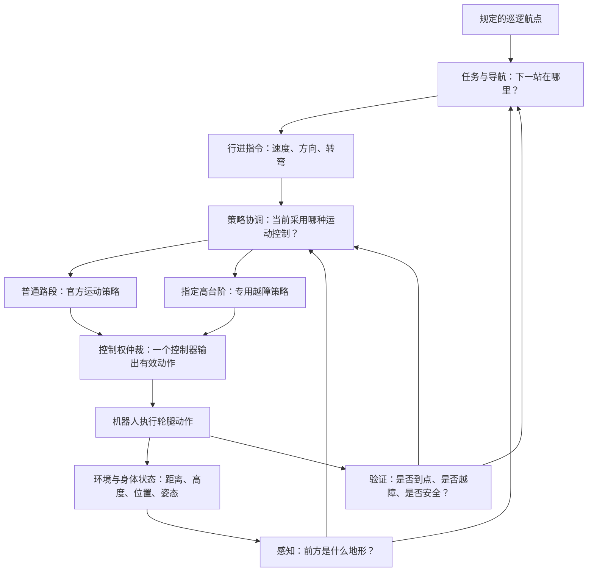

# GOAI LAI／狗來项目介绍

## 面向 Lynx S10 的地形感知自主导航与自适应运动控制

**英文项目名称：Terrain-Aware Autonomous Driving with Adaptive Locomotion for the Lynx S10**

我们希望让一台拥有四条腿和四个轮子的机器人，能够根据周围地形，自主决定往哪里走、以什么速度走，以及遇到障碍时怎样调整身体，最终完成一整条巡逻路线。

可以把它想象成一位进入陌生产业园区的巡逻员：它拿到一份必须依次到访的地点清单，需要在行进中观察道路、绕开障碍、通过坡道和台阶，并确认每个地点都真正到达。我们的工作，就是把这些能力组织成一套能够连续运行的机器人系统。

> 本文根据项目保存的参赛材料、技术文档和运行记录撰写。实现与成绩以 2026 年 8 月 20 日的 `3660b81` 提交快照及其 392.257 秒完整仿真记录为主要依据；比赛公开信息核对于 2026 年 9 月 1 日。文中明确区分已经验证的仿真能力、实验中的方法和面向真机的后续工作。

## 1. 比赛内容：让机器人在复杂地形中完成巡逻

我们参加的是 **GOAI 2026 全球开源人工智能大赛的“具身未来”赛道，赛题二“产业园区全地形巡逻挑战赛”**。这个赛题围绕自主导航、实时避障、多地形运动控制和任务调度展开，要求参赛者形成从感知、决策到执行与验证的完整系统。[GOAI 官方赛道说明](https://www.goaihz.com/en/tracks?track=embodied)

“具身智能”中的“具身”，可以理解为 AI 拥有一个能够与现实接触的身体。机器人作出决定以后，会真的移动、接触地面、改变姿态，也可能打滑或失去平衡。因此，它必须持续观察行动的结果，再调整下一步动作。

### 1.1 机器人具体要做什么？

在这项任务中，机器人需要按照指定顺序经过多个检查点。检查点也叫“航点”，英文是 waypoint，项目中用 WP 表示，例如 WP15 就是编号为 15 的航点。

任务可以分成四个问题：

| 问题 | 日常生活中的对应行为 | 机器人需要的能力 |
|---|---|---|
| 下一站在哪里？ | 查看巡逻清单 | 航点管理和路线跟踪 |
| 这条路能走吗？ | 观察前方道路 | 地形感知和通行判断 |
| 遇到障碍怎么办？ | 绕行、减速或跨过台阶 | 局部规划和运动控制 |
| 任务真的完成了吗？ | 确认每个地点都已到访 | 顺序检查和运行验证 |

即使机器人最后到达终点，中间漏掉一个必须经过的点，也不能据此认定它完成了整条巡逻任务。这让“准确地完成每一步”与“尽快到达终点”同样重要。

### 1.2 仿真阶段与现场决赛有什么区别？

仿真阶段在计算机里的机器人和赛道上测试。仿真器根据机器人模型计算重力、碰撞、轮子转动和关节运动，让我们反复检查控制方法。

现场决赛则需要将软件接到真实机器人上，处理真实传感器、实际地面接触和设备运行中的误差。根据本地保存的参赛手册，现场巡逻任务包含多种地形和 30 个需要顺序经过的航点；本文所报告的初赛仿真版本则包含 33 个航点，两者属于不同阶段。[本地参赛手册](/Users/xxxwbwxxx/Documents/Projects/goai26/resources/handbook_EN.md)

同一份手册给出的决赛计分方式是“完成时间 ÷ 模式系数”：遥控为 1.0，自主跟随为 1.3，自主导航为 1.4，完成规定任务后数值越小越好。例如，若均用时 420 秒，自主导航的折算值为 300。这个机制体现了比赛对自主能力的鼓励；具体执行仍以现场最终规则为准。

对我们的项目而言，优化目标是让机器人准确完成所有检查点，并在可控的风险下减少耗时。

## 2. 项目目标与团队背景

我们的队伍名为 **GOAI LAI／狗來**。根据团队此前提供的信息，三位成员分别来自哥伦比亚大学 MSAI 的 AI and Advanced Computing、Robotics and Perception 方向，以及清华大学电子工程本科。这些背景对应了项目中的 AI 计算、机器人感知与学习、控制和工程集成等工作。

团队此前确认已进入巡逻赛题前十名决赛队伍。本文重点介绍支持这一参赛工作的技术系统；下文展示的时间是团队仿真自测记录。

我们的具体目标是：

> **构建一套能感知地形、规划局部路线、协调轮腿动作，并持续验证任务进度的自主巡逻系统。**

这包含三个相互关联的要求：机器人既要知道下一站在哪里，也要判断当前地面怎样通过，还要在每一步之后确认自己确实取得了进展。

## 3. 机器人平台：为什么同时需要轮子和腿？

项目使用云深处科技的 **Lynx S10 轮足机器人**。它有四条可以改变姿态的腿，每条腿末端装有一个轮子。

在平坦道路上，轮子能够提供连续推进；遇到起伏或台阶时，腿部关节可以调整轮子的位置和身体姿态，帮助机器人建立支撑、抬升身体并越过障碍。

这两种能力需要协同工作。例如爬台阶时，轮子可能仍然向前转动，腿部则同时改变姿态，为前轮建立支撑、为后半身上台创造条件。轮子和腿的动作会共同影响机器人是否能够成功通过。

也正因为如此，一条简单的“向前走”指令并不直接等于四个轮子同时加速。底层控制器还要根据当前姿态、关节状态和地面条件，决定每条腿与每个轮子的具体动作。

## 4. 总体 approach：用分层系统组织感知、导航与运动

我们的总体方法是：**将巡逻任务分成几个职责明确的层次，再用持续反馈把它们连接起来。**

高层负责下一站和行进方向，感知模块提供周围几何信息，运动控制负责轮腿动作，协调模块决定当前由哪个控制器接管机器人。

例如，导航模块可以提出“向前慢走，并稍微向左修正”；底层控制器再将这个目标变成关节角度和轮速。导航模块不必自己计算每条腿怎么弯，底层控制器也不必独自承担整条巡逻路线的管理。

这样的分工还有一个实际好处：发生失败时，我们能够追查它属于哪一层。看错地形、选错路线、越障动作不足，以及控制器切换不当，需要不同的修复方法。

当前通过完整仿真验证的方案采用以下组合：

| 部分 | 采用的方法 | 对任务的作用 |
|---|---|---|
| 环境感知 | 仿真激光测距和局部高度图 | 提供障碍距离和地形起伏 |
| 导航 | 顺序航点跟踪、路径跟随、局部避障 | 决定往哪里走和走多快 |
| 普通运动 | 官方提供的运动策略 | 执行大多数路段的轮腿控制 |
| 高台阶越障 | 带高度图输入的基础策略与残差策略 | 处理 WP15→WP16 的特殊高差 |
| 系统协调 | 分阶段切换、控制权仲裁、越障确认 | 让各控制器连续配合 |
| 验证 | 仿真器记录、运行日志、轨迹与回放 | 检查实际任务完成情况 |

## 5. 细分 approach 一：让机器人理解周围地形

### 5.1 用距离信息判断障碍在哪里

激光雷达的基本作用是测量不同方向上物体与机器人的距离。可以把它想象成向四周伸出许多看不见的尺子：前方有墙时，对应方向的测量距离较短；空旷方向的可见距离则更远。

在当前仿真中，这些测量由仿真器向场景发射虚拟射线得到。系统生成多角度的测距数据，并提取接近水平的一圈信息，用于判断前方是否被挡住、哪一侧更容易通过。

这里使用的是在线几何测量。机器人每移动一步，周围障碍与自身的相对位置都会变化，系统随之更新判断。

### 5.2 用高度图判断地面如何起伏

距离信息还不足以回答“前面是平地、斜坡，还是突然抬高的台阶”。为此，我们使用一张 **13×9 的局部高度图**，也就是 117 个地形高度采样值。

可以把机器人附近的地面想象成一张方格纸，每个格子记录那一小块区域相对于机身的高度。连续缓慢升高的格子可能对应坡道；突然升高的一排格子可能对应台阶；明显降低或缺失的区域则需要谨慎处理。

这张图覆盖机身前方约 1.2 米、后方约 0.6 米、左右各约 0.6 米，采样间隔为 15 厘米。它会跟随机器人的朝向旋转，所以“图的前方”始终对应“机器人准备前进的方向”。

高度图相当于提供了一份小范围的地形草图，让导航与越障控制能够提前考虑地面变化。

### 5.3 将几何信息转化为通行判断

系统结合高度变化与测距信息，将局部情况分为平地、坡道、楼梯、阻塞、高障碍、落差、不稳定或未知等类别。

分类会影响后续动作。例如，确认是可通过的坡道或楼梯时，可以进入持续通过的状态；遇到高障碍时，先考虑重新寻找局部路线；对落差或不确定区域，则降低速度或停止前进。

机器人运动时会晃动，瞬间读数可能发生变化。因此，系统会参考连续观测，避免刚判断为台阶、下一瞬间又改成平地，造成控制指令反复切换。

这里的“理解”主要指几何层面的通行判断。目前这套实现并不包含识别人、车辆、设备故障等完整视觉语义能力。仿真里的位置来自仿真器提供的准确状态，实机定位则需要后续接入真实的估计模块。[感知实现与边界](/Users/xxxwbwxxx/Documents/Projects/goai26/resources/submission_update_20260820_392s/submission_20260820_392s_main3660b81/03_documents/TECHNICAL_DESIGN.md)

## 6. 细分 approach 二：既准确到点，也找到身体能通过的路线

### 6.1 严格管理航点顺序

在所使用的仿真版本中，评估器按顺序检查机器人是否进入每个航点附近的 20 厘米水平距离范围。

我们的导航系统采用更小的 **18 厘米内部到点阈值**：只有满足这个条件，才把目标推进到下一个航点。这提供了 2 厘米的几何余量，但实际判断仍依赖定位与采样精度。

这里比较的是评估器所使用的机器人参考位置与航点之间的水平距离。可以想象地面上以航点为中心画了一个圆，指定参考位置需要进入圆内，不能用任意一条腿碰到附近来代替。

### 6.2 用前视目标平顺地跟随路线

我们使用的路径跟随方法包含 Pure Pursuit，通常译为“纯追踪”。它的直观想法是：观察路线前方的一小段，朝那个位置逐步修正方向。

这与骑自行车时看向前方道路类似。速度较快时，需要看得更远，提前调整；接近检查点、急转弯或复杂地形时，则减速，提高通过精度。

系统还会检查机器人朝向与目标方向的差别，以及机身偏离路线的程度。转角过大时，先调整朝向；方向基本正确以后，再继续前进。

### 6.3 按机器人的实际宽度选择通路

两个航点之间的直线未必能直接通过。直线上可能有柱子、挡板，也可能贴着平台边缘。

局部规划器会比较目标方向附近的多个候选方向，同时考虑障碍距离、通道宽度和偏离目标的程度。实现中使用带宽度的通行走廊检查，为机身保留空间。

这就像推着一辆宽推车穿过门口：仅仅看推车中心是否能穿过还不够，两侧也必须留出余量。

在几个特定平台和转角处，我们还加入了根据场地测量得到的有限路线提示，例如先向后退一点获得转弯空间，再沿可通行的方向前进。这些中间位置帮助机器人绕障，任务管理仍然要求按顺序通过原有航点。

### 6.4 根据路段安排速度

系统会在已验证的平坦、开阔路段允许更高速度，在狭窄平台、复杂地形和关键接近阶段降低速度。能否加速，还要同时满足朝向、横向偏差和身体倾斜等条件。

提高成绩的方式因此包括：减少无效转向、避免反复卡住、在宽阔路段节省时间，并在关键障碍前建立合适的姿态。

## 7. 细分 approach 三：让轮腿动作适应高台阶

### 7.1 普通运动策略负责什么？

普通路段使用官方提供的运动策略。这里的“策略”指一个将输入状态转化为动作的控制模型。

该模型接收 57 个输入数值，其中包括身体转动状态、重力方向、希望达到的运动速度、关节位置与速度，以及上一时刻的动作。可以把这些信息理解为机器人对“自己的身体现在怎么样”的描述。

它据此产生轮腿控制，让导航提出的行进要求真正落实到机器人身体上。

### 7.2 为什么 WP15→WP16 需要专门处理？

这一段包含约 **37.7 厘米的垂直高差**。既有实验发现，普通策略能够在部分情况下把前轮送上台面，但后轮继续上台仍然困难。

可以想象人爬上一处较高的平台：双手搭上边缘只是第一步，接下来还需要移动重心、抬升身体，并把双脚带上来。机器人也需要处理类似的连续支撑变化。

这个问题要求控制器同时考虑前后轮位置、腿部姿态、身体平衡和持续推进。[Gate 16 实验背景](/Users/xxxwbwxxx/Documents/Projects/goai26/goai-s10-gate16-policy/docs/STATUS.md)

### 7.3 将身体信息和地形信息一起交给越障模型

专用越障模型在 57 个原有输入的基础上，加入 117 个高度图数值，得到 **174 个输入**。

这些数字的意义很直接：模型既知道身体当前如何运动，也能看到附近地面的大致形状。它最终输出 16 个动作量，分别对应 12 个腿部关节的位置控制量和 4 个轮子的速度控制量。

轮子和腿会在同一次控制决策中共同参与越障。

### 7.4 用“基础动作＋专门修正”构造越障动作

专用越障控制采用 **基础策略＋残差策略**。其中，残差可以理解为“在已有动作上增加的修正”。

基础策略提供一组动作，残差策略根据身体与地形信息，给这些动作补充适合攀爬的调整。系统对修正和最终输出都施加限制，避免出现过大的动作命令。

可以用一行文字表示：

> 最终越障动作＝基础动作＋在允许范围内的攀爬修正。

这里的专用基础模型与普通路段的官方 57 维控制器是不同的模型配置。实际运行时，系统会在指定路段切换到整套 174 维越障控制，再在通过之后切回普通控制。

### 7.5 让修正只在适合的阶段生效

攀爬修正受到地形检测和系统状态共同控制。只有越障控制已被允许、地形信息有效，而且检测到相关台阶特征时，它才会介入。

前轮刚上台时，后轮可能仍在台下，因此控制器需要保持越障状态一段时间，避免地形观测发生变化就过早停止修正。

完整自测所采用的是保守的正面接近配置。研究代码还保留了更快的动作适配和斜向接近实验，但这些分支在该次完整运行中没有启用，不能把其局部实验结果当作整套系统的已验证能力。

## 8. 细分 approach 四：让不同控制器可靠地交接

控制器切换本身也是一个需要解决的技术问题。普通运动策略和高台阶策略即使分别能够工作，若交接时机不对，也可能导致失稳。

### 8.1 先建立合适的接近条件

机器人接近高台阶时，普通控制器继续负责运动，系统同时检查距离、速度、朝向、横向偏差和身体倾斜。

以保存的稳定配置为例，机器人需要在距离台沿约 62—70 厘米、实测前进速度约 0.08—0.20 米／秒、朝向误差不超过约 6 度，并满足其他姿态条件时，才进入越障控制。这些参数说明：越障方法有一个经过设计的适用起点。

就像跨越障碍前先调整脚步，机器人也需要以合适的速度和姿态开始动作。

### 8.2 同一时刻只允许一个控制器发出有效动作

系统设置了关节控制权仲裁。普通控制器和专用控制器可以在软件中同时存在，但只有取得控制权的一方可以把动作发送给机器人。

这样能够防止一个控制器要求抬腿、另一个控制器同时要求保持原姿态。交接时还需要处理上一时刻动作等内部状态，减少新控制器接管时的突变。

### 8.3 确认四轮通过，再恢复普通导航

到达航点和身体完成越障是两个独立条件。机器人参考位置已经进入航点范围时，后轮仍可能跨在台沿上。

因此，系统会进一步检查四个轮子是否越过边缘、是否达到上方平台所需高度，以及接触和身体姿态是否符合条件。确认后，才结束攀爬修正，经过受控交接，让普通策略继续执行后续巡逻。

在当前仿真中，轮子位置和接触信息由仿真器提供。真实机器人需要等价的支撑状态估计，这是后续实机集成的一项重点。

## 9. 细分 approach 五：处理卡住、误判与异常状态

连续巡逻过程中，机器人可能看起来一直在动，却没有接近目标。例如轮子打滑、腿部反复调整，或者机身卡在一个转角。

我们同时观察两类进展：一类是实际移动速度，另一类是到当前航点的距离有没有缩短。这有助于区分“正在缓慢通过”和“已经失去有效进展”。

检测到停滞后，系统可以进行有限回退、调整朝向或重新尝试，并保留当前必须完成的航点。恢复次数和持续时间受到限制，避免陷入无限重复。

多层平台也带来了另一类问题：同一水平位置可能对应上方平台、下方地面或上方遮挡物，高度测量容易引起错误的通行判断。我们在感知处理和已知赛段逻辑中加入了针对性修正。

例如，WP28→WP29 的已知上层平台路段，在确认机器人按顺序通过 WP28 且姿态稳定后，可以采用该平台的同层通行判断，减少错误进入攀爬或绕行状态。同时仍保留激光障碍检查和相关异常判断，使实际柱子等障碍继续影响路线。

这些处理提高了指定赛道上的可运行性，也表明当前系统使用了一部分已知场地信息。扩大到新场景时，需要重新验证这类规则，或逐步用更通用的感知和规划取代。

系统还监测感知数据是否及时更新、动作输出是否有效、身体是否过度倾斜等状态，并设置停止或退出条件，使异常能够被记录和处理。

## 10. 训练与开发 approach：从局部能力走向完整任务

### 10.1 用仿真反复探索运动方法

仿真提供了可以重复运行的机器人与环境。我们能够固定一个台阶、改变起始姿态，多次观察哪些条件会成功、哪些条件会失败。

项目的低层运动研究涉及强化学习。其基本思路是让机器人在仿真中尝试动作，根据前进效果、平衡情况、动作变化和控制代价获得反馈，再调整策略。

例如，既希望机器人跟上要求的前进速度，也需要约束跌倒、过大动作和不良接触。只有速度奖励高，并不能说明动作已经适合整场比赛。

研究材料还包含基于成功轨迹的动作学习、失败状态修正和分阶段训练方案。这些属于开发中探索过或规划过的方法；本文对完整成绩的说明，以实际使用的冻结模型与运行配置为准。

### 10.2 检查模型在新环境中的输入输出是否一致

训练好的模型需要接入比赛软件。这个过程中，关节顺序、左右方向、角度单位、高度图含义和动作缩放必须保持一致。

例如，同一个高度值，在一处代码中可能表示“地面比机器人高多少”，另一处代码中却表示“机器人比地面高多少”。若没有正确转换，模型看到的台阶就可能完全不同。

因此，项目除了模型本身，还需要输入输出约定、格式转换和部署检查。ONNX 在这里是保存和运行训练后模型的一种格式，帮助软件加载固定的模型进行动作计算。

### 10.3 按局部、衔接、整圈逐步验证

我们把验证分为几个层次：先检查单个模块，再检查一段路线，最后连续完成整条巡逻任务。

局部实验帮助我们看清高台阶或转角的具体问题；完整运行则检验前一段留下的位置、速度和姿态，是否会影响下一段任务。

实验中的“随机种子”可以理解为生成某组可重复测试条件的编号。比较不同编号、不同起始条件，以及同一配置的重复运行，有助于评估方法对变化的敏感程度。

一个策略在理想起点完成一次越障，只能证明它具备某些条件下的能力。它还需要与导航产生的实际接近状态衔接，并在完整任务中接受验证。

## 11. 已经取得的结果，以及这些结果说明什么

保存的完整仿真自测记录显示，系统在一次连续运行中，**按顺序通过 WP0—WP32 全部 33 个航点，仿真器计时为 392.257 秒，约 6 分 32 秒**。这次运行使用 Mac ARM64 上的独立 Docker 环境，测试种子为 8。

| 项目 | 该次运行记录 |
|---|---:|
| 按顺序完成的航点 | 33／33 |
| 仿真器记录的路线用时 | 392.257 秒 |
| 实际行驶距离 | 249.94 米 |
| 最终目标距离 | 0.177 米 |
| 最大记录倾角 | 44.6° |
| 停滞记录 | 2 次 |
| 漏点、跌倒、超时或协调器中止 | 均未发生 |

原始日志逐项记录了航点通过事件，并在最后一个航点给出总用时；专用越障部分也保留了进入、四轮通过验证和返回普通控制器的记录。[完整运行记录](/Users/xxxwbwxxx/Documents/Projects/goai26/resources/submission_update_20260820_392s/submission_20260820_392s_main3660b81/04_evidence/RUN_SUMMARY.md)

这里的 392.257 秒是**仿真世界中的时间**。电脑实际运行这次实验的墙钟时间约为 674 秒，因为仿真运行速度受计算负载影响。两者含义不同，项目成绩采用前者。

这次结果支持一个具体结论：我们的感知、导航、专用越障和控制交接能够在同一次仿真中连续配合，完成完整路线。

它也有清楚的适用范围：这是一次有日志支持的成功自测，不能单凭它推算所有条件下的成功率，更不能据此认定真实机器人的整场任务已经完成。项目保存的其他测试中仍有倾倒、感知更新中断和越障交接失败等记录，持续提高重复成功率仍是重要工作。[验证报告与结果边界](/Users/xxxwbwxxx/Documents/Projects/goai26/resources/submission_update_20260820_392s/submission_20260820_392s_main3660b81/03_documents/TECHNICAL_DESIGN.md)

## 12. 工程实现：让方案能够运行、重现和检查

为了使项目能在其他机器上运行，我们保存了固定的软件版本、模型文件、启动流程和测试证据。

ROS 2 负责让感知、导航和控制模块交换信息；Docker 用来准备一致的运行环境；MuJoCo 负责仿真中的物理运动；ONNX Runtime 负责执行模型。它们分别承担通信、环境、仿真和推理工作。

项目还记录了每个模型和依赖的来源，说明哪些能力来自官方平台，哪些由团队开发和集成。普通运动策略、机器人模型和基础赛道来自比赛资源；团队工作主要围绕在线感知接入、导航与局部避障、特殊越障策略、控制器协调以及验证工具展开。

录像采用先保留机器人状态、再离线绘制回放的方式，减少高分辨率画面生成对运行时计算负载的影响。对应录像可以显示机器人行进、当前目标、控制器状态和感知信息，并与保存的仿真时间对齐。

这些材料让评审和后续开发者能够检查：系统用的是哪个版本、哪些航点真正通过、失败发生在哪里，以及视频对应哪一次运行。

## 13. 下一阶段：把仿真能力带到真实机器人上

目前的完整仿真结果，为实机集成提供了可运行的起点。接下来最关键的是替换和验证仿真中特有的信息来源。

**第一，接入真实定位。** 仿真器能够直接给出准确位置和朝向，真实机器人则需要根据传感器估计它们。我们需要验证估计精度、时间延迟和坐标关系，确保导航能够准确接近检查点。

**第二，重建真实地形观测。** 真实雷达或深度传感器会出现噪声、遮挡和数据缺失。高度图生成需要处理这些情况，并明确区分“地面确实很低”和“没有可靠测量”。

**第三，验证实际轮地接触与运动效果。** 地面摩擦、轮胎形变、电机响应和机身负载都会影响越障。尤其是四轮是否已建立稳定支撑，需要实机可获得的判断依据。

**第四，提高重复成功率。** 后续评估需要覆盖不同速度、接近角度、位置误差和地面条件，记录成功、失败与恢复情况，再选择适合现场运行的配置。

**第五，减少对特定赛段规则的依赖。** 当前针对已知平台和转角的处理具有明确用途。面向更广泛的园区，需要增强对新地形的判断与规划能力，使系统适应更多路线。

这些工作共同决定，项目能否从“在指定仿真路线中完成巡逻”，进一步发展为真实场景中可靠的自主移动系统。

## 14. 项目的实际价值

园区巡检、电力设施检查和大型场地巡视都需要机器人先可靠地到达任务地点。复杂路况中的自主移动，是后续读取仪表、拍摄设备或检测异常等业务的基础。

我们的项目聚焦于这项基础能力：把地形观察、路线选择、轮腿控制和任务验证连接起来，让机器人能够在有高差、有障碍、需要精确到点的路线中持续前进。

从技术角度看，项目中有三个相互支撑的工作重点：

1. **让地形信息参与决策和动作。** 高度图既帮助判断怎么走，也进入专用越障模型，影响身体如何通过障碍。
2. **协调普通能力与专用能力。** 大多数路段使用官方运动策略，关键高台阶使用专用模型，并对进入条件和退出条件进行明确检查。
3. **用完整任务检验系统。** 除了观察单个越障动作，还检查能否按顺序完成全程，并保存可追溯的运行证据。

这些成果为下一阶段的真机调试提供了明确的系统结构、已验证的仿真基线，以及可以逐项检查和改进的问题清单。

## 附录：常见术语的通俗解释

| 术语 | 在本项目中的意思 |
|---|---|
| 具身智能 | AI 通过机器人的身体观察、行动并获得反馈 |
| 感知 | 将传感器数据整理成对周围环境有用的信息 |
| 定位 | 估计机器人在哪里、面向哪里 |
| 高度图 | 用网格数值描述机器人附近地面的高低 |
| 航点／WP | 机器人需要经过的指定位置 |
| 局部规划 | 根据眼前路况选择接下来一小段怎么走 |
| 运动策略／policy | 根据当前状态计算轮子和腿应该采取的动作 |
| 本体信息 | 机器人自身的姿态、关节和运动状态等信息 |
| 残差策略 | 在基础动作上补充针对性修正的模型 |
| 控制权仲裁 | 决定当前由哪个控制器向机器人发送有效动作 |
| 闭环 | 执行动作后观察结果，再据此调整下一步 |
| 仿真到现实 | 将仿真中开发的方法接入真实机器人，并验证实际效果 |

## 资料依据

- [GOAI 官方“具身未来”赛道](https://www.goaihz.com/en/tracks?track=embodied)：比赛方向、任务定位与公开要求。
- [本地参赛手册](/Users/xxxwbwxxx/Documents/Projects/goai26/resources/handbook_EN.md)：保存的赛制、现场任务和计分信息。
- [392 秒提交包技术设计](/Users/xxxwbwxxx/Documents/Projects/goai26/resources/submission_update_20260820_392s/submission_20260820_392s_main3660b81/03_documents/TECHNICAL_DESIGN.md)：实际系统结构、控制条件和已知边界。
- [392 秒完整运行摘要](/Users/xxxwbwxxx/Documents/Projects/goai26/resources/submission_update_20260820_392s/submission_20260820_392s_main3660b81/04_evidence/RUN_SUMMARY.md)：用时、航点、轨迹与录像信息。
- [392 秒自测原始日志](/Users/xxxwbwxxx/Documents/Projects/goai26/resources/submission_update_20260820_392s/submission_20260820_392s_main3660b81/04_evidence/raw/00_32_seed8.log)：逐航点事件与最终计时。
- [第三方依赖与模型来源](/Users/xxxwbwxxx/Documents/Projects/goai26/resources/submission_update_20260820_392s/submission_20260820_392s_main3660b81/03_documents/THIRD_PARTY.md)：官方资源、团队模型和部署依赖的职责划分。
- [Gate 16 策略说明](/Users/xxxwbwxxx/Documents/Projects/goai26/goai-s10-gate16-policy/docs/S10_POLICY.md)：训练与模型设计思路；其历史配置以完整运行所用提交包为准。

团队成员背景与入围情况依据团队此前提供的信息；本文没有从自测成绩推导官方排名。
