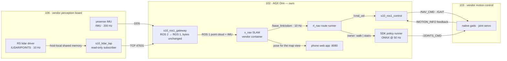
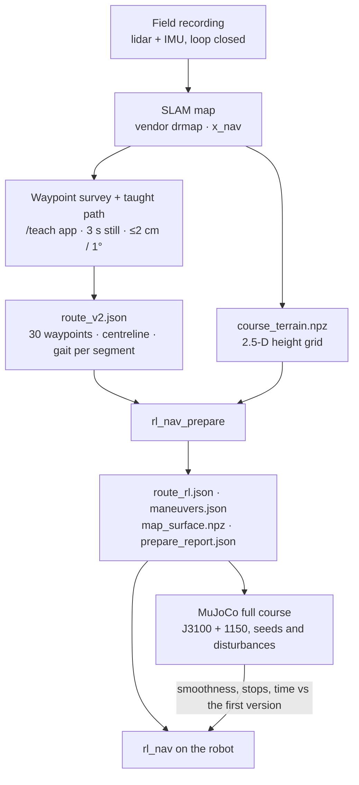
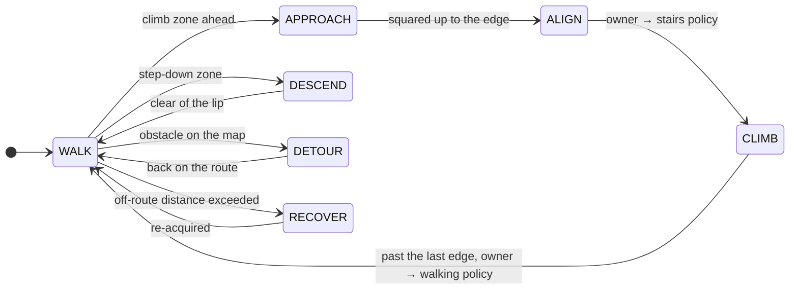

<div align="center">

# goai26-s10-racing

**Autonomous course navigation for the DEEP Robotics Lynx S10 wheel-legged robot** — route planning, MuJoCo and kinematic simulation, Isaac Lab locomotion policies, mapping and localisation, and the on-robot ROS 2 / ROS 1 stack.

GOAI 2026 · Track 4 *Embodied Future* · Challenge 2 — S10 Perception Racing

[](LICENSE)
[](https://docs.ros.org/en/jazzy/)
[-22314E.svg?logo=ros&logoColor=white)](https://www.ros.org/)
[](https://releases.ubuntu.com/24.04/)
[](https://mujoco.org/)
[](https://isaac-sim.github.io/IsaacLab/)
[](https://www.python.org/)


<sub><b>The whole course in simulation.</b> The <code>route_v2</code> follower drives two RL policies — J3100 for walking, 1150 for stairs — through all 30 waypoints in 713 s of simulated time. Trajectory colour is the controller mode; orange bands are climb zones handed to the stairs policy.</sub>

</div>

---

## Contents

- [What is in here](#what-is-in-here)
- [System overview](#system-overview)
- [From map to robot](#from-map-to-robot)
- [Quick start](#quick-start)
- [Modules](#modules)
  - [1 · Planning and navigation](#1--planning-and-navigation)
  - [2 · Simulation](#2--simulation)
  - [3 · Locomotion policies and RL training](#3--locomotion-policies-and-rl-training)
  - [4 · Mapping and localisation](#4--mapping-and-localisation)
  - [5 · Field tools on the phone](#5--field-tools-on-the-phone)
  - [6 · Real-robot deployment and safety](#6--real-robot-deployment-and-safety)
- [Results](#results)
- [Status](#status)
- [Repository layout](#repository-layout)
- [Documentation](#documentation)
- [Development](#development)
- [History](#history)
- [License and credits](#license-and-credits)

## What is in here

- **A route-following navigation stack** for a 30-waypoint outdoor course: a taught centreline, per-segment gait selection, and recovery that only fires on a measured deviation — [module 1](#1--planning-and-navigation).
- **Two simulators**: a fast kinematic whole-course harness in this repo, and a full MuJoCo run of the real map with real ONNX policies — **30/30 waypoints, 713 s** — [module 2](#2--simulation).
- **Locomotion policies** from three sources: the vendor's 57-D controller, our Isaac Lab training runs, and teammate models. Three have run on hardware — [module 3](#3--locomotion-policies-and-rl-training).
- **Mapping and localisation**, from the vendor SLAM map (`0914_fr_v3`) to a new third-party SLAM (x_nav) reached through a byte-exact ROS 2 → ROS 1 gateway — [module 4](#4--mapping-and-localisation).
- **Field tools**: phone pages served from the robot's own compute for mapping, waypoint survey and taught-path recording — [module 5](#5--field-tools-on-the-phone).
- **Status labels** throughout: ✅ proven on hardware, 🧪 simulation only, 🗄 historical, 📝 pending — summarised under [Status](#status).

## System overview

Three onboard computers. We own one of them; the other two are vendor boards on a robot shared with another team, so everything we add there is read-only or removable with one command.



Two ways to move the robot, and the navigation layer is the same for both: **native vendor gaits** (`/GAIT` 0x3002 flat, 0x3003 stairs) or **our RL policies** through the SDK runner. Only one of them owns the joints at any instant — see [module 6](#6--real-robot-deployment-and-safety).

| Board | Role | Owner | What we run there |
|---|---|---|---|
| **102** AGX Orin, Ubuntu 24.04 | our compute | us (`golai`) | ROS 2 Jazzy stack, user-space ROS 1 master + gateway, x_nav container, phone web app |
| **103** motion control | native gaits, PTP master | vendor | nothing of ours; we only publish commands to it |
| **106** perception | lidar, IMU, vendor SLAM | vendor | one read-only lidar tap in a user directory, removed by `robot_session.sh down` |
| **Phone** | field UI | — | browser on the robot Wi-Fi |

## From map to robot



The current `route_v2.json` came from matching 30 waypoint photos to mapping keyframes ([`tools/wp_match`](tools/wp_match/README_ZH.md)); its uncertainty radius is 1.5–3 m, which is why the [`/teach`](tools/s10_mapping_web/TEACH_GUIDE_ZH.md) survey exists.

## Quick start

```bash
git clone https://github.com/bowenwan6/goai26-s10-racing.git
cd goai26-s10-racing
git lfs pull            # point clouds, MuJoCo scenes, media
```

**Run the kinematic whole-course simulation** (no ROS, no GPU, a few minutes on a laptop):

```bash
python -m pip install -r sim_full_course/requirements.txt
python -m sim_full_course.harness                      # nominal run over route_v2
python -m sim_full_course.harness --scenario detour_box --s0 160 --s1 185 --obstacle-s 172
```

**Run the test suites** (no robot needed):

```bash
PYTHONPATH=.:src/s10_auto_nav:src/s10_perception \
  python -m pytest -q src/s10_auto_nav/test sim_full_course/tests tests_real
```

**Prepare a route for the robot** — turns `route_v2` plus a height grid into what `rl_nav` consumes:

```bash
ros2 run s10_auto_nav rl_nav_prepare \
  --route route_v2_field.json --terrain course_terrain.npz \
  --overrides overrides_v1.json --method first --out prepared/
```

**Bring up the sensor path on the robot** — run from a laptop; `up` deploys the 106 tap and starts the gateway, `down` removes every trace:

```bash
bash ros1_gateway/scripts/robot_session.sh up
bash ros1_gateway/scripts/health_check.sh --hz 10
bash ros1_gateway/scripts/robot_session.sh down --agx
```

The competition stack from the August simulation contest runs in its own container — see [History](#history).

## Modules

### 1 · Planning and navigation

`src/s10_auto_nav` — ROS 2 package. One design rule shapes it: **the first version's controller stays the nominal behaviour**. We add robustness as recovery that a measured deviation triggers, never as an always-on guard, because the always-on version stopped the robot in undisturbed runs.

| Piece | What it does | Status |
|---|---|---|
| [`rl_nav/route_runner.py`](src/s10_auto_nav/s10_auto_nav/rl_nav/route_runner.py) | Mode machine over the taught route; emits body velocity and the joint-owner request | 🧪 |
| [`rl_nav/prepare.py`](src/s10_auto_nav/s10_auto_nav/rl_nav/prepare.py) | Offline route grounding, climb manoeuvres, map surface, report | 🧪 |
| [`route_v2.py`](src/s10_auto_nav/s10_auto_nav/route_v2.py), [`route_planner.py`](src/s10_auto_nav/s10_auto_nav/route_planner.py) | Centreline following with a Frenet local planner, A\* fallback on the prior map | 🧪 |
| [`native_transfer/`](native_transfer/README_ZH.md) | Same follower driving the vendor's native gaits | ✅ deployed; observation only, no commands sent yet |



Details: [`docs/RL_ROUTE_ROBUST_PLAN_ZH.md`](docs/RL_ROUTE_ROBUST_PLAN_ZH.md) (ZH), [`docs/ROUTE_V2_PLANNER_ZH.md`](docs/ROUTE_V2_PLANNER_ZH.md) (ZH).

### 2 · Simulation

Two levels, both driven by the same route artefacts.

**Kinematic whole-course harness** — [`sim_full_course/`](sim_full_course/README_ZH.md). Builds a 2.5-D terrain from the v3 point cloud, moves a kinematic robot, injects obstacles by arc length, and shares the perception contract with the real nodes. Fast enough to run on every change.

**MuJoCo whole course with the real policies** — harness in the [`s10-rl-sprint`](https://github.com/bowenwan6/s10-rl-sprint) repo, scene built from the same map. This run produces the headline result below.

<div align="center">

<br>
<sub>The 713 s run at roughly 60× speed. The overlay shows target waypoint, controller mode, active policy, speed, leg torque, wheel speed and tilt.</sub>
</div>


<sub>Nine moments from the same run: the start apron, the B staircase under the stairs policy, the long traverse, a ledge hand-off, the rock bed and the garden section.</sub>

### 3 · Locomotion policies and RL training

Policies come from three places: the vendor's shipped controller, our Isaac Lab training in [`s10-rl-sprint`](https://github.com/bowenwan6/s10-rl-sprint), and teammate models on the `Jackdev` branch. The full table with measured limits and sources is in [`docs/POLICIES_AND_APPS_ZH.md`](docs/POLICIES_AND_APPS_ZH.md) (ZH); the short version:

| Policy | Obs → act | Role | Status |
|---|---|---|---|
| Vendor 57-D | 57 → 16 | general walking, default on the robot | ✅ hardware |
| `speedturn2000` | 57 → 16 | speed and turning, fine-tuned from the vendor model | ✅ hardware |
| HIM 1500 | 342 → 16 | history-conditioned general walking | ✅ hardware, failed on the first stair |
| **J3100** | 59 → 16 | walking actor for `rl_nav` | 🧪 |
| **1150** | 59 → 16 | stairs, steep slopes, side slopes | 🧪 |
| Gate 16 v1.5 | 174 → 16 | one 0.377 m ledge in the August contest | 🗄 |
| `stairs_stable` | 57 → 16 | stair ascent in the August contest | 🗄 |

The measured limits matter more than the list. J3100 clears 3–8 cm steps and 8–12° slopes at 0.6–0.8 m/s, yet stalls on the same terrain at 0.4 m/s. 1150 climbs 12–18 cm steps and 20° slopes, but barely turns and drives wheel speed to 37–47 rad/s, past the robot's 30 rad/s diagnostic limit. No single model covers the course, which is why the stack hands the joints over segment by segment.

Training, evaluation harnesses and the acceptance criteria live in the sprint repo; this repo holds the exported ONNX models, the deployment glue in [`integration/`](integration/), and the August training code in [`training/`](training/).

### 4 · Mapping and localisation

<table>
<tr>
<td width="55%"></td>
<td></td>
</tr>
<tr>
<td><sub>v3 course point cloud (<code>0914_fr_v3-20260914-142008</code>), the reference frame for every route artefact.</sub></td>
<td><sub>Collision scene generated from the same cloud for MuJoCo.</sub></td>
</tr>
</table>

- **Vendor SLAM on 106** produced the v3 map and the localisation used through August and September. Map, MuJoCo scene and an offline viewer are in [`deliverables/`](deliverables/S10_v3_Map_MuJoCo_20260916/README.md).
- **New third-party SLAM (x_nav)** runs in a container on our AGX and publishes `/base_link/odom` at 10 Hz. It needs ROS 1 sensor topics, which is what the gateway provides.
- **ROS 2 → ROS 1 gateway** — [`ros1_gateway/`](ros1_gateway/README_ZH.md) (ZH). It forwards point cloud fields, timestamps and frame ids byte for byte and invents no TF. The 106 lidar publishes host-locally, so a read-only tap there relays CDR frames over TCP. Checked against an independent ROS 2 reference on the new robot: **592/592 clouds and 11 845/11 845 IMU messages identical over 60 s**.
- **Map alignment** to the v3 frame, waypoint re-survey and the route rebuild are planned in [`docs/NEW_SLAM_XNAV_INTEGRATION_ZH.md`](docs/NEW_SLAM_XNAV_INTEGRATION_ZH.md) (ZH).

### 5 · Field tools on the phone

A small standard-library web server on the AGX serves the field pages over the robot's Wi-Fi ([`tools/s10_mapping_web/`](tools/s10_mapping_web/README.md)):

- **`/teach` — collection assistant** (current): mapping capture with a loop-closure helper, waypoint survey with a 3 s still test (≤2 cm position and ≤1° heading spread to pass), switch-point pairs for policy hand-off, and taught-path recording. Records only — it never commands motion and never switches maps. Guide: [`TEACH_GUIDE_ZH.md`](tools/s10_mapping_web/TEACH_GUIDE_ZH.md) (ZH).
- **`/`, `/localization`, `/heightmap`, `/field`, `/imu-check`, `/native-nav`**: mapping control, live pose, elevation map, field checklists and native-gait tests. They are bound to robot 48; do not open them on the shared robot — the reason is in [`docs/POLICIES_AND_APPS_ZH.md`](docs/POLICIES_AND_APPS_ZH.md) §2.1.

<table>
<tr>
<td width="50%"></td>
<td></td>
</tr>
<tr>
<td><sub>Sensor rates, the pose topic in use, and a live top view: trail, waypoints, switch points and the robot.</sub></td>
<td><sub>The 30-waypoint grid — green means the 3 s still test passed — and a switch point saved with 0.3 cm / 0.1° spread.</sub></td>
</tr>
</table>

<sub>Screenshots from the built-in demo mode (`teach-worker.sh start --fake`), which simulates a robot so the page can be rehearsed without one.</sub>

### 6 · Real-robot deployment and safety

- **One joint owner.** [`integration/joint_command_owner.hpp`](integration/joint_command_owner.hpp) guarantees a single source of `/JOINTS_CMD`; switching owners passes through a 0.25 s SafeHold, so a policy hand-off can never overlap.
- **Diagnostic limits** are the robot's, not ours: 25.76 / 30 rad/s leg and wheel speed, 45 / 12 N·m torque. Crossing them drops the robot into damping — this is what stopped HIM 1500 on the stairs and what 1150 would hit today.
- **Velocity bridge** [`ros1_gateway/src/s10_ros1_control`](ros1_gateway/README_ZH.md) converts ROS 1 `/cmd_vel` and web commands into native motion commands with clamps, timeouts, a latched stop and an exclusivity fault. It is a **dry run by default**; motion needs `--enable-motion` and a person on site.
- **Sharing the robot.** `robot_session.sh up` deploys what we need; `down` removes every file and process we created on 106 and leaves the vendor services running. Before a motion test we agree with the other team first, because the robot already carries two native publishers on `/NAV_CMD`.

## Results

**MuJoCo whole course, 2026-09-19** — `route_v2` follower, J3100 + 1150, ground-truth localisation:

| Metric | Value |
|---|---|
| Waypoints | **30 / 30**, every one within 0.18 m |
| Simulated time | **713.0 s** over 260 m |
| Wheel speed above 30 rad/s | 1.94 s total, peak 57.9 rad/s |
| Tilt above 15° | 21.8 s total |
| Reproducibility | identical tick-by-tick on a rebuilt environment |

**August simulation contest, Ver 1.0** — official simulator, vendor 57-D policy plus the Gate 16 bundle:

| Metric | Value |
|---|---|
| Ordered gates | 33 / 33 (WP0–WP32), seed 6 |
| Official elapsed | 436.058 s |
| Distance | 257.49 m, maximum tilt 57.9° |

Not every seed succeeds: seed 8 failed twice and seed 10 stalled before WP29. Full evidence: [`docs/TECHNICAL_DESIGN.md`](docs/TECHNICAL_DESIGN.md).

**Sensor gateway on the new robot, 2026-09-19** — 10 minutes continuous: gateway at ~30 % of one core and 67 MiB flat, tap 13 621/13 621 frames with zero drops, vendor lidar driver load unchanged.

## Status

| Area | Proven on hardware | Simulation only | Pending |
|---|---|---|---|
| Locomotion | vendor 57-D, `speedturn2000`, HIM 1500 (no stairs) | J3100, 1150, Isaac Lab candidates | 59-D dual-slot SDK runner; 1150 wheel-speed margin |
| Navigation | native-gait transfer, read-only observation | `rl_nav` route runner, route_v2 follower | first motion test with a person on site |
| Sensing | ROS 1 gateway, 106 tap, PTP clock sync | — | phone access over the robot Wi-Fi |
| Mapping | v3 vendor map; x_nav mapping on the new robot | — | x_nav ↔ v3 registration; waypoint re-survey |
| Field tools | `/teach` running on the robot with live topics | — | end-to-end survey session in the field |

## Repository layout

| Path | Contents |
|---|---|
| [`src/`](src/) | ROS 2 packages: `s10_auto_nav` (navigation), `s10_perception`, `s10_bringup` |
| [`integration/`](integration/) | C++ SDK glue: joint owner, policy runners, stand-up state machine |
| [`ros1_gateway/`](ros1_gateway/) | ROS 2 → ROS 1 gateway, 106 lidar tap, motion bridge, MCAP converter, x_nav deployment |
| [`sim_full_course/`](sim_full_course/) | Kinematic whole-course simulator |
| [`native_transfer/`](native_transfer/), [`real_transfer/`](real_transfer/), [`tests_real/`](tests_real/) | Real-robot transfer, shadow computation, replay and their tests |
| [`policy/`](policy/), [`policies/`](policies/), [`training/`](training/) | Deployed policy bundles, exported ONNX models, August training code |
| [`tools/`](tools/) | Phone web app, waypoint matching, remote access, capture tools |
| [`deliverables/`](deliverables/), [`map-reviews/`](map-reviews/), [`waypoint-photos-20260914/`](waypoint-photos-20260914/) | Map and MuJoCo bundle, map reviews, course photos (Git LFS) |
| [`docs/`](docs/) | Documentation, media, references |
| `artifacts/`, `evidence/`, `backups/` | Field evidence, sync records, snapshots of deployed software |
| `scripts/`, `docker/`, `.github/` | Build and run scripts, dev container, CI |

A per-directory description, branch rules and what never enters Git: [`docs/REPO_GUIDE_ZH.md`](docs/REPO_GUIDE_ZH.md) (ZH).

## Documentation

Most working documents are in Chinese, marked (ZH).

| Start here | |
|---|---|
| [Policies and apps overview](docs/POLICIES_AND_APPS_ZH.md) (ZH) | every policy and tool, status, measured numbers, gaps |
| [Repository guide](docs/REPO_GUIDE_ZH.md) (ZH) | directories, branches, large files, pre-push checks |
| [File index](docs/GITHUB_FILE_INDEX_ZH.md) (ZH) | what was uploaded and where it came from |

| By area | |
|---|---|
| [New SLAM integration plan](docs/NEW_SLAM_XNAV_INTEGRATION_ZH.md) (ZH) | waypoint survey, switch points, taught path, map alignment |
| [ROS 1 gateway](ros1_gateway/README_ZH.md) (ZH) | design, evidence, acceptance on the new robot |
| [Collection assistant guide](tools/s10_mapping_web/TEACH_GUIDE_ZH.md) (ZH) | the field procedure for `/teach` |
| [Route follower robustness plan](docs/RL_ROUTE_ROBUST_PLAN_ZH.md) (ZH) · [route_v2 planner](docs/ROUTE_V2_PLANNER_ZH.md) (ZH) | navigation design and evaluation |
| [Native gait acceptance](docs/NATIVE_START_B_ACCEPTANCE.md) (ZH) · [HIM deployment](docs/S10_HIM_DEPLOYMENT.md) (ZH) | on-robot control paths |
| [Technical design](docs/TECHNICAL_DESIGN.md) · [Submission](docs/SUBMISSION.md) · [Third party](docs/THIRD_PARTY.md) | August contest architecture, evidence and provenance |

## Development

- **Branches.** `main` is the single integrated line; everything else arrives through a pull request. Prefixes: `nav/`, `rl/`, `ros1/`, `codex/`, `docs/`, `integration/`.
- **CI** (`.github/workflows/ci.yml`) runs ruff, the unit tests and a colcon build on every push. Unit tests and the build are green; the style job still reports a large backlog inherited from August.
- **Large files** use Git LFS: point clouds, meshes, media, PDFs, archives. Run `git lfs pull` after cloning.
- **Never in Git**: raw recordings, vendor licence files, credentials of any kind, virtualenvs and build trees. Scan diffs before pushing — see [`docs/REPO_GUIDE_ZH.md`](docs/REPO_GUIDE_ZH.md) §4.

## History

The August 2026 simulation contest release is preserved:

| Tag | Commit | What it is |
|---|---|---|
| [`v1.0-sim-release`](https://github.com/bowenwan6/goai26-s10-racing/releases/tag/v1.0-sim-release) | `1e390f5` | Ver 1.0 competition release |
| [`sim-contest-submission`](https://github.com/bowenwan6/goai26-s10-racing/releases/tag/sim-contest-submission) | `3660b81` | the submitted build (`s10-racing:submission-3660b81-clean`) |

The README that shipped with that release, including the contest run instructions and the Gate 16 contract, is archived verbatim at [`docs/README_V1_ARCHIVE.md`](docs/README_V1_ARCHIVE.md).

## License and credits

Released under [BSD-3-Clause](LICENSE), matching upstream. Dependency, data and model provenance are disclosed in [`docs/THIRD_PARTY.md`](docs/THIRD_PARTY.md); the post-competition open-source scope is in [`docs/OPEN_SOURCE_PLAN.md`](docs/OPEN_SOURCE_PLAN.md).

The Lynx S10 platform, its SDK, native gaits and the vendor SLAM are DEEP Robotics'. Contest material is the organisers'. Everything in `src/`, `ros1_gateway/`, `sim_full_course/`, `tools/`, `integration/` and `docs/` is ours unless a file says otherwise.
