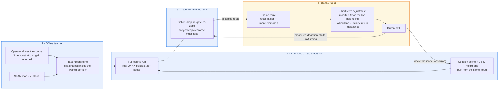
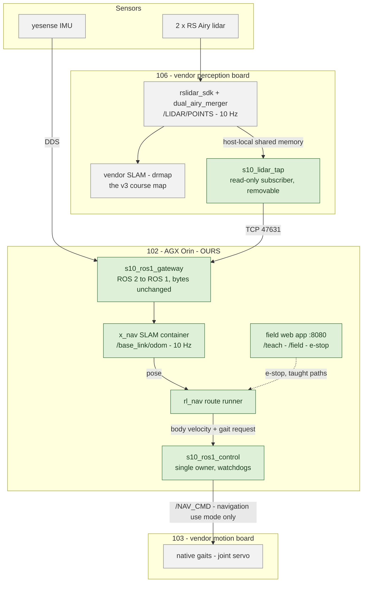
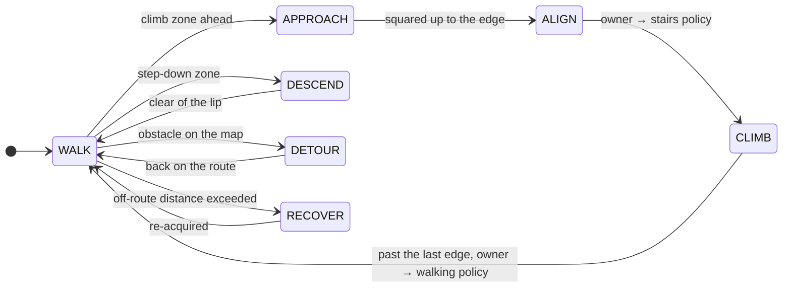
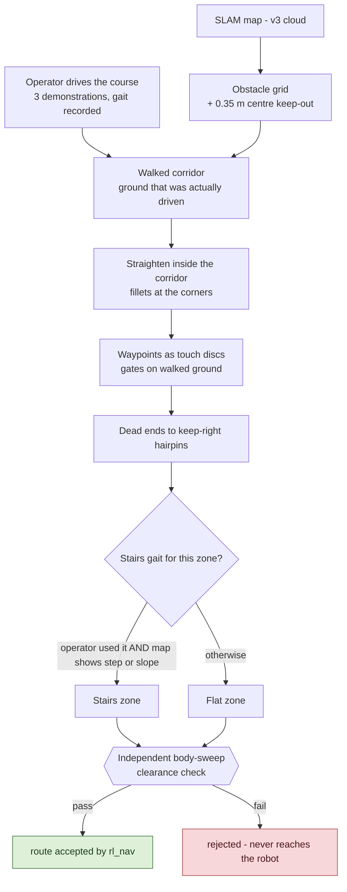
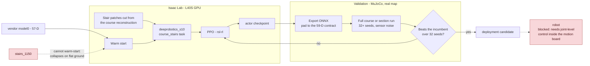
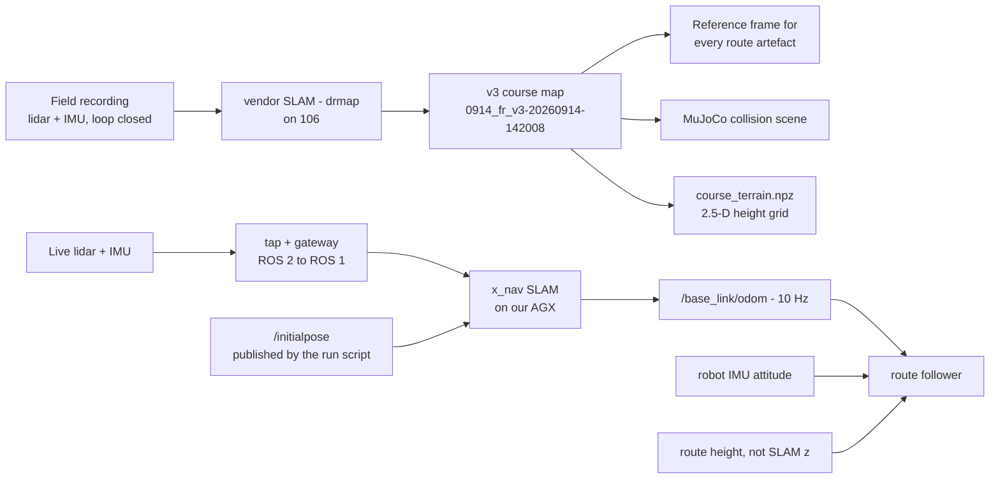
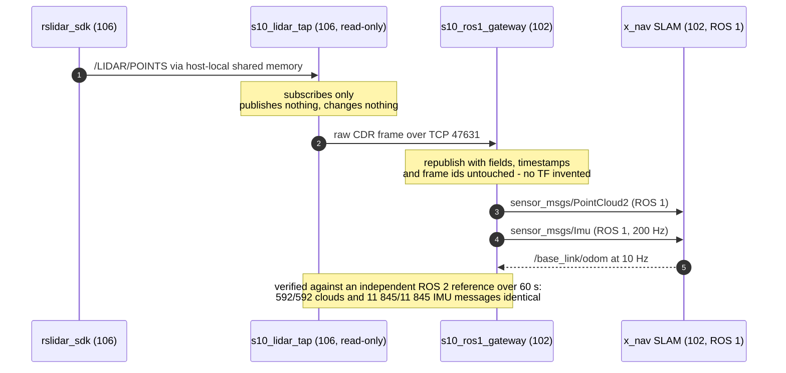
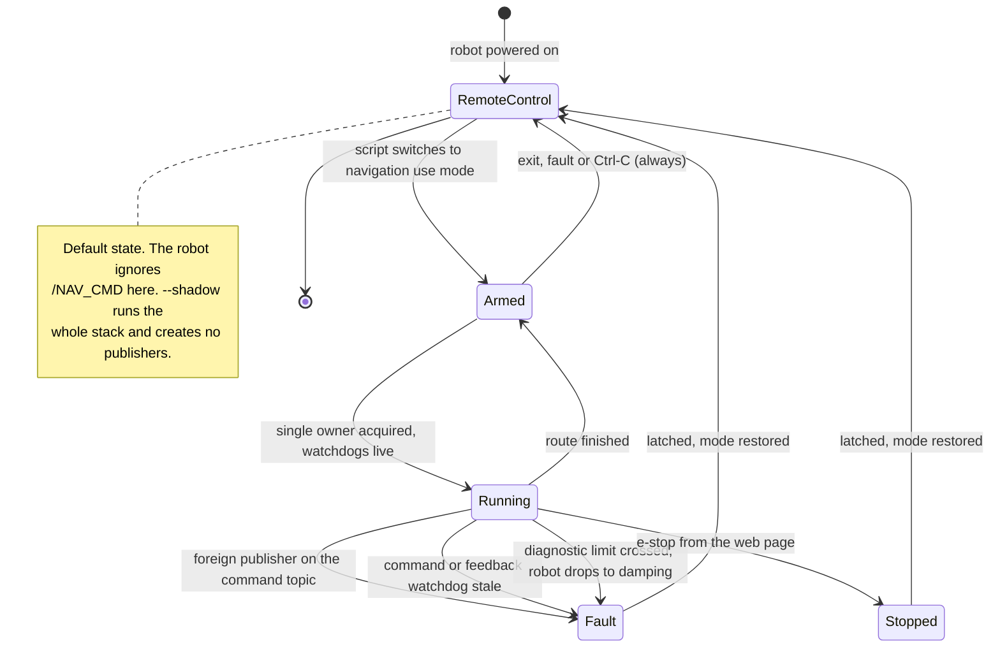

<div align="center">

# goai26-s10-racing

Autonomous course navigation for the DEEP Robotics Lynx S10, a wheel-legged quadruped.<br>
Built for GOAI 2026, Track 4 *Embodied Future*, Challenge 2: S10 Perception Racing.

**English** · [中文](README.zh.md)

[](LICENSE)
[](https://docs.ros.org/en/jazzy/)
[-22314E.svg?logo=ros&logoColor=white)](https://www.ros.org/)
[](https://releases.ubuntu.com/24.04/)
[](https://mujoco.org/)
[](https://isaac-sim.github.io/IsaacLab/)
[](https://www.python.org/)


<sub>The full course in MuJoCo. The follower hands the joints between two RL policies, J3100 for walking and 1150 for stairs, and reaches all 30 waypoints in 713 s of simulated time. Colour is the controller mode; the orange bands are climb zones.</sub>

<table>
<tr>
<td width="52%"></td>
<td></td>
</tr>
<tr>
<td><sub>Dog 048 stepping off the gabion wall in the platform gait. The planner marks this ledge as a jump lane.</sub></td>
<td><sub>A field run from 2026-09-21: the path the robot drove, drawn over the planned line and the offline map. Orange is where the local planner was replanning.</sub></td>
</tr>
</table>

</div>

---

## Contents

- [Overview](#overview)
- [Results](#results)
- [How it works](#how-it-works)
- [Hardware](#hardware)
- [What we built](#what-we-built)
- [Planning and navigation](#planning-and-navigation)
- [Simulation](#simulation)
- [Locomotion and RL training](#locomotion-and-rl-training)
- [Mapping and localisation](#mapping-and-localisation)
- [Field tools](#field-tools)
- [Running on the robot safely](#running-on-the-robot-safely)
- [Status](#status)
- [Quick start](#quick-start)
- [Repository layout](#repository-layout)
- [Documentation](#documentation)
- [Team](#team)
- [Development](#development)
- [History and license](#history-and-license)

## Overview

We taught the robot the course by driving it, checked and corrected that route in a MuJoCo model built from the real map, and then ran it on the robot with a local planner watching the ground just ahead.

The robot follows a taught centreline, picks a gait for each segment, and only starts a recovery when it is measurably off the line. We test routes in two simulators: a quick kinematic one for the whole course, and MuJoCo with the real map and the real ONNX policies, where the route reached all 30 waypoints in 713 s. The walking policies come from the vendor, from our own Isaac Lab training and from teammates, and three of them have run on the robot. For localisation we started on the vendor's SLAM map and later moved to a third-party SLAM (x_nav), which we feed through our own ROS 2 to ROS 1 gateway. A set of web pages served from the robot handles mapping, waypoint surveys and recording taught paths.

Throughout this page, ✅ means it ran on the robot, 🧪 means simulation only, 🗄 is historical and 📝 is pending.

## Results

<div align="center">

</div>

The run above is from 16:53 on 2026-09-21: WP01 to WP17, 119.5 m in 155 s. The robot stayed within 0.45 m of the planned line the whole way (mean 0.133 m) and never came near the 0.80 m threshold that triggers recovery. For 114 of the 152 control ticks the local planner was replanning around what the lidar saw. We don't record a pose topic during runs, so the path is rebuilt from the distance along the route and the lateral offset that the runner logs every tick. [`robot/tools/run_review/plot_driven_vs_planned.py`](robot/tools/run_review/plot_driven_vs_planned.py) regenerates it for any run.

### On the robot

#### Evening of 2026-09-21, into 09-22

The platform-gait strategies (s3 to s5) ran on the course. At 23:18 the dog climbed the WP17 ledge at 0.7 m/s after failing at 0.4 m/s, and that is why platform speed became a command-line option. There were motion sessions at 23:18, 23:36, 23:52 and 00:16, and route s5 went onto the robot at about 01:20. The per-run times and paths for this session are still in the logs on the AGX; they will go into this page once they are copied off.

#### Morning of 2026-09-21: first long run

Dog 048, our route runner on ROS 1 driving the robot's own gaits.

| | |
|---|---|
| Section | WP10 → WP29 in **569 s** |
| Where the time went | 66 % in the stairs gait at its 0.30 m/s cap (the operator's own median in that gait is 0.73 m/s). The flat parts averaged 0.69 m/s, held back by a speed scaling on visible free space and by strafing back to the line. |
| What we changed because of it | stairs speed set by distance and terrain, steering back to the line, faster acceleration. Simulated at 413 s against about 470 s for the morning version. |

#### 2026-09-20: first autonomous run

Dog 048, an indoor room map, flat gait.

| | |
|---|---|
| Route | WP01 → WP02 on map `v6_room`, 4.67 m in a straight line, 5.0 m along the route |
| Run | 19:27:46 to 19:28:25, **38.2 s**, finished in `DONE` with no fault and no operator input |
| Speed | commanded limit 0.10 m/s, measured about 0.12 m/s over roughly 4.5 m (the native gait doesn't track the command exactly) |
| Arrival | stopped 0.22 m from WP02; arrival counts on entering the 0.20 m radius |
| Moving the joints | the vendor controller (state 17, flat gait `0x3002`) in navigation use mode, not J3100 or 1150 |
| What it needed | navigation use mode for `/NAV_CMD`; roll and pitch from the robot's IMU because x_nav's pitch is biased; blind-zone fill in the height grid; a 0.12 m step limit on flat ground; a loose height tolerance because x_nav's z drifts; the measured standing height of 0.41 m |

### In simulation

#### MuJoCo, full course, 2026-09-19

`route_v2` follower, J3100 and 1150, ground-truth localisation.

| | |
|---|---|
| Waypoints | **30 / 30**, each within 0.18 m |
| Time | **713.0 s** over 260 m |
| Wheel speed over 30 rad/s | 1.94 s in total, peak 57.9 rad/s |
| Tilt over 15° | 21.8 s in total |
| Reproducibility | identical tick for tick after rebuilding the environment |

#### Many seeds on the team GPU server

Over 32 seeds per stack on the full course, the current runner finishes 19/32 (23/32 at the previous commit), against 4/24 for the first version. With 5 cm / 2° localisation noise on seeds 0 to 11: the B staircase 9/12 (three falls at 60–63° of tilt), the terrace 11/12, the whole course 8/12. Which seeds fail changes whenever the command stream changes, so we only compare over 32 or more.

#### August simulation contest, Ver 1.0

Official simulator, vendor 57-D policy plus the Gate 16 bundle: 33/33 ordered gates (WP0 to WP32) on seed 6, official time 436.058 s, 257.49 m, maximum tilt 57.9°. Not every seed made it. Seed 8 failed twice and seed 10 stalled before WP29.

### Sensor gateway

Measured on 2026-09-19. The byte-level audit is described under [mapping](#mapping-and-localisation). This is the ten-minute load test.

| Where | Process | CPU (one core) | Memory |
|---|---|---|---|
| AGX (102) | gateway | mean 30.3 %, p95 34.9 % | 67 MiB |
| Perception board (106) | read-only tap | mean 8.4 %, p95 9.0 % | 185 MiB |
| Perception board (106) | vendor lidar driver | 13.4 % with the tap attached, 14.1–14.6 % before | 175 MiB |

The last row is why we could put the tap on a board we don't own: it didn't add measurable load to the vendor's driver. Over the same ten minutes the gateway passed 13 621 of 13 621 frames with no drops or errors, 19.3 GB over one connection, at 9.96–10.00 Hz for the lidar and 199.79–199.99 Hz for the IMU. The 106 figures were copied by hand from the sampler's screen, because its raw file was deleted by a restart before we saved it. Raw files and notes are in [`artifacts/evidence/runs/ros1-gateway-newdog-20260919/`](artifacts/evidence/runs/ros1-gateway-newdog-20260919/README.md).

The same tap and gateway ran under every field session on 09-20, 09-21 and 09-22, about 20 navigation runs including the full 272 m course, and no run failed because of sensor data. We didn't keep per-run frame counts for those, so treat that as experience, not measurement.

## How it works

The course is taught once. After that, each stage feeds the next and also sends corrections back: MuJoCo fixes the route before the robot ever sees it, and what the robot measures in the field fixes it again.



1. Offline teacher. The operator drives the course a few times. From those drives the tool builds an obstacle grid out of the SLAM map and a corridor of ground that was actually driven over, then straightens the line inside that corridor.

2. MuJoCo simulation of the real map. The same point cloud becomes a collision scene and a 2.5-D height grid. The candidate route runs there with the real ONNX policies over 32 or more seeds. We use it to find where the route breaks.

3. Route fixes. Whatever MuJoCo turns up goes back into the line. We splice in a re-taught segment, drop a waypoint, move a gate, change a gait zone or shorten a jump lane. Every candidate has to pass a separate body-sweep clearance check before the runner will load it.

4. On the robot. The route itself is fixed before the run starts. What changes during the run is the short stretch in front of the robot. A modified A* replans locally on the live height grid, a lane controller steers the robot back onto the line, and the gait for each zone depends on the distance along the route and on what the map shows under the wheels. Recovery only kicks in on a measured deviation.

Every field run logs, per control tick, the distance along the route, the lateral offset, the follower state and the gait. We use those logs to edit the next route. That is how we found the stairs speed cap was eating 66 % of the morning run.

The current `route_v2.json` came from matching 30 waypoint photos to the mapping keyframes ([`robot/tools/wp_match`](robot/tools/wp_match/README_ZH.md)). Its uncertainty radius is 1.5 to 3 m, which is why we built the [`/teach`](robot/tools/s10_mapping_web/TEACH_GUIDE_ZH.md) survey page. The full design is in [`docs/NAVIGATION_DESIGN_ZH.md`](docs/NAVIGATION_DESIGN_ZH.md) (Chinese).

## Hardware

The robot has three onboard computers, two lidars and an IMU. Only one of the computers is ours. The other two are vendor boards, and the robot is shared with another team.

| Part | What it is | Who owns it |
|---|---|---|
| DEEP Robotics Lynx S10 | wheel-legged quadruped: 4 legs × 3 joints plus 4 wheels, 16 actuators | vendor |
| 106, perception board | `rslidar_sdk` and `dual_airy_merger`, the vendor SLAM (`drmap`); publishes only on the board itself | vendor, with our read-only tap added |
| 102, AGX Orin | our computer: gateway, x_nav SLAM, route runner, control node, field web app | **ours** |
| 103, motion board | the native gaits and joint servos; accepts `/NAV_CMD` only in navigation use mode | vendor; we switch the mode for a run and switch it back |
| 2 × RS Airy lidar | merged into `/LIDAR/POINTS` at 10 Hz | vendor |
| yesense IMU | `/IMU` at 200 Hz; the follower trusts its attitude | vendor |



Green is ours. Anything we put on a vendor board either only reads, or comes off again with one command (see [running on the robot safely](#running-on-the-robot-safely)).

## What we built

Most of the stack is the vendor's. These five parts are ours, and each one exists because we hit a problem that configuration couldn't solve. The complete technical reference (the whole chain, planning strategy, parameters, tests, what hasn't been verified, how to roll back) is [`robot/ros1_gateway/docs/PIPELINE_AND_PLANNING_ZH.md`](robot/ros1_gateway/docs/PIPELINE_AND_PLANNING_ZH.md) (Chinese).

### A read-only tap and a byte-exact bridge

The vendor only publishes the lidar on its own board, and the SLAM we wanted to use speaks ROS 1. So a subscriber on that board reads the raw frames and forwards them to our computer, where a one-way bridge republishes them without touching the fields, timestamps or frame ids. Against an independent reference over 60 s, 592 of 592 point clouds and 11 845 of 11 845 IMU messages came out identical. Nothing on the vendor side changes, and one command removes all of it.

### A control node with exactly one owner

Only one velocity source can drive the robot at a time. If some other process publishes on the command topic, the node latches a fault. Separate watchdogs on the commands and on the robot's feedback stop it if either goes quiet. Gaits only change at a standstill, and only after the robot confirms the change. A dry run creates no publishers at all.

It also handles something we learned the hard way: the robot ignores navigation commands unless it is in navigation use mode. The node switches that mode on for the run and back to remote control on exit, on a fault, or on Ctrl-C.

### A taught line in place of a drawn route

The operator drives the course a few times. The tool turns those drives into an obstacle grid and a corridor of driven ground, then straightens the line inside the corridor and rounds off the corners. Waypoints become discs the robot has to touch. Gates are placed on ground that was actually driven, dead ends turn into keep-right hairpins, and a stretch only gets the stairs gait if the operator used it there and the map shows a step or a slope. No candidate line reaches the runner without passing a separate body-sweep clearance check.

<table>
<tr>
<td width="58%"></td>
<td></td>
</tr>
<tr>
<td><sub>Thin lines are the operator's three drives. The dots are the straightened line, blue for the flat gait and red for stairs. Dark cells are real obstacles; grey is the 0.35 m keep-out around the centre.</sub></td>
<td><sub>The same drives coloured by the gait the operator was using, with the recorded switch points (▲ into stairs, ▼ out).</sub></td>
</tr>
</table>

Over the full course this raised the share of straight driving from 35–50 % to 86 % and cut total turning from 9 390–14 313° to 2 209°, on a 279.7 m line with 29 waypoints.

<div align="center">

<br>
<sub>Kinematic simulation, not a field run: the straightened line driven over the whole course, with the flat and stairs zones and the waypoint discs.</sub>
</div>

### Tracking that trusts the right sensor

For attitude the follower uses the robot's own IMU rather than the SLAM output, and for height it uses the route rather than the SLAM's z. The height grid filters out the robot's own body and fills in the blind zone under it. To get back onto the line the robot steers (Stanley-style, at most 20°) instead of strafing. Output acceleration is limited, there is a single speed setting, and in stairs-gait zones the speed depends on the distance along the route and on what the map shows.

### Operations that a shared robot can live with

One command starts a session and another puts the robot back exactly the way it was. The stack starts on boot with a watchdog, and the map and pose come back without the vendor's web page. A route can be run forwards, backwards, or from any waypoint with a single command. The e-stop on the web page also stops runs that were started from a terminal.

## Planning and navigation

`src/s10_auto_nav` is the ROS 2 package. One rule runs through it: the first version's controller is the normal behaviour. We add robustness as recovery that a measured deviation triggers, never as a guard that is always on, because when we tried the always-on version it stopped the robot on runs where nothing was wrong.

| Piece | What it does | Status |
|---|---|---|
| [`rl_nav/route_runner.py`](src/s10_auto_nav/s10_auto_nav/rl_nav/route_runner.py) | mode machine over the taught route; outputs body velocity and the joint-owner request | ✅ |
| [`rl_nav/prepare.py`](src/s10_auto_nav/s10_auto_nav/rl_nav/prepare.py) | offline route grounding, climb manoeuvres, map surface, report | 🧪 |
| [`route_v2.py`](src/s10_auto_nav/s10_auto_nav/route_v2.py), [`route_planner.py`](src/s10_auto_nav/s10_auto_nav/route_planner.py) | centreline following with a Frenet local planner, and an A* fallback on the prior map | 🧪 |
| [`robot/native_transfer/`](robot/native_transfer/README_ZH.md) | the same follower driving the vendor's native gaits over ROS 2 | ✅ deployed, observing only |
| [`robot/ros1_gateway/nav/`](robot/ros1_gateway/docs/HANDOFF_S10_AUTONOMY_STACK.md) | the same runner under ROS 1 on the AGX, with the run scripts | ✅ drives the robot through `s10_ros1_control` |

The runner's modes:



How operator drives turn into a route the runner will accept:



## Simulation

There are two levels, and both use the same route files.

The kinematic harness in [`sim/sim_full_course/`](sim/sim_full_course/README_ZH.md) builds a 2.5-D terrain from the v3 point cloud, moves a kinematic robot along it, drops obstacles at chosen distances, and uses the same perception interface as the real nodes. It is quick enough to run on every change.

The MuJoCo harness lives in the [`s10-rl-sprint`](https://github.com/bowenwan6/s10-rl-sprint) repository and builds its scene from the same map. The 30/30, 713 s result comes from there.

<div align="center">

<br>
<sub>The 713 s run at about 60× speed. The overlay shows the target waypoint, controller mode, active policy, speed, leg torque, wheel speed and tilt.</sub>
</div>


<sub>Nine moments from the same run: the start area, the B staircase on the stairs policy, the long straight, a hand-off at a ledge, the rock bed and the garden.</sub>

## Locomotion and RL training

The policies come from three places: the controller the vendor ships, our Isaac Lab training in [`s10-rl-sprint`](https://github.com/bowenwan6/s10-rl-sprint), and teammates' models on the `Jackdev` branch. [`docs/POLICIES_AND_APPS_ZH.md`](docs/POLICIES_AND_APPS_ZH.md) (Chinese) has the full list with measured limits.

| Policy | Obs → act | Used for | Status |
|---|---|---|---|
| Vendor 57-D | 57 → 16 | general walking, the robot's default | ✅ |
| `speedturn2000` | 57 → 16 | speed and turning, fine-tuned from the vendor model | ✅ |
| HIM 1500 | 342 → 16 | walking with history input | ✅, failed at the first stair |
| J3100 | 59 → 16 | walking actor for `rl_nav` | 🧪 |
| 1150 | 59 → 16 | stairs, steep and side slopes | 🧪 |
| Gate 16 v1.5 | 174 → 16 | one 0.377 m ledge in the August contest | 🗄 |
| `stairs_stable` | 57 → 16 | climbing stairs in the August contest | 🗄 |

The limits matter more than the list. J3100 handles 3–8 cm steps and 8–12° slopes at 0.6–0.8 m/s, but stalls on the same ground at 0.4 m/s. 1150 climbs 12–18 cm steps and 20° slopes, yet barely turns, and it pushes the wheels to 37–47 rad/s when the robot's diagnostic limit is 30. No single model covers the whole course, so the stack hands the joints over from segment to segment.

On the real robot the joints still belong to the vendor's controller. Running J3100 or 1150 there needs joint-level control inside the motion board, which we don't have yet, so the field runs use the native gaits and the RL policies stay in simulation for now.

This is the training loop. Isaac Lab on an L40S produces a candidate, and MuJoCo on the real map decides whether it beats the current one:



Two constraints shaped the next round. First, the actors the robot runs take 59 inputs: this repo's 57-D observation plus the sine and cosine of the runner's gait phase. Any replacement has to match that exactly. Second, `stairs_1150` can't be fine-tuned. Warm-started in Isaac Lab it can't even stand on flat ground (the base sinks to 0.37 m and 69 % of episodes end with the body on the ground), even though gains, action scale and joint order all match, while the vendor's `model0` stands at 0.454 m without falling. So a better climber has to be trained starting from `model0`. The other direction works: `model0` padded to 59 inputs walked WP21 to WP24 in the MuJoCo course in 105 s, against 110 s for J3100.

MuJoCo gives different results on x86 and ARM, and small changes to the command stream change which seeds fail. So we judge completion over at least 32 seeds. Section runs hardly depend on the seed unless `--loc_noise` is on, because sensor noise only matters in the modes the follower drives.

Training code, evaluation harnesses and acceptance criteria are in the sprint repository. This repository has the exported ONNX models in [`models/`](models/), the deployment code in [`robot/integration/`](robot/integration/), and the August training code in [`sim/training/`](sim/training/).

## Mapping and localisation

<table>
<tr>
<td width="55%"></td>
<td></td>
</tr>
<tr>
<td><sub>The v3 course point cloud (<code>0914_fr_v3-20260914-142008</code>). Every route file uses this frame.</sub></td>
<td><sub>The MuJoCo collision scene built from the same cloud.</sub></td>
</tr>
</table>

The vendor SLAM on board 106 produced the v3 map and the localisation we used through August and September. The map, the MuJoCo scene and an offline viewer are in [`artifacts/data/deliverables/`](artifacts/data/deliverables/S10_v3_Map_MuJoCo_20260916/README.md).

x_nav is a third-party SLAM that runs in a container on our AGX and publishes `/base_link/odom` at 10 Hz. It needs the sensor topics in ROS 1, which is what our gateway provides. Indoor maps are built, saved and relocalised into, and the run script sets the starting pose by publishing `/initialpose`.

Aligning the map to the v3 frame, re-surveying the waypoints and rebuilding the route are planned in [`docs/NAVIGATION_DESIGN_ZH.md`](docs/NAVIGATION_DESIGN_ZH.md), section 3.

From a field recording to the pose the follower uses:



x_nav never sees the vendor's ROS 2 graph, so the gateway ([`robot/ros1_gateway/`](robot/ros1_gateway/README_ZH.md), Chinese) has to hand it the data exactly. This is the whole path:



`robot_session.sh down` removes the tap and every file it put on 106.

## Field tools

A small web server on the AGX, written with the Python standard library, serves the field pages over the robot's Wi-Fi ([`robot/tools/s10_mapping_web/`](robot/tools/s10_mapping_web/README.md)).

`/teach` is the collection page we use now. It records mapping runs with a helper for closing the loop, surveys waypoints with a 3 s stillness test (the position spread has to stay under 2 cm and the heading under 1°), records pairs of switch points for handing over between policies, and records taught paths. It only records. It never sends a motion command and never changes the map. The field procedure is in [`TEACH_GUIDE_ZH.md`](robot/tools/s10_mapping_web/TEACH_GUIDE_ZH.md) (Chinese).

[`teach_to_route.py`](robot/ros1_gateway/tools/teach_to_route.py) turns a teach session into a route: the waypoints and taught centreline become `route_v2.json`, and the switch points become the climb manoeuvres the runner uses.

Phones reach the page through a user-level forwarder on the vendor board, and the app itself stays on our AGX. We remove the forwarder when we hand the robot back.

The older pages (`/`, `/localization`, `/heightmap`, `/field`, `/imu-check`, `/native-nav`) cover mapping control, live pose, the elevation map, field checklists and native-gait tests. They are tied to robot 48 and shouldn't be opened on the shared robot; [`docs/POLICIES_AND_APPS_ZH.md`](docs/POLICIES_AND_APPS_ZH.md) section 2.1 explains why.

<table>
<tr>
<td width="50%"></td>
<td></td>
</tr>
<tr>
<td><sub>Sensor rates, the pose topic in use, and a live top view with the trail, waypoints, switch points and the robot.</sub></td>
<td><sub>The 30-waypoint grid (green means the 3 s stillness test passed) and a switch point saved with 0.3 cm / 0.1° spread.</sub></td>
</tr>
</table>

<sub>Screenshots are from the built-in demo mode (<code>teach-worker.sh start --fake</code>), which simulates a robot so the page can be practised without one.</sub>

## Running on the robot safely

- One joint owner. [`robot/integration/joint_command_owner.hpp`](robot/integration/joint_command_owner.hpp) makes sure `/JOINTS_CMD` has a single source. Switching owners goes through a 0.25 s SafeHold, so two policies never drive the joints at once.
- The diagnostic limits are the robot's: 25.76 / 30 rad/s for leg and wheel speed, 45 / 12 N·m for torque. Going over them drops the robot into damping. That is what stopped HIM 1500 on the stairs, and 1150 would hit it today.
- The velocity bridge [`robot/ros1_gateway/src/s10_ros1_control`](robot/ros1_gateway/README_ZH.md) turns ROS 1 `/cmd_vel` and web commands into native motion commands, with clamps, timeouts, a latched stop and a fault if anyone else publishes. By default it is a dry run. It only moves the robot with `--enable-motion` and someone on site.
- Sharing the robot. `robot_session.sh up` deploys what we need. `down` removes every file and process we created on 106 and leaves the vendor services running, and `unkeys` removes our SSH keys. Any change we make to a vendor board, including the plaintext control ports that `/NAV_CMD` needs, is written down and undone before we hand the robot back. We check with the other team before any motion test, because the robot already has two native publishers on `/NAV_CMD`.
- Arming is explicit. The robot ignores `/NAV_CMD` until it is switched to navigation use mode. Our scripts switch it, run, and always switch it back to remote control on exit, on a fault or on Ctrl-C. `--shadow` runs the whole stack without sending a single command.
- One command per run, so the operator can keep the remote in their hands: `robot_session.sh nav --speed <m/s> [--route short|full] [--shadow]` picks the map, sets the starting pose, waits for the robot to stand, arms, runs, prints one status line per second, and puts the mode back at the end. Procedure and thresholds are in [`ROOM_NAV_RUNBOOK_ZH.md`](robot/ros1_gateway/docs/ROOM_NAV_RUNBOOK_ZH.md), and the field log is [`EXPERIMENT_048_ZH.md`](robot/ros1_gateway/docs/EXPERIMENT_048_ZH.md) (both Chinese).

Who can move the robot, and what stops it:



## Status

| Area | Run on the robot | Simulation only | Still to do |
|---|---|---|---|
| Locomotion | vendor 57-D, `speedturn2000`, HIM 1500 (not on stairs), the native flat gait under our commands | J3100, 1150, Isaac Lab candidates | joint-level control on the robot; wheel-speed margin for 1150 |
| Navigation | route runner on ROS 1: the 4.7 m room run, WP10 → WP29 in 569 s, and the platform-gait strategies on 09-21 evening and 09-22 | — | lap times from the 09-21 evening and 09-22 logs |
| Sensing | ROS 1 gateway, 106 tap, PTP clock sync, autostart on boot | — | — |
| Mapping | v3 vendor map; x_nav mapping and localisation on the robot | — | registering x_nav to v3; re-surveying the outdoor waypoints |
| Field tools | `/teach` on the robot, reachable from a phone through the 103 forwarder | — | a full outdoor survey session end to end |

## Quick start

```bash
git clone https://github.com/bowenwan6/goai26-s10-racing.git
cd goai26-s10-racing
git lfs pull            # point clouds and MuJoCo scenes
```

Run the kinematic whole-course simulation. It needs no ROS and no GPU, and takes a few minutes on a laptop:

```bash
python -m pip install -r sim/sim_full_course/requirements.txt
PYTHONPATH=sim python -m sim_full_course.harness       # nominal run over route_v2
PYTHONPATH=sim python -m sim_full_course.harness --scenario detour_box --s0 160 --s1 185 --obstacle-s 172
```

Run the tests (no robot needed):

```bash
PYTHONPATH=.:sim:robot:src/s10_auto_nav:src/s10_perception \
  python -m pytest -q src/s10_auto_nav/test sim/sim_full_course/tests robot/tests_real
```

Prepare a route for the robot. This turns `route_v2` and a height grid into what `rl_nav` reads:

```bash
ros2 run s10_auto_nav rl_nav_prepare \
  --route route_v2_field.json --terrain course_terrain.npz \
  --overrides overrides_v1.json --method first --out prepared/
```

Bring up the sensor path, from a laptop. `up` deploys the 106 tap and starts the gateway, and `down --agx` removes everything again:

```bash
bash robot/ros1_gateway/scripts/robot_session.sh up
bash robot/ros1_gateway/scripts/health_check.sh --hz 10
bash robot/ros1_gateway/scripts/robot_session.sh down --agx
```

The stack from the August simulation contest runs in its own container; see [history](#history-and-license).

## Repository layout

| Path | Contents |
|---|---|
| [`docs/`](docs/) | design documents, media, vendor references |
| [`src/`](src/) | ROS 2 packages: `s10_auto_nav` (navigation), `s10_perception`, `s10_bringup` |
| [`robot/`](robot/) | everything that runs on or talks to the robot: the ROS 1 gateway and 106 tap, the C++ SDK code, the transfer stacks, the field web app, run scripts, docker |
| [`sim/`](sim/) | the `sim_full_course` kinematic harness and `training` |
| [`models/`](models/) | `deployed/` holds what the robot loads; `candidates/` holds training sweeps |
| [`artifacts/`](artifacts/) | `data/` (maps, routes, photos), `evidence/` (dated field records), `reports/` |

`upstream/` isn't tracked. [`robot/scripts/setup_upstream.sh`](robot/scripts/setup_upstream.sh) fetches the organisers' SDK at the pinned revision `13dd084b`. Tool output goes to `out/`, which isn't tracked either.

## Documentation

Three documents cover the whole repository, all in Chinese:

- [Policies and apps](docs/POLICIES_AND_APPS_ZH.md): every policy and tool, their status, measured numbers and open gaps.
- [Navigation design](docs/NAVIGATION_DESIGN_ZH.md): route_v2 following, the `rl_nav` runner and how we plan to make it more robust, and the plan for the new SLAM.
- [Repository guide](docs/REPO_GUIDE_ZH.md): directories, branches, large files, third-party code and licences, and what to check before pushing.

The operating manuals sit next to their code:

- [`robot/ros1_gateway/docs/PIPELINE_AND_PLANNING_ZH.md`](robot/ros1_gateway/docs/PIPELINE_AND_PLANNING_ZH.md): the technical reference for the robot stack.
- [`robot/ros1_gateway/README_ZH.md`](robot/ros1_gateway/README_ZH.md): the ROS 1 gateway and motion bridge.
- [`robot/ros1_gateway/docs/`](robot/ros1_gateway/docs/): the English interface handoff, the field runbook, the first-run log, the test plan and the app API.
- [`robot/tools/s10_mapping_web/TEACH_GUIDE_ZH.md`](robot/tools/s10_mapping_web/TEACH_GUIDE_ZH.md): how to use `/teach` in the field.
- [`sim/sim_full_course/README_ZH.md`](sim/sim_full_course/README_ZH.md) and [`robot/tools/wp_match/README_ZH.md`](robot/tools/wp_match/README_ZH.md): the simulator and waypoint matching.

Documents written before 2026-09-20 were merged into the three above or retired. They are kept under the `docs-archive-20260920` tag:

```bash
git show docs-archive-20260920:docs/TECHNICAL_DESIGN.md
git show docs-archive-20260920:docs/S10_REAL_ROBOT_QUICKSTART_ZH.md
```

## Team

- **Bowen Wang** ([@bowenwan6](https://github.com/bowenwan6)): navigation and planning, the ROS 1 gateway and control node, simulation, field operations.
- **Jack** ([@Jack15678](https://github.com/Jack15678)): the gait recording tool and recording review, the stairs reconstruction, the flat-ground imitation training workflow, and the HIM 1500 policy with its SDK deployment, one of the three policies that ran on the robot.
- **Belsun** ([@belsun](https://github.com/belsun)): Gate 16 v1.5 with its confidence fallback and evaluation matrix, and the continuous stairs ascent controller for the August contest.

## Development

- `main` is the only integration branch, and everything reaches it through a pull request. Branch prefixes: `nav/`, `rl/`, `ros1/`, `codex/`, `docs/`, `integration/`.
- CI (`.github/workflows/ci.yml`) runs on every push: a correctness lint (ruff `E9,F,I`), the unit tests and a colcon build, with a separate style report that doesn't block. It also checks for developer paths, public IP addresses in the docs, the size of the README images, secrets and broken links.
- Large files (point clouds, meshes, PDFs, archives) use Git LFS, so run `git lfs pull` after cloning. The images in this README are plain Git files on purpose: from LFS, every view of the page would use up bandwidth quota, and once it ran out every image would break. CI keeps them under 1.2 MB each and 3.5 MB in total.
- Never commit raw recordings, vendor licence files, credentials of any kind, virtualenvs, build trees, or absolute paths from someone's own machine. [`docs/REPO_GUIDE_ZH.md`](docs/REPO_GUIDE_ZH.md) section 4 has the pre-push checks.

## History and license

The release from the August 2026 simulation contest is kept as two tags. [`v1.0-sim-release`](https://github.com/bowenwan6/goai26-s10-racing/releases/tag/v1.0-sim-release) is the Ver 1.0 release, and [`sim-contest-submission`](https://github.com/bowenwan6/goai26-s10-racing/releases/tag/sim-contest-submission) is the build we submitted (`s10-racing:submission-3660b81-clean`). The README from that release, with the contest run instructions and the Gate 16 interface, is at `git show docs-archive-20260920:docs/README_V1_ARCHIVE.md`.

This project is released under [BSD-3-Clause](LICENSE), the same licence as upstream. Sources for dependencies, data and models, including one model licence question that is still open, are listed in [`docs/REPO_GUIDE_ZH.md`](docs/REPO_GUIDE_ZH.md) section 4.

The Lynx S10, its SDK, its native gaits and the vendor SLAM belong to DEEP Robotics. The contest material belongs to the organisers; `robot/scripts/setup_upstream.sh` downloads it unchanged, and this repository doesn't keep a copy. Everything in `src/`, `robot/`, `sim/` and `docs/` is ours unless a file says otherwise.
