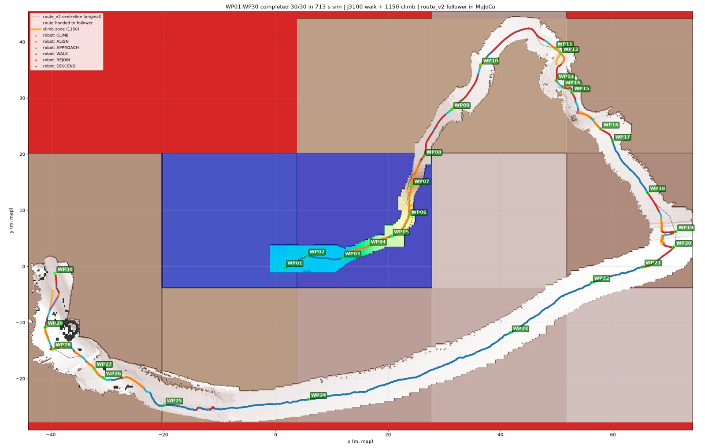
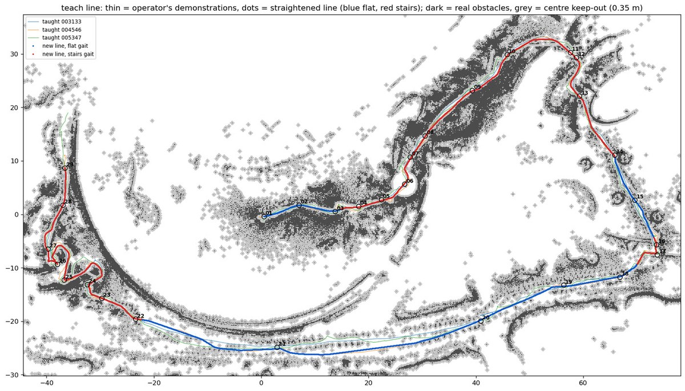
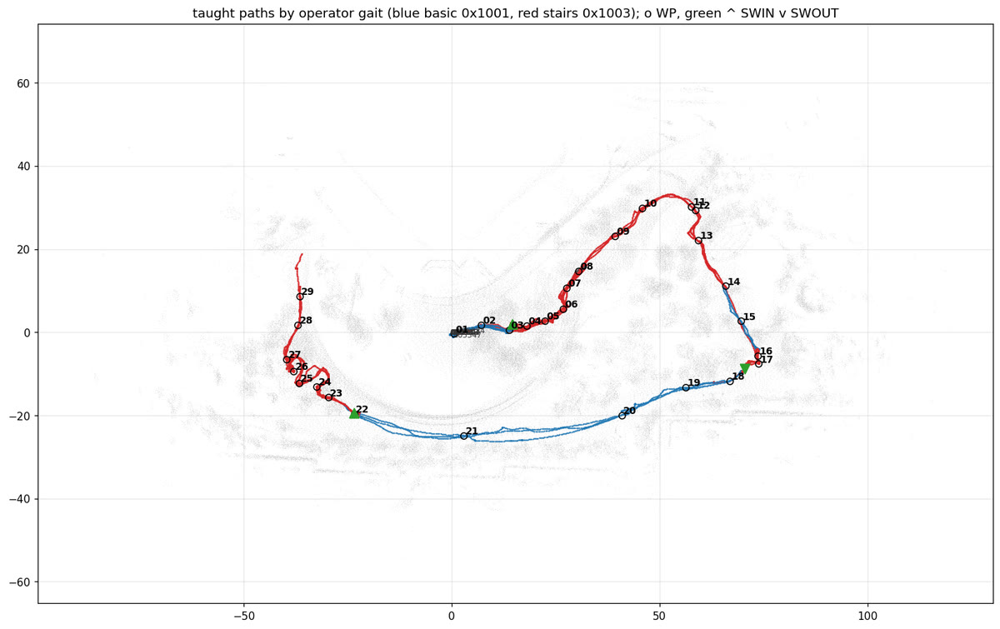
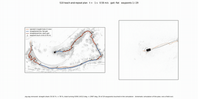
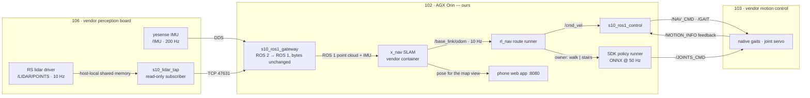
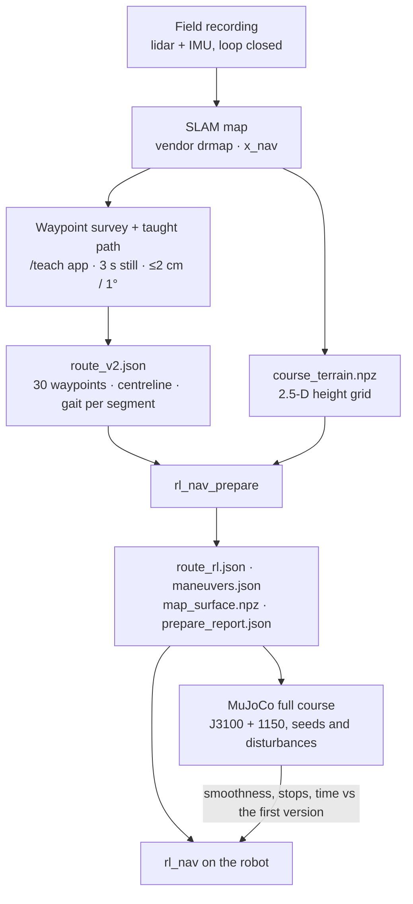
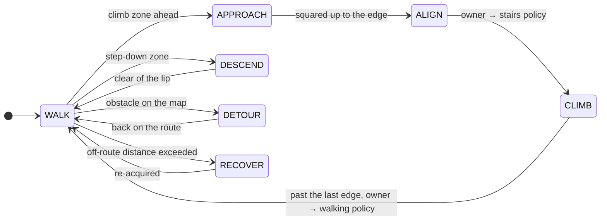
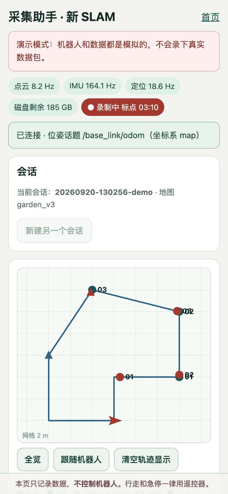

<div align="center">

# goai26-s10-racing

**Autonomous course navigation for the DEEP Robotics Lynx S10 wheel-legged robot** — route planning, MuJoCo and kinematic simulation, Isaac Lab locomotion policies, mapping and localisation, and the on-robot ROS 2 / ROS 1 stack.

GOAI 2026 · Track 4 *Embodied Future* · Challenge 2 — S10 Perception Racing

[](LICENSE)
[](https://docs.ros.org/en/jazzy/)
[-22314E.svg?logo=ros&logoColor=white)](https://www.ros.org/)
[](https://releases.ubuntu.com/24.04/)
[](https://mujoco.org/)
[](https://isaac-sim.github.io/IsaacLab/)
[](https://www.python.org/)



<sub><b>The whole course in simulation.</b> The <code>route_v2</code> follower drives two RL policies — J3100 for walking, 1150 for stairs — through all 30 waypoints in 713 s of simulated time. Trajectory colour is the controller mode; orange bands are climb zones handed to the stairs policy.</sub>

</div>

---

## Contents

- [What is in here](#what-is-in-here)
- [What we built](#what-we-built)
- [System overview](#system-overview)
- [From map to robot](#from-map-to-robot)
- [Quick start](#quick-start)
- [Modules](#modules)
  - [1 · Planning and navigation](#1--planning-and-navigation)
  - [2 · Simulation](#2--simulation)
  - [3 · Locomotion policies and RL training](#3--locomotion-policies-and-rl-training)
  - [4 · Mapping and localisation](#4--mapping-and-localisation)
  - [5 · Field tools on the phone](#5--field-tools-on-the-phone)
  - [6 · Real-robot deployment and safety](#6--real-robot-deployment-and-safety)
- [Results](#results)
- [Status](#status)
- [Repository layout](#repository-layout)
- [Documentation](#documentation)
- [Development](#development)
- [History](#history)
- [License and credits](#license-and-credits)

## What is in here

- **A route-following navigation stack** for a 30-waypoint outdoor course: a taught centreline, per-segment gait selection, and recovery that only fires on a measured deviation — [module 1](#1--planning-and-navigation).
- **Autonomous runs on the robot**: a first 4.7 m run on 2026-09-20, then **WP10 → WP29 of the course in 569 s** on 2026-09-21 — our route runner on ROS 1 driving the robot's native gaits — [Results](#results).
- **Two simulators**: a fast kinematic whole-course harness in this repo, and a full MuJoCo run of the real map with real ONNX policies — **30/30 waypoints, 713 s** — [module 2](#2--simulation).
- **Locomotion policies** from three sources: the vendor's 57-D controller, our Isaac Lab training runs, and teammate models. Three have run on hardware — [module 3](#3--locomotion-policies-and-rl-training).
- **Mapping and localisation**, from the vendor SLAM map (`0914_fr_v3`) to a new third-party SLAM (x_nav) reached through a byte-exact ROS 2 → ROS 1 gateway — [module 4](#4--mapping-and-localisation).
- **Field tools**: phone pages served from the robot's own compute for mapping, waypoint survey and taught-path recording — [module 5](#5--field-tools-on-the-phone).
- **Status labels** throughout: ✅ proven on hardware, 🧪 simulation only, 🗄 historical, 📝 pending — summarised under [Status](#status).

## What we built

Five pieces of this stack are ours rather than the vendor's. Each exists because something in the way could not be solved by configuration. The full technical reference — chain, planning strategy, parameters, tests, what is unverified, rollback — is [`ros1_gateway/docs/PIPELINE_AND_PLANNING_ZH.md`](ros1_gateway/docs/PIPELINE_AND_PLANNING_ZH.md) (ZH).

**1 · A read-only tap and a byte-exact bridge.** The vendor publishes the lidar only on its own board, and the SLAM we integrate speaks ROS 1. A read-only subscriber on that board forwards the raw frames to our compute, where a one-way bridge republishes them with fields, timestamps and frame ids untouched — 592/592 clouds and 11 845/11 845 IMU messages identical to an independent reference over 60 s. Nothing vendor-side changes, and one command removes every trace.

**2 · A control node that can only ever have one owner.** One velocity source at a time; a foreign publisher on the robot's command topic latches a fault; command and feedback watchdogs stop the robot when either goes stale; the gait changes only at a standstill and only once the robot confirms it; a dry run creates no publishers at all. It also encodes a precondition we found the hard way — the robot ignores navigation commands unless it is in navigation use mode — and puts it back in remote-control mode on exit, fault or Ctrl-C.

**3 · A taught line instead of a drawn route.** The operator drives the course a few times. The tool turns those demonstrations into an obstacle grid from the SLAM map and a corridor of ground that was actually walked, then straightens the line inside that corridor with fillets at the corners. Waypoints are touch discs rather than points, gates sit on walked ground, dead ends become keep-right hairpins, and a zone gets the stairs gait only where the operator used it *and* the map shows a step or slope. Every candidate line passes an independent body-sweep clearance check before the runner will accept it.

<table>
<tr>
<td width="58%"></td>
<td></td>
</tr>
<tr>
<td><sub>Thin lines: the operator's three demonstrations. Dots: the straightened line, blue for the flat gait and red for the stairs gait. Dark: real obstacles; grey: the 0.35 m centre keep-out.</sub></td>
<td><sub>The same demonstrations coloured by the gait the operator actually used, with the recorded switch points (▲ into stairs, ▼ out).</sub></td>
</tr>
</table>

On the full course the straight share rose from 35–50 % to 86 % and total turning fell from 9 390–14 313° to 2 209°, over a 279.7 m line with 29 waypoints.

**4 · A tracking layer that trusts the right sensor.** Around the follower: the robot's own IMU instead of the SLAM's attitude, the route's height instead of the SLAM's z, a self-body filter and blind-zone fill for the height grid, a lane that steers back to the line (Stanley-style, at most 20°) instead of strafing, acceleration-limited output, one speed knob, and stairs-gait zones where speed is set by distance along the route and by what the map shows.

**5 · Operations a shared robot can survive.** One command brings a session up and another puts the robot back exactly as it was; boot autostart with a watchdog; map and pose restored without the vendor web page; one command to run a route forward, in reverse, or from any waypoint; an e-stop on the web page that also stops runs started from a terminal.

<div align="center">

<br>
<sub><b>Kinematic simulation, not a field run.</b> The straightened line followed over the whole course, with the flat and stairs zones and the waypoint touch discs.</sub>
</div>

**Where it actually runs.** On the robot: the flat 5 m room route (2026-09-20) and a real run from WP10 to WP29 on the course (2026-09-21, 569 s, the morning version of the stack). The midday improvements — steering-based lane return, faster acceleration, terrain-aware stairs zones, splice/drop/contact editing of the line, resume from any waypoint, the web-page e-stop — passed 29/29 in simulation — 413 s at the time of that route build, against about 470 s for the morning version — and have not yet run on the robot. Work since then (braking before every gait change, a take-off check and dedicated lanes for platform jumps, one locked parameter file for the whole stack) is offline only.

## System overview

Three onboard computers. We own one of them; the other two are vendor boards on a robot shared with another team, so everything we add there is read-only or removable with one command.



Two ways to move the robot, and the navigation layer is the same for both: **native vendor gaits** (`/GAIT` 0x3002 flat, 0x3003 stairs), or **our RL policies** through the SDK runner. Only one of them owns the joints at any instant — see [module 6](#6--real-robot-deployment-and-safety).

On the robot today the native-gait path is the live one: joint-level control would have to run inside the vendor's motion board, so J3100 and 1150 stay in simulation while the route runner drives `/NAV_CMD` through `s10_ros1_control`. x_nav contributes localisation only.

| Board | Role | Owner | What we run there |
|---|---|---|---|
| **102** AGX Orin, Ubuntu 24.04 | our compute | us (`golai`) | ROS 2 Jazzy stack, user-space ROS 1 master + gateway, x_nav container, phone web app |
| **103** motion control | native gaits, PTP master | vendor | commands only, plus a user-level port forwarder so phones reach the AGX; both removed at handover |
| **106** perception | lidar, IMU, vendor SLAM | vendor | one read-only lidar tap in a user directory, removed by `robot_session.sh down` |
| **Phone** | field UI | — | browser on the robot Wi-Fi |

## From map to robot



The current `route_v2.json` came from matching 30 waypoint photos to mapping keyframes ([`tools/wp_match`](tools/wp_match/README_ZH.md)); its uncertainty radius is 1.5–3 m, which is why the [`/teach`](tools/s10_mapping_web/TEACH_GUIDE_ZH.md) survey exists. The design behind all of this is in [`docs/NAVIGATION_DESIGN_ZH.md`](docs/NAVIGATION_DESIGN_ZH.md) (ZH).

## Quick start

```bash
git clone https://github.com/bowenwan6/goai26-s10-racing.git
cd goai26-s10-racing
git lfs pull            # point clouds, MuJoCo scenes, media
```

**Run the kinematic whole-course simulation** (no ROS, no GPU, a few minutes on a laptop):

```bash
python -m pip install -r sim_full_course/requirements.txt
python -m sim_full_course.harness                      # nominal run over route_v2
python -m sim_full_course.harness --scenario detour_box --s0 160 --s1 185 --obstacle-s 172
```

**Run the test suites** (no robot needed):

```bash
PYTHONPATH=.:src/s10_auto_nav:src/s10_perception \
  python -m pytest -q src/s10_auto_nav/test sim_full_course/tests tests_real
```

**Prepare a route for the robot** — turns `route_v2` plus a height grid into what `rl_nav` consumes:

```bash
ros2 run s10_auto_nav rl_nav_prepare \
  --route route_v2_field.json --terrain course_terrain.npz \
  --overrides overrides_v1.json --method first --out prepared/
```

**Bring up the sensor path on the robot** — run from a laptop; `up` deploys the 106 tap and starts the gateway, `down` removes every trace:

```bash
bash ros1_gateway/scripts/robot_session.sh up
bash ros1_gateway/scripts/health_check.sh --hz 10
bash ros1_gateway/scripts/robot_session.sh down --agx
```

The competition stack from the August simulation contest runs in its own container — see [History](#history).

## Modules

### 1 · Planning and navigation

`src/s10_auto_nav` — ROS 2 package. One design rule shapes it: **the first version's controller stays the nominal behaviour**. We add robustness as recovery that a measured deviation triggers, never as an always-on guard, because the always-on version stopped the robot in undisturbed runs.

| Piece | What it does | Status |
|---|---|---|
| [`rl_nav/route_runner.py`](src/s10_auto_nav/s10_auto_nav/rl_nav/route_runner.py) | Mode machine over the taught route; emits body velocity and the joint-owner request | ✅ first autonomous run |
| [`rl_nav/prepare.py`](src/s10_auto_nav/s10_auto_nav/rl_nav/prepare.py) | Offline route grounding, climb manoeuvres, map surface, report | 🧪 |
| [`route_v2.py`](src/s10_auto_nav/s10_auto_nav/route_v2.py), [`route_planner.py`](src/s10_auto_nav/s10_auto_nav/route_planner.py) | Centreline following with a Frenet local planner, A\* fallback on the prior map | 🧪 |
| [`native_transfer/`](native_transfer/README_ZH.md) | Same follower driving the vendor's native gaits (ROS 2 route) | ✅ deployed; observation only, no commands sent |
| [`ros1_gateway/nav/`](ros1_gateway/docs/HANDOFF_S10_AUTONOMY_STACK.md) | The same runner under ROS 1 on the AGX, plus one-command run scripts | ✅ drives the robot through `s10_ros1_control` |



Details: [`docs/NAVIGATION_DESIGN_ZH.md`](docs/NAVIGATION_DESIGN_ZH.md) (ZH).

### 2 · Simulation

Two levels, both driven by the same route artefacts.

**Kinematic whole-course harness** — [`sim_full_course/`](sim_full_course/README_ZH.md). Builds a 2.5-D terrain from the v3 point cloud, moves a kinematic robot, injects obstacles by arc length, and shares the perception contract with the real nodes. Fast enough to run on every change.

**MuJoCo whole course with the real policies** — harness in the [`s10-rl-sprint`](https://github.com/bowenwan6/s10-rl-sprint) repo, scene built from the same map. This run produces the headline result below.

<div align="center">

<br>
<sub>The 713 s run at roughly 60× speed. The overlay shows target waypoint, controller mode, active policy, speed, leg torque, wheel speed and tilt.</sub>
</div>


<sub>Nine moments from the same run: the start apron, the B staircase under the stairs policy, the long traverse, a ledge hand-off, the rock bed and the garden section.</sub>

### 3 · Locomotion policies and RL training

Policies come from three places: the vendor's shipped controller, our Isaac Lab training in [`s10-rl-sprint`](https://github.com/bowenwan6/s10-rl-sprint), and teammate models on the `Jackdev` branch. The full table with measured limits and sources is in [`docs/POLICIES_AND_APPS_ZH.md`](docs/POLICIES_AND_APPS_ZH.md) (ZH); the short version:

| Policy | Obs → act | Role | Status |
|---|---|---|---|
| Vendor 57-D | 57 → 16 | general walking, default on the robot | ✅ hardware |
| `speedturn2000` | 57 → 16 | speed and turning, fine-tuned from the vendor model | ✅ hardware |
| HIM 1500 | 342 → 16 | history-conditioned general walking | ✅ hardware, failed on the first stair |
| **J3100** | 59 → 16 | walking actor for `rl_nav` | 🧪 |
| **1150** | 59 → 16 | stairs, steep slopes, side slopes | 🧪 |
| Gate 16 v1.5 | 174 → 16 | one 0.377 m ledge in the August contest | 🗄 |
| `stairs_stable` | 57 → 16 | stair ascent in the August contest | 🗄 |

The measured limits matter more than the list. J3100 clears 3–8 cm steps and 8–12° slopes at 0.6–0.8 m/s, yet stalls on the same terrain at 0.4 m/s. 1150 climbs 12–18 cm steps and 20° slopes, but barely turns and drives wheel speed to 37–47 rad/s, past the robot's 30 rad/s diagnostic limit. No single model covers the course, which is why the stack hands the joints over segment by segment.

On the robot the joints still belong to the vendor's controller: running J3100 or 1150 there needs joint-level control inside the motion board, so today's autonomous runs use the native gaits and the RL policies stay in simulation.

Two findings shape the next training round (details in [`docs/POLICIES_AND_APPS_ZH.md`](docs/POLICIES_AND_APPS_ZH.md) §1.2, sources in the sprint repo). The deployed actors take **59 inputs** — this repo's 57-D observation plus the sine and cosine of the runner's gait phase — so any replacement has to match that contract. And the stairs actor **cannot be fine-tuned**: dropped into Isaac Lab on flat ground with clean observations it collapses within a few seconds, while the vendor's model stands, so a better climber has to be trained from a model that survives there. Training on stair patches cut from the course reconstruction is in progress and does not beat the current stairs actor yet.

Training, evaluation harnesses and the acceptance criteria live in the sprint repo; this repo holds the exported ONNX models, the deployment glue in [`integration/`](integration/), and the August training code in [`training/`](training/).

### 4 · Mapping and localisation

<table>
<tr>
<td width="55%"></td>
<td></td>
</tr>
<tr>
<td><sub>v3 course point cloud (<code>0914_fr_v3-20260914-142008</code>), the reference frame for every route artefact.</sub></td>
<td><sub>Collision scene generated from the same cloud for MuJoCo.</sub></td>
</tr>
</table>

- **Vendor SLAM on 106** produced the v3 map and the localisation used through August and September. Map, MuJoCo scene and an offline viewer are in [`data/deliverables/`](data/deliverables/S10_v3_Map_MuJoCo_20260916/README.md).
- **New third-party SLAM (x_nav)** runs in a container on our AGX and publishes `/base_link/odom` at 10 Hz. It needs ROS 1 sensor topics, which is what the gateway provides. Indoor maps are built, saved and re-localised into; localisation is initialised by publishing `/initialpose`, which the run script does automatically.
- **ROS 2 → ROS 1 gateway** — [`ros1_gateway/`](ros1_gateway/README_ZH.md) (ZH). It forwards point cloud fields, timestamps and frame ids byte for byte and invents no TF. The 106 lidar publishes host-locally, so a read-only tap there relays CDR frames over TCP. Checked against an independent ROS 2 reference on the new robot: **592/592 clouds and 11 845/11 845 IMU messages identical over 60 s**.
- **Map alignment** to the v3 frame, waypoint re-survey and the route rebuild are planned in [`docs/NAVIGATION_DESIGN_ZH.md`](docs/NAVIGATION_DESIGN_ZH.md) §3 (ZH).

### 5 · Field tools on the phone

A small standard-library web server on the AGX serves the field pages over the robot's Wi-Fi ([`tools/s10_mapping_web/`](tools/s10_mapping_web/README.md)):

- **`/teach` — collection assistant** (current): mapping capture with a loop-closure helper, waypoint survey with a 3 s still test (≤2 cm position and ≤1° heading spread to pass), switch-point pairs for policy hand-off, and taught-path recording. Records only — it never commands motion and never switches maps. Guide: [`TEACH_GUIDE_ZH.md`](tools/s10_mapping_web/TEACH_GUIDE_ZH.md) (ZH).
- A teach session becomes a route with [`ros1_gateway/tools/teach_to_route.py`](ros1_gateway/tools/teach_to_route.py): waypoints and the taught centreline turn into `route_v2.json`, and the switch points become the climb manoeuvres the runner consumes.
- Phones reach the page through a user-level forwarder on the vendor board; the app itself stays on our AGX. The forwarder is removed at handover.
- **`/`, `/localization`, `/heightmap`, `/field`, `/imu-check`, `/native-nav`**: mapping control, live pose, elevation map, field checklists and native-gait tests. They are bound to robot 48; do not open them on the shared robot — the reason is in [`docs/POLICIES_AND_APPS_ZH.md`](docs/POLICIES_AND_APPS_ZH.md) §2.1.

<table>
<tr>
<td width="50%"></td>
<td></td>
</tr>
<tr>
<td><sub>Sensor rates, the pose topic in use, and a live top view: trail, waypoints, switch points and the robot.</sub></td>
<td><sub>The 30-waypoint grid — green means the 3 s still test passed — and a switch point saved with 0.3 cm / 0.1° spread.</sub></td>
</tr>
</table>

<sub>Screenshots from the built-in demo mode (`teach-worker.sh start --fake`), which simulates a robot so the page can be rehearsed without one.</sub>

### 6 · Real-robot deployment and safety

- **One joint owner.** [`integration/joint_command_owner.hpp`](integration/joint_command_owner.hpp) guarantees a single source of `/JOINTS_CMD`; switching owners passes through a 0.25 s SafeHold, so a policy hand-off can never overlap.
- **Diagnostic limits** are the robot's, not ours: 25.76 / 30 rad/s leg and wheel speed, 45 / 12 N·m torque. Crossing them drops the robot into damping — this is what stopped HIM 1500 on the stairs and what 1150 would hit today.
- **Velocity bridge** [`ros1_gateway/src/s10_ros1_control`](ros1_gateway/README_ZH.md) converts ROS 1 `/cmd_vel` and web commands into native motion commands with clamps, timeouts, a latched stop and an exclusivity fault. It is a **dry run by default**; motion needs `--enable-motion` and a person on site.
- **Sharing the robot.** `robot_session.sh up` deploys what we need; `down` removes every file and process we created on 106 and leaves the vendor services running, and `unkeys` removes our SSH keys. Any change to a vendor board — including the plaintext control ports that `/NAV_CMD` needs — is recorded and restored before handover. Before a motion test we agree with the other team first, because the robot already carries two native publishers on `/NAV_CMD`.
- **Arming is explicit.** The robot ignores `/NAV_CMD` until it is switched into navigation use mode; our scripts switch it, run, and always switch back to remote-control mode on exit, fault or Ctrl-C. `--shadow` runs the whole stack without sending a single command.
- **One command per run**, because a field operator should hold the remote, not a keyboard: `robot_session.sh nav --speed <m/s> [--route short|full] [--shadow]` selects the map, sets the initial pose, waits for the robot to stand, arms, runs, prints one status line per second, and restores the mode at the end. Procedure and thresholds: [`ROOM_NAV_RUNBOOK_ZH.md`](ros1_gateway/docs/ROOM_NAV_RUNBOOK_ZH.md) (ZH), field log: [`EXPERIMENT_048_ZH.md`](ros1_gateway/docs/EXPERIMENT_048_ZH.md) (ZH).

## Results

**First long run on the course, 2026-09-21** — dog 048, our route runner on ROS 1, native flat and stairs gaits, the morning version of the stack:

| Metric | Value |
|---|---|
| Section | **WP10 → WP29**, 569 s |
| Where the time went | 66 % in the stairs gait at its default 0.30 m/s cap (the operator's own median in that gait is 0.73 m/s); the flat stretches averaged 0.69 m/s, slowed by a visible-space speed scaling and by strafing back to the line |
| What changed because of it | the midday version: stairs speed by distance and terrain, steering instead of strafing, faster acceleration — simulated 413 s against about 470 s at the time of the route build, not yet run on the robot |

**First autonomous run on the robot, 2026-09-20** — dog 048, an indoor room map, our route runner on ROS 1, native flat gait:

| Metric | Value |
|---|---|
| Route | WP01 → WP02 on map `v6_room`, straight-line 4.67 m, route length 5.0 m, flat |
| Run | 19:27:46 → 19:28:25, **38.2 s**, mode `DONE`, no fault, no operator input |
| Speed | commanded clamp 0.10 m/s; measured mean ≈ 0.12 m/s over ≈ 4.5 m — the native gait does not track the command exactly |
| Arrival | stopped 0.22 m from WP02, counted on entry into the 0.20 m radius |
| Who moved the joints | the vendor controller (state 17, flat gait `0x3002`) under navigation use mode — not J3100 or 1150 |
| What it needed | navigation use mode for `/NAV_CMD`; the robot's IMU for roll and pitch (x_nav pitch is biased); blind-zone fill of the height grid; a 0.12 m flat step limit; a loose z tolerance because x_nav height drifts; the measured standing height 0.41 m |
| Not verified yet | the stairs segment (one attempt held on "no progress"), the reverse route, and any speed above the probe value |

**MuJoCo whole course, 2026-09-19** — `route_v2` follower, J3100 + 1150, ground-truth localisation:

| Metric | Value |
|---|---|
| Waypoints | **30 / 30**, every one within 0.18 m |
| Simulated time | **713.0 s** over 260 m |
| Wheel speed above 30 rad/s | 1.94 s total, peak 57.9 rad/s |
| Tilt above 15° | 21.8 s total |
| Reproducibility | identical tick-by-tick on a rebuilt environment |

**August simulation contest, Ver 1.0** — official simulator, vendor 57-D policy plus the Gate 16 bundle:

| Metric | Value |
|---|---|
| Ordered gates | 33 / 33 (WP0–WP32), seed 6 |
| Official elapsed | 436.058 s |
| Distance | 257.49 m, maximum tilt 57.9° |

Not every seed succeeds: seed 8 failed twice and seed 10 stalled before WP29. Full evidence: `TECHNICAL_DESIGN.md` (archived).

**Many-seed simulation** — on the team GPU server. Full course, 32 seeds per stack: the current runner completes 19/32 (23/32 at the previous commit) against 4/24 for the first version. With 5 cm / 2° localisation noise over seeds 0–11: the B staircase 9/12 (three falls at 60–63° of tilt), the terrace 11/12, the whole course 8/12. Outcomes reshuffle whenever the command stream changes, so we judge over 32+ seeds rather than a handful.

**Sensor gateway, 2026-09-19** — 10 minutes continuous: gateway at ~30 % of one core and 67 MiB flat, tap 13 621/13 621 frames with zero drops, vendor lidar driver load unchanged.

## Status

| Area | Proven on hardware | Simulation only | Pending |
|---|---|---|---|
| Locomotion | vendor 57-D, `speedturn2000`, HIM 1500 (no stairs), native flat gait under our commands | J3100, 1150, Isaac Lab candidates | joint-level control on the robot; 1150 wheel-speed margin |
| Navigation | route runner on ROS 1: 4.7 m room run; WP10 → WP29 on the course in 569 s | the midday tracking and planning changes (29/29, 413 s at build time); platform-jump handling | the full WP01 → WP30 run; higher stairs-gait speeds |
| Sensing | ROS 1 gateway, 106 tap, PTP clock sync, boot autostart | — | — |
| Mapping | v3 vendor map; x_nav mapping and localisation on the robot | — | x_nav ↔ v3 registration; outdoor waypoint re-survey |
| Field tools | `/teach` on the robot, phone reachable through the 103 forwarder | — | end-to-end outdoor survey session |

## Repository layout

| Path | Contents |
|---|---|
| [`src/`](src/) | ROS 2 packages: `s10_auto_nav` (navigation), `s10_perception`, `s10_bringup` |
| [`integration/`](integration/) | C++ SDK glue: joint owner, policy runners, stand-up state machine |
| [`ros1_gateway/`](ros1_gateway/) | ROS 2 → ROS 1 gateway, 106 lidar tap, motion bridge, the ROS 1 navigation runtime and run scripts, MCAP converter, x_nav deployment |
| [`sim_full_course/`](sim_full_course/) | Kinematic whole-course simulator |
| [`native_transfer/`](native_transfer/), [`real_transfer/`](real_transfer/), [`tests_real/`](tests_real/) | Real-robot transfer, shadow computation, replay and their tests |
| [`policy/`](policy/), [`policies/`](policies/), [`training/`](training/) | Deployed policy bundles, exported ONNX models, August training code |
| [`tools/`](tools/) | Phone web app, waypoint matching, remote access, capture tools |
| [`data/`](data/) | Map and MuJoCo bundle, map reviews, course photos, recording notes (Git LFS) |
| [`docs/`](docs/) | Documentation, media, references |
| [`evidence/`](evidence/) | Field evidence, sync records, snapshots of deployed software |
| [`reports/`](reports/) | Reports, posters and their build assets (August–September deliverables) |
| `vendor/contest_material/` | Organiser material, unmodified |
| `scripts/`, `docker/`, `.github/` | Build and run scripts, dev container, CI |

A per-directory description, branch rules and what never enters Git: [`docs/REPO_GUIDE_ZH.md`](docs/REPO_GUIDE_ZH.md) (ZH).

## Documentation

Three documents describe the whole repository; everything else lives next to the code it documents. Chinese documents are marked (ZH).

| Document | What it covers |
|---|---|
| [Policies and apps overview](docs/POLICIES_AND_APPS_ZH.md) (ZH) | every policy and tool, status, measured numbers, open gaps |
| [Navigation design](docs/NAVIGATION_DESIGN_ZH.md) (ZH) | route_v2 following, the `rl_nav` runner and its robustness plan, the new-SLAM integration plan |
| [Repository guide](docs/REPO_GUIDE_ZH.md) (ZH) | directories, branches, large files, third-party and licensing, pre-push checks |

Operational manuals stay with their code:

| Where | What |
|---|---|
| [`ros1_gateway/docs/PIPELINE_AND_PLANNING_ZH.md`](ros1_gateway/docs/PIPELINE_AND_PLANNING_ZH.md) (ZH) | **the technical reference for the robot stack**: whole chain, planning strategy, parameters, tests, what is unverified, rollback |
| [`ros1_gateway/README_ZH.md`](ros1_gateway/README_ZH.md) (ZH) | the ROS 1 gateway and motion bridge: design, evidence, acceptance |
| [`ros1_gateway/docs/`](ros1_gateway/docs/) | English interface handoff (its planning sections predate the pipeline doc), field runbook, first-run log, test plan, app API |
| [`tools/s10_mapping_web/TEACH_GUIDE_ZH.md`](tools/s10_mapping_web/TEACH_GUIDE_ZH.md) (ZH) | the field procedure for `/teach` |
| [`sim_full_course/README_ZH.md`](sim_full_course/README_ZH.md) (ZH) · [`tools/wp_match/README_ZH.md`](tools/wp_match/README_ZH.md) (ZH) | simulator and waypoint matching |

Documents written before 2026-09-20 — the August contest technical design, submission and third-party records, the older robot setup, mapping, matching and research notes, and the previous README — were folded into the three above or retired. They stay reachable at the `docs-archive-20260920` tag:

```bash
git show docs-archive-20260920:docs/TECHNICAL_DESIGN.md
git show docs-archive-20260920:docs/S10_REAL_ROBOT_QUICKSTART_ZH.md
```

## Development

- **Branches.** `main` is the single integrated line; everything else arrives through a pull request. Prefixes: `nav/`, `rl/`, `ros1/`, `codex/`, `docs/`, `integration/`.
- **CI** (`.github/workflows/ci.yml`) runs ruff, the unit tests and a colcon build on every push. Unit tests and the build are green; the style job still reports a large backlog inherited from August.
- **Large files** use Git LFS: point clouds, meshes, media, PDFs, archives. Run `git lfs pull` after cloning.
- **Never in Git**: raw recordings, vendor licence files, credentials of any kind, virtualenvs and build trees. Scan diffs before pushing — see [`docs/REPO_GUIDE_ZH.md`](docs/REPO_GUIDE_ZH.md) §4.

## History

The August 2026 simulation contest release is preserved:

| Tag | Commit | What it is |
|---|---|---|
| [`v1.0-sim-release`](https://github.com/bowenwan6/goai26-s10-racing/releases/tag/v1.0-sim-release) | `1e390f5` | Ver 1.0 competition release |
| [`sim-contest-submission`](https://github.com/bowenwan6/goai26-s10-racing/releases/tag/sim-contest-submission) | `3660b81` | the submitted build (`s10-racing:submission-3660b81-clean`) |

The README that shipped with that release, with the contest run instructions and the Gate 16 contract, is at `git show docs-archive-20260920:docs/README_V1_ARCHIVE.md`.

## License and credits

Released under [BSD-3-Clause](LICENSE), matching upstream. Dependency, data and model provenance, including the one unresolved model-licence item, are summarised in [`docs/REPO_GUIDE_ZH.md`](docs/REPO_GUIDE_ZH.md) §4; the full records are archived at `git show docs-archive-20260920:docs/THIRD_PARTY.md` and `…:docs/OPEN_SOURCE_PLAN.md`.

The Lynx S10 platform, its SDK, native gaits and the vendor SLAM are DEEP Robotics'. Contest material is the organisers' and sits unmodified in `vendor/contest_material/`. Everything in `src/`, `ros1_gateway/`, `sim_full_course/`, `tools/`, `integration/` and `docs/` is ours unless a file says otherwise.
