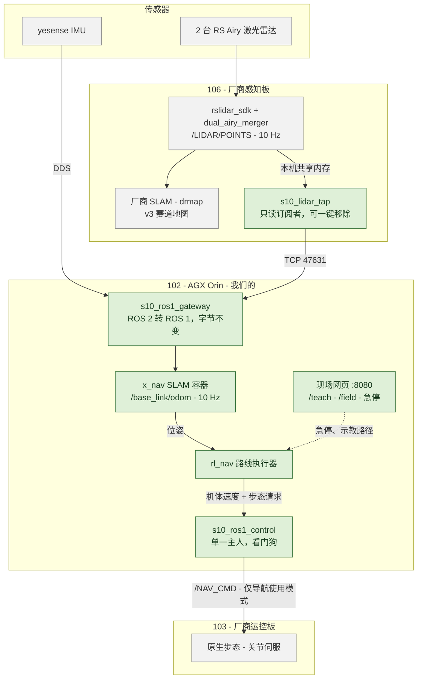
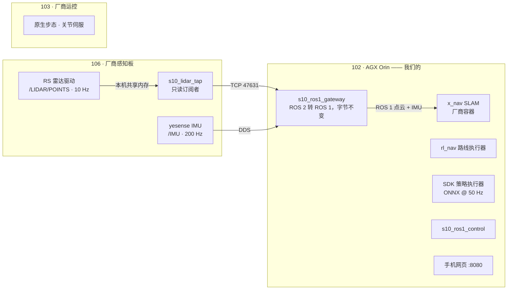
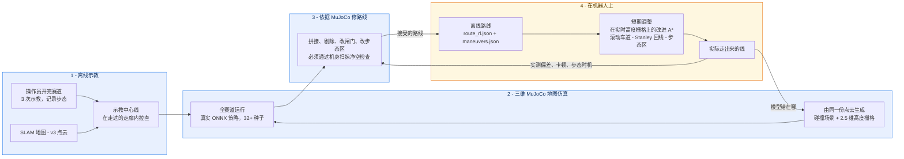
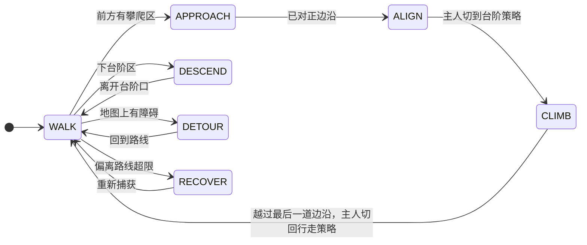
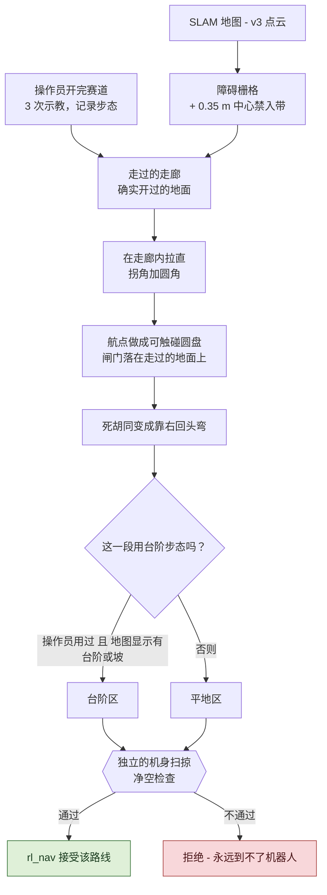
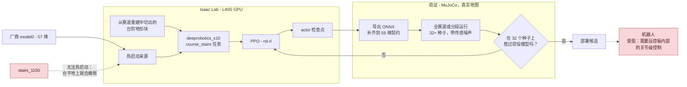
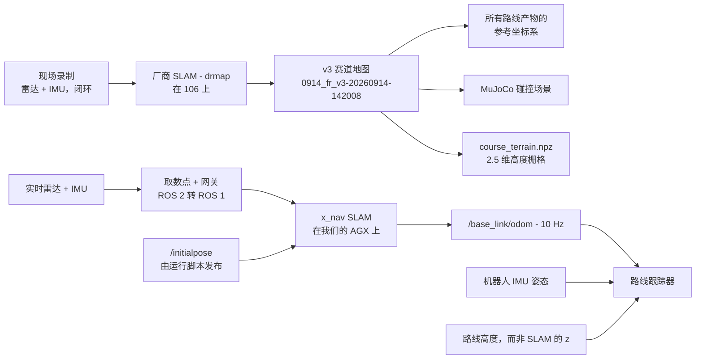
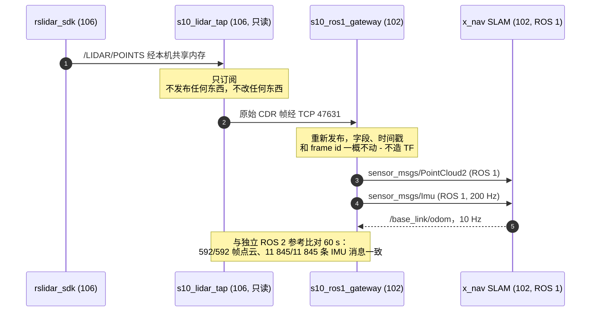
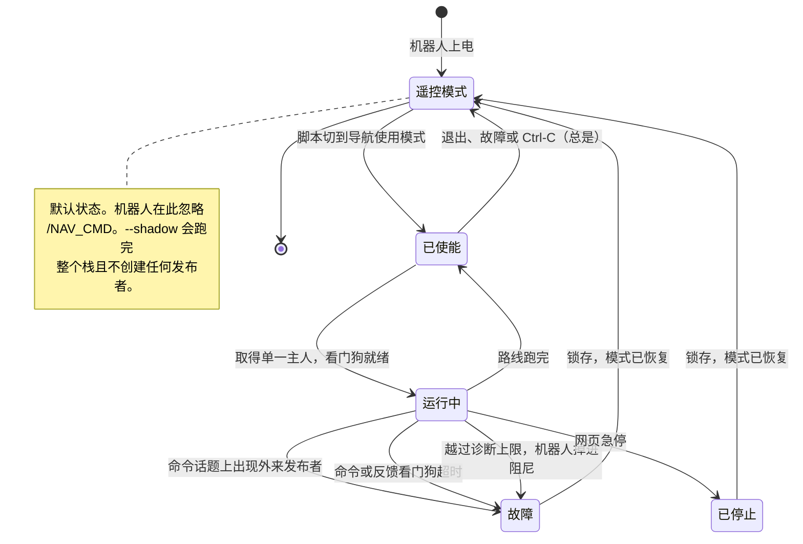

<div align="center">

# goai26-s10-racing

**云深处 Lynx S10 轮足机器人的赛道自主导航** —— 路径规划、MuJoCo 与运动学仿真、Isaac Lab 运动策略、建图与定位，以及机器人上的 ROS 2 / ROS 1 软件栈。

GOAI 2026 · 赛道 4 *具身未来* · 挑战 2 —— S10 感知竞速

[English](README.md) · **中文**

[](LICENSE)
[](https://docs.ros.org/en/jazzy/)
[-22314E.svg?logo=ros&logoColor=white)](https://www.ros.org/)
[](https://releases.ubuntu.com/24.04/)
[](https://mujoco.org/)
[](https://isaac-sim.github.io/IsaacLab/)
[](https://www.python.org/)


<sub><b>仿真里的整条赛道。</b><code>route_v2</code> 跟踪器驱动两个 RL 策略 —— J3100 负责行走、1150 负责台阶 —— 在 713 s 仿真时间内走完全部 30 个航点。轨迹颜色表示控制器模式，橙色带是交给台阶策略的攀爬区。</sub>

</div>

---

## 目录

- [这里有什么](#这里有什么)
- [我们做了什么](#我们做了什么)
- [硬件](#硬件)
- [系统总览](#系统总览)
- [这个闭环](#这个闭环)
- [快速开始](#快速开始)
- [模块](#模块)
  - [1 · 路径规划与导航](#1--路径规划与导航)
  - [2 · 仿真](#2--仿真)
  - [3 · 运动策略与强化学习训练](#3--运动策略与强化学习训练)
  - [4 · 建图与定位](#4--建图与定位)
  - [5 · 手机现场工具](#5--手机现场工具)
  - [6 · 真机部署与安全](#6--真机部署与安全)
- [结果](#结果)
- [状态](#状态)
- [仓库结构](#仓库结构)
- [文档](#文档)
- [开发约定](#开发约定)
- [历史](#历史)
- [许可与致谢](#许可与致谢)

## 这里有什么

- **一套沿路线跟踪的导航栈**，面向 30 个航点的室外赛道：示教得到的中心线、逐段选择步态，以及只在测到偏差时才触发的恢复动作 —— [模块 1](#1--路径规划与导航)。
- **机器人上的自主运行**：2026-09-20 第一次跑完 4.7 m，2026-09-21 **在赛道上从 WP10 跑到 WP29，用时 569 s** —— 我们的路线执行器跑在 ROS 1 上，驱动机器人原生步态 —— [结果](#结果)。
- **两套仿真**：本仓库内的快速运动学全赛道试验台，以及用真实地图和真实 ONNX 策略跑的完整 MuJoCo —— **30/30 航点，713 s** —— [模块 2](#2--仿真)。
- **运动策略**来自三处：厂商的 57 维控制器、我们自己的 Isaac Lab 训练，以及队友的模型。其中三个已在真机上跑过 —— [模块 3](#3--运动策略与强化学习训练)。
- **建图与定位**，从厂商 SLAM 地图（`0914_fr_v3`）到通过逐字节一致的 ROS 2 → ROS 1 网关接入的第三方 SLAM（x_nav）—— [模块 4](#4--建图与定位)。
- **现场工具**：由机器人自身算力提供的手机网页，用于建图、航点勘测和示教路径录制 —— [模块 5](#5--手机现场工具)。
- **全文标注状态**：✅ 真机验证、🧪 仅仿真、🗄 历史、📝 待办 —— 汇总见[状态](#状态)。

## 我们做了什么

这套系统里有五处是我们自己做的，而不是厂商提供的。每一处的存在，都是因为挡在前面的问题无法靠配置解决。完整技术参考 —— 链路、规划策略、参数、测试、尚未验证的部分、回滚方式 —— 见 [`ros1_gateway/docs/PIPELINE_AND_PLANNING_ZH.md`](robot/ros1_gateway/docs/PIPELINE_AND_PLANNING_ZH.md)。

**1 · 一个只读的取数点和一座逐字节一致的桥。** 厂商只在自己的板子上发布激光雷达，而我们要接入的 SLAM 说的是 ROS 1。板子上一个只读订阅者把原始帧转发到我们的算力，在那里由一座单向桥重新发布，字段、时间戳和 frame id 一概不动 —— 在 60 s 内与一个独立参考实现比对，592/592 帧点云、11 845/11 845 条 IMU 消息完全一致。厂商侧没有任何改动，一条命令即可清除全部痕迹。

**2 · 一个永远只能有一个主人的控制节点。** 同一时刻只有一个速度源；机器人命令话题上出现外来发布者会锁定故障；命令和反馈各有看门狗，任一超时都会停下机器人；步态只在静止时切换，且必须等机器人确认；空跑模式不创建任何发布者。它还固化了一条我们踩坑才发现的前提 —— 机器人不在导航使用模式下就会忽略导航命令 —— 并在退出、故障或 Ctrl-C 时把机器人放回遥控模式。

**3 · 用示教出来的线，而不是画出来的路线。** 操作员先把赛道开几遍。工具把这些示教转成两样东西：由 SLAM 地图得到的障碍栅格，以及一条确实走过的地面走廊；然后在走廊内把线拉直，并在拐角处加圆角。航点是可触碰的圆盘而不是点，闸门落在走过的地面上，死胡同变成靠右的回头弯，而只有在操作员用过台阶步态 *并且* 地图显示有台阶或坡度的区域，才会被标成台阶步态。每条候选线在被执行器接受之前，都要通过一次独立的机身扫掠净空检查。

在整条赛道上，直线段占比从 35–50 % 升到 86 %，总转向量从 9 390–14 313° 降到 2 209°，全线 279.7 m、29 个航点。

**4 · 一层懂得该信哪个传感器的跟踪。** 围绕跟踪器的是：用机器人自己的 IMU 而不是 SLAM 的姿态、用路线高度而不是 SLAM 的 z、对高度栅格做自身机体滤除和盲区填充、用把车拉回线上的转向车道（Stanley 式，最多 20°）而不是横移、输出加速度限幅、一个速度旋钮，以及速度由沿路线距离和地图特征共同决定的台阶步态区。

**5 · 让共享机器人能活下来的运维方式。** 一条命令把一次会话拉起来，另一条把机器人原样放回去；开机自启带看门狗；不依赖厂商网页也能恢复地图和位姿；一条命令即可正向、反向或从任意航点开始跑一条路线；网页上的急停同样能停掉从终端发起的运行。

**它实际跑在哪里。** 机器人上：2026-09-20 的 5 m 平地房间路线，以及 2026-09-21 赛道上从 WP10 到 WP29 的真实运行（569 s，上午版本的软件栈）。中午之后的改进 —— 基于转向的回线、更快的加速、结合地形的台阶区、对线的拼接/剔除/接触编辑、从任意航点恢复、网页急停 —— 在仿真中 29/29 通过（当时那版路线下 413 s，对比上午版本约 470 s），尚未在机器人上跑过。之后的工作（每次换步态前先刹停、平台跳跃的起跳检查与专用车道、整个栈统一的参数锁定文件）目前只在离线状态。

## 硬件

三台机载计算机、两台激光雷达和一个 IMU。其中只有一块板是我们的；另外两块是厂商的板子，装在一台与另一支队伍共用的机器人上。

| 部件 | 是什么 | 归属 |
|---|---|---|
| **云深处 Lynx S10** | 轮足四足机器人：4 条腿 × 3 关节 + 4 个轮 = 16 个执行器 | 厂商 |
| **106 · 感知板** | `rslidar_sdk` + `dual_airy_merger`、厂商 SLAM（`drmap`），仅在本机发布 | 厂商 —— 我们加了一个只读取数点 |
| **102 · AGX Orin** | 我们的算力：网关、x_nav SLAM、路线执行器、控制节点、现场网页 | **我们的** |
| **103 · 运控板** | 原生步态、关节伺服，只在导航使用模式下接受 `/NAV_CMD` | 厂商 —— 每次运行前切换、结束后恢复 |
| **2 台 RS Airy 激光雷达** | 合并为 `/LIDAR/POINTS`，10 Hz | 厂商 |
| **yesense IMU** | `/IMU`，200 Hz —— 跟踪器信任的姿态来源 | 厂商 |



绿色是我们的。放在厂商板子上的任何东西，要么只读，要么一条命令即可移除 —— 见[模块 6](#6--真机部署与安全)。

## 系统总览

三台机载计算机。其中一台是我们的，另外两台是厂商板子，装在与另一支队伍共用的机器人上，所以我们加在上面的东西要么只读，要么一条命令就能移除。



## 这个闭环

这里没有任何一段是单向流水线。赛道只示教一次，之后每一级都喂给下一级 **并且回传**：MuJoCo 在机器人看到路线之前先把它改对，而机器人在现场测到的东西又会再一次改这条路线。



**1 · 离线示教。** 操作员先把赛道开几遍。工具把这些示教转成由 SLAM 地图得到的障碍栅格，以及一条确实走过的地面走廊，然后在走廊内把线拉直。

**2 · 三维 MuJoCo 地图仿真。** 同一份点云变成碰撞场景和 2.5 维高度栅格。候选路线带着真实 ONNX 策略在那里跑 32 个以上种子 —— 目的不是证明它能跑通，而是找出它在哪里跑不通。

**3 · 修路线。** MuJoCo 找到的问题回到线上：拼进一段重新示教的路径、剔除一个航点、挪一个闸门、改一个步态区、缩短一条起跳直线。每条候选线在执行器愿意加载之前，都必须通过一次独立的机身扫掠净空检查。

**4 · 在机器人上：离线路线 + 短期调整。** 路线在开跑前就固定了；**不**固定的是机器人前方的那一米：改进的 A* 在实时高度栅格上做局部重规划，滚动车道用转向把车拉回线上而不是横着怼过去，步态区则由沿路线的距离和地图显示的轮下地形共同决定。恢复动作只在测到偏差时才触发。

**再传回去。** 每次现场运行都会逐拍记录沿路线距离、横向偏差、跟踪器状态和步态。这才是闭环真正闭上的地方 —— 台阶限速吃掉 66 % 运行时间就是这样查出来的，下一版路线也是照着它改的。


当前的 `route_v2.json` 来自把 30 张航点照片与建图关键帧做匹配（[`tools/wp_match`](robot/tools/wp_match/README_ZH.md)）；它的不确定半径是 1.5–3 m，这正是 [`/teach`](robot/tools/s10_mapping_web/TEACH_GUIDE_ZH.md) 勘测存在的理由。背后的设计见 [`docs/NAVIGATION_DESIGN_ZH.md`](docs/NAVIGATION_DESIGN_ZH.md)。

## 快速开始

```bash
git clone https://github.com/bowenwan6/goai26-s10-racing.git
cd goai26-s10-racing
git lfs pull            # 点云、MuJoCo 场景、交付物
```

**跑运动学全赛道仿真**（不需要 ROS，不需要 GPU，笔记本上几分钟）：

```bash
python -m pip install -r sim/sim_full_course/requirements.txt
PYTHONPATH=sim python -m sim_full_course.harness       # 在 route_v2 上的标称运行
PYTHONPATH=sim python -m sim_full_course.harness --scenario detour_box --s0 160 --s1 185 --obstacle-s 172
```

**跑测试**（不需要机器人）：

```bash
PYTHONPATH=.:sim:robot:src/s10_auto_nav:src/s10_perception \
  python -m pytest -q src/s10_auto_nav/test sim/sim_full_course/tests robot/tests_real
```

**为机器人准备一条路线** —— 把 `route_v2` 和高度栅格变成 `rl_nav` 能消费的产物：

```bash
ros2 run s10_auto_nav rl_nav_prepare \
  --route route_v2_field.json --terrain course_terrain.npz \
  --overrides overrides_v1.json --method first --out prepared/
```

**在机器人上拉起传感链路** —— 从笔记本运行；`up` 部署 106 取数点并启动网关，`down` 清除全部痕迹：

```bash
bash robot/ros1_gateway/scripts/robot_session.sh up
bash robot/ros1_gateway/scripts/health_check.sh --hz 10
bash robot/ros1_gateway/scripts/robot_session.sh down --agx
```

八月仿真赛的竞赛栈跑在自己的容器里 —— 见[历史](#历史)。

## 模块

### 1 · 路径规划与导航

`src/s10_auto_nav` —— ROS 2 包。有一条设计原则贯穿其中：**第一版的控制器就是标称行为**。鲁棒性只以「由实测偏差触发的恢复」形式加入，绝不做成常开的保护，因为常开版本会在没有扰动的运行中把机器人停住。

| 部件 | 作用 | 状态 |
|---|---|---|
| [`rl_nav/route_runner.py`](src/s10_auto_nav/s10_auto_nav/rl_nav/route_runner.py) | 在示教路线上的模式机；输出机体速度和关节主人请求 | ✅ 首次自主运行 |
| [`rl_nav/prepare.py`](src/s10_auto_nav/s10_auto_nav/rl_nav/prepare.py) | 离线路线落地、攀爬动作、地图曲面、报告 | 🧪 |
| [`route_v2.py`](src/s10_auto_nav/s10_auto_nav/route_v2.py)、[`route_planner.py`](src/s10_auto_nav/s10_auto_nav/route_planner.py) | 中心线跟踪 + Frenet 局部规划，先验地图上的 A\* 兜底 | 🧪 |
| [`native_transfer/`](robot/native_transfer/README_ZH.md) | 同一跟踪器驱动厂商原生步态（ROS 2 路线） | ✅ 已部署；仅观测，不下发命令 |
| [`ros1_gateway/nav/`](robot/ros1_gateway/docs/HANDOFF_S10_AUTONOMY_STACK.md) | 同一执行器在 AGX 上的 ROS 1 版本，外加一键运行脚本 | ✅ 通过 `s10_ros1_control` 驱动机器人 |



一次示教如何变成执行器愿意接受的路线：



在整条赛道上，这把直线段占比从 35–50 % 提到 86 %，总转向量从 9 390–14 313° 降到 2 209°，全线 279.7 m、29 个航点。

细节见 [`docs/NAVIGATION_DESIGN_ZH.md`](docs/NAVIGATION_DESIGN_ZH.md)。

### 2 · 仿真

两个层级，都由同一批路线产物驱动。

**运动学全赛道试验台** —— [`sim_full_course/`](sim/sim_full_course/README_ZH.md)。从 v3 点云构建 2.5 维地形，移动一个运动学机器人，按弧长注入障碍，并与真实节点共用同一套感知契约。快到可以每次改动都跑一遍。

**用真实策略跑的 MuJoCo 全赛道** —— 试验台在 [`s10-rl-sprint`](https://github.com/bowenwan6/s10-rl-sprint) 仓库，场景由同一张地图生成。下面的头条结果就出自这次运行。

<div align="center">

<br>
<sub>713 s 的运行，约 60 倍速。叠加信息包括目标航点、控制器模式、当前策略、速度、腿部力矩、轮速和倾角。</sub>
</div>


<sub>同一次运行中的九个瞬间：起步场地、台阶策略下的 B 楼梯、长距离直行、一次台阶交接、碎石地和花园段。</sub>

### 3 · 运动策略与强化学习训练

策略来自三处：厂商随机出厂的控制器、我们在 [`s10-rl-sprint`](https://github.com/bowenwan6/s10-rl-sprint) 里的 Isaac Lab 训练，以及 `Jackdev` 分支上队友的模型。带实测边界和来源的完整表格见 [`docs/POLICIES_AND_APPS_ZH.md`](docs/POLICIES_AND_APPS_ZH.md)；简版如下：

| 策略 | 观测 → 动作 | 角色 | 状态 |
|---|---|---|---|
| 厂商 57 维 | 57 → 16 | 通用行走，机器人默认 | ✅ 真机 |
| `speedturn2000` | 57 → 16 | 速度与转向，由厂商模型微调 | ✅ 真机 |
| HIM 1500 | 342 → 16 | 带历史的通用行走 | ✅ 真机，在第一级台阶失败 |
| **J3100** | 59 → 16 | `rl_nav` 的行走 actor | 🧪 |
| **1150** | 59 → 16 | 台阶、陡坡、侧坡 | 🧪 |
| Gate 16 v1.5 | 174 → 16 | 八月赛中的一处 0.377 m 台沿 | 🗄 |
| `stairs_stable` | 57 → 16 | 八月赛中的上楼梯 | 🗄 |

实测边界比清单更重要。J3100 能过 3–8 cm 台阶和 8–12° 坡，速度 0.6–0.8 m/s；可在同样地形上降到 0.4 m/s 反而会卡住。1150 能爬 12–18 cm 台阶和 20° 坡，但几乎不转向，且会把轮速推到 37–47 rad/s，超过机器人 30 rad/s 的诊断上限。没有任何单一模型能覆盖整条赛道，这正是这套栈要逐段交接关节的原因。

在机器人上，关节目前仍归厂商控制器所有：要在真机上跑 J3100 或 1150，需要运控板内部的关节级控制，所以今天的自主运行用的是原生步态，RL 策略仍留在仿真里。

**训练闭环。** L40S 上的 Isaac Lab 产出候选 actor；真实赛道地图上的 MuJoCo 判断它是否比现有的更好；只有过了这一关才会成为部署候选。这张图里 *缺少* 的那两条箭头，恰恰是让我们付出最多时间的发现。



**两条硬约束。** 机器人上跑的 actor 是 **59 维**：本仓库的 57 维观测，加上执行器步态相位的正弦和余弦，所以任何替换都必须严格匹配这个契约。而 `stairs_1150` **无法被微调** —— 把它热启动进 Isaac Lab 后，即使增益、动作缩放和关节顺序全都一致，它在平地上都站不住（机体高度沉到 0.37 m，69 % 的回合以机体触地结束），而厂商的 `model0` 能干净地站在 0.454 m 且零跌倒。所以更好的攀爬策略必须 *从* `model0` 训起。反方向是可行的：`model0` 补齐到 59 维后，在 MuJoCo 赛道上用 105 s 走完 WP21→WP24，而 J3100 用了 110 s。

**评估靠统计，不靠个例。** MuJoCo 在 x86 和 ARM 上结果并不一致，而且过程是混沌的：命令流的任何改动都会重新洗牌哪些种子会失败。完成率按 **32 个以上种子**判断，绝不用 4 个。分段运行几乎不依赖种子，除非打开 `--loc_noise`，因为传感噪声只在跟踪器主导的模式下才起作用。

训练、评估试验台和验收标准都在 sprint 仓库；本仓库保存导出的 ONNX 模型、[`integration/`](robot/integration/) 里的部署胶水，以及 [`training/`](sim/training/) 里八月的训练代码。

### 4 · 建图与定位

<table>
<tr>
<td width="55%"></td>
<td></td>
</tr>
<tr>
<td><sub>v3 赛道点云（<code>0914_fr_v3-20260914-142008</code>），所有路线产物的参考坐标系。</sub></td>
<td><sub>由同一份点云生成、供 MuJoCo 使用的碰撞场景。</sub></td>
</tr>
</table>

- **106 上的厂商 SLAM** 产出了 v3 地图，以及八月到九月一直在用的定位。地图、MuJoCo 场景和一个离线查看器在 [`data/deliverables/`](artifacts/data/deliverables/S10_v3_Map_MuJoCo_20260916/README.md)。
- **新的第三方 SLAM（x_nav）** 跑在我们 AGX 上的容器里，以 10 Hz 发布 `/base_link/odom`。它需要 ROS 1 的传感器话题，这正是网关提供的。室内地图已完成建图、保存和重定位；定位通过发布 `/initialpose` 初始化，运行脚本会自动完成。
- **ROS 2 → ROS 1 网关** —— [`ros1_gateway/`](robot/ros1_gateway/README_ZH.md)。它逐字节转发点云字段、时间戳和 frame id，不凭空造 TF。106 的雷达只在本机发布，因此那里的一个只读取数点通过 TCP 转发 CDR 帧。在新机器人上与独立的 ROS 2 参考比对：**60 s 内 592/592 帧点云、11 845/11 845 条 IMU 消息完全一致**。
- **地图对齐**到 v3 坐标系、航点重新勘测和路线重建，规划见 [`docs/NAVIGATION_DESIGN_ZH.md`](docs/NAVIGATION_DESIGN_ZH.md) 第 3 节。

**从一次现场录制，到跟踪器能用的位姿：**



跟踪器有意 **不** 全盘接受 SLAM 给的东西：姿态用机器人自己的 IMU 而不是 SLAM 的，高度用路线的而不是 SLAM 的 `z`。

**网关的接口契约。** 这是必须分毫不差的部分，因为 x_nav 是一个从未见过厂商 ROS 2 图的第三方 SLAM：



一条命令（`robot_session.sh down`）即可移除取数点及它在 106 上放下的每一个文件。

### 5 · 手机现场工具

AGX 上一个只用标准库的小网页服务器，通过机器人的 Wi-Fi 提供现场页面（[`tools/s10_mapping_web/`](robot/tools/s10_mapping_web/README.md)）：

- **`/teach` —— 采集助手**（当前版本）：带闭环辅助的建图采集、带 3 s 静止检查的航点勘测（位置散布 ≤2 cm、朝向 ≤1° 才算通过）、用于策略交接的切换点对，以及示教路径录制。只记录 —— 它从不下发运动命令，也从不切换地图。指南：[`TEACH_GUIDE_ZH.md`](robot/tools/s10_mapping_web/TEACH_GUIDE_ZH.md)。
- 一次示教会话通过 [`ros1_gateway/tools/teach_to_route.py`](robot/ros1_gateway/tools/teach_to_route.py) 变成路线：航点和示教中心线变成 `route_v2.json`，切换点变成执行器消费的攀爬动作。
- 手机通过厂商板上一个用户级转发器访问页面；应用本身仍在我们的 AGX 上。交接时会移除该转发器。
- **`/`、`/localization`、`/heightmap`、`/field`、`/imu-check`、`/native-nav`**：建图控制、实时位姿、高程图、现场检查表和原生步态测试。它们绑定在 48 号机器人上；不要在共享机器人上打开 —— 原因见 [`docs/POLICIES_AND_APPS_ZH.md`](docs/POLICIES_AND_APPS_ZH.md) 第 2.1 节。

<table>
<tr>
<td width="50%"></td>
<td></td>
</tr>
<tr>
<td><sub>传感器频率、正在使用的位姿话题，以及实时俯视图：轨迹、航点、切换点和机器人。</sub></td>
<td><sub>30 个航点的网格 —— 绿色表示 3 s 静止检查通过 —— 以及一个以 0.3 cm / 0.1° 散布保存的切换点。</sub></td>
</tr>
</table>

<sub>截图来自内置演示模式（`teach-worker.sh start --fake`），它模拟一台机器人，好让页面在没有真机时也能演练。</sub>

### 6 · 真机部署与安全

- **单一关节主人。** [`integration/joint_command_owner.hpp`](robot/integration/joint_command_owner.hpp) 保证 `/JOINTS_CMD` 只有一个来源；切换主人要经过 0.25 s 的 SafeHold，所以策略交接绝不会重叠。
- **诊断上限**是机器人的，不是我们的：腿速/轮速 25.76 / 30 rad/s，力矩 45 / 12 N·m。越限会让机器人掉进阻尼模式 —— HIM 1500 就是这样在台阶上停下的，1150 今天也会撞上这条线。
- **速度桥** [`ros1_gateway/src/s10_ros1_control`](robot/ros1_gateway/README_ZH.md) 把 ROS 1 的 `/cmd_vel` 和网页命令转成原生运动命令，带限幅、超时、锁存停止和排他故障。它**默认空跑**；要真正运动需要 `--enable-motion` 且现场有人。
- **共用机器人。** `robot_session.sh up` 部署我们需要的东西；`down` 移除我们在 106 上创建的每个文件和进程，并保持厂商服务运行；`unkeys` 移除我们的 SSH 公钥。对厂商板的任何改动 —— 包括 `/NAV_CMD` 需要的明文控制端口 —— 都会记录，并在交接前恢复。运动测试前先和另一支队伍打招呼，因为机器人上已经有两个原生发布者在 `/NAV_CMD` 上。
- **使能是显式的。** 机器人在切到导航使用模式之前会忽略 `/NAV_CMD`；我们的脚本切过去、运行，并在退出、故障或 Ctrl-C 时总是切回遥控模式。`--shadow` 会跑完整个栈而不发出任何一条命令。
- **一次运行一条命令**，因为现场操作员手里该拿的是遥控器而不是键盘：`robot_session.sh nav --speed <m/s> [--route short|full] [--shadow]` 会选地图、设初始位姿、等机器人站起、使能、运行、每秒打印一行状态，并在结束时恢复模式。流程和阈值见 [`ROOM_NAV_RUNBOOK_ZH.md`](robot/ros1_gateway/docs/ROOM_NAV_RUNBOOK_ZH.md)，现场记录见 [`EXPERIMENT_048_ZH.md`](robot/ros1_gateway/docs/EXPERIMENT_048_ZH.md)。

**谁被允许让机器人动，以及什么能停下它：**



## 结果

**赛道上第一次长距离运行，2026-09-21** —— 048 号狗，我们的路线执行器跑在 ROS 1 上，原生平地与台阶步态，上午版本的软件栈：

| 指标 | 数值 |
|---|---|
| 区段 | **WP10 → WP29**，569 s |
| 时间花在哪 | 66 % 处于台阶步态、受其默认 0.30 m/s 上限限制（操作员自己在该步态下的中位速度是 0.73 m/s）；平地段平均 0.69 m/s，被可视空间限速和横移回线拖慢 |
| 因此改了什么 | 中午版本：台阶速度按距离和地形给定、用转向代替横移、加速更快 —— 仿真 413 s，对比当时那版路线下的约 470 s，尚未在机器人上跑过 |

**机器人上第一次自主运行，2026-09-20** —— 048 号狗，室内房间地图，我们的路线执行器跑在 ROS 1 上，原生平地步态：

| 指标 | 数值 |
|---|---|
| 路线 | 地图 `v6_room` 上 WP01 → WP02，直线 4.67 m，路线长 5.0 m，平地 |
| 运行 | 19:27:46 → 19:28:25，**38.2 s**，模式 `DONE`，无故障，无人工干预 |
| 速度 | 命令限幅 0.10 m/s；约 4.5 m 上实测均速 ≈ 0.12 m/s —— 原生步态并不严格跟随命令 |
| 到达 | 停在距 WP02 0.22 m 处，按进入 0.20 m 半径计数 |
| 谁在动关节 | 导航使用模式下的厂商控制器（状态 17，平地步态 `0x3002`）—— 不是 J3100 也不是 1150 |
| 它需要什么 | `/NAV_CMD` 需要导航使用模式；横滚和俯仰用机器人 IMU（x_nav 的俯仰有偏）；高度栅格盲区填充；0.12 m 的平地台阶限制；因 x_nav 高度漂移而放宽的 z 容差；实测站立高度 0.41 m |
| 尚未验证 | 台阶段（一次尝试卡在「无进展」）、反向路线，以及任何高于试探值的速度 |

**MuJoCo 全赛道，2026-09-19** —— `route_v2` 跟踪器，J3100 + 1150，真值定位：

| 指标 | 数值 |
|---|---|
| 航点 | **30 / 30**，每个都在 0.18 m 以内 |
| 仿真时间 | **713.0 s**，行程 260 m |
| 轮速超过 30 rad/s | 累计 1.94 s，峰值 57.9 rad/s |
| 倾角超过 15° | 累计 21.8 s |
| 可复现性 | 在重建环境上逐 tick 完全一致 |

**八月仿真赛，Ver 1.0** —— 官方仿真器，厂商 57 维策略加 Gate 16 组合：

| 指标 | 数值 |
|---|---|
| 有序通过闸门 | 33 / 33（WP0–WP32），种子 6 |
| 官方计时 | 436.058 s |
| 距离 | 257.49 m，最大倾角 57.9° |

并非每个种子都成功：种子 8 失败两次，种子 10 在 WP29 前卡住。完整证据见 `TECHNICAL_DESIGN.md`（已归档）。

**多种子仿真** —— 在队内 GPU 服务器上。全赛道、每个栈 32 个种子：当前执行器完成 19/32（上一个提交是 23/32），对比第一版的 4/24。在 5 cm / 2° 定位噪声下、种子 0–11：B 楼梯 9/12（三次在 60–63° 倾角下跌倒）、露台 11/12、全赛道 8/12。命令流一变，结果就重新洗牌，所以我们按 32 个以上种子判断，而不是看少数几次。

**传感网关，2026-09-19** —— 上面的逐字节一致性审计，外加连续 10 分钟。完整原始件与注意事项见 [`evidence/artifacts/ros1-gateway-newdog-20260919/`](artifacts/evidence/runs/ros1-gateway-newdog-20260919/README.md)。

| 位置 | 进程 | CPU（单核占比） | 内存 |
|---|---|---|---|
| AGX（102） | 网关 | 均值 30.3 %，p95 34.9 % | 67 MiB |
| 感知板（106） | 只读取数点 | 均值 8.4 %，p95 9.0 % | 185 MiB |
| 感知板（106） | **厂商雷达驱动** | **挂上取数点后 13.4 %，之前为 14.1–14.6 %** | 175 MiB |

最后一行才是关键：挂上取数点并没有给厂商自己的驱动带来可测量的负载。同一时间窗内网关转发 **13 621 / 13 621 帧、0 丢弃、0 错误**，单连接 19.3 GB，雷达稳定在 9.96–10.00 Hz、IMU 199.79–199.99 Hz，无时间戳倒退。106 的数字是从采样器输出转录的，不是原始文件——原始文件在被拷走之前被一次会话重启删掉了。

**这套转换在现场的表现** —— 同一个取数点和网关在 2026-09-20、09-21、09-22 的每一次现场会话中都在底层运行（048 号狗）：大约 20 多次导航运行，其中包括 272 m 全赛道 29/29 航点。没有任何一次因传感器数据失败。这是运行记录而不是测量：各次会话的健康日志留在 AGX 上，没有拷出来，因此没有这些运行的帧计数。

## 状态

| 领域 | 真机验证 | 仅仿真 | 待办 |
|---|---|---|---|
| 运动 | 厂商 57 维、`speedturn2000`、HIM 1500（不含台阶）、我们命令下的原生平地步态 | J3100、1150、Isaac Lab 候选 | 机器人上的关节级控制；1150 的轮速余量 |
| 导航 | ROS 1 上的路线执行器：4.7 m 房间运行；赛道 WP10 → WP29，569 s | 中午的跟踪与规划改动（29/29，构建时 413 s）；平台跳跃处理 | 完整 WP01 → WP30；更高的台阶步态速度 |
| 传感 | ROS 1 网关、106 取数点、PTP 时钟同步、开机自启 | —— | —— |
| 建图 | v3 厂商地图；机器人上的 x_nav 建图与定位 | —— | x_nav ↔ v3 配准；室外航点重新勘测 |
| 现场工具 | 机器人上的 `/teach`，手机经 103 转发器可达 | —— | 端到端的室外勘测会话 |

## 仓库结构

六个目录，各自回答一个问题。

| 路径 | 回答什么问题 | 内容 |
|---|---|---|
| [`docs/`](docs/) | *它是怎么工作的？* | 设计文档、图、媒体与厂商参考资料 |
| [`src/`](src/) | *ROS 2 下跑什么？* | `s10_auto_nav`（导航）、`s10_perception`、`s10_bringup` |
| [`robot/`](robot/) | *什么会碰到机器人？* | ROS 1 网关与 106 取数点、C++ SDK 胶水、迁移栈、现场网页、运行脚本、docker |
| [`sim/`](sim/) | *上场前是怎么验的？* | `sim_full_course` 运动学试验台、`training` |
| [`models/`](models/) | *实际跑的是什么？* | `deployed/` —— 机器人加载的包；`candidates/` —— 训练扫描 |
| [`artifacts/`](artifacts/) | *发生过什么？* | `data/`（地图、路线、照片）、`evidence/`（带日期的现场记录）、`reports/` |

`upstream/` 不入库：[`robot/scripts/setup_upstream.sh`](robot/scripts/setup_upstream.sh) 按锁定版本 `13dd084b` 拉取主办方 SDK。工具生成的输出放在 `out/`，同样不入库。

逐目录说明、分支规则以及绝不入库的内容：[`docs/REPO_GUIDE_ZH.md`](docs/REPO_GUIDE_ZH.md)。

## 文档

有三份文档描述整个仓库；其余文档都放在它所描述的代码旁边。

| 文档 | 覆盖内容 |
|---|---|
| [策略与应用总览](docs/POLICIES_AND_APPS_ZH.md) | 每个策略和工具、状态、实测数据、未解决的缺口 |
| [导航设计](docs/NAVIGATION_DESIGN_ZH.md) | `route_v2` 跟踪、`rl_nav` 执行器及其鲁棒性方案、新 SLAM 接入方案 |
| [仓库指南](docs/REPO_GUIDE_ZH.md) | 目录、分支、大文件、第三方与许可、推送前检查 |

运维手册和它们的代码放在一起：

| 位置 | 内容 |
|---|---|
| [`ros1_gateway/docs/PIPELINE_AND_PLANNING_ZH.md`](robot/ros1_gateway/docs/PIPELINE_AND_PLANNING_ZH.md) | **机器人栈的技术参考**：完整链路、规划策略、参数、测试、尚未验证的部分、回滚 |
| [`ros1_gateway/README_ZH.md`](robot/ros1_gateway/README_ZH.md) | ROS 1 网关与运动桥：设计、证据、验收 |
| [`ros1_gateway/docs/`](robot/ros1_gateway/docs/) | 英文接口交接（其规划章节早于 pipeline 文档）、现场运行手册、首次运行记录、测试计划、应用 API |
| [`tools/s10_mapping_web/TEACH_GUIDE_ZH.md`](robot/tools/s10_mapping_web/TEACH_GUIDE_ZH.md) | `/teach` 的现场操作流程 |
| [`sim_full_course/README_ZH.md`](sim/sim_full_course/README_ZH.md) · [`tools/wp_match/README_ZH.md`](robot/tools/wp_match/README_ZH.md) | 仿真器与航点匹配 |

2026-09-20 之前写的文档 —— 八月竞赛技术设计、提交与第三方记录、较早的机器人搭建、建图、匹配与研究笔记，以及上一版 README —— 已并入上述三份或退役。它们仍可在 `docs-archive-20260920` 标签下找到：

```bash
git show docs-archive-20260920:docs/TECHNICAL_DESIGN.md
git show docs-archive-20260920:docs/S10_REAL_ROBOT_QUICKSTART_ZH.md
```

## 开发约定

- **分支。** `main` 是唯一的集成线；其余一律通过 pull request 进入。前缀：`nav/`、`rl/`、`ros1/`、`codex/`、`docs/`、`integration/`。
- **CI**（`.github/workflows/ci.yml`）在每次推送时运行。正确性门禁（ruff 的 `E9,F,I`）、单元测试和 colcon 构建都是绿的，必须通过；风格检查作为不阻塞的报告单独一档。另有卫生检查：开发者路径、文档中的 IP 字面量、README 素材体积预算、密钥扫描和链接检查。
- **大文件**走 Git LFS：点云、网格、PDF、压缩包。克隆后运行 `git lfs pull`。README 与文档素材**不走 LFS**，见下。
- **README 素材是普通 Git 对象**，不是 LFS：公开仓库每次渲染 README 都会消耗 LFS 流量，配额耗尽后整个仓库的图片都会失效。预算由 CI 强制：单文件 1.2 MB，`docs/media` 合计 3.5 MB。
- **绝不入库**：原始录制、厂商许可文件、任何形式的凭据、虚拟环境和构建目录，以及任何开发者机器上的绝对路径。推送前扫描 diff —— 见 [`docs/REPO_GUIDE_ZH.md`](docs/REPO_GUIDE_ZH.md) 第 4 节。

## 历史

2026 年八月仿真赛的版本已保留：

| 标签 | 提交 | 是什么 |
|---|---|---|
| [`v1.0-sim-release`](https://github.com/bowenwan6/goai26-s10-racing/releases/tag/v1.0-sim-release) | `1e390f5` | Ver 1.0 竞赛版本 |
| [`sim-contest-submission`](https://github.com/bowenwan6/goai26-s10-racing/releases/tag/sim-contest-submission) | `3660b81` | 提交的构建（`s10-racing:submission-3660b81-clean`） |

随那个版本一起发布的 README，含竞赛运行说明和 Gate 16 契约，在 `git show docs-archive-20260920:docs/README_V1_ARCHIVE.md`。

## 许可与致谢

以 [BSD-3-Clause](LICENSE) 发布，与上游一致。依赖、数据和模型的来源，包括一项尚未解决的模型许可事项，汇总在 [`docs/REPO_GUIDE_ZH.md`](docs/REPO_GUIDE_ZH.md) 第 4 节；完整记录归档在 `git show docs-archive-20260920:docs/THIRD_PARTY.md` 和 `…:docs/OPEN_SOURCE_PLAN.md`。

Lynx S10 平台、其 SDK、原生步态和厂商 SLAM 属于云深处。主办方资料属于主办方；`scripts/setup_upstream.sh` 会按锁定版本把它原样拉取到 `upstream/`，本仓库从不保存副本。`src/`、`ros1_gateway/`、`sim_full_course/`、`tools/`、`integration/` 和 `docs/` 中的内容，除非文件另有说明，均为我们所作。
