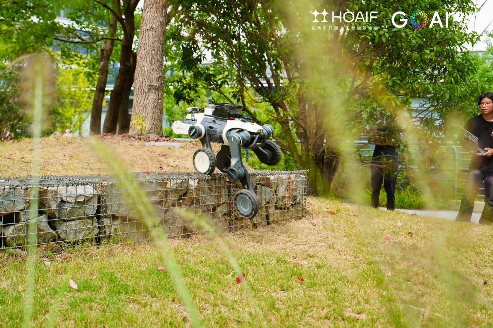
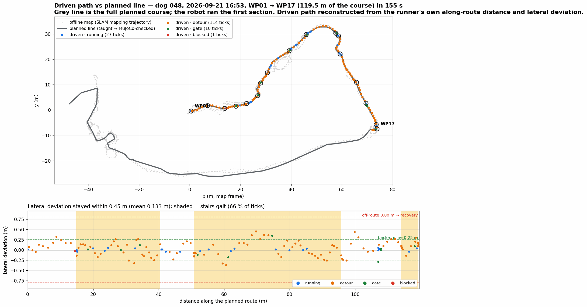
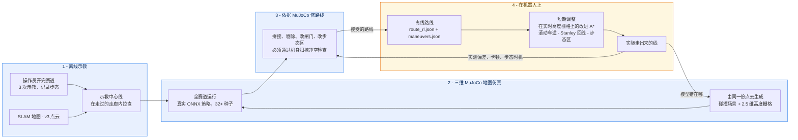
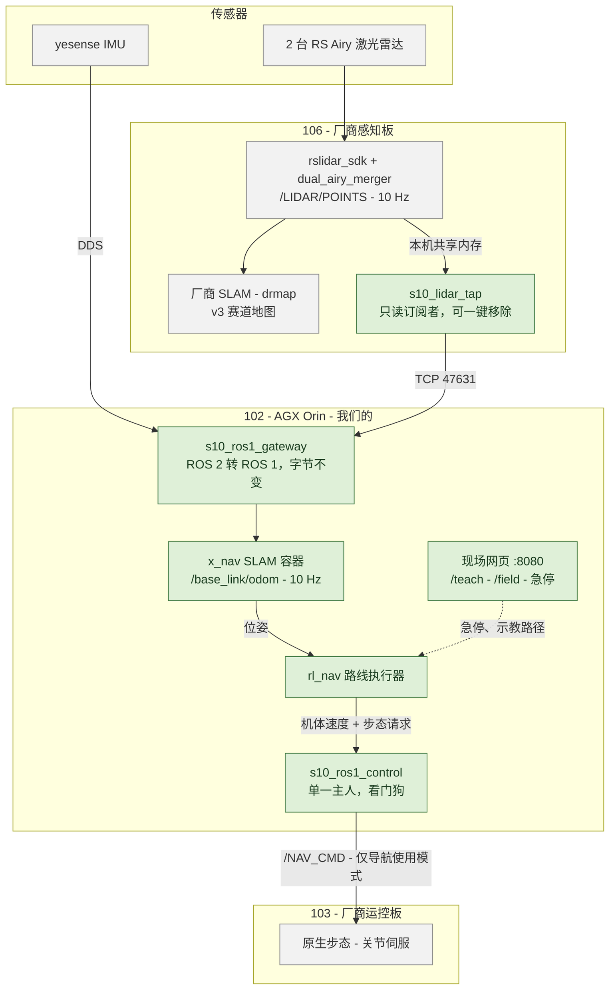
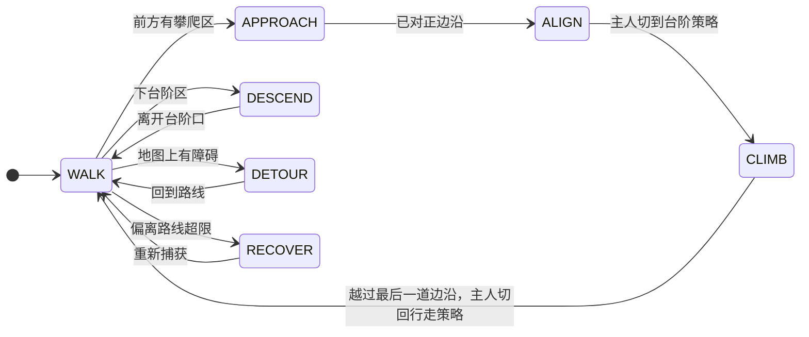
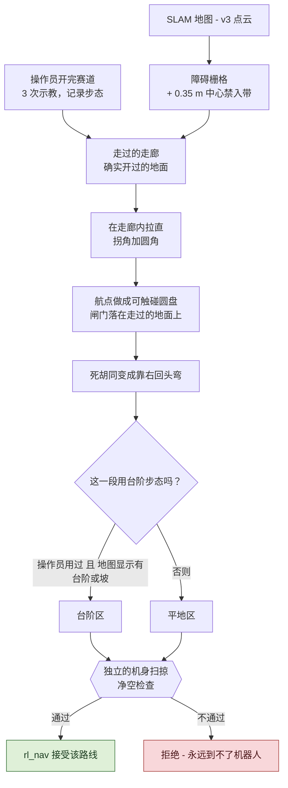
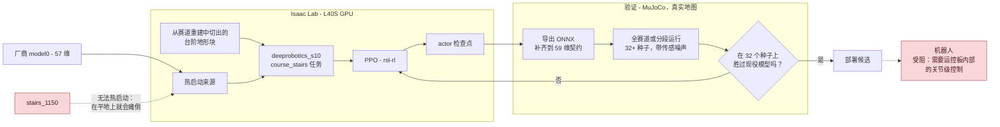
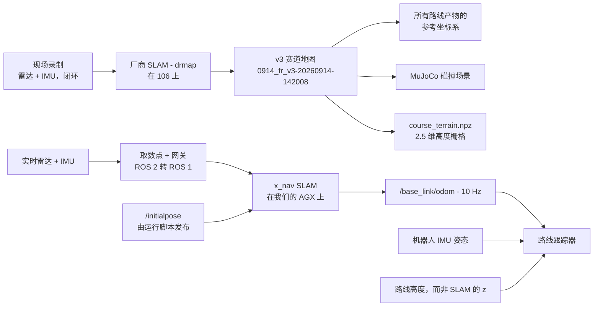
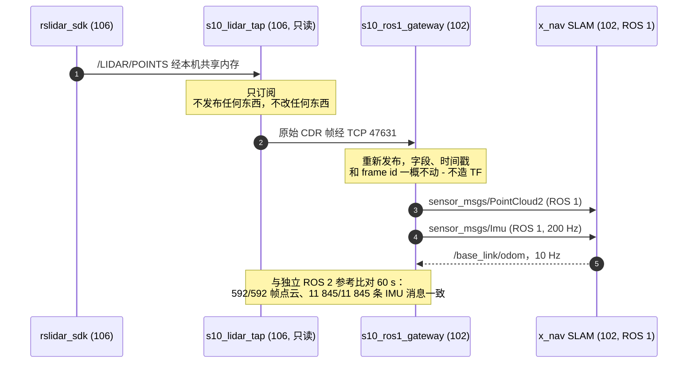
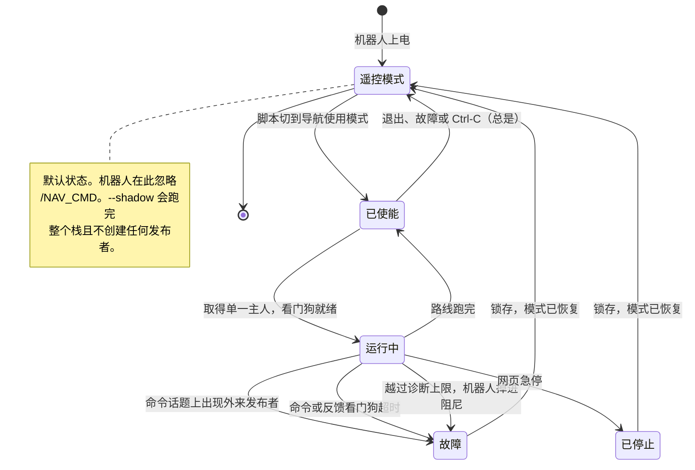

<div align="center">

# goai26-s10-racing

云深处 Lynx S10 轮足机器人的赛道自主导航。<br>
为 GOAI 2026 赛道 4「具身未来」挑战 2「S10 感知竞速」而做。

[English](README.md) · **中文**

[](LICENSE)
[](https://docs.ros.org/en/jazzy/)
[-22314E.svg?logo=ros&logoColor=white)](https://www.ros.org/)
[](https://releases.ubuntu.com/24.04/)
[](https://mujoco.org/)
[](https://isaac-sim.github.io/IsaacLab/)
[](https://www.python.org/)


<sub>MuJoCo 里的整条赛道。跟踪器在两个 RL 策略之间切换关节控制权，J3100 负责走路，1150 负责上台阶，仿真时间 713 秒跑完全部 30 个航点。颜色表示控制器模式，橙色段是攀爬区。</sub>

<table>
<tr>
<td width="52%"></td>
<td></td>
</tr>
<tr>
<td><sub>048 号狗用高台步态从石笼墙上跳下来。规划器把这道台沿标成了起跳直线。</sub></td>
<td><sub>2026-09-21 的一次现场运行：机器人实际走出来的路径，叠在规划线和离线地图上。橙色是局部规划器正在重新规划的地方。</sub></td>
</tr>
</table>

</div>

---

## 目录

- [概览](#概览)
- [结果](#结果)
- [工作原理](#工作原理)
- [硬件](#硬件)
- [我们做了什么](#我们做了什么)
- [路径规划与导航](#路径规划与导航)
- [仿真](#仿真)
- [运动策略与强化学习](#运动策略与强化学习)
- [建图与定位](#建图与定位)
- [现场工具](#现场工具)
- [真机上的安全措施](#真机上的安全措施)
- [状态](#状态)
- [快速开始](#快速开始)
- [仓库结构](#仓库结构)
- [文档](#文档)
- [团队](#团队)
- [开发](#开发)
- [历史与许可](#历史与许可)

## 概览

我们先开着机器人把赛道走一遍，把路线教给它；再放到用真实地图建的 MuJoCo 模型里检查、修正；最后上真机跑，由一个局部规划器盯着眼前的地面。

机器人沿示教中心线走，每一段自己选步态，只有测到明显偏离路线时才启动恢复。路线要过两套仿真：一套是跑全程很快的运动学仿真，另一套是 MuJoCo，用真实地图和真实的 ONNX 策略，在那里全部 30 个航点 713 秒跑完。行走策略有三个来源：厂商自带的、我们自己用 Isaac Lab 训的、队友做的，其中三个上过真机。定位一开始用厂商的 SLAM 地图，后来换成第三方 SLAM（x_nav），数据经我们自己写的 ROS 2 转 ROS 1 网关送过去。建图、勘测航点、录示教路径都在机器人自己提供的几个网页上完成。

本页的标记：✅ 上过真机，🧪 只在仿真里跑过，🗄 历史版本，📝 待办。

## 结果

<div align="center">

</div>

上图是 2026-09-21 16:53 的一次运行：WP01 到 WP17，119.5 米，用时 155 秒。全程离规划线最远 0.45 米（平均 0.133 米），离触发恢复的 0.80 米阈值还差得远。152 个控制周期里有 114 个，局部规划器都在根据激光雷达看到的东西重新规划。运行时我们不录位姿话题，所以这条路径是用执行器每个周期记下的"沿路线距离"和"横向偏差"反推出来的。任何一次运行都可以用 [`robot/tools/run_review/plot_driven_vs_planned.py`](robot/tools/run_review/plot_driven_vs_planned.py) 重新画。

### 真机

#### 2026-09-21 晚到 09-22

高台步态的几版策略（s3 到 s5）上了赛道。23:18 那次，狗以 0.4 m/s 上不去 WP17 的台沿，换成 0.7 m/s 就上去了，高台速度也因此改成了命令行参数。23:18、23:36、23:52 和 00:16 各跑过一轮，凌晨 01:20 左右 s5 路线装上了机器人。这一晚每次的用时和路径还在 AGX 的日志里，拷出来之后补到这一页。

#### 2026-09-21 上午：第一次长距离运行

048 号狗，我们的路线执行器跑在 ROS 1 上，驱动机器人原生步态。

| | |
|---|---|
| 区段 | WP10 → WP29，**569 秒** |
| 时间花在哪 | 66% 的时间在台阶步态里，被 0.30 m/s 的上限卡住（操作员自己在这个步态下的中位速度是 0.73 m/s）。平地段平均 0.69 m/s，一是按可见空闲距离限了速，二是横移回线拖慢了。 |
| 因此改了什么 | 台阶速度按距离和地形给，回线改成转向，加速更快。仿真里 413 秒，上午那版约 470 秒。 |

#### 2026-09-20：第一次自主运行

048 号狗，室内房间地图，平地步态。

| | |
|---|---|
| 路线 | 地图 `v6_room` 上 WP01 → WP02，直线距离 4.67 米，沿路线 5.0 米 |
| 运行 | 19:27:46 到 19:28:25，**38.2 秒**，以 `DONE` 结束，没有故障，没人干预 |
| 速度 | 指令上限 0.10 m/s，大约 4.5 米内实测约 0.12 m/s（原生步态不严格跟随指令） |
| 到达 | 停在离 WP02 0.22 米处，进入 0.20 米半径就算到达 |
| 谁在控制关节 | 导航使用模式下的厂商控制器（状态 17，平地步态 `0x3002`），不是 J3100 也不是 1150 |
| 跑通靠的是 | `/NAV_CMD` 要在导航使用模式下；横滚和俯仰用机器人自己的 IMU，因为 x_nav 的俯仰有偏差；高度栅格的盲区要补；平地台阶上限 0.12 米；高度容差放宽，因为 x_nav 的 z 会漂；站立高度实测 0.41 米 |

### 仿真

#### MuJoCo 全赛道，2026-09-19

`route_v2` 跟踪器，J3100 加 1150，真值定位。

| | |
|---|---|
| 航点 | **30 / 30**，每个都在 0.18 米以内 |
| 用时 | **713.0 秒**，全程 260 米 |
| 轮速超过 30 rad/s | 累计 1.94 秒，峰值 57.9 rad/s |
| 倾角超过 15° | 累计 21.8 秒 |
| 可复现性 | 重建环境后逐周期完全一致 |

#### 队内 GPU 服务器上的多种子测试

全赛道每个版本跑 32 个种子：现在的执行器完成 19/32（上一个提交是 23/32），第一版是 4/24。加上 5 厘米 / 2° 的定位噪声、种子 0 到 11：B 楼梯 9/12（三次在 60–63° 倾角时摔倒），露台 11/12，全程 8/12。指令流稍有改动，失败的种子就会换一批，所以我们只在 32 个以上种子上做比较。

#### 八月仿真赛 Ver 1.0

官方仿真器，厂商 57 维策略加 Gate 16 组合：种子 6 上按顺序通过 33/33 个闸门（WP0 到 WP32），官方计时 436.058 秒，行程 257.49 米，最大倾角 57.9°。不是每个种子都成功，种子 8 失败了两次，种子 10 在 WP29 前卡住了。

### 传感器网关

2026-09-19 实测。逐字节的一致性审计在[建图](#建图与定位)那一节，这里是十分钟的负载测试。

| 位置 | 进程 | CPU（单核） | 内存 |
|---|---|---|---|
| AGX（102） | 网关 | 平均 30.3%，p95 34.9% | 67 MiB |
| 感知板（106） | 只读取数点 | 平均 8.4%，p95 9.0% | 185 MiB |
| 感知板（106） | 厂商雷达驱动 | 挂上取数点后 13.4%，挂之前 14.1–14.6% | 175 MiB |

我们敢把取数点放到别人的板子上，靠的就是最后一行：它没给厂商驱动带来可测量的负载。同样这十分钟里，网关转发了 13 621 帧中的 13 621 帧，没有丢帧也没有出错，单连接共 19.3 GB，雷达稳定在 9.96–10.00 Hz，IMU 在 199.79–199.99 Hz。106 那边的数字是照着采样器屏幕手抄的，原始文件还没存下来就被一次重启删掉了。原始文件和说明在 [`artifacts/evidence/runs/ros1-gateway-newdog-20260919/`](artifacts/evidence/runs/ros1-gateway-newdog-20260919/README.md)。

09-20、09-21、09-22 每一次现场运行，底下都是这套取数点和网关，大约 20 次导航运行，包括 272 米的全赛道，没有一次是因为传感器数据出的问题。不过那几次没记帧数，所以这算经验，不算测量。

## 工作原理

赛道只示教一次。之后每一步都把结果交给下一步，同时把修正传回来：机器人上场之前，MuJoCo 先把路线改一遍；上场之后，机器人测到的东西再把路线改一遍。



1. 离线示教。操作员把赛道开几遍。工具用这几次的轨迹，从 SLAM 地图里做出障碍栅格和一条真正开过的地面走廊，再在走廊里把线拉直。

2. 在真实地图的 MuJoCo 里仿真。同一份点云做成碰撞场景和 2.5 维高度栅格，候选路线带着真实的 ONNX 策略在里面跑 32 个以上的种子，目的是找出路线在哪里会出问题。

3. 修路线。MuJoCo 里发现的问题都改回到线上：拼进一段重新示教的路径、去掉一个航点、挪一个闸门、换一段步态区、缩短一条起跳直线。每条候选线都要单独过一次机身扫掠净空检查，执行器才会加载它。

4. 上真机。路线在开跑前就定好了，跑的过程中变化的只是机器人眼前那一小段：改进的 A* 在实时高度栅格上做局部重规划，车道控制器把机器人转回线上，每段用什么步态由沿路线的距离和地图上轮子底下的地形决定。只有测到偏差，才会启动恢复。

每次现场运行都会逐个控制周期记下沿路线距离、横向偏差、跟踪器状态和步态，下一版路线就照着这些日志改。上午那次台阶限速吃掉了 66% 的时间，就是这么查出来的。

现在的 `route_v2.json` 是把 30 张航点照片和建图关键帧对上得到的（[`robot/tools/wp_match`](robot/tools/wp_match/README_ZH.md)），不确定半径有 1.5 到 3 米，所以我们才做了 [`/teach`](robot/tools/s10_mapping_web/TEACH_GUIDE_ZH.md) 勘测页面。完整设计见 [`docs/NAVIGATION_DESIGN_ZH.md`](docs/NAVIGATION_DESIGN_ZH.md)。

## 硬件

机器人上有三台计算机、两台激光雷达和一个 IMU。三台计算机里只有一台是我们的，另外两台是厂商的板子，而且这台机器人和另一支队伍共用。

| 部件 | 是什么 | 归谁 |
|---|---|---|
| 云深处 Lynx S10 | 轮足四足机器人：4 条腿各 3 个关节，加 4 个轮子，共 16 个执行器 | 厂商 |
| 106，感知板 | `rslidar_sdk` 和 `dual_airy_merger`、厂商 SLAM（`drmap`）；只在板子本机上发布 | 厂商，我们加了一个只读取数点 |
| 102，AGX Orin | 我们的计算机：网关、x_nav SLAM、路线执行器、控制节点、现场网页 | **我们的** |
| 103，运控板 | 原生步态和关节伺服；只在导航使用模式下接受 `/NAV_CMD` | 厂商；每次运行前我们切换模式，跑完切回来 |
| 2 台 RS Airy 激光雷达 | 合并成 `/LIDAR/POINTS`，10 Hz | 厂商 |
| yesense IMU | `/IMU`，200 Hz；跟踪器信它给的姿态 | 厂商 |



绿色是我们的。我们放到厂商板子上的东西，要么只读，要么一条命令就能撤掉（见[真机上的安全措施](#真机上的安全措施)）。

## 我们做了什么

这套系统大部分是厂商的。下面五样是我们自己做的，每一样都是因为碰到了改配置解决不了的问题。完整的技术参考（整条链路、规划策略、参数、测试、还没验证的部分、怎么回滚）在 [`robot/ros1_gateway/docs/PIPELINE_AND_PLANNING_ZH.md`](robot/ros1_gateway/docs/PIPELINE_AND_PLANNING_ZH.md)。

### 只读取数点和逐字节一致的桥

厂商只在自己的板子上发布激光雷达，而我们要用的 SLAM 只认 ROS 1。所以我们在那块板子上放了一个订阅者读原始帧，转发到我们的计算机，再由一座单向桥重新发布，字段、时间戳和 frame id 都不动。和一个独立的参考实现比对 60 秒，592 帧点云和 11 845 条 IMU 消息全部一致。厂商那边什么都不用改，一条命令就能全部撤掉。

### 只有一个主人的控制节点

同一时间只能有一个速度源驱动机器人。如果有别的进程往指令话题上发消息，节点就锁定故障。指令和机器人反馈各有一个看门狗，任何一个没了动静都会让机器人停下。步态只在静止时切换，而且要等机器人确认。空跑模式下连发布者都不创建。

还有一件事是我们吃过亏才知道的：机器人不在导航使用模式下，就会无视导航指令。所以节点在运行开始时切到这个模式，退出、出故障或者按 Ctrl-C 时再切回遥控模式。

### 用示教的线代替手画的路线

操作员把赛道开几遍，工具把这几次的轨迹做成障碍栅格和一条开过的地面走廊，在走廊里把线拉直，拐角处倒圆。航点变成机器人必须碰到的圆盘。闸门放在真正开过的地面上，死胡同改成靠右的掉头弯。一段路只有操作员在那里用过台阶步态、地图上也确实有台阶或坡，才会标成台阶步态。任何一条候选线，没过单独的机身扫掠净空检查就到不了执行器。

<table>
<tr>
<td width="58%"></td>
<td></td>
</tr>
<tr>
<td><sub>细线是操作员开的三遍。点是拉直后的线，蓝色走平地步态，红色走台阶步态。深色格子是真实障碍，灰色是中心线周围 0.35 米的禁入带。</sub></td>
<td><sub>同样三遍，按操作员当时用的步态着色，标出了记录下来的切换点（▲ 进台阶，▼ 出台阶）。</sub></td>
</tr>
</table>

整条赛道上，直线行驶的比例从 35–50% 提高到 86%，总转向量从 9 390–14 313° 降到 2 209°，线长 279.7 米，29 个航点。

<div align="center">

<br>
<sub>这是运动学仿真，不是实地运行：拉直后的线走完整条赛道，标出了平地区、台阶区和航点圆盘。</sub>
</div>

### 知道该信哪个传感器的跟踪层

姿态用机器人自己的 IMU，不用 SLAM 给的；高度用路线上的，不用 SLAM 的 z。高度栅格会滤掉机器人自己的身体，并补上身子底下的盲区。偏离路线时机器人靠转向回来（Stanley 式，最多 20°），而不是横着挪过去。输出加速度有上限，速度只有一个旋钮，台阶步态区里的速度按沿路线的距离和地图上的地形给。

### 共用机器人也扛得住的运维

一条命令开始一次会话，另一条命令把机器人原样恢复。整套系统开机自启，带看门狗，不用厂商网页也能恢复地图和位姿。一条路线可以正着跑、倒着跑，或者从任意航点开始，都只要一条命令。网页上的急停对从终端启动的运行同样有效。

## 路径规划与导航

`src/s10_auto_nav` 是 ROS 2 包。里面贯彻一条原则：第一版的控制器就是正常行为。鲁棒性只以"测到偏差才触发的恢复"的形式加进来，绝不做成一直开着的保护。我们试过一直开着的版本，结果在什么问题都没有的运行里也会把机器人停下。

| 部件 | 作用 | 状态 |
|---|---|---|
| [`rl_nav/route_runner.py`](src/s10_auto_nav/s10_auto_nav/rl_nav/route_runner.py) | 示教路线上的模式机，输出机体速度和关节主人请求 | ✅ |
| [`rl_nav/prepare.py`](src/s10_auto_nav/s10_auto_nav/rl_nav/prepare.py) | 离线处理路线：落地、攀爬动作、地图曲面、报告 | 🧪 |
| [`route_v2.py`](src/s10_auto_nav/s10_auto_nav/route_v2.py)、[`route_planner.py`](src/s10_auto_nav/s10_auto_nav/route_planner.py) | 沿中心线跟踪，带 Frenet 局部规划，先验地图上用 A* 兜底 | 🧪 |
| [`robot/native_transfer/`](robot/native_transfer/README_ZH.md) | 同一个跟踪器经 ROS 2 驱动厂商原生步态 | ✅ 已部署，只观测 |
| [`robot/ros1_gateway/nav/`](robot/ros1_gateway/docs/HANDOFF_S10_AUTONOMY_STACK.md) | 同一个执行器在 AGX 上跑 ROS 1 版本，外加运行脚本 | ✅ 经 `s10_ros1_control` 驱动机器人 |

执行器的几种模式：



操作员开的几遍，怎样变成执行器愿意接受的路线：



## 仿真

仿真分两层，用的是同一批路线文件。

[`sim/sim_full_course/`](sim/sim_full_course/README_ZH.md) 里的运动学仿真从 v3 点云建 2.5 维地形，让一个运动学机器人沿着走，在指定距离处放障碍，感知接口和真实节点一样。它快到每次改动都能跑一遍。

MuJoCo 仿真在 [`s10-rl-sprint`](https://github.com/bowenwan6/s10-rl-sprint) 仓库里，场景也是用同一张地图建的。30/30、713 秒的结果就是从那里来的。

<div align="center">

<br>
<sub>713 秒的那次运行，约 60 倍速。叠加信息有目标航点、控制器模式、当前策略、速度、腿部力矩、轮速和倾角。</sub>
</div>


<sub>同一次运行里的九个瞬间：起点、台阶策略下的 B 楼梯、长直道、台沿处的一次交接、碎石地和花园。</sub>

## 运动策略与强化学习

策略有三个来源：厂商自带的控制器、我们在 [`s10-rl-sprint`](https://github.com/bowenwan6/s10-rl-sprint) 里用 Isaac Lab 训的、队友放在 `Jackdev` 分支上的模型。带实测边界的完整列表见 [`docs/POLICIES_AND_APPS_ZH.md`](docs/POLICIES_AND_APPS_ZH.md)。

| 策略 | 观测 → 动作 | 用途 | 状态 |
|---|---|---|---|
| 厂商 57 维 | 57 → 16 | 通用行走，机器人默认 | ✅ |
| `speedturn2000` | 57 → 16 | 速度和转向，从厂商模型微调 | ✅ |
| HIM 1500 | 342 → 16 | 带历史输入的行走 | ✅，第一级台阶失败 |
| J3100 | 59 → 16 | `rl_nav` 的行走 actor | 🧪 |
| 1150 | 59 → 16 | 台阶、陡坡、侧坡 | 🧪 |
| Gate 16 v1.5 | 174 → 16 | 八月赛里一道 0.377 米的台沿 | 🗄 |
| `stairs_stable` | 57 → 16 | 八月赛里上楼梯 | 🗄 |

比起列表，边界更重要。J3100 在 0.6–0.8 m/s 能过 3–8 厘米的台阶和 8–12° 的坡，同样的地面降到 0.4 m/s 反而会卡住。1150 能爬 12–18 厘米的台阶和 20° 的坡，但几乎不会转弯，而且会把轮速推到 37–47 rad/s，机器人的诊断上限是 30。没有哪个模型能包下整条赛道，所以系统要一段一段地交接关节控制权。

在真机上，关节目前还归厂商控制器管。要在真机上跑 J3100 或 1150，需要运控板里的关节级控制，我们还没有，所以现场运行用的是原生步态，RL 策略暂时只在仿真里跑。

训练闭环是这样的：L40S 上的 Isaac Lab 产出候选策略，再由真实地图上的 MuJoCo 判断它是不是比现在的好。



有两条约束决定了下一轮怎么训。第一，机器人上跑的 actor 有 59 维输入：本仓库的 57 维观测，加上执行器步态相位的正弦和余弦，任何替换都必须严格对上。第二，`stairs_1150` 没法微调。把它热启动进 Isaac Lab，增益、动作缩放和关节顺序都对得上，它在平地上都站不稳（机体沉到 0.37 米，69% 的回合以机体着地结束），而厂商的 `model0` 能稳稳站在 0.454 米，一次不倒。所以更好的攀爬策略只能从 `model0` 开始训。反过来是可以的：`model0` 补到 59 维后，在 MuJoCo 赛道里 105 秒走完 WP21 到 WP24，J3100 用了 110 秒。

MuJoCo 在 x86 和 ARM 上结果不一样，指令流稍有变化，失败的种子也会换一批。所以完成率至少要看 32 个种子。分段运行基本不受种子影响，除非打开 `--loc_noise`，因为传感器噪声只在跟踪器主导的模式下起作用。

训练代码、评测工具和验收标准在 sprint 仓库里。本仓库放的是导出的 ONNX 模型（[`models/`](models/)）、部署代码（[`robot/integration/`](robot/integration/)）和八月的训练代码（[`sim/training/`](sim/training/)）。

## 建图与定位

<table>
<tr>
<td width="55%"></td>
<td></td>
</tr>
<tr>
<td><sub>v3 赛道点云（<code>0914_fr_v3-20260914-142008</code>），所有路线文件都用这个坐标系。</sub></td>
<td><sub>用同一份点云建的 MuJoCo 碰撞场景。</sub></td>
</tr>
</table>

106 板上的厂商 SLAM 建出了 v3 地图，八九月一直用的也是它的定位。地图、MuJoCo 场景和一个离线查看器在 [`artifacts/data/deliverables/`](artifacts/data/deliverables/S10_v3_Map_MuJoCo_20260916/README.md)。

x_nav 是第三方 SLAM，跑在我们 AGX 的容器里，以 10 Hz 发布 `/base_link/odom`。它要的传感器话题是 ROS 1 的，这正是我们的网关提供的。室内地图已经能建、能存、能重定位，运行脚本发布 `/initialpose` 来设定起始位姿。

把地图对齐到 v3 坐标系、重新勘测航点、重建路线，这些计划写在 [`docs/NAVIGATION_DESIGN_ZH.md`](docs/NAVIGATION_DESIGN_ZH.md) 第 3 节。

从一次现场录制，到跟踪器用上的位姿：



x_nav 看不到厂商的 ROS 2 图，所以网关（[`robot/ros1_gateway/`](robot/ros1_gateway/README_ZH.md)）交给它的数据必须一点不差。完整的路径是这样的：



`robot_session.sh down` 会撤掉取数点，以及它放在 106 上的每一个文件。

## 现场工具

AGX 上有一个只用 Python 标准库写的小网页服务器，通过机器人的 Wi-Fi 提供现场页面（[`robot/tools/s10_mapping_web/`](robot/tools/s10_mapping_web/README.md)）。

`/teach` 是现在用的采集页面。它能录建图、带闭环辅助；能勘测航点，要求 3 秒静止（位置散布小于 2 厘米、朝向小于 1°）；能录策略交接用的切换点对；还能录示教路径。它只负责记录，从不发运动指令，也从不切换地图。现场操作步骤见 [`TEACH_GUIDE_ZH.md`](robot/tools/s10_mapping_web/TEACH_GUIDE_ZH.md)。

[`teach_to_route.py`](robot/ros1_gateway/tools/teach_to_route.py) 把一次示教会话变成路线：航点和示教中心线变成 `route_v2.json`，切换点变成执行器用的攀爬动作。

手机经厂商板上的一个用户级转发器访问页面，应用本身还是在我们的 AGX 上。还机器人的时候，我们会把转发器撤掉。

旧页面（`/`、`/localization`、`/heightmap`、`/field`、`/imu-check`、`/native-nav`）管建图控制、实时位姿、高程图、现场检查表和原生步态测试。它们绑定在 48 号机器人上，不要在共用机器人上打开，原因见 [`docs/POLICIES_AND_APPS_ZH.md`](docs/POLICIES_AND_APPS_ZH.md) 第 2.1 节。

<table>
<tr>
<td width="50%"></td>
<td></td>
</tr>
<tr>
<td><sub>传感器频率、正在用的位姿话题，以及实时俯视图：轨迹、航点、切换点和机器人。</sub></td>
<td><sub>30 个航点的网格（绿色表示 3 秒静止测试通过），以及一个散布 0.3 厘米 / 0.1° 的切换点。</sub></td>
</tr>
</table>

<sub>截图来自内置演示模式（<code>teach-worker.sh start --fake</code>），它会模拟一台机器人，没有真机也能练习。</sub>

## 真机上的安全措施

- 关节只有一个主人。[`robot/integration/joint_command_owner.hpp`](robot/integration/joint_command_owner.hpp) 保证 `/JOINTS_CMD` 只有一个来源。换主人要经过 0.25 秒的 SafeHold，两个策略不会同时控制关节。
- 诊断上限是机器人自己定的：腿速和轮速 25.76 / 30 rad/s，力矩 45 / 12 N·m。超了机器人就进入阻尼模式。HIM 1500 在台阶上就是这么停下的，1150 今天去跑也会碰上。
- 速度桥 [`robot/ros1_gateway/src/s10_ros1_control`](robot/ros1_gateway/README_ZH.md) 把 ROS 1 的 `/cmd_vel` 和网页指令转成原生运动指令，带限幅、超时、锁存停止，别人一发布就报故障。它默认空跑，只有加上 `--enable-motion` 并且现场有人，才会让机器人动。
- 共用机器人。`robot_session.sh up` 部署我们需要的东西；`down` 删掉我们在 106 上建的每个文件和进程，厂商服务照常运行；`unkeys` 删掉我们的 SSH 公钥。我们对厂商板子做的任何改动，包括 `/NAV_CMD` 需要的明文控制端口，都会记下来，还机器人之前改回去。每次运动测试前都先和另一支队伍打招呼，因为机器人上已经有两个原生发布者在 `/NAV_CMD` 上。
- 使能要明确操作。机器人切到导航使用模式之前不理 `/NAV_CMD`。我们的脚本负责切过去、运行，并且在退出、出故障或按 Ctrl-C 时一定切回遥控模式。`--shadow` 会跑完整套系统，但一条指令都不发。
- 一次运行一条命令，这样操作员手里能一直拿着遥控器：`robot_session.sh nav --speed <m/s> [--route short|full] [--shadow]` 会选地图、设起始位姿、等机器人站起来、使能、运行、每秒打一行状态，结束时把模式恢复。流程和阈值见 [`ROOM_NAV_RUNBOOK_ZH.md`](robot/ros1_gateway/docs/ROOM_NAV_RUNBOOK_ZH.md)，现场记录见 [`EXPERIMENT_048_ZH.md`](robot/ros1_gateway/docs/EXPERIMENT_048_ZH.md)。

谁能让机器人动，什么能让它停：



## 状态

| 方面 | 上过真机 | 只在仿真里 | 还要做 |
|---|---|---|---|
| 运动 | 厂商 57 维、`speedturn2000`、HIM 1500（不含台阶）、我们指令下的原生平地步态 | J3100、1150、Isaac Lab 候选 | 真机上的关节级控制；1150 的轮速余量 |
| 导航 | ROS 1 上的路线执行器：4.7 米房间运行，WP10 → WP29 用时 569 秒，以及 09-21 晚和 09-22 的高台步态策略 | — | 09-21 晚和 09-22 的单圈用时 |
| 传感 | ROS 1 网关、106 取数点、PTP 时钟同步、开机自启 | — | — |
| 建图 | v3 厂商地图；真机上的 x_nav 建图和定位 | — | x_nav 与 v3 配准；室外航点重新勘测 |
| 现场工具 | 真机上的 `/teach`，手机经 103 转发器可以访问 | — | 一次完整的室外勘测 |

## 快速开始

```bash
git clone https://github.com/bowenwan6/goai26-s10-racing.git
cd goai26-s10-racing
git lfs pull            # 点云和 MuJoCo 场景
```

跑运动学全赛道仿真。不需要 ROS 和 GPU，笔记本上几分钟：

```bash
python -m pip install -r sim/sim_full_course/requirements.txt
PYTHONPATH=sim python -m sim_full_course.harness       # 在 route_v2 上正常跑一遍
PYTHONPATH=sim python -m sim_full_course.harness --scenario detour_box --s0 160 --s1 185 --obstacle-s 172
```

跑测试（不需要机器人）：

```bash
PYTHONPATH=.:sim:robot:src/s10_auto_nav:src/s10_perception \
  python -m pytest -q src/s10_auto_nav/test sim/sim_full_course/tests robot/tests_real
```

给机器人准备路线，把 `route_v2` 和高度栅格转成 `rl_nav` 读的格式：

```bash
ros2 run s10_auto_nav rl_nav_prepare \
  --route route_v2_field.json --terrain course_terrain.npz \
  --overrides overrides_v1.json --method first --out prepared/
```

在笔记本上拉起传感链路。`up` 部署 106 取数点并启动网关，`down --agx` 全部撤掉：

```bash
bash robot/ros1_gateway/scripts/robot_session.sh up
bash robot/ros1_gateway/scripts/health_check.sh --hz 10
bash robot/ros1_gateway/scripts/robot_session.sh down --agx
```

八月仿真赛那套系统在单独的容器里跑，见[历史](#历史与许可)。

## 仓库结构

| 路径 | 内容 |
|---|---|
| [`docs/`](docs/) | 设计文档、图片、厂商参考资料 |
| [`src/`](src/) | ROS 2 包：`s10_auto_nav`（导航）、`s10_perception`、`s10_bringup` |
| [`robot/`](robot/) | 在机器人上跑或者和机器人打交道的东西：ROS 1 网关和 106 取数点、C++ SDK 代码、迁移代码、现场网页、运行脚本、docker |
| [`sim/`](sim/) | `sim_full_course` 运动学仿真和 `training` |
| [`models/`](models/) | `deployed/` 是机器人加载的模型，`candidates/` 是训练扫描出来的候选 |
| [`artifacts/`](artifacts/) | `data/`（地图、路线、照片）、`evidence/`（带日期的现场记录）、`reports/` |

`upstream/` 不入库，由 [`robot/scripts/setup_upstream.sh`](robot/scripts/setup_upstream.sh) 按固定版本 `13dd084b` 下载主办方的 SDK。工具的输出放在 `out/`，同样不入库。

## 文档

有三份文档覆盖整个仓库：

- [策略与应用](docs/POLICIES_AND_APPS_ZH.md)：每个策略和工具、状态、实测数据、还没解决的问题。
- [导航设计](docs/NAVIGATION_DESIGN_ZH.md)：route_v2 跟踪、`rl_nav` 执行器以及让它更稳的计划、新 SLAM 的接入计划。
- [仓库指南](docs/REPO_GUIDE_ZH.md)：目录、分支、大文件、第三方代码与许可、推送前要检查什么。

操作手册和代码放在一起：

- [`robot/ros1_gateway/docs/PIPELINE_AND_PLANNING_ZH.md`](robot/ros1_gateway/docs/PIPELINE_AND_PLANNING_ZH.md)：机器人这套系统的技术参考。
- [`robot/ros1_gateway/README_ZH.md`](robot/ros1_gateway/README_ZH.md)：ROS 1 网关和运动桥。
- [`robot/ros1_gateway/docs/`](robot/ros1_gateway/docs/)：英文接口交接文档、现场手册、第一次运行的记录、测试计划、应用 API。
- [`robot/tools/s10_mapping_web/TEACH_GUIDE_ZH.md`](robot/tools/s10_mapping_web/TEACH_GUIDE_ZH.md)：现场怎么用 `/teach`。
- [`sim/sim_full_course/README_ZH.md`](sim/sim_full_course/README_ZH.md) 和 [`robot/tools/wp_match/README_ZH.md`](robot/tools/wp_match/README_ZH.md)：仿真和航点匹配。

2026-09-20 之前写的文档，要么并进了上面三份，要么退役了，都留在 `docs-archive-20260920` 这个标签下：

```bash
git show docs-archive-20260920:docs/TECHNICAL_DESIGN.md
git show docs-archive-20260920:docs/S10_REAL_ROBOT_QUICKSTART_ZH.md
```

## 团队

- **Bowen Wang**（[@bowenwan6](https://github.com/bowenwan6)）：导航与规划、ROS 1 网关和控制节点、仿真、现场运维。
- **Jack**（[@Jack15678](https://github.com/Jack15678)）：步态录制工具和录像复盘、台阶重建、平地模仿训练流程，以及 HIM 1500 策略和它的 SDK 部署，这是上过真机的三个策略之一。
- **Belsun**（[@belsun](https://github.com/belsun)）：Gate 16 v1.5 及其置信度回退和评估矩阵，以及八月仿真赛的连续上台阶控制。

## 开发

- `main` 是唯一的集成分支，所有改动都通过 pull request 进来。分支前缀：`nav/`、`rl/`、`ros1/`、`codex/`、`docs/`、`integration/`。
- CI（`.github/workflows/ci.yml`）每次推送都会跑：正确性检查（ruff `E9,F,I`）、单元测试和 colcon 构建，另有一个不拦截的代码风格报告。它还会检查开发者本机路径、文档里的公网 IP、README 图片大小、密钥泄露和坏链接。
- 大文件（点云、网格、PDF、压缩包）用 Git LFS，clone 之后要跑 `git lfs pull`。这个 README 里的图片故意存成普通 Git 文件：放在 LFS 里的话，每次打开页面都要消耗流量配额，额度一用完所有图片都会显示不出来。CI 限制单张 1.2 MB 以内、合计 3.5 MB 以内。
- 永远不要提交原始录制数据、厂商许可文件、任何形式的凭据、虚拟环境、构建目录，以及任何人本机上的绝对路径。推送前的检查项见 [`docs/REPO_GUIDE_ZH.md`](docs/REPO_GUIDE_ZH.md) 第 4 节。

## 历史与许可

2026 年八月仿真赛的版本保存在两个标签里：[`v1.0-sim-release`](https://github.com/bowenwan6/goai26-s10-racing/releases/tag/v1.0-sim-release) 是 Ver 1.0 正式版，[`sim-contest-submission`](https://github.com/bowenwan6/goai26-s10-racing/releases/tag/sim-contest-submission) 是我们提交的构建（`s10-racing:submission-3660b81-clean`）。那个版本附带的 README，包括比赛运行说明和 Gate 16 接口，可以用 `git show docs-archive-20260920:docs/README_V1_ARCHIVE.md` 查看。

本项目以 [BSD-3-Clause](LICENSE) 发布，和上游一致。依赖、数据和模型的来源，包括一个还没解决的模型许可问题，列在 [`docs/REPO_GUIDE_ZH.md`](docs/REPO_GUIDE_ZH.md) 第 4 节。

Lynx S10、它的 SDK、原生步态和厂商 SLAM 属于云深处。比赛资料属于主办方，`robot/scripts/setup_upstream.sh` 会原样下载，本仓库不保存副本。`src/`、`robot/`、`sim/` 和 `docs/` 里的内容，除非文件另有说明，都是我们写的。
