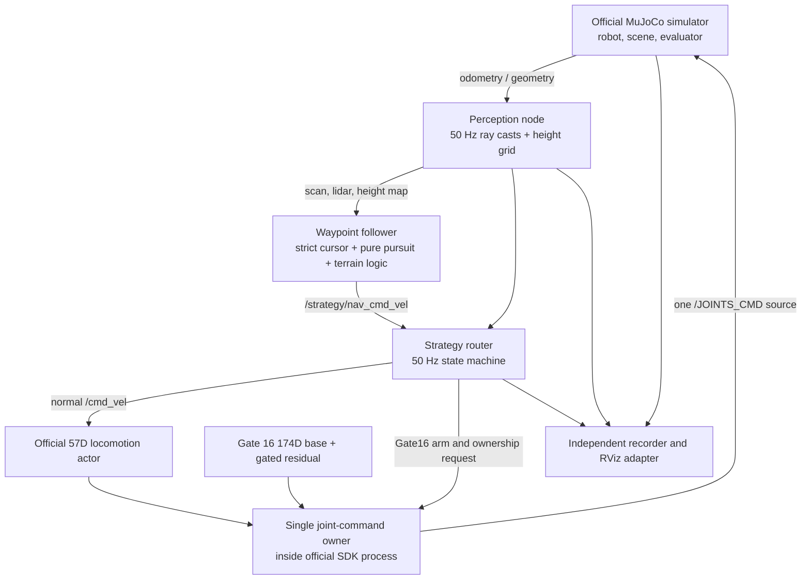
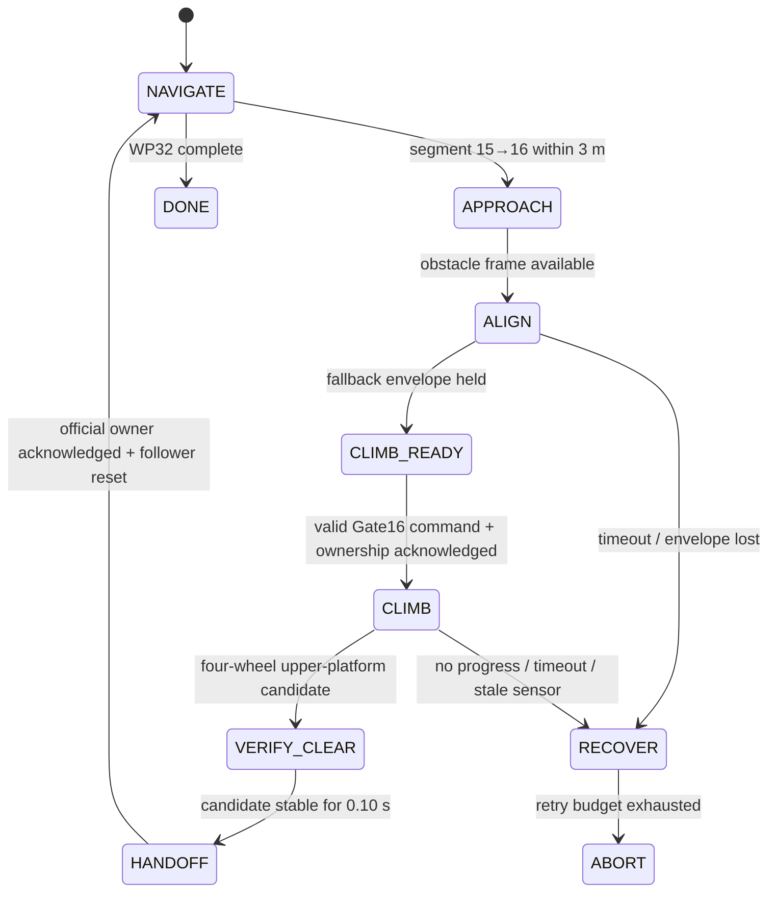

# Technical Design and Verification Record

**Project:** Terrain-Aware Autonomous Navigation for the DEEP Robotics Lynx S10  
**Competition:** GOAI 2026, Track 4 *Embodied Future*, Challenge 2  
**Document status:** Ver1.0 competition design record  
**Last fact check:** 2026-08-20

## 1. Purpose and claim boundary

This document gives reviewers a single, implementation-linked account of the system: the task
being solved, its architecture and interfaces, the navigation and control algorithms, the Gate 16
learned-policy integration, safety behavior, reproducibility, measured results, and known limits.
It is intended to be read together with the root `README.md`, `SUBMISSION.md`, `THIRD_PARTY.md`
and `OPEN_SOURCE_PLAN.md`.

The central verified claim is deliberately narrow:

> The Ver1.0 stack completed one continuous MuJoCo self-test from WP0 through WP32, passing all
> 33 evaluator waypoints in strict order in 392.257 seconds of simulation elapsed time. The successful
> run used the official 57D locomotion actor everywhere except the WP15→WP16 Gate 16 segment,
> where it used the frozen 174D base-plus-residual policy and then returned to the official actor.

This is a team self-test, not an organizer-certified score and not a guarantee over every random
seed. The accepted run uses simulator ground-truth odometry; a hardware localization estimator is
not implemented in this repository. The dedicated Gate 16 policy has also shown seed-dependent
failures. These limitations are part of the design record, not omitted exceptions.

## 2. Challenge interpretation and success criteria

The organizer describes Challenge 2 as autonomous navigation, real-time obstacle avoidance,
multi-terrain adaptive motion control and task scheduling in an industrial-park patrol scenario.
The public Track 4 requirements emphasize a runnable and reproducible perception–decision–action
loop, deployment instructions, dependency and data provenance, architecture/runtime disclosure,
evaluation evidence and an open-source plan.

For the supplied preliminary simulator, the implementation treats success as all of the following:

1. WP0, WP1, …, WP32 enter the evaluator radius in that exact order.
2. The robot does not trigger a fall or run-failure condition before WP32.
3. Policy transitions do not allow two joint controllers to drive the robot simultaneously.
4. The independent upstream evaluator—not the navigation cursor—records the ordered pass events.
5. Course time is the upstream MuJoCo simulation clock from the WP0 event to the WP32 event.

At the pinned organizer SDK revision, the simulator contains 33 waypoints and the evaluator uses
horizontal distance

```text
d_xy = sqrt((robot_x - waypoint_x)^2 + (robot_y - waypoint_y)^2)
```

with a 0.20 m acceptance radius and a strict cursor. The follower and strategy router both use a
tighter 0.18 m internal radius. This is a navigation margin; it does not modify or replace the
organizer's evaluator. It is unrelated to collision envelopes, lidar clearance or wheel radius.

## 3. System boundary and architecture

The solution subclasses and patches the organizer's SDK rather than copying or replacing its
simulator. MuJoCo physics, the Lynx S10 model, course geometry, joint transport and official timer
remain organizer components. Team code adds simulated perception, navigation, a bounded strategy
router, policy integration, command ownership, observability and evidence capture.



### 3.1 Runtime components

| Component | Main implementation | Responsibility |
|---|---|---|
| Simulator/perception | `src/s10_perception/s10_perception/sim_node.py` | Subclass upstream simulator, publish odometry, lidar, height map and wheel/contact state |
| Visualization adapter | `src/s10_perception/s10_perception/viz_node.py` | Convert array observations to RViz `PointCloud2`; publish required transforms |
| Follower | `src/s10_auto_nav/s10_auto_nav/follower_node.py` | Ordered waypoint tracking, terrain classification, local planning, route recovery, velocity output |
| Strategy router | `src/s10_auto_nav/s10_auto_nav/strategy_router_node.py` and `strategy/router.py` | Gate 16 lifecycle, safety checks, controller selection and handoff |
| Gate 16 runtime | `integration/gate16_policy_runner.hpp` | Build 174D observations, infer two ONNX graphs, execute command phases and decode actions |
| Actuator arbiter | `integration/joint_command_owner.hpp` | Enforce one command source at the actual SDK `/JOINTS_CMD` boundary |
| Official velocity bridge | `integration/ros_cmd_interface.hpp` | Feed `/cmd_vel` into the organizer actor, autonomous stand-up and command timeout |
| Recorder | `src/s10_auto_nav/s10_auto_nav/segment_recorder.py` | Record independent state, commands, events, policies, joint state and failure evidence |

### 3.2 ROS interface contract

| Topic | Type | Nominal rate | Producer → consumer | Meaning |
|---|---|---:|---|---|
| `/ground_truth/odom` | `nav_msgs/Odometry` | 50 Hz | simulator → follower/router/recorder | Simulation base pose and twist |
| `/scan` | `sensor_msgs/LaserScan` | 50 Hz | perception → follower/router | Horizontal ring used for clearance and obstacle avoidance |
| `/perception/lidar` | `Float32MultiArray` | 50 Hz | perception → visualization | 8×64 range image |
| `/perception/heightmap` | `Float32MultiArray` | 50 Hz | perception → follower/router/Gate16 | 13×9 local terrain grid |
| `/perception/wheel_state` | `Float32MultiArray` | 50 Hz | simulator → router/recorder | Four wheel centres and contact state |
| `/strategy/nav_cmd_vel` | `geometry_msgs/Twist` | 50 Hz | follower → router | Normal navigation request when router is enabled |
| `/cmd_vel` | `geometry_msgs/Twist` | 50 Hz | router → official actor | Sole high-level velocity command |
| `/strategy/joint_owner` | `std_msgs/String` | event/50 Hz | router → SDK arbiter | Requested actuator owner |
| `/strategy/climb_joints` | `Float32MultiArray` | 50 Hz | optional ROS climb actor → SDK | 16 targets; not used by in-process Gate16 path |
| `/joints/owner` | `std_msgs/String` | event | SDK arbiter → router/recorder | Actual, acknowledged actuator owner |
| `/JOINTS_DATA` | organizer message | SDK rate | robot interface → policies/recorder | Measured joint position, velocity and torque |
| `/JOINTS_CMD` | organizer message | SDK rate | SDK arbiter → robot interface | Final five-column joint command matrix |

When the strategy router is enabled, launch remaps the follower output to
`/strategy/nav_cmd_vel`; the router is then the only `/cmd_vel` publisher. Gate 16 does not publish
`/JOINTS_CMD` from ROS. Its command is evaluated in the SDK process and passed through the same
in-process arbiter that handles the official actor.

## 4. Perception and state representation

### 4.1 Lidar and horizontal scan

The simulation perception node ray-casts against the current MuJoCo scene. It publishes the full
8×64 range image and extracts a horizontal `LaserScan` ring. The planner uses bearings and ranges,
not an external map or online service. RViz conversion is separate from the controller so timed
headless runs do not pay visualization overhead.

### 4.2 Height map

The height map has 13 rows by 9 columns (117 values) and is aligned with base yaw:

| Property | Contract |
|---|---|
| Frame axes | x forward, y left, z up |
| x coverage | −0.60 m to +1.20 m |
| y coverage | −0.60 m to +0.60 m |
| Cell spacing | 0.15 m |
| Flattening | C order: x row outer, y column inner |
| Producer value | `clip(terrain_z - base_z, -1, 1)` metres |
| Gate16 conversion | valid cell `clip(-raw - 0.5, -1, 1)` |
| Missing/void sentinel | raw values at or below −1 are retained as −1 |

Navigation consumes the raw geometric convention. Gate 16 consumes the converted training
convention, approximately `base_z - terrain_z - 0.5`. The conversion is intentional and covered by
contract tests. One remaining hardware-interface risk is that a legitimately clipped −1 m cell and
the void sentinel share the same numerical value; a future physical perception message should
carry an explicit validity mask.

The in-process buffer rejects a map older than 200 ms for Gate 16 and supplies `valid=false` with a
zeroed payload. A stale map cannot initiate a residual gate. The router separately watches the
complete odometry/lidar/height-map set.

### 4.3 Terrain classification

`TerrainClassifier` fuses height-grid relief with lidar clearance and labels the local situation as
`FLAT`, `RAMP`, `STAIRS`, `BLOCKED`, `HIGH_BARRIER`, `DROP`, `UNSTABLE` or `UNKNOWN`. Dwell and
hysteresis suppress label oscillation from gait motion. Only `RAMP` and `STAIRS` authorize a direct
terrain commitment. A barrier first triggers local replanning; drops and unknown/unstable evidence
reduce or stop forward motion.

This is a course-oriented local geometry system, not a claim of general semantic perception. The
accepted simulation uses `/ground_truth/odom`; replacing that topic with a real localization source
while preserving its frame and covariance contract is required for hardware deployment.

## 5. Navigation design

### 5.1 Ordered waypoint cursor

The follower never treats a later waypoint as compensation for a missed one. Its current target is
advanced only after the 0.18 m internal pass condition. The router maintains a cursor over the same
course and the same radius so controller selection cannot disagree with navigation about the active
segment. The independent upstream evaluator retains its own 0.20 m cursor.

The generated course has 33 waypoints, 224.21 m of horizontal path length and 6.70 m of accumulated
height gain. The final physical-event handbook may describe a different waypoint count; this design
record describes the pinned preliminary simulator used for the stated result.

### 5.2 Pure-pursuit velocity controller

The normal controller combines a speed-dependent lookahead, heading correction and lateral
cross-track correction. It reduces translation as heading error grows, pivots when the next leg is
more than 30° away, brakes near a gate and limits command slew. Current principal limits are:

| Parameter | Competition value | Design role |
|---|---:|---|
| `max_forward` | 2.1 m/s | Admitted only on explicitly validated clear, level legs |
| `terrain_max_forward` | 1.2 m/s | General non-flat/uncertain ceiling |
| `max_lateral` | 0.4 m/s | Holonomic correction cap |
| `max_yaw_rate` | 0.7 rad/s | Normal yaw cap |
| `lookahead` | 1.5 m | Base pursuit target distance |
| `lookahead_speed_gain` | 0.7 | Increases lookahead with speed |
| `forward/lateral/yaw_slew` | 5.0 / 2.0 / 6.0 per s | Command continuity |
| `pivot_threshold` | 30° | Turn before translating onto a sharp new leg |

The 2.1 m/s value is not used globally. `fast_flat_waypoints` admits it only when distance,
heading, cross-track, pitch and tilt checks all pass. Narrow decks and critical approaches have
explicit lower bounds in `waypoint_speed_limit_*`; terrain classification can reduce speed further.

### 5.3 Obstacle avoidance and course-specific recovery

The local planner samples headings within ±90° of the goal bearing, evaluates a 4 m lidar probe and
requires a 0.45 m half-width body corridor. It trades clearance against deviation and applies a
target-clearance margin so geometry beyond a near waypoint does not make that waypoint unreachable.

Several bounded mechanisms encode measured course geometry:

- high barriers use an edge escape and bypass before direct-climb fallback;
- WP26 and WP27 retreat 0.70 m along the scored incoming path before a right-angle deck turn;
- WP28 has a bounded 1.30 m run-up for its final riser;
- WP31 and WP32 use body-clear intermediate route hints without advancing the waypoint cursor;
- after ordered WP28, a same-level WP28→WP29 upper-deck corridor is admitted only after tilt is
  below 12° for 0.4 s. It converts height-derived DROP/HIGH_BARRIER/RAMP/STAIRS false positives to
  FLAT, suppresses StepCommit on that segment, and leaves lidar plus BLOCKED/UNSTABLE/UNKNOWN
  classifications active; the real pillar therefore remains avoidable;
- WP30 can retain committed motion where stacked-storey projection confuses the local height map.

These exceptions are visible in `nav.yaml` and were introduced from measured failures. They improve
reproducibility on the supplied course but should not be presented as a globally optimal planner.

### 5.4 Stall and progress detection

Two clocks detect different failure shapes. The fast detector triggers below 0.08 m/s for 2.5 s.
The slow detector asks whether the current gate is getting closer and triggers after 12 s without
progress, even if gait oscillation keeps instantaneous speed above the first threshold. Recovery is
bounded; it cannot silently skip the current waypoint.

## 6. Locomotion policies and Gate 16 integration

### 6.1 Policy allocation

| Course region | Active locomotion controller | Status |
|---|---|---|
| All normal segments | Organizer's official 57D proprioceptive ONNX actor | Deployed |
| WP15→WP16 only | Frozen Gate 16 174D base + height-gated residual | Deployed |
| Short/continuous stairs model | Team-supplied 57D actor | Shipped but disabled |

The segment mapping is declared once in `strategy_gate16.yaml` as `climb_segment: [15, 16]`.
The accepted log records actual ownership changing to Gate 16 for that segment and returning via
safe hold to the official owner immediately afterward. The experimental stairs actor is
`stairs57_enabled: false`; focused trials with the current decoder fell at 61–68°, so it did not
contribute to the accepted result.

### 6.2 Gate 16 asset identity

| Asset | Shape | SHA-256 |
|---|---|---|
| `policy/gate16/policy.onnx` | float32 `[batch,174]` → `[batch,16]` | `5c1b388f951b282693b4497cd4fd2fd1b53fe1bcd989758c0af42f140a20fb16` |
| `policy/gate16/climb_residual.onnx` | float32 `[batch,174]` → `[batch,16]` | `de61441facb21f0301787b26f168f8447fdc0d83c337eeea884537bbf2468889` |

The integration source is `belsun/goai-s10-gate16-policy` commit
`216b77affa550359e73f4e71944d2853c64959ef`, with asset bundle commit
`b6535a48bf3d72f3ab2f3e37f8b555eb15aa3e64`. Both graphs are evaluated at 50 Hz.

### 6.3 Exact 174D observation

All entries are float32 and use policy joint order
`FL leg, FR leg, HL leg, HR leg, FL wheel, FR wheel, HL wheel, HR wheel`.

| Slice | Width | Meaning and preprocessing |
|---|---:|---|
| `[0:3]` | 3 | Body-frame base angular velocity × 0.25 |
| `[3:6]` | 3 | Projected gravity `R_base^-1 · [0,0,-1]` |
| `[6:9]` | 3 | Commanded forward, lateral and yaw velocity after command-profile adjustment |
| `[9:25]` | 16 | Joint position minus policy defaults; four wheel-angle entries are zeroed before default subtraction |
| `[25:41]` | 16 | Joint velocity × 0.05, including wheel velocity |
| `[41:57]` | 16 | Previous final raw policy action |
| `[57:174]` | 117 | Converted 13×9 height map in the flattening contract from §4.2 |

Policy-order defaults are:

```text
[0,-0.3,0.6,  0,-0.3,0.6,  0,0.3,-0.6,  0,0.3,-0.6,  0,0,0,0]
```

Shadow inference does not seed actuator history. On the actual ownership edge, the runtime
inverse-decodes measured leg position and wheel velocity into the previous-action field, then
clips it to the action guard. This prevents a shadow action that was never applied from becoming
the recurrent context for the first controlled tick.

### 6.4 Base, residual and gate computation

For observation `o`, the runtime computes:

```text
base = BaseONNX(o)
if router_armed and height_skill_gate_active and residual_engaged:
    correction_i = clip(ResidualONNX(o)_i, -4, 4) * scale_i
    raw_i = base_i + correction_i
else:
    raw_i = base_i
final_i = clip(raw_i, -guard_i, guard_i)
```

`scale=[1×12, 6×4]`; `guard=[8×12, 25×4]`. The height skill gate enters after two frames with a
measured edge above 0.04 m, stays active for at least 100 frames, exits after 15 frames below
0.02 m, and has a 600-frame hard maximum. It examines rows 4–8 and columns 2–6, with rows 0–8
retaining an already active edge. Invalid or stale maps cannot create a new gate.

Competition configuration forces the v1.5 stable frontal fallback. The confidence adapter and
mirroring implementation remain available for future experiments but are disabled for the accepted
run. In fallback, the low-level forward command is capped at 0.15 m/s and residual control begins
when the height gate activates. This is intentionally different from claiming broad arbitrary-yaw
operation.

### 6.5 Exact 16D action mapping

The policy output is reordered to the robot's interleaved joint order. For each leg:

| Output | Robot command | Scale |
|---|---|---:|
| hip-x raw offset | position = default + raw × scale | 0.125 rad |
| hip-y raw offset | position = default + raw × scale | 0.25 rad |
| knee raw offset | position = default + raw × scale | 0.25 rad |
| wheel raw command | velocity = raw × scale | 5.0 rad/s |

The Gate 16 command uses leg gains `kp=80`, `kd=2`, wheel gains `kp=0`, `kd=0.6`, and zero
feed-forward torque. The command is rejected to safe hold if its dimensions or values are invalid.

### 6.6 Entry, command profile and state machine

The current fallback entry envelope is a stable, moving approach:

- lip-normal distance 0.62–0.70 m;
- measured forward speed 0.08–0.20 m/s, target command 0.18 m/s;
- absolute lateral error ≤0.25 m;
- absolute yaw relative to the measured step normal ≤6°;
- absolute yaw rate ≤0.10 rad/s;
- combined tilt ≤12°;
- envelope held for 0.10 s.

The official actor owns the approach while Gate 16 shadow-evaluates. The robot aligns while moving;
it does not intentionally stop at the lip and pivot. The broader fast window (0.60–0.65 m,
0.23–0.27 m/s, ≤5°) is retained in configuration but cannot be selected while
`gate16_fast_adapter_enabled: false`.



`front_tuck_command_profiles.json` is executed by the low-level Gate 16 runner, not by the ONNX
graph. A profile is selected from entry speed/yaw only in an enabled confidence path. Its phase
change uses the height-map skill gate's separate left/right edge-distance estimates; after each side
remains within the configured front-support edge distance for the required samples, the runner
applies front tuck, holds `settle` for 30 policy steps and then enters `push`. These are
height-map-derived controller events, not measured wheel contacts. Under the forced stable fallback,
the fast adapter is inactive and an unmatched profile deliberately uses the frozen release-policy
command rather than inventing an interpolated profile. The router's later four-wheel test is the
independent physical clearance check.

### 6.7 Four-wheel clearance and handoff

The router verifies wheel centres against the measured lip normal, deck height and wheel radius,
checks contact/attitude sanity, and debounces the all-wheel candidate. Gate scoring alone is not
enough because rear wheels may still straddle the edge. After verification:

1. residual arming is removed;
2. Gate 16 ownership is released;
3. the joint arbiter inserts a 0.25 s measured-position safe hold;
4. the official actor is reset so old action history cannot leak across the gap;
5. the router waits for `/joints/owner=official` acknowledgement;
6. follower transient state is reset and navigation resumes at 0.50 m/s for 0.80 s.

The reverse transition is also guarded. Normal owner changes pass through safe hold; Gate 16's
moving entry is a reviewed exception and is atomic only if a finite Gate 16 matrix is already
available on that same 50 Hz tick. Otherwise the arbiter retains the official command for at most
0.10 s and then holds safely.

## 7. Safety architecture

Safety is layered rather than delegated to a policy output:

| Hazard | Current response |
|---|---|
| Multiple controllers | Sole `/cmd_vel` publisher plus in-process, single-source `/JOINTS_CMD` arbiter |
| Startup without observations | Zero velocity, official ownership retained until all required sensors arrive |
| Runtime sensor age >0.5 s | Stop; cancel/recover if climbing |
| Continued sensor loss for 3.0 s | Abort |
| Non-finite observation/action/target | Reject transition or command; measured-position safe hold |
| Tilt ≥60° | Cancel policy and abort |
| No climb progress | Recover after the active policy's progress window; Gate16 uses 12 s in competition config |
| Climb duration ≥20 s | Cancel and recover/abort according to retry budget |
| ROS climb command older than 0.20 s | Safe hold |
| Owner transition | Drop previous owner's buffer; require actual-owner acknowledgement |
| Sustained measured torque >50 Nm for 1.0 s | Router abort while a delegated Gate16/stairs controller owns CLIMB or VERIFY_CLEAR |

The torque watchdog is **not equivalent to the organizer's independent continuous torque rule**.
It uses one all-joint ceiling and a 1.0 s grace, and it is not applied while the normal official
controller owns navigation. Therefore torque-duration compliance must still be checked from `/JOINTS_DATA` telemetry
against the organizer's current rule before physical competition. The accepted evidence proves
ordered completion and tilt below the 60° software fall threshold; it is not a formal
hardware-torque certification.

The software has no authority to guarantee real-world collision safety from simulation alone.
Emergency-stop integration, hardware command limits, localization uncertainty, perception
validity and platform-specific torque limits remain mandatory parts of final-device commissioning.

## 8. Configuration, dependency and deployment design

### 8.1 Reproducible environment

The reference environment is Ubuntu 24.04, ROS 2 Jazzy and Python 3.12. Docker starts from a
digest-pinned `ros:jazzy-ros-base` image. Direct Python packages are locked, including NumPy 1.26.4,
MuJoCo 3.11.0, SciPy 1.17.1 and ONNX Runtime 1.28.0. The organizer SDK is checked out separately at
commit `13dd084be6cb5e2514098bc87e586d00dfe580b2` because access is controlled by the organizer.

`scripts/setup_upstream.sh` checks the revision, applies the reviewed integration and regenerates
the course. `scripts/build.sh` builds the SDK and ROS workspace. `scripts/verify_install.sh` checks
revision, patches, course, policy hashes and installed packages. The documented competition entry
point is:

```bash
scripts/run_race.sh --headless
```

or, in the portable environment:

```bash
docker compose run --rm s10 scripts/run_race.sh --headless
```

`run_race.sh` enables `strategy_gate16.yaml` by default. Direct launch retains a conservative
router-off default; that diagnostic mode does not reproduce the accepted Gate 16 run.

### 8.2 Resource and data boundary

Runtime inference is local and does not call a hosted model, commercial API or cloud service.
The public Git package pulls organizer scene/model/waypoint material from its access-controlled
upstream revision. The complete judge-only offline ZIP contains the authorized pinned checkout;
it is not intended as a public redistribution artifact. Raw logs, telemetry, replay frames and
videos remain outside Git. Model and dependency provenance, including the unresolved contributor-
license action for team-supplied policy assets, is disclosed in `THIRD_PARTY.md`.

## 9. Verification method and measured result

### 9.1 Validation layers

The project uses four complementary validation levels:

1. **Static contract checks:** YAML consistency, exact course generation, policy file hashes,
   ONNX input/output shape and dependency pins.
2. **Unit and integration tests:** navigation geometry, local planning, terrain state, strategy
   transitions, Gate 16 observation/action mapping, C++ header contracts and owner arbitration.
3. **Focused simulation:** difficult segments and policy ownership/handoff tests before a full run.
4. **Continuous full stack:** one process graph from WP0 to WP32, scored by the independent
   upstream evaluator and recorded by a separate telemetry node.

No success claim is based only on a process exit code. The retained run was checked against
official waypoint messages, internal gate events, owner transitions, telemetry limits, final
distance and video duration.

### 9.2 Accepted full-run evidence

| Metric | Verified value |
|---|---:|
| Seed/platform | 8 / Mac arm64 |
| Ordered waypoints | 33/33 |
| Official WP0 simulation time | 0.001 s |
| Official WP32 simulation time | 392.258 s |
| Official elapsed | **392.257 s (6:32.257)** |
| Recorder wall elapsed | 674.01 s |
| Distance travelled | 249.94 m |
| Final WP32 distance | 0.177 m |
| Maximum recorded tilt | 44.6° |
| Recorder stall events | 2 |

The two time values have different meanings. Official elapsed time is simulation time measured by
the upstream evaluator and is the self-test course time. Recorder wall time includes host compute
and rendering overhead and is a performance diagnostic, not the course result.

### 9.3 Per-waypoint official timestamps

| WP | sim s | WP | sim s | WP | sim s |
|---:|---:|---:|---:|---:|---:|
| 0 | 0.001 | 11 | 97.573 | 22 | 219.341 |
| 1 | 13.203 | 12 | 106.268 | 23 | 232.201 |
| 2 | 20.927 | 13 | 117.928 | 24 | 263.805 |
| 3 | 27.253 | 14 | 127.034 | 25 | 274.812 |
| 4 | 33.517 | 15 | 134.724 | 26 | 292.477 |
| 5 | 42.554 | 16 | 152.871 | 27 | 305.699 |
| 6 | 50.798 | 17 | 155.488 | 28 | 345.309 |
| 7 | 63.121 | 18 | 172.326 | 29 | 353.676 |
| 8 | 72.278 | 19 | 185.104 | 30 | 356.928 |
| 9 | 77.912 | 20 | 191.713 | 31 | 371.001 |
| 10 | 89.608 | 21 | 212.730 | 32 | 392.258 |

### 9.4 Gate 16 evidence in the accepted run

The retained log records this sequence: stable-fallback envelope held; residual armed; actual
owner acknowledged as Gate 16; fallback entry with command 0.18 m/s, base yaw approximately −5.00°,
valid native-frame height map and measured edge peak 0.37691 m; about 6.86 seconds of Gate 16 ownership;
four-wheel candidate; 0.35 s verification; residual disarmed; actual owner changed to safe hold and
then official in about 0.257 s; follower transient state reset. WP16 scored at simulation time
152.871 s and WP17 at 155.488 s. The same log records WP28 at 345.309 s, activation of the
same-level corridor toward WP29, no WP28→WP29 CLIMB or DETOUR, and WP29 at 353.676 s.

### 9.5 Video evidence

The separately submitted file `wp0_to_wp32_mac_seed8_720p_official_perception.mp4` is a continuous
simulation-time render of the accepted run. It is H.264 Main, 1280×720, 30 fps and 392.267 s
long—0.010 s from the official elapsed time. SHA-256:
`405f786f47aae9b91da04f04ac50908fb535bc531899a54d755258aa65383949`.
It overlays elapsed time, target waypoint, active policy, actual joint owner and pass events. The
right panels visualize the exact horizontal lidar rays/hit points and 13×9 relative heightmap
samples recomputed from each replay state with the submitted sensor code and identical scene.

### 9.6 Negative evidence and repeatability limits

The same configuration is not universally successful. Other seed-8 trials passed Gate 16 and later
fell on WP27→WP28 at about 63°, or failed during Gate 16 near 69° despite selecting the intended
fallback. Seed 10 became stuck before WP29. The accepted Mac seed-8 run used the later same-level
corridor fix and completed, but it remains evidence of feasibility rather than a statistically
established success rate.
The next reliability study should predeclare a seed set, run identical binaries/configuration and
report success proportion with failure locations rather than selecting only the fastest survivor.

## 10. Design decisions, limitations and next work

### 10.1 Main technical decisions

- Preserve the organizer actor as the normal controller; specialize only the single high-step
  segment that required a different learned behavior.
- Put policy selection above the actuator boundary but enforce exclusivity at the actuator boundary.
- Use a moving Gate 16 entry and measured geometry instead of triggering at a waypoint coordinate.
- Require physical four-wheel clearance before returning control to navigation.
- Keep scorer, navigation cursor and evidence recorder independent so one cannot manufacture the
  other's success.
- Expose course-specific recovery in configuration rather than hiding it in model weights or
  scattered waypoint conditionals.

### 10.2 Known limitations and risks

| Item | Current status | Required follow-up |
|---|---|---|
| Gate 16 stochastic robustness | One accepted continuous seed; known failures | Fixed multi-seed campaign and confidence interval |
| Hardware localization | Uses simulator ground truth | Integrate and validate a real estimator with matching frame/time contract |
| Height-map validity | −1 can mean clipped terrain or void | Add explicit validity mask and hardware calibration |
| Torque compliance | Software watchdog differs from organizer rule | Telemetry-based rule checker and real-device torque validation |
| Generalization | Several route mechanisms use measured course geometry | Test altered obstacle layouts and quantify sensitivity |
| Experimental stairs57 actor | Shape-compatible but unsafe in focused runs | Reproduce original runner/normalization before enabling |
| Fast/mirrored Gate 16 path | Code retained, competition-disabled | Shadow mode, focused ±yaw validation, then multi-seed gate |
| Model licensing | Team bundles lacked standalone licenses | Obtain contributor-approved license/permission before wider distribution |
| Architecture validation | Clean ARM64 Docker build verified; other hosts intended | Re-run the exact image and full course on judge target architecture |

### 10.3 Staged continuation plan

1. Add an offline trace comparator for every 174D field, base output, residual output, gate state
   and final actuator matrix against the reference runner.
2. Add an explicit height-map validity channel without changing the current model tensor contract.
3. Run Gate 16 shadow inference at 50 Hz on the target computer and measure deadline misses.
4. Repeat the frozen frontal fallback over a predeclared seed set; validate entry distribution,
   four-wheel completion and clean handoff.
5. Run continuous Gate16→WP17→WP18 tests before another full course campaign.
6. Close torque-rule and emergency-stop validation on real hardware.
7. Only then evaluate fast confidence/mirrored variants or re-enable the stairs actor.

## 11. Evidence and source register

This document was fact-checked against the following source classes. Current code/configuration and
raw accepted-run evidence take precedence over historical plans.

### 11.1 Versioned repository sources

- `README.md` and `docs/SUBMISSION.md`: release scope, run procedure and submission record.
- `docs/THIRD_PARTY.md`: upstream, model, dependency, data and license boundaries.
- `docs/OPEN_SOURCE_PLAN.md`: planned public release scope.
- `src/s10_bringup/config/nav.yaml`: accepted navigation parameters and route constraints.
- `src/s10_bringup/config/strategy_gate16.yaml`: policy allocation, entry and handoff parameters.
- `integration/gate16_policy_runner.hpp`: actual observation, inference, profile and action path.
- `integration/gate16_perception_buffer.hpp`: height-map freshness and conversion boundary.
- `integration/joint_command_owner.hpp`: actual actuator owner transition and safe hold.
- `policy/gate16/climb_policy_manifest.json`: model identity, shape, hashes and gate constants.
- `docker/requirements.lock`: accepted Python runtime versions.

### 11.2 Organizer/reference sources

- [GOAI Track 4 public page](https://www.goaihz.com/en/tracks?track=embodied), checked
  2026-08-19 for current scope, deliverables and review focus.
- Organizer-provided English participation handbook retained by the team.
- `DeepRoboticsLab/goai_embodied_future_material` at pinned commit
  `13dd084be6cb5e2514098bc87e586d00dfe580b2`, including the simulator evaluator and official actor.
- Gate 16 reference contract and runner from `belsun/goai-s10-gate16-policy`.

### 11.3 Retained external evidence (not in Git)

- accepted Mac seed-8 full log, CSV and JSON telemetry;
- seed-8 validation report and official timestamp extraction;
- continuous 720p MP4 and SHA-256 record;
- focused Gate 16 and stairs57 reports;
- retained unsuccessful seed-8 and seed-10 logs/videos;
- chronological engineering plan and experiment log.

Raw evidence is deliberately outside the public code repository to keep the competition package
limited to required source, models, configuration and documentation. It can be supplied to the
organizer for audit without changing the submitted code commit.

### 11.4 Fact-check result on 2026-08-20

The finished document was checked against the current branch rather than only reviewed as prose:

- after a clean isolated build, 378/378 source tests passed when the known joint-owner fixture was
  excluded;
- the observation/training-contract suite passed 29/29 tests when both workspace Python package
  roots were supplied;
- the separately executed joint-owner fixture compiled, but five assertions for an unused
  in-process adaptive Gate16 path failed and therefore its nine pytest wrappers errored; the
  accepted run used forced stable fallback and its runtime owner lifecycle completed cleanly;
- `scripts/verify_install.sh` accepted the upstream patch, generated course, three policy hashes
  and four required ROS packages;
- ONNX Runtime reported both Gate 16 graphs as float32 `['batch',174]` → `['batch',16]` with input
  name `obs`;
- locally computed model/profile SHA-256 values matched the versioned manifest;
- the accepted raw log contained exactly 33 ordered upstream `[TRACK]` events, the documented Gate
  16 owner lifecycle, and the WP28→WP29 same-level-corridor activation;
- FFprobe and SHA-256 verification matched the documented video codec, profile, resolution, frame
  rate, duration and digest;
- shell syntax, Git whitespace checks and the submission package's required-file list passed.

The two material wording errors found during this review—describing the disabled fast entry window
as active and describing height-map edge events as physical wheel contacts—were corrected in both
this record and the root README.

## 12. Reviewer quick audit

For a short technical review, the recommended order is:

1. read §§1–3 for scope and architecture;
2. compare `nav.yaml` and `strategy_gate16.yaml` with §§5–6;
3. run `scripts/verify_install.sh` to check upstream revision, model hashes and installation;
4. run the core test suite and inspect Gate 16 owner tests;
5. start `scripts/run_race.sh --headless` and verify independent ordered evaluator events;
6. compare the result with the timestamp and owner lifecycle in §9;
7. review §10 before interpreting the single successful seed as a reliability claim.
