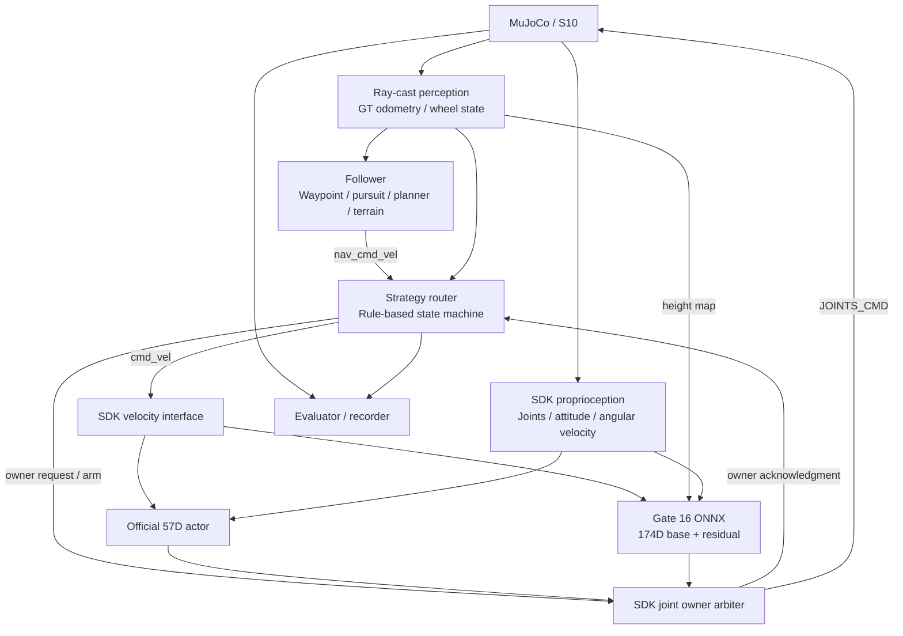
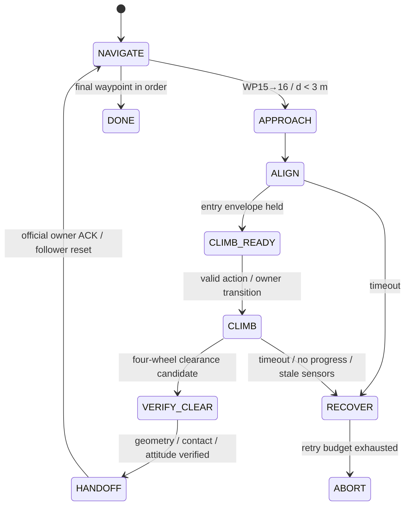

# Lynx S10 地形感知自主导航与残差越障控制

**GOAI LAI／狗來 · Technical System Report**

**系统基线：** `goai26-s10-racing@3660b81e8244dfa238633c161673596fe91650f6`  
**上游基线：** `goai_embodied_future_material@13dd084be6cb5e2514098bc87e586d00dfe580b2`  
**结果基线：** 2026-08-20，Mac ARM64，seed 8，WP0→WP32 连续仿真自测 392.257 s  
**文档范围：** 已交付系统的实现、Gate 16 策略训练与部署、实验结果及复现边界。  
**修订日期：** 2026-09-02

## 摘要

本项目面向 GOAI 2026 Track 4 Challenge 2，在官方 Lynx S10 轮足模型与 MuJoCo 赛道上实现分层自主导航。系统以在线几何 ray casting 构造 8×64 LiDAR range image 和 13×9 yaw-aligned height map，使用严格顺序航点管理、前视路径跟踪、候选航向局部规划及地形状态机生成速度指令。普通赛段采用官方 57D 本体感知 locomotion policy；WP15→WP16 的 0.3769 m 高台阶由冻结的 174D base actor 与 heightmap-gated residual actor 接管。规则型 strategy router 约束入口状态，并在四轮几何净空、接触及姿态检查后，通过 SDK 内单一关节控制权仲裁切回官方策略。

部署 residual 的 checkpoint 为 `speed_core` 第 120 次 PPO 迭代，actor 为 `174–512–512–256–128–16` ELU MLP。其训练采用固定官方台阶、入口状态随机化、冻结 base、参考策略约束和速度导向奖励。连续系统自测按序完成全部 33 个航点，仿真计时 392.257 s。该结果依赖仿真真值定位、几何高度采样和轮子接触状态；当前没有真机完成率或独立场景泛化的充分证据。

## 1. 任务定义与系统范围

给定顺序航点集合 \(W=(w_0,\ldots,w_{32})\)，系统生成机身速度命令 \(c_t=(v_x,v_y,\omega_z)\)，并通过运动策略产生 16 个执行器目标。目标是在满足顺序到点和运行约束的条件下减少完整路线用时。

官方 evaluator 使用机器人参考位置与航点的水平距离：

\[
d_{xy}(p_t,w_i)=\sqrt{(x_t-x_i)^2+(y_t-y_i)^2},\qquad r_{\mathrm{eval}}=0.20\ \mathrm{m}.
\]

Follower 与 router 各自维护同一航点序列的 cursor，均使用 \(r_{\mathrm{internal}}=0.18\ \mathrm{m}\)。后续航点不会补偿前序漏点。该阈值与碰撞模型、轮子半径、局部规划的机身走廊相互独立。

指定仿真路线有 33 个航点，航点折线水平长度 224.21 m，累计上升 6.70 m。路线坐标、部分平台几何、Gate 16 台沿及若干困难路段配置在运行前已知。系统属于**已知任务路线上的闭环导航与专用越障集成**，当前没有在线 SLAM、全局最优路径求解或未知场景端到端策略。

官方资源提供机器人模型、物理环境、基础 locomotion actor、SDK 和计时器；团队实现感知扩展、导航、越障策略及接口、控制权协调、恢复逻辑和评测工具。[S1–S3]

## 2. 系统架构与运行实现

### 2.1 控制结构



*图 1. 系统数据流与关节控制权仲裁。箭头表示状态、命令或控制权消息。*

Router 是带阈值、计时器、迟滞和状态锁存的有限状态机，未训练策略选择网络。Locomotion 层使用神经网络；任务层和局部规划层采用确定性算法与场地配置。

### 2.2 实现模块

以下路径均相对于系统基线仓库；完整本地源码索引见 §12。

| 模块 | 文件 | 主要职责 |
|---|---|---|
| 仿真与感知 | `src/s10_perception/s10_perception/sim_node.py`、`lidar.py`、`heightmap.py` | 扩展上游仿真，发布测距、高度、机身与轮子状态 |
| 导航 | `src/s10_auto_nav/s10_auto_nav/follower_node.py` | 航点、地形、局部规划和恢复的执行顺序 |
| 跟踪与避障 | `pure_pursuit.py`、`local_planner.py`、`waypoints.py` | 前视目标、速度命令、机身走廊和顺序到点 |
| 地形通过 | `terrain.py`、`step_commit.py` | 地形分类、持续通过和有界尝试 |
| 策略协调 | `strategy_router_node.py`、`strategy/router.py` | 状态装配、入口约束、接管、退出与异常处理 |
| 越障推理 | `integration/gate16_policy_runner.hpp` | 174D observation、双 ONNX 推理、动作解码 |
| 执行器仲裁 | `integration/joint_command_owner.hpp` | 在 SDK 输出边界决定有效关节命令 |
| 速度接口 | `integration/ros_cmd_interface.hpp` | 接入 `/cmd_vel`、起立与超时处理 |
| 数据记录 | `segment_recorder.py` | 逐时刻轨迹、动作、控制权和失败记录 |

### 2.3 ROS 与执行器接口

| Topic | 类型 | 名义频率 | 用途 |
|---|---|---:|---|
| `/ground_truth/odom` | `nav_msgs/Odometry` | 50 Hz | Follower、router 和 recorder 的机身状态 |
| `/scan` | `sensor_msgs/LaserScan` | 50 Hz | 近水平障碍测距 |
| `/perception/lidar` | `Float32MultiArray` | 50 Hz | 8×64 测距及可视化 |
| `/perception/heightmap` | `Float32MultiArray` | 50 Hz | 117 个局部地形值 |
| `/perception/wheel_state` | `Float32MultiArray` | 50 Hz | 四轮位置与接触状态 |
| `/strategy/nav_cmd_vel` | `geometry_msgs/Twist` | 50 Hz | Follower→router 的候选速度命令 |
| `/cmd_vel` | `geometry_msgs/Twist` | 50 Hz | Router→SDK 速度接口，供当前运动策略使用 |
| `/strategy/joint_owner` | `std_msgs/String` | 事件／控制周期 | 请求控制权 |
| `/joints/owner` | `std_msgs/String` | 事件 | SDK 确认的实际控制权 |
| `/JOINTS_DATA`、`/JOINTS_CMD` | 上游自定义消息 | SDK 控制频率 | 实测关节状态与最终命令矩阵 |

启用 router 时，launch 将 follower 输出重映射到 `/strategy/nav_cmd_vel`，由 router 统一发布 `/cmd_vel`。Gate 16 模型在 SDK 进程内执行，通过同一 arbiter 输出关节命令；另有 ROS climb-command 接口用于可选策略，但不是本次 Gate 16 执行路径。

## 3. 感知与状态表示

### 3.1 合成 LiDAR

`mj_multiRay` 对当前碰撞几何执行在线查询。射线模板预计算，运行时按机身姿态变换，复用距离与 geom-id 缓冲区。

| 参数 | 配置 |
|---|---|
| 方位采样 | 64，360°，端点不重复 |
| 仰角采样 | 8，−30° 至 +15° 均匀采样 |
| 测距范围 | 0.05–12.0 m |
| 机身系安装偏置 | `[0.20, 0, 0.12] m` |
| 几何过滤 | 地形 group 0；排除机器人和非碰撞航点标记 |
| 未命中 | 发布 12.0 m |
| `/scan` 来源 | 最接近水平的仰角行，实际为约 +2.143° |

该传感器通过射线与场景的首次相交建模几何遮挡；同一帧使用同一仿真状态，未模拟测量噪声、材质回波、扫描运动畸变或传输延迟。

### 3.2 航向对齐高度图

局部网格在机身前后方向取 13 点、左右方向取 9 点：

\[
x\in[-0.60,1.20],\quad y\in[-0.60,0.60],\quad \Delta x=\Delta y=0.15\ \mathrm{m}.
\]

网格随 yaw 对齐，忽略机身 roll/pitch；展平采用 x 外循环、y 内循环。高度值通过网格位置的向下射线直接查询场景，**不是从 8×64 LiDAR 重建得到**。实现可跳过高于 `base_z+1.0 m` 的上方表面，最多 12 次，以减少多层结构干扰。

导航使用：

\[
h^{\mathrm{raw}}_{ij}=\operatorname{clip}(z^{\mathrm{terrain}}_{ij}-z^{\mathrm{base}},-1,1).
\]

Gate 16 使用训练约定：

\[
h^{\mathrm{policy}}_{ij}=\operatorname{clip}(-h^{\mathrm{raw}}_{ij}-0.5,-1,1),
\]

但 raw≤−1 的无效／空洞编码保留为 −1。实际裁剪到 −1 的深地面与无命中共享数值，当前消息没有逐格 validity mask。SDK 高度图缓存对超过 200 ms 的观测标记无效；无效图不能新启动 residual gate。

### 3.3 地形状态与特权信息

高度特征先在轮子通行走廊内拟合平面，再计算相对该平面的正／负高度残差、平面坡度和起伏覆盖宽度。这样将连续坡面与局部台阶分开；分类阈值中的 rise 是平面残差，不等于障碍的绝对高度。

`TerrainClassifier` 融合这些特征、前向净空和姿态，输出 `FLAT/RAMP/STAIRS/BLOCKED/HIGH_BARRIER/DROP/UNSTABLE/UNKNOWN`，通过 dwell 与 hysteresis 抑制标签抖动。只有 `RAMP/STAIRS` 可直接授权 step commitment；高障碍先触发局部重规划，落差与未知状态限制前进。

当前部署依赖的 simulator-only 信息包括：真值 odometry、网格位置的直接地形查询，以及用于交接确认的四轮世界坐标和接触 flags。模型输入、router 输入与训练奖励使用的信息范围不同，应分别评估 sim-to-real 替代方案。

## 4. 导航与地形条件速度控制

### 4.1 顺序跟踪与前视控制

前视距离由上一周期前向命令决定：

\[
L_t=1.5+0.7|v_{x,t-1}|.
\]

对选择后的目标 \(p^*\)，令 \(\Delta=p^*-p_t\)、\(e_\psi=\operatorname{wrap}(\operatorname{atan2}(\Delta_y,\Delta_x)-\psi_t)\)，实现计算：

\[
\omega_z=\operatorname{clip}(1.8e_\psi,-0.7,0.7),
\]
\[
v_y=\operatorname{clip}\{0.9[-\sin\psi_t\Delta_x+\cos\psi_t\Delta_y],-0.4,0.4\}.
\]

当 \(|e_\psi|>30^\circ\) 时目标平移速度为零，先旋转对齐；否则前向命令随朝向误差线性衰减，并叠加到点制动。上述是变化率限制前的目标命令；实际输出的三个通道分别受 5.0 m/s²、2.0 m/s²、6.0 rad/s² 限制，因此切入旋转模式不等于平移命令瞬时归零。横向项是目标点在机身系的侧向偏移。该实现未采用标准自行车模型的曲率公式。

部分宽转角采用 corner preview：世界系平移仍指向当前未计分航点，机身朝向提前插值到出弯方向。当前配置仅对 WP13、19、20、21、22、23 启用，前视触发距离 0.8 m、速度上限 0.7 m/s、倾角上限 10°；顺序到点条件不变。

### 4.2 候选航向局部规划

规划器围绕目标方位，在 ±90° 内采样 31 个航向。将 LiDAR 回波投影到候选方向，取 0.45 m 半宽走廊内最近的正向距离 \(C(\theta)\)，截断于 4 m。候选得分为：

\[
J(\theta)=1.6\frac{C(\theta)}{4.0}-\frac{|\operatorname{wrap}(\theta-\theta_g)|}{\pi/2}.
\]

选择最高得分，平分时优先较小目标偏差。选中净空不足 0.8 m 则判为阻塞，否则按净空缩放速度。若目标很近，超过目标距离加 0.25 m 机身前伸余量的障碍不否决该目标，避免航点后方柱子导致永远无法到点。

该方法是贪心候选航向搜索，未求解完整时域动力学轨迹，也不保证全局最优或连续碰撞安全。

### 4.3 速度调度与场地先验

| 条件／目标航点 | 命令上限或处理 |
|---|---|
| WP2、10、14、22 的平坦开阔接近 | 最高 2.1 m/s；同时要求距航点≥1.5 m、航向误差≤7°、横向偏差≤0.26 m、倾角≤13°、pitch≤6° |
| 一般非快速路段 | 最高 1.2 m/s，再受地形状态约束 |
| WP26、28 | 0.95 m/s |
| WP16、24、25、27、29、31、32 | 0.70 m/s |
| WP26、27 的窄平台转弯 | 沿已通过来路后退 0.70 m，再转向 |
| WP28 最后一级台阶 | 配置 1.30 m 有界后退助跑 |
| WP28→29 | WP28 计分且倾角<12°持续0.4 s后，启用已知同层走廊；抑制跨层高度误判及 StepCommit，保留 LiDAR 与 BLOCKED/UNSTABLE/UNKNOWN |
| WP31、32 | 使用预设 body-clear 中间引导点；不推进官方航点 cursor |

速度上限约束的是相应导航模式的命令，不等于实测速度或对所有恢复／引导模式统一生效的全局上限。StepCommit、route hint 和控制交接另有命令限制。

### 4.4 停滞检测与恢复

Follower 在请求前进时并行监测：速度低于 0.08 m/s 持续 2.5 s；或到当前航点的最佳距离连续 12 s 没有有效改善。触发后进行有限倒退与转向，并继续尝试同一航点。StepCommit 有独立的推进超时和尝试预算。

需要区分 follower 的通用恢复与 Gate 16 router 的重试：**交付配置 `max_retries: 0`**，Gate 16 失败不会自动获得多次额外攀爬机会。

## 5. 运动策略与部署接口约定

### 5.1 模型分工与网络结构

| 控制路径 | 结构 | 状态 |
|---|---|---|
| 普通赛段 | 官方 57D 本体观测 actor | 使用官方权重和 runner |
| Gate 16 base | `174→512→256→128→16`，隐藏层 ELU | 冻结；来源 `s10_29cm_stable.pt` |
| Gate 16 residual | `174→512→512→256→128→16`，隐藏层 ELU | 冻结部署；`speed_core` iteration 120 |
| Residual critic | `174→256→128→64→1`，隐藏层 ELU | 仅训练使用 |
| 连续楼梯 57D actor | 独立团队模型 | 打包但 `stairs57_enabled: false` |

两份 Gate 16 ONNX 的层尺寸与 ELU 算子已直接从模型文件核对，residual checkpoint 的迭代、训练模式和 tensor shapes 也已读取。Actor 是 feed-forward MLP；上一动作作为显式输入，没有 RNN 或额外历史堆叠。[S4]

### 5.2 174D 观测向量

\[
o_t=[0.25\omega_t^b,\ g_t^b,\ c_t,\ \tilde q_t-q_0,\ 0.05\dot q_t,\ a_{t-1},\ h_t]\in\mathbb R^{174}.
\]

| 切片 | 维数 | 定义 |
|---|---:|---|
| 0:3 | 3 | 机身系角速度 ×0.25 |
| 3:6 | 3 | 投影重力 \(R^{-1}[0,0,-1]\) |
| 6:9 | 3 | 前向、横向和 yaw 速度命令 |
| 9:25 | 16 | 关节位置相对默认值；轮角先置零 |
| 25:41 | 16 | 包括轮速的关节速度 ×0.05 |
| 41:57 | 16 | 上周期经过 guard 的最终 raw action |
| 57:174 | 117 | 按训练约定转换的高度图 |

\(\tilde q_t\) 为重排后将四个轮角置零的位置向量；\(c_t\) 为 runner 实际送入网络的速度条件，已包含适用的命令限幅。Policy order 为四组腿关节 FL、FR、HL、HR，随后四个轮子 FL、FR、HL、HR。默认角度为：

```text
[0,-0.3,0.6, 0,-0.3,0.6, 0,0.3,-0.6, 0,0.3,-0.6, 0,0,0,0]
```

该 observation 不包含实测机身线速度、接触标志、绝对航点或 router phase；这些量可能供 router 或训练评测使用，但不是 actor 输入。

### 5.3 基础策略与门控残差

令 \(b_t=\pi_b(o_t)\)、\(\delta_t=\mu_\theta(o_t)\)，部署计算为：

\[
a_t=\operatorname{clip}\left[b_t+m_t\,s\odot\operatorname{clip}(\delta_t,-4,4),-a_{\mathrm{max}},a_{\mathrm{max}}\right],
\]

其中 \(s=[1]^{12}\oplus[6]^4\)、\(a_{\mathrm{max}}=[8]^{12}\oplus[25]^4\)，\(m_t\in\{0,1\}\) 由 router arming、height skill gate 和 runner engagement 共同确定，\(a_{\mathrm{max}}\) 为逐通道 raw-action guard。

实际 skill gate 在中央列 2–6、行边界 4–8 检查向上高度差；连续两帧≥0.04 m 进入，至少保持 100 帧，连续 15 帧≤0.02 m 退出，最多保持 600 帧。保持阶段扩展到行边界 0–8。以上是**残差激活阈值**，不代表模型能通过任意该高度以上的障碍。

完整运行强制选择 `gate16_climb_fallback`：前向条件输入在低层限至 0.15 m/s，禁用 confidence fast adapter、policy mirroring 与 front-tuck command profile。Bundle 中保留这些实验功能，不代表它们在该次运行中生效。[S10]

### 5.4 动作解码与 PD 控制

Raw action 重排到每条腿三个关节加一个轮子的 robot order：

| 通道 | 目标 | 缩放 |
|---|---|---:|
| hip-x | 默认位置＋偏置 | 0.125 rad／raw unit |
| hip-y、knee | 默认位置＋偏置 | 0.25 rad／raw unit |
| wheel | 速度目标 | 5.0 rad/s／raw unit |

腿使用 \(K_p=80,K_d=2\)，轮子使用 \(K_p=0,K_d=0.6\)，feed-forward torque 为零。SDK 输出为每执行器五列命令矩阵。

局部训练 runtime 每个策略步执行 20 个 1 ms 物理步，每步计算并裁剪 PD torque：

\[
\tau=\operatorname{clip}\{K_p(q^*-q)+K_d(\dot q^*-\dot q),-\tau_{\mathrm{max}},\tau_{\mathrm{max}}\},
\]

其中腿关节 \(\tau_{\mathrm{max}}=50\) Nm，轮子为 14 Nm。Raw-action guard 与 torque clipping 分别约束不同变量，不能等同于完整的关节位置／速度及比赛扭矩合规证明。

## 6. 强化学习训练与模型选择

### 6.1 最终权重来源与训练阶段

实际使用的 residual checkpoint SHA-256 为 `16e81160d099d345cb6766d06107a84f77ed02bb2ae9259e9f4076ece58eee74`。Checkpoint 明确记录：

```text
iteration = 120
terrain_mode = official_track
objective_mode = speed
activation_mode = heightmap
speed_range = [0.18, 0.40] m/s
yaw_range_rad = 0.1396263  (~8 degrees)
initial_residual_checkpoint = gate16_front_retention_20260817T121106/selected/best_checkpoint.pt
base_checkpoint = s10_29cm_stable.pt
```

可确认的训练链为：既有 174D base 与前期 residual → Gate 16 成功轨迹修复和前轮保持研究 → `speed_core` 速度目标 PPO → 固定矩阵选择 → 冻结并导出。早期材料描述了 57D→174D warm-start、课程地形和 BC/DAgger，但本地没有完整保存 base 的训练日志及所有中间 selection，因此不能声称已经从原始初始化完整重建最终权重的训练历史。

最终训练 recipe 的关键文件在发布来源 `5ef14fa` 与所读本地训练仓库之间无差异；其中仍须区分 checkpoint 直接确认的设置与 launch script 提供的设置。[S4–S6]

### 6.2 训练环境、重置分布与特权信号

最终 `speed_core` 使用 `OfficialClosedLoopResidualEnv`，直接加载官方 `S10_track.xml`；固定台沿约 \(x=12.646\) m，地面 \(z=0.10181425\) m，平台 \(z=0.47872480\) m，高差 0.37691055 m。环境最大 episode 为 850 个控制步，即 17 s。

训练入口采样如下：

| 变量 | `speed_core` recipe |
|---|---|
| 入口距台沿 | 0.55–0.65 m；85% 概率从 `{0.55,0.60,0.65}` 抽取，其余均匀采样 |
| 命令前向速度 | 0.18–0.40 m/s |
| 初始前向速度 | 与采样命令速度一致 |
| 入口 yaw | 约 ±8° 均匀采样 |
| 横向偏置 | ±0.02 m |
| 机身高度扰动 | 此 recipe 为 0 |
| 初始侧向速度、yaw rate | 默认 0 |
| 地形 | 固定官方 Gate 16 |

Checkpoint 中保存的 `depth_range=[0.3,0.4]` 是 trainer 通用字段；`terrain_mode=official_track` 不使用可变高度 fixture，**不能据此声称该阶段进行了 30–40 cm 台阶随机化**。本阶段也没有证据支持质量、摩擦、驱动延迟或 LiDAR 噪声随机化。

局部环境在控制周期内还设置 yaw 命令为 \(\operatorname{clip}(-1.5\psi,-0.8,0.8)\)，除非显式指定。因而模型训练并非在完全无辅助的任务导航下进行。

部署 fallback 的网络前向速度条件最高为 0.15 m/s，低于本阶段训练采样的下界 0.18 m/s；入口距离 0.62–0.70 m 也部分超出训练的 0.55–0.65 m。较低速度出现在前期 recipe 和发布选择矩阵中，但当前证据不能证明训练与部署入口分布完全覆盖。

Actor 与 critic 均接收 174D observation；critic 没有额外 privileged observation。但奖励和 episode 结束条件使用仿真轮心、平台高度与机身状态，属于 privileged reward/evaluation signals。

### 6.3 PPO 优化目标与实现

Residual actor 在训练中定义独立高斯分布：

\[
\delta_t\sim\mathcal N(\mu_\theta(o_t),\operatorname{diag}(\sigma^2)),
\]

策略评估和 ONNX 部署使用均值。Base actor 冻结且不进入 optimizer；residual actor 从已选 checkpoint 初始化，critic 在切换到速度目标时重新初始化。

采用 GAE，\(\gamma=0.99,\lambda=0.95\)，batch 内标准化 advantage。PPO ratio 基于 clipping/gating 前采样的 residual action：\(\rho_t=\pi_\theta(\delta_t\mid o_t)/\pi_{\theta_{\mathrm{old}}}(\delta_t\mid o_t)\)，\(\hat R_t=\hat A_t+V_{\mathrm{old}}(o_t)\)。Actor 解冻后的联合损失为：

\[
\begin{aligned}
\mathcal L={}&-\mathbb E\left[\min\left(\rho_t\hat A_t,\operatorname{clip}(\rho_t,1-\epsilon,1+\epsilon)\hat A_t\right)\right]\\
&+0.5\mathbb E\left[(V(o_t)-\hat R_t)^2\right]-\beta\mathcal H(\pi_\theta)\\
&+\alpha\mathbb E\left[\frac{1}{16}\sum_{j=1}^{16}(\mu_{\theta,j}(o_t)-\mu_{\mathrm{ref},j}(o_t))^2\right].
\end{aligned}
\]

\(\mu_{\mathrm{ref}}\) 为该阶段初始化后冻结的 residual actor；参数名虽为 `zero_anchor_coef`，在 warm-start 情况下约束目标是初始策略输出，不是零动作。

实现将成功、跌倒、动作发散及 850 步时间上限统一返回为 `done`，GAE 对这些 transition 均令 `nonterminal=0`，不为时间上限额外 bootstrap；仅 rollout batch 截断且 episode 尚未结束时保留下一状态价值。前 40 次 critic warm-up 仅更新 value loss，actor、entropy 与 reference-anchor 项不参与更新。

| 参数 | `speed_core` 设置 | 依据 |
|---|---:|---|
| Residual actor hidden | 512, 512, 256, 128，ELU | Checkpoint＋ONNX |
| Critic hidden | 256, 128, 64，ELU | Checkpoint＋trainer |
| 环境数／每环境 rollout | 12／32 | Launch script |
| 每迭代 transition 数 | 384 | 上述配置计算 |
| Optimizer | Adam | Trainer |
| Actor／critic LR | \(2\times10^{-8}\)／\(1\times10^{-5}\) | Launch script |
| Epochs／minibatches | 1／4 | Launch script |
| PPO clip \(\epsilon\) | 0.05 | Launch script |
| Entropy coefficient \(\beta\) | 0 | Launch script |
| 初始 log standard deviation | −3.5 | Launch script |
| Reference-anchor coefficient \(\alpha\) | 2.0 | Launch script |
| Critic warm-up | 前 40 次迭代冻结 actor | Launch script＋trainer |
| Gradient-norm clipping | 1.0 | PPO implementation |
| log-std bounds | [−5,0] | PPO implementation |
| 评估／保存间隔 | 40 次迭代 | Launch script |
| 计划最大迭代数 | 200；连续3次评估不改善可停止 | Launch script |
| 实际部署 checkpoint | iteration 120 | Checkpoint |
| 训练 seed | 377511 | Launch script |

按该 recipe，iteration 120 对应本阶段 46,080 个 rollout transitions，不含先前训练及评估交互；这是配置推算值，不能当作总训练样本量。12 个环境由单个 env-step worker 串行推进，神经网络使用批量推理／CUDA 更新，未使用 Isaac Gym 式 GPU 并行物理仿真。当前资料不足以报告端到端 GPU-hours 或整个训练链的样本效率。

### 6.4 速度导向奖励函数

令 \(\Delta x\) 为裁剪到 [−0.05,0.05] m 的单步前进量；\(\Delta F,\Delta R,\Delta C\) 为前轮、后轮及机身进展的历史最优值增量；\(\Delta N\) 为历史最多越沿轮数的增量。Residual 激活时的稠密奖励为：

\[
\begin{aligned}
r_t^{\mathrm{active}}={}&35\Delta x+20\Delta F+70\Delta R+35\Delta C+6\Delta N-0.05\\
&-0.0005\operatorname{mean}(\bar\delta_t^2)\\
&-0.0005\operatorname{mean}[(\bar\delta_t-\bar\delta_{t-1})^2].
\end{aligned}
\]

\(\bar\delta\) 是 clipping/gating 后、乘各通道 scale 前的 residual。令 \([u]_0^1=\operatorname{clip}(u,0,1)\)、\(H=z_{\mathrm{deck}}-z_{\mathrm{floor}}\)，前后轮瞬时进展分别为：

\[
\begin{aligned}
F_t^{\mathrm{inst}}&=\frac12\sum_{i\in\mathrm{front}}\left[\frac{x_i-x_{\mathrm{lip}}+0.45}{0.35}\right]_0^1\left[\frac{z_i-z_{\mathrm{floor}}-r_w}{H}\right]_0^1,\\
R_t^{\mathrm{inst}}&=\frac12\sum_{i\in\mathrm{rear}}\left[\frac{x_i-x_{\mathrm{lip}}+0.35}{0.35}\right]_0^1\left[\frac{z_i-z_{\mathrm{floor}}-r_w}{H}\right]_0^1.
\end{aligned}
\]

机身进展为 \(C_t^{\mathrm{inst}}=[(x_{\mathrm{base}}-x_{\mathrm{lip}}+0.35)/0.70]_0^1\)。各项先更新历史最大值，再取相对前一步历史最大值的增量。代码字段 `best_com_progress` 使用 base position，不是质量加权全身质心。

完整奖励为激活指示量乘上述稠密奖励，再独立累加成功、跌倒与发散项：

\[
\begin{aligned}
r_t={}&\mathbf1_{\mathrm{active}}r_t^{\mathrm{active}}
+\mathbf1_{\mathrm{success}}[300+0.5\max(0,850-n_t)]\\
&-250\mathbf1_{\mathrm{fallen}}-300\mathbf1_{\mathrm{diverged}},
\end{aligned}
\]

其中 \(n_t\) 为当前 episode 已执行的控制步数。事件奖励不要求 residual 激活；成功与跌倒标志独立计算，代码没有互斥优先级。所有历史最佳增量非负，前轮重新掉下不会自动撤销既得进度。`objective_mode=speed` 不加入前轮保持或收腿阶段奖励。

局部环境的成功条件是四个轮心均满足 \(x_i\ge x_{\mathrm{lip}}+0.02\) 且 \(z_i\ge z_{\mathrm{deck}}+0.70r_w\)，\(r_w=0.081\) m。跌倒条件为投影重力 z 分量>−0.20，或机身高度低于 floor+0.12 m。该成功条件没有部署 router 的接触数量、24°姿态约束和持续确认，因此局部成功率不能直接代替整圈 handoff 成功率。

### 6.5 课程训练、行为克隆与失败状态聚合

训练仓库实现了以下开发路径，实际采用情况由发布记录区分：

- **57D→174D warm-start：** 保留第一层原 57 列权重，将新增 117 列置零；早期 recipe 包含 flat、8 cm、14 cm、20 cm 地形阶段。它是模型扩展方法和早期训练配置，不足以证明当前 base 完整经历这些阶段。
- **成功轨迹监督：** 收集 CEM 和已有策略的四轮成功轨迹，将最终动作与固定 base 输出之差，按 residual scale 还原为监督目标；关键接触阶段可重采样。
- **Failure-state aggregation：** 运行当前 residual，收集失败 rollout 的相关状态，以成功轨迹中的近邻提供 pseudo-target，并与成功样本 rehearsal、参数锚定共同优化。后期版本将修正限制在 `settle/push` 状态。该方法的标签来自近邻成功状态，不能等同于每个失败状态都有可靠的在线专家动作。
- **Front-retention curriculum：** 脚本设置 0.10–0.12、0.10–0.20、0.10–0.30 m/s 三阶段，分别计划 180、260、360 次 PPO 迭代，逐步扩大 yaw。最终 `speed_core` checkpoint 指向这一阶段输出的 selected checkpoint，但缺少完整中间材料来确认每阶段实际执行次数与获选模型。
- **Speed fine-tuning：** 最终采用上述 `speed_core`。后续 phase-reward PPO、DAgger 小步更新及 checkpoint blending 未通过既定可靠性筛选，发布模型保持冻结。

因此，不能将“所有研究分支依次成功训练并共同提升最终模型”作为本项目的方法描述。[S5–S7]

### 6.6 模型选择与确定性评测

正式局部选择矩阵包含 45 个状态：距离 `{0.55,0.60,0.65}` m × yaw `{−12°,0°,12°}` × 速度 `{0.10,0.15,0.20,0.25,0.30}` m/s。另设 27 个速度筛选状态，距离相同，yaw `{−8°,0°,8°}`，速度 `{0.20,0.30,0.40}` m/s。

Speed selection 先要求两个矩阵的成功率均不低于相应 baseline，再比较 failure-penalized completion steps：成功使用实际步数，所有失败统一计为 850 步。后期 release selection 另约束 fall rate 和 drop-free success 不退化。

训练中的周期评估恢复各环境 RNG state，保持 common random numbers；发布评估保留固定 case 顺序，相关 DAgger 校验使用 CPU actor 和每个速度复用一个环境，以减少数值与环境生命周期差异。固定矩阵参与了选模，属于 validation/selection set，不是独立无偏 test set。

### 6.7 ONNX 导出与模型身份

导出仅包含 actor mean，base 与 residual 分别保存。发布清单记录的 PyTorch→ONNX 最大绝对误差分别为 \(3.814697\times10^{-6}\) 和 \(4.768372\times10^{-6}\)；本次文档核查验证了文件 SHA-256 与结构，未重新执行数值推理比对。

| 文件 | SHA-256 |
|---|---|
| `policy.onnx` | `5c1b388f951b282693b4497cd4fd2fd1b53fe1bcd989758c0af42f140a20fb16` |
| `climb_residual.onnx` | `de61441facb21f0301787b26f168f8447fdc0d83c337eeea884537bbf2468889` |

模型接入来源为 `belsun/goai-s10-gate16-policy@216b77a`，asset bundle 为 `b6535a4`。模型权重身份与 runner/config 身份都影响结果，不能只比较 ONNX hash 就认定两个实验配置相同。

## 7. 规则策略路由与控制器交接

### 7.1 状态机与入口条件



*图 2. Gate 16 状态机与主要转移条件；交付配置的重试预算为 0。*

Gate 16 的边缘中心、法向和上平台高度来自预先测量的 MJCF 配置；当前不是通用在线台沿重建。稳定接管要求：

| 条件 | 当前 fallback |
|---|---:|
| 沿台沿法向的机身距离 | 0.62–0.70 m |
| 实测前向速度 | 0.08–0.20 m/s |
| 目标速度命令 | 0.18 m/s；runner 中最高 0.15 m/s |
| 横向位置误差 | ≤0.25 m |
| 朝向误差 | ≤6° |
| yaw rate | ≤0.10 rad/s |
| 组合倾角 | ≤12° |
| 条件持续时间 | 0.10 s |

官方 actor 拥有移动接近阶段的控制权。Gate 16 可提前 shadow inference，但 shadow 输出不能降低接近速度或写入实际动作历史。接管边沿从实测关节位置和轮速逆解上一动作，避免使用尚未执行的 shadow action 或另一策略不兼容的历史。

### 7.2 四轮净空与受控退出

部署 verification 要求：四轮心沿冻结台沿法向均超过边缘 0.02 m；四轮心高度≥0.4787248+0.70×0.081=0.5354248 m；至少三个轮子有 terrain-contact flag；倾角≤24°；进入确认时平面速度≤1.08 m/s。组合条件持续 0.10 s，允许 0.30 s unready chatter，确认超时为 5.0 s。

通过后依次撤销 residual arming、释放 Gate 16 owner、进入 0.25 s measured-position safe hold、重置官方 actor 内部历史、等待 `/joints/owner=official`、清空 follower transient state，并以 0.50 m/s 恢复 0.80 s。

移动接管是 arbiter 的受限例外：同一 SDK tick 已有有效 Gate 16 command matrix 才可直接切入；否则短暂保留官方输出，超过 0.10 s 未准备好则 hold。控制权互斥由 SDK 输出边界保证，router 的请求字符串本身不等于执行器已交接。

## 8. 时序、保护机制与失败语义

### 8.1 时间与更新频率

局部 RL 环境严格按 20 次×1 ms 物理积分执行一个 20 ms policy step。完整 ROS/SDK 系统各模块名义上以 50 Hz 更新，但进程调度、消息到达和仿真推进不是同一件事。

在本文固定源码中，router 使用 ROS node clock，部分 dwell 通过固定 `dt=1/control_rate` 累加；Gate 16 C++ runner 使用 monotonic clock。官方路线计时来自 MuJoCo `sim_time`。因此，**本报告不宣称所有 watchdog、dwell 和控制切换均已统一到 `/clock`，也不将名义 50 Hz 当作实测实时性保证**。计算负载造成的 callback/cadence 变化可影响控制结果。

Router 的 odometry、LiDAR 和 heightmap freshness 时间记录为 callback 接收时刻，而非统一的传感器采样时刻；轮子状态也没有独立 age 字段。现有 watchdog 主要检测消息停止到达，不能完整识别排队中的陈旧样本或轮状态单独停更。

### 8.2 实际保护条件

| 事件 | 处理 |
|---|---|
| 初始所需观测未齐 | 零速度，保留官方 ownership |
| 运行时观测 age>0.5 s | 停止；攀爬中取消策略并转恢复 |
| 持续 stale 状态达到3.0 s | Abort |
| 倾角≥60° | Abort |
| Gate 16 无有效进展 | 12 s progress window 后恢复／退出 |
| Gate 16 攀爬超时 | 20 s |
| Alignment 超时 | 40 s |
| 非有限输出、尺寸错误、失效命令 | 拒绝并 safe hold |
| 请求 owner 与实际 owner 不一致 | 等待确认，不假定交接已完成 |

代码在 **Gate 16/stairs 委托控制处于 `CLIMB/VERIFY_CLEAR` 时**检查实测关节 torque；任一关节绝对值>50 Nm 连续1.0 s触发退出。普通导航阶段清空该 watchdog 的累计状态。它使用全关节统一阈值，不能替代轮子14 Nm的逐执行器限幅或比赛独立的持续过扭矩规则。局部训练的每步 torque clipping、上游执行器边界和运行期 watchdog 是不同层次，本次完赛记录不构成完整 torque-duration 合规证明。

## 9. 实验协议与结果

### 9.1 连续系统自测

使用 `3660b81` 代码和固定上游，独立 ARM64 Docker 构建；segment harness 仅提供 WP0 初始状态与观测记录，之后连续运行生产控制栈。该结果是 team self-test，未被表述为主办方认证成绩。

| 指标 | 结果 |
|---|---:|
| Seed | 8 |
| 按序航点事件 | 33／33，WP0–WP32 |
| WP0／WP32 仿真时间 | 0.001／392.258 s |
| 路线 elapsed | **392.257 s** |
| Recorder wall elapsed | 674.01 s |
| 行驶距离 | 249.94 m |
| 最终 WP32 距离 | 0.177 m |
| 最大倾角 | 44.6° |
| Recorder stalls | 2 |
| 漏点／跌倒／超时／router abort | 均未发生 |

WP16 在 152.871 s 通过，WP17 在 155.488 s 通过。日志保留 fallback 接管、residual arm、四轮验证、safe hold、官方 owner 确认及 follower reset。WP28→29 用时 8.367 s，该段启用了同层走廊修正。

Recorder 在严格 0.18 m 终点条件满足后结束 launch，未必等待后续 router `DONE` 状态锁存；实际最后 owner 为 official。完成判据来自独立官方航点序列和 timer，不能以进程 exit code 或单个 `reached=true` 字段替代。[S1–S2]

### 9.2 局部策略结果与适用范围

| 实验 | 配置／样本 | 结果 | 解释 |
|---|---|---|---|
| `speed_core` 发布矩阵 | 45 个固定入口状态 | 38/45 成功；2/45 跌倒；20/45 drop-free 成功 | 固定台阶上的候选选择证据 |
| 同一矩阵成功样本用时 | 38 个成功 case | 平均 6.134 s；总体标准差 3.098 s | 从 episode reset 起计，不含失败样本 |
| 同一矩阵失败惩罚后均值 | 45 个 case，失败计17 s | 7.824 s | 与成功样本均值不同 |
| 同一矩阵前轮→后轮完成 | 38 个成功 case | 平均208.26步，约4.165 s | 从双前轮首次满足几何条件到四轮同时满足 |
| 后续 front-tuck/profile 实验 | 独立局部适配配置 | 发布文档报告39/45；固定距离速度的斜入扫描25/25 | 本次完整运行未启用，不计入部署鲁棒性 |

`drop-free success` 指最终成功，且双前轮首次满足 §6.4 的轮心几何条件后、四轮完成前，未出现满足条件的前轮数从2降到小于2的事件。该指标的“支撑”是几何代理，未检查接触力；20/45 的分母为全部 case。表中标准差按总体标准差计算，未作 \(N-1\) 校正。[S11]

Checkpoint 内嵌 `eval_success=0.6667` 来自该训练阶段的内部评估分布，与正式45-case矩阵不同。它和38/45不能混用，二者也都不等于全路线成功率。[S4、S7]

### 9.3 负面证据与当前评测缺口

保留测试中存在 Gate 16 跨沿后无法交接、其他楼梯段倾倒和感知更新中断。另一次独立 Mac 批次五次均失败，其中三次为启动感知问题、两次为途中倾倒；其运行条件不应与392秒成功样本直接合并成控制算法成功率。[S8]

目前证据不足以给出统一协议下的整圈成功率、置信区间或相对 baseline 的因果增益。尚缺：独立 held-out 入口／地形测试、固定硬件负载下多 seed 整圈统计、逐模块消融、策略切换 baseline，以及真机重复实验。现有课程特例和选模矩阵使用也限制了泛化结论。392.257 s 是保留并用于提交的成功样本，不是全部试验的平均成绩，也未据此主张当前所有版本的最佳成绩。

### 9.4 代码验证与回放

提交包报告：非 joint-owner fixture 的源码测试 378/378 通过，training/observation contract 测试 29/29 通过；另有未启用 adaptive owner 路径的 C++ fixture 检查失败，产生9个 pytest setup errors。因此整体测试状态不是全绿。Fallback owner 生命周期在该次完整运行中得到验证，但不能用单次运行消除 fixture 缺口。

720p 回放由同一次状态记录离线渲染，30 fps、11,768帧、392.267 s，与官方 elapsed 差0.010 s。该视频是仿真状态重绘。以上实验与测试均为归档结果；本次文档修订未重新执行仿真或测试套件。

## 10. 部署与可复现性

### 10.1 运行环境

Ubuntu 24.04、ROS 2 Jazzy、Python 3.12；Docker base image 按 digest 固定，Python dependencies 有 lock file。提交包记录 NumPy 1.26.4、MuJoCo 3.11.0、ONNX Runtime 1.28.0。比赛运行无商业 API、托管模型或在线推理依赖。

在正确 checkout 和已授权的上游资源就绪后，主要流程为：

```bash
S10_UPSTREAM_OFFLINE=1 docker compose run --rm s10 scripts/setup_upstream.sh
docker compose run --rm s10 scripts/build.sh
docker compose run --rm s10 scripts/verify_install.sh
docker compose run --rm s10 scripts/run_race.sh --headless
```

`run_race.sh` 启用比赛 router 配置；底层 launch 的 opt-in 默认值及旧注释不能代替实际入口脚本。独立实验应隔离 ROS domain、容器和 build volume，并在运行前校验安装源码与模型身份。

完整 seed-8 复测入口为：

```bash
docker compose run --rm s10 scripts/run_segment.sh \
  --start 0 --end 32 --seeds 1 --seed-from 8 --max-time 2400 \
  --out /ws/results/retest_seed8 --tag full --router \
  --router-params /ws/src/s10_bringup/config/strategy_gate16.yaml
```

这提供复测流程，不保证另一计算负载或机器上重现完全相同的接触轨迹和完成时间。

### 10.2 训练复现条件

`training/run_gate16_speed_first_pipeline.sh` 接收上一阶段的 selected run 与输出目录，执行 speed matrix baseline、PPO 候选、矩阵筛选和双 ONNX 导出。运行需要官方 XML、`s10_29cm_stable.pt`、前期 residual、前期 `selection.json` 及其引用的评测摘要。

当前本地保留最终 residual checkpoint、两份 ONNX、发布选择摘要和训练脚本；缺少 base 原始训练日志、完整前期 checkpoint／dataset 链及 `speed_core` 原始训练曲线。**部署复测材料较完整，最终模型从头再训练的材料仍不完整。** 本文据此报告精确可核对的算法与 recipe，不给出未经证据支持的收敛曲线、总训练成本或所有课程阶段成绩。

### 10.3 模型与依赖归属

普通 actor、机器人资产和官方环境来自主办方；Gate 16 base/residual 和实验楼梯模型属于团队贡献。当前归档披露部分模型 bundle 缺少独立许可证，公开分发前仍需补齐贡献者授权与归属；官方受限资源应按其授权渠道提供。本文不将第三方能力计为团队从零实现的算法。

## 11. 技术局限与后续研究

1. **Perception/localization transfer：** 用物理传感器重建高度图，替换真值定位和轮子接触 oracle，加入 validity、协方差与时间同步。
2. **Training–deployment mismatch：** 最终训练与 fallback 部署的速度条件、入口距离、完成判据和控制节拍不完全一致；需要在完整部署入口包络内验证，并对齐时间与终止语义。
3. **Robustness：** 最终速度阶段只随机化有限入口状态，没有完整 dynamics randomization；规则的放行窗口也没有得到连续状态空间验证。
4. **Course dependence：** 固定台沿、速度白名单、平台特例及 route hints 对已知赛道有效，尚无跨场景成功率。
5. **Evaluation completeness：** 补充重复整圈、held-out 测试、机制消融、真实推理延迟／控制 jitter 和力矩时间序列分析。
6. **Decision learning：** Learned router 可作为后续研究方向，但需以当前规则系统为 baseline，并保留单一控制权及异常保护；该方向尚无实现或实验结果。

## 12. 源码与证据索引

正文中的实现与数字来自以下材料。局部训练代码与部署代码分别索引，避免将训练 runner、实验 adapter 和比赛配置混为一体。本次已将 router、ROS adapter、pursuit、导航／策略配置、policy runner、joint arbiter、heightmap sampler 和启动脚本等九个关键部署文件与 Git `3660b81` 逐字节比较，均一致。

- **S1 — 提交技术设计与验证报告：** [TECHNICAL_DESIGN.md](<home>/Documents/Projects/goai26/resources/submission_update_20260820_392s/submission_20260820_392s_main3660b81/03_documents/TECHNICAL_DESIGN.md)、[validation_report.md](<home>/Documents/Projects/goai26/resources/submission_update_20260820_392s/submission_20260820_392s_main3660b81/04_evidence/validation_report.md)。遇到文档与代码不一致，本报告采用实际代码与运行记录。
- **S2 — 连续自测证据：** [RUN_SUMMARY.md](<home>/Documents/Projects/goai26/resources/submission_update_20260820_392s/submission_20260820_392s_main3660b81/04_evidence/RUN_SUMMARY.md)、[原始日志](<home>/Documents/Projects/goai26/resources/submission_update_20260820_392s/submission_20260820_392s_main3660b81/04_evidence/raw/00_32_seed8.log)。
- **S3 — 部署源码：** [follower_node.py](<home>/Documents/Projects/goai26/resources/submission_mac_retest_20260820/20260820_215224_main3660b81/source/goai26-s10-racing/src/s10_auto_nav/s10_auto_nav/follower_node.py)、[router.py](<home>/Documents/Projects/goai26/resources/submission_mac_retest_20260820/20260820_215224_main3660b81/source/goai26-s10-racing/src/s10_auto_nav/s10_auto_nav/strategy/router.py)、[nav.yaml](<home>/Documents/Projects/goai26/resources/submission_mac_retest_20260820/20260820_215224_main3660b81/source/goai26-s10-racing/src/s10_bringup/config/nav.yaml)、[strategy_gate16.yaml](<home>/Documents/Projects/goai26/resources/submission_mac_retest_20260820/20260820_215224_main3660b81/source/goai26-s10-racing/src/s10_bringup/config/strategy_gate16.yaml)。
- **S4 — 本次直接模型核查：** [TECHNICAL_MODEL_AUDIT.json](<home>/Documents/ChatGPT/GOAI/TECHNICAL_MODEL_AUDIT.json)，包含 checkpoint metadata、tensor shapes、ONNX 算子和 SHA-256。Metadata 读取不执行训练代码。
- **S5 — 最终阶段 recipe 与 PPO：** [run_gate16_speed_first_pipeline.sh](<home>/Documents/Projects/goai26/goai-s10-gate16-policy-v1-5/training/run_gate16_speed_first_pipeline.sh)、[train_official_policy_residual.py](<home>/Documents/Projects/goai26/goai-s10-gate16-policy-v1-5/training/mujoco_s10/train_official_policy_residual.py)、[train.py](<home>/Documents/Projects/goai26/goai-s10-gate16-policy-v1-5/training/mujoco_s10/train.py)。
- **S6 — 局部环境与奖励：** [official_policy_env.py](<home>/Documents/Projects/goai26/goai-s10-gate16-policy-v1-5/training/mujoco_s10/official_policy_env.py)、[evaluate_official_track_skill.py](<home>/Documents/Projects/goai26/goai-s10-gate16-policy-v1-5/training/mujoco_s10/evaluate_official_track_skill.py)、[speed_objective.py](<home>/Documents/Projects/goai26/goai-s10-gate16-policy-v1-5/training/mujoco_s10/speed_objective.py)。
- **S7 — 发布模型选择：** [selection.json](<home>/Documents/Projects/goai26/gate16_front_tuck_release_20260817/provenance/selection.json)、[rear-push 发布报告](<home>/Documents/Projects/goai26/goai-s10-gate16-policy-v1-5/docs/gate16_rear_push_result_20260817.md)、[前期训练记录](<home>/Documents/Projects/goai26/goai-s10-gate16-policy-v1-5/docs/GATE16_HANDOFF_TRAINING_AND_REPO_20260817.md)。
- **S8 — 失败批次：** [macOS submission retest](<home>/Documents/Projects/goai26/resources/submission_mac_retest_20260820/20260820_215224_main3660b81/REPORT.md)。
- **S9 — 依赖与模型来源：** [THIRD_PARTY.md](<home>/Documents/Projects/goai26/resources/submission_update_20260820_392s/submission_20260820_392s_main3660b81/03_documents/THIRD_PARTY.md)。
- **S10 — 感知与 SDK 部署实现：** [lidar.py](<home>/Documents/Projects/goai26/resources/submission_mac_retest_20260820/20260820_215224_main3660b81/source/goai26-s10-racing/src/s10_perception/s10_perception/lidar.py)、[heightmap.py](<home>/Documents/Projects/goai26/resources/submission_mac_retest_20260820/20260820_215224_main3660b81/source/goai26-s10-racing/src/s10_perception/s10_perception/heightmap.py)、[local_planner.py](<home>/Documents/Projects/goai26/resources/submission_mac_retest_20260820/20260820_215224_main3660b81/source/goai26-s10-racing/src/s10_auto_nav/s10_auto_nav/local_planner.py)、[gate16_policy_runner.hpp](<home>/Documents/Projects/goai26/resources/submission_mac_retest_20260820/20260820_215224_main3660b81/source/goai26-s10-racing/integration/gate16_policy_runner.hpp)、[joint_command_owner.hpp](<home>/Documents/Projects/goai26/resources/submission_mac_retest_20260820/20260820_215224_main3660b81/source/goai26-s10-racing/integration/joint_command_owner.hpp)。
- **S11 — 局部评测指标实现：** [front_retention.py](<home>/Documents/Projects/goai26/goai-s10-gate16-policy-v1-5/training/mujoco_s10/front_retention.py)、[speed_objective.py](<home>/Documents/Projects/goai26/goai-s10-gate16-policy-v1-5/training/mujoco_s10/speed_objective.py)。
