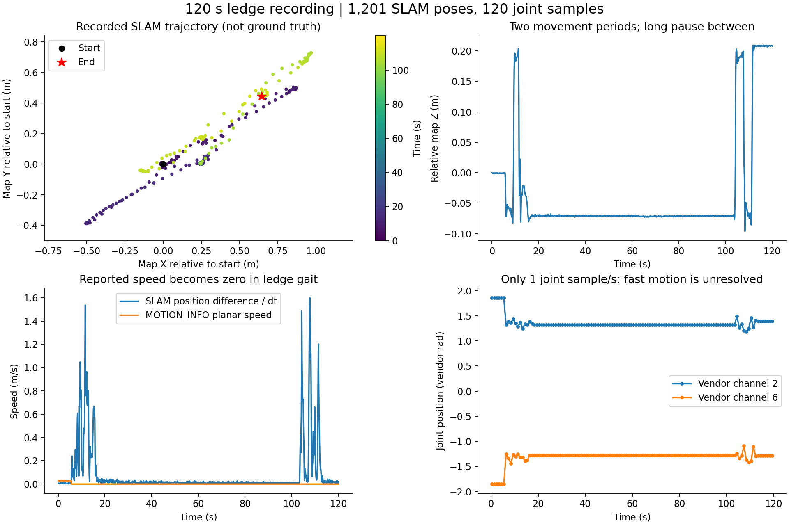
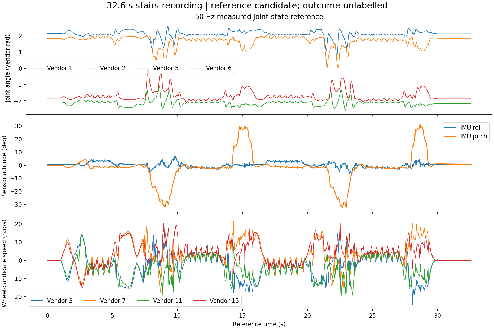
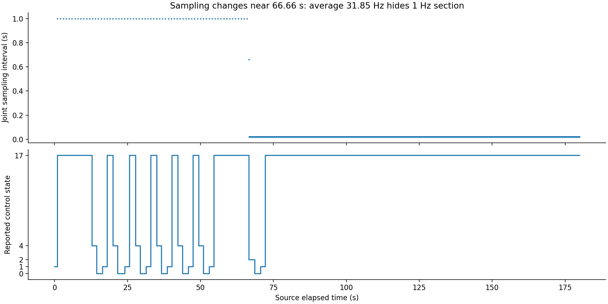

# AGX 历史录制：专家参考轨迹可用性分析

结论：**现有数据可以提取部分关节状态参考，并从一轮数据中提取空间位姿路径；尚不能把任意一轮直接当作已经验证的完整专家全身轨迹。** 对于用参考运动设计奖励的 RL，缺少专家动作并不是硬性阻碍。当前最有价值的是 32.6 秒楼梯录制的 50 Hz 关节参考，以及 120 秒高台录制的 10 Hz SLAM 位姿；两者来自不同录制，不能拼成同一次全身示范。

后续已完成 SDK 关节映射、运动学回放及短时 MuJoCo 物理跟踪；结果见 [关节与姿态验证](simulation_review/VALIDATION.md)。下文是原始采集质量审查，未验证项的进展以该后续报告为准。

## 数据范围与验证结果

- 来源：AGX `10.21.33.102:/home/xwy/s10_gait_data`。2026-09-09 复制到本目录 `raw/`，原始数据均为 2026-09-06 录制。
- 9 轮、31 个文件、10,194,824,515 字节；复制后全部文件大小与远端清单相符。重复 ZIP 未复制。
- 录制时长合计 781.36 秒，约 13.02 分钟；共 219,044 条消息。
- 全部 SQLite `PRAGMA quick_check` 通过；全部消息使用标准 ROS Jazzy 和复制的厂商 `.msg` 类型成功反序列化；各话题计数与 manifest 一致。
- 本次抽取的数值字段没有 NaN/Inf；消息头源时间戳均存在，各流内部没有倒退或重复。这不等于跨设备时钟已校准。
- 最后一轮 `metadata.yaml` 和 `SHA256SUMS.json` 为空，但 SQLite 数据和消息计数正常。分析直接只读打开 SQLite，没有改写原始 bag 或补写元数据。
- 没有任何一轮包含 `/JOINTS_CMD`、`/LOCATION_STATUS`、`/tf`、`/tf_static`。只有高台一轮包含 `/SLAM_ODOM`。全体结果均为 `unlabeled`，主要七轮均无人工事件和地形尺寸标注。
- 完整机器可读结果：`audit.json`；逐流数组：`decoded/*.npz`。点云全部反序列化，但未逐点审查几何质量或执行离线 SLAM。

## 逐轮判断

以下时间为录制 ID 中的时间，不对它另作时区换算。关节频率由消息头时间戳实测。

| 录制时间 / ID 尾号 | 标签与时长 | 关节数据 | 空间位姿 | 判断 |
|---|---|---|---|---|
| 13:32:15 / 7ac9013c8d0f | 部署测试，12.0 s | 200 Hz，几乎不变 | 无 | 空闲状态，排除出运动专家集 |
| 13:36:11 / a088e9a21bad | 部署测试，12.0 s | 200 Hz，有明显运动 | 无 | 数据有运动价值，但备注明确写了非训练示范，场景/结果未确认；本次不默认选入候选 |
| 13:42:13 / 82386e35f7b0 | 基础，4.62 s | 50 Hz，几乎不变 | 无 | 站立/静态参考，不作为行走轨迹 |
| 13:42:45 / 67a76c09d415 | 基础，23.64 s | 50 Hz | 无 | 已提取局部关节/IMU参考候选 |
| 13:43:24 / 93fa2317c970 | 楼梯，32.63 s | 50 Hz | 无 | 最值得先审查的楼梯关节参考，已提取 |
| 14:16:06 / 4ef6a913c02c | 高台，120.01 s | **1 Hz** | **10 Hz SLAM** | 可提取几何路径；快速关节动作欠采样 |
| 14:31:50 / 2620f4f1e142 | 基础，96.44 s | 50 Hz | 无 | 已提取；约 89.24 s 从基础切到标准楼梯步态，应分段使用 |
| 15:16:03 / 3aa186c2ff49 | 连续楼梯，300.01 s | **1 Hz** | 无 | 不适合高频关节参考；可作姿态/步态/雷达分析，空间轨迹还需离线估计 |
| 15:30:20 / 96c782400250 | 趴下/起立，180.00 s | 前约 66.66 s 为 1 Hz，之后 50 Hz；另有连续 10 Hz 备用流 | 无 | 平均 31.85 Hz 会掩盖前段欠采样；已提取高频尾段，非 RL 控制段另设无效掩码 |

15:30:20 的多次趴下/起立大部分发生在低采样率前段，不能因为后段达到 50 Hz 就声称已取得高频起立轨迹。备用 10 Hz 流可用于慢动作分析，但本次没有把它插值成 50 Hz 专家数据。

## 已经提取到什么

### 空间路径：高台录制

`references/ledge_odometry_native.npz` 和同名 CSV 保存 1,201 个原始 SLAM 位姿，约 120 s、10 Hz。源时间间隔最大 101.03 ms，无源时间倒退。

- 坐标在 `map` 框架下；原始位置范围：X 1.472 m、Y 1.119 m、Z 0.306 m。
- 数据主要在约 5–20 s、100–115 s 出现移动，中间有长时间停顿。分段边界来自曲线观察，不是人工确认的障碍进入/成功时刻。
- 原始折线累计长度为 9.554 m，其中包含静止抖动，不能当作精确实走距离。
- `child_frame_id` 为空且没有 TF/定位状态流，因此尚不能确认这些位姿对应机器人基座的哪个点，也不能独立排除定位漂移/重定位影响。
- 切到 `gait=0x1002` 后，`MOTION_INFO` 的平面速度绝大多数为零；同时 SLAM 和关节仍显示运动，转向速度也并非始终为零。因此不能用该轮的平面速度积分替代定位，也不能给它们高权重的“零速度”参考奖励。



这条路径适合先在查看器中核对、裁剪移动区间，再做高层路径/位姿跟踪实验。它不是已经验证的高台成功全身参考；1 Hz 关节数据也无法恢复跨越瞬间的完整运动。

### 关节参考：四份 50 Hz 候选

使用消息内部的源时间戳对齐，关节状态线性插值，IMU 四元数用 SLERP，状态/步态采用前值保持。只取各传感器共同覆盖的时间范围。没有把 1 Hz 数据插值后伪装成高频测量。

| 文件前缀 | 导出时长 | 样本 | 通过时间间隔及 `state=17` 检查的样本 |
|---|---:|---:|---:|
| gait_20260906_134245_67a76c09d415 | 23.54 s | 1,178 | 1,178 |
| gait_20260906_134324_93fa2317c970 | 32.58 s | 1,630 | 1,630 |
| gait_20260906_143150_2620f4f1e142 | 96.38 s | 4,820 | 4,820 |
| gait_20260906_153020_96c782400250 | 113.30 s，高频尾段 | 5,666 | 5,386 |

这些文件位于 `references/`，各有 `_50hz.npz`、`_50hz.csv`、`_50hz.json`。合计 13,014 个样本通过上述检查。`valid_reference=true` 仅代表时间间隔满足阈值且处于 RL 控制状态，**不表示专家动作正确、通过障碍成功或已通过仿真验证**。

楼梯 32.6 秒片段的关节最大源时间间隔约 29.71 ms；IMU 200 Hz。可以看到两组明显的身体倾斜与关节变化，说明它包含实际动态运动，不只是静止采集。运动反馈全段为 `state=17, gait=0x1003`；没有定位，因此不能从当前导出直接得到楼梯上的 XYZ 路线。



最后一轮的采样变化与控制状态如下：



## 怎样用于 RL

当前最直接的用途是**基于测量状态的运动模仿奖励**：仿真策略自行输出动作，以参考关节位置/速度、映射后的身体姿态、任务成功等奖励学习。它不要求示范包含原厂的每一步动作。这与直接用 `(观测, 专家动作)` 做行为克隆不同；相关方法见 [DeepMimic 原论文](https://arxiv.org/abs/1804.02717) 和 [四足机器人模仿动物运动研究](https://arxiv.org/abs/2004.00784)。

建议先拿 32.6 秒楼梯候选中的一个短运动段做仿真回放与跟踪实验，而不是直接训练整个 5 分钟低频文件。

参考奖励可从以下可用项开始，具体权重属于后续训练配置：

```text
奖励 = 关节姿态接近参考
     + 关节/轮子速度接近参考
     + 经坐标映射后的身体姿态接近参考
     + 任务前进/越障成功
     - 跌倒、碰撞、动作突变
```

现阶段不能直接加入没有可靠观测的全局位置、触地时刻、接触力或足端世界坐标奖励。高台路径可以单独探索位置跟踪，但不能将其和另一轮楼梯关节参考拼成一条轨迹。

投入训练前仍需完成四项与结果直接相关的工作：

1. **关节映射**：bag 名称为数字 `0..15`。指南第 24 页给出监控接口的解剖顺序，但本次没有验证它与仿真索引、正方向、零位完全一致。导出保留厂商数值顺序。3/7/11/15 对应轮子的判断依据该顺序及累计角度特征；确认后通常跟踪轮速，不追踪几千弧度的绝对累计轮角。
2. **坐标与时间**：IMU 四元数仍在传感器约定中，没有转换为基座或地图姿态。各流源时间单调，但源到接收的中位差约为关节 2–3 ms、IMU 10–11 ms、高台 SLAM 73 ms；这些混合了传输/处理延迟和可能的时钟差，不能据此直接认定时钟偏差或自动平移时间。
3. **片段和场景**：全体结果未标注；楼梯高度/台阶深度等为空。需要在原地形或合理匹配的仿真地形中验证参考可达性；成功、失败、接管不能混成正样本。
4. **闭环测试**：先看关节/身体回放是否合理，再训练短片段跟踪，观察是否因动作欠采样、坐标错误或地形不匹配而失稳。本次未修改训练环境或启动 RL。

若目标严格要求世界坐标下的完整楼梯路线，还需要给缺少里程计的录制运行离线定位/建图。现有点云样例只有 `x/y/z/intensity`、每点 16 字节，未见逐点时间/线号；需要选择兼容格式的定位流程和已有外参，不能把现有数据直接视为通用 LIO 输入已齐全。

## 文件结构和复现

```text
raw/                       原始录制副本
remote_inventory.json      远端原始清单及 manifest
copy_result.json           复制大小核对结果
catalog.json               实际 SQLite 话题目录
audit.json                 完整质量统计
decoded/<session>.npz      各原生数据流数值与源/接收时间
references/                参考候选 CSV、NPZ、解释 JSON
figures/                   三张分析图
analyze.py                 只读审查、解码和提取
build_references.py        候选导出、图表和插值自检
```

`decoded` 中各话题有 `<topic>_source_ns`、`<topic>_receive_ns`、`<topic>_values`。`values` 的列定义：

| 话题 | 列顺序 |
|---|---|
| JOINTS_DATA / JOINTS_DATA_10HZ | 16 个 position，16 个 velocity，16 个 torque |
| IMU | 四元数 x/y/z/w，角速度 x/y/z，加速度 x/y/z |
| MOTION_INFO | vel_x、vel_y、vel_yaw、height、state、gait |
| SLAM_ODOM | position x/y/z，四元数 x/y/z/w，twist.linear x/y/z，twist.angular x/y/z |
| STEER / HANDLE_STEER | x、y、z、roll、pitch、yaw |
| GAIT | gait |
| 点云 | 点数、data 字节数；完整 XYZ 仍在原 bag |

`references` 的 NPZ 保留精确 int64 纳秒时间、状态和有效性掩码；CSV 便于人工检查，JSON 记录未映射字段的含义与使用限制。50 Hz NPZ 的 `reported_motion_vx_vy_wz_height` 是机器人上报值，不是世界位移，也不是遥控器指令。

在仓库根目录复现：

```powershell
python artifacts/s10-expert-analysis/analyze.py
python -s artifacts/s10-expert-analysis/build_references.py
```

`rosbags` 安装在本地 `tmp/s10-analysis-deps`，解码脚本加载该目录；图表脚本使用 `python -s` 复用已有兼容的 NumPy/SciPy/Matplotlib。插值检查覆盖边界外样本、长缺口和四元数插值，导出同时检查字段长度、有限值与单位四元数。所有分析在本地进行。


后续试验：[假设人行楼梯的运动匹配](stairs_match/REPORT.md)，包含 72 组尺寸与位置候选、两次下楼复测视频及上楼失败记录。
