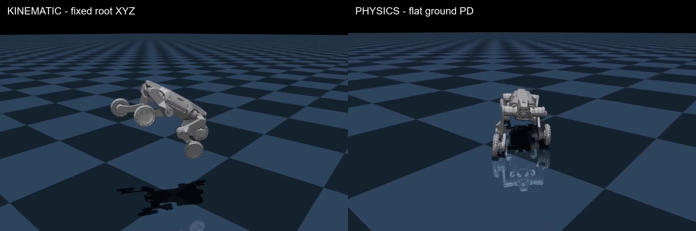
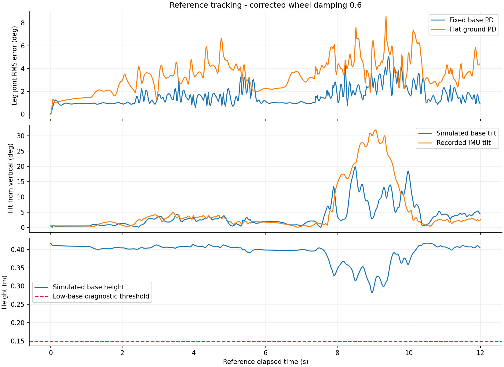

# 楼梯录制的关节与姿态验证

**结论：这段数据已具备继续做参考运动跟踪实验的价值。SDK 关节映射通过数值和回放检查，12 秒平地物理测试可运行；尚未验证楼梯越障或复现现场机身路径。**

数据为 `gait_20260906_134324_93fa2317c970` 的 32.58 秒、1,630 帧参考。使用现成本机 MuJoCo 3.11.0 和比赛 SDK 的 S10 模型，无 ROS/机器人连接。本轮未启动 Docker 内的 RL 训练。

## 查看结果

- [12 秒并排视频](comparison_12s.mp4)：左侧按实录关节与 IMU 姿态回放，机身 XYZ 固定为示意；右侧为受重力、接触和力矩限制的平地 PD 跟踪，机身自由运动。
- [32.6 秒完整运动学回放](kinematic_stairs_32s.mp4)。悬空显示是有意固定机身位置，不能解释为真实机器人悬空或重建出的世界轨迹。
- [12 秒平地物理跟踪](flat_motion_tracking.mp4)、[3 秒站姿保持](flat_stance_hold.mp4)、[12 秒固定机身跟踪](fixed_base_tracking.mp4)。
- [完整数值结果](validation.json)、[跟踪曲线](tracking_results.png)。



## 映射与姿态检查

从现有 `mujoco_simulation_ros2.py` 读取 `JOINT_DIR` 和 `POS_OFFSET_RAD` 对应参数，采用 SDK 已有的转换：

```text
MuJoCo 关节角 = 实录关节角 × JOINT_DIR + POS_OFFSET_RAD
MuJoCo 关节速度 = 实录关节速度 × JOINT_DIR
```

对应四腿、每腿 hipx/hipy/knee/wheel 的 16 个执行器。对腿部关节做了逆转换一致性检查；四个轮子的累计角只减去起始相位用于显示，轮速保留。

- 全部 1,630 帧没有受限关节超限。
- 在当前碰撞模型和排除规则下，没有深于 2 mm 的接触穿插。悬空回放不能验证足端与现场楼梯的接触。
- IMU 姿态变化推算的角速度，与实录陀螺仪三个轴的相关系数分别为 **0.949、0.987、0.998**；差向量范数中位数 0.057 rad/s，P95 0.247 rad/s。
- 这支持数据自身的姿态/角速度一致性，但不能独立标定实机 IMU 到机身的安装外参。显示时仅去掉初始航向，并未校正外参。

## 物理跟踪测试

仿真步长 1 ms；参考为 50 Hz 线性插值。复用 SDK RL runner 的腿部 `kp=80, kd=2`，轮子 `kp=0, kd=0.6`。测得的关节状态作为 PD 目标；没有原厂动作或实录力矩前馈。执行器保留模型限制：腿部 ±50 Nm、轮子 ±14 Nm。固定机身试验悬空；其余两项使用模型原有平地和摩擦参数。

| 检查 | 时长 | 腿部角度 RMSE | 轮速 RMSE | 结果 |
|---|---:|---:|---:|---|
| 固定机身关节跟踪 | 12 s | **1.75°** | 0.245 rad/s | 无力矩限幅，腿部最大瞬时误差约 13.32° |
| 平地保持首帧站姿 | 3 s | **1.49°** | 0.140 rad/s | 最低机身高度 0.406 m，最大倾斜 0.81° |
| 平地播放运动参考 | 12 s | **3.65°** | 1.796 rad/s | 无力矩限幅、无非轮碰撞体接地，最大瞬时腿部误差约 20.94° |

三项均没有数值发散。平地运动试验最低机身高度 0.283 m、最大倾斜 19.94°，没有触发本次诊断判据（倾斜大于 60°或机身低于 0.15 m）。三秒站姿和十二秒运动只证明本次初始条件下的短时结果，不是长期稳定性或越障成功率。

早期试运行发现脚本的整数数组把 `kd=0.6` 截为零，已修正为浮点数组并加检查。这里的 JSON、图表和视频均为修正后重跑结果，之前报告的约 8.44 秒非轮接地不适用于最终结果。



## 对后续工作的意义

这次检查支持将实录腿部角度、速度和轮速用于参考跟踪实验。平地上约 8–10 秒期间，仿真身体倾斜和实录 IMU 明显不同：**关节接近参考，不保证机身姿态、接触和越障效果相同。** 场景不匹配、控制目标并非原厂期望动作以及尚未核实的外参都可能产生差异。

下一步可将映射后的短片段接入现有 Isaac Lab 环境，先检查机器人资产和动作空间对应关系，再做小规模参考跟踪训练。若目标是复现楼梯动作，则需要从同轮点云估计楼梯几何/相对位置，或补充实测尺寸，随后核对接触和机身轨迹。当前不应将任意假定楼梯尺寸当成录制现场尺寸。

## 复现

在仓库根目录运行：

```powershell
.venv-win/Scripts/python.exe artifacts/s10-expert-analysis/validate_motion.py
```

可通过 `--kp`、`--kd`、`--wheel-kd` 调整本地实验增益；报告会保存实际参数。自检覆盖 SDK 腿部映射往返、四元数运算、轮子小数增益保留，以及仿真全过程有限值。生成的 XML 只在本目录，比赛模型原文件未修改。

`mapped_kinematic.npz` 保存时间、映射后的关节、示意 qpos 和轮中心位置；**其机身 XYZ 是显示用常量，不能作为训练的真实位置标签**。三个物理测试 NPZ 包含跟踪误差、目标/实际关节以及日志列 `[time_s, base_x, base_y, base_z, tilt_deg, nonwheel_floor_contacts]`。
