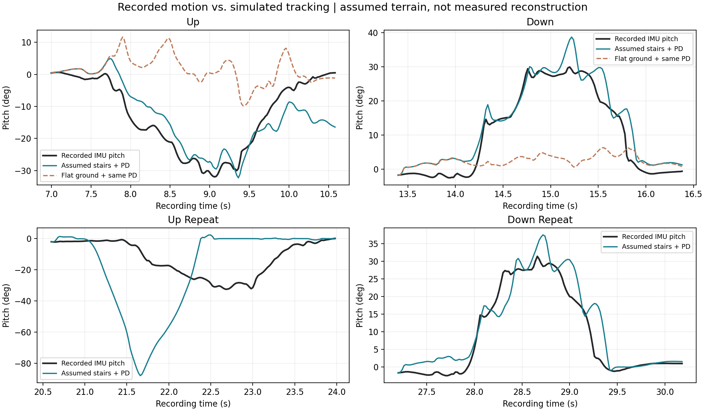

# 假设人行楼梯的运动匹配试验

本轮得到一个可重复的**下楼参考跟踪候选**：阶高 15 cm、踏面 28 cm、3 级台阶，两次下楼片段均到达下方平地。上楼尚未通过。这里匹配的是假设地形中的短时运动，**没有确定现场楼梯尺寸或恢复实机世界路径**。

## 视频与结果

- [两次下楼物理跟踪视频](two_descents.mp4)，画面标明原录制时间。
- [第一段上楼尝试](up_best.mp4)、[延长至失稳](up_extended.mp4)、[第二段上楼复测](up_repeat.mp4)。
- [完整候选结果](search.json)、[选定场景与复测结果](selected.json)。



| 片段（原录制秒数） | 假设楼梯：阶高/踏面/级数 | 俯仰 RMSE | 腿关节 RMSE | 本轮结果 |
|---|---|---:|---:|---|
| 第一次下楼 13.4–16.4 | 15 cm / 28 cm / 3 | 4.13° | 3.47° | 全轮通过最后一级、到达下方平地 |
| 第二次下楼 27.2–30.2 | 同上，尺寸与起始间距不再搜索 | 4.80° | 3.41° | 全轮通过最后一级、到达下方平地 |
| 第一次上楼 7.0–10.6 | 17 cm / 30 cm / 2 | 6.49° | 5.30° | 机身抬升约 24.5 cm，后轮未全部通过 |
| 第二次上楼 20.6–24.0 | 同上，尺寸与起始间距不再搜索 | 31.00° | 3.90° | 约 0.90 s 后倾斜超过 60° |
| 第一次上楼延长至 11.2 | 同上 | 7.83° | 5.30° | 约 4.08 s 后倾斜超过 60°，不能把短片段的抬升算作成功 |

两次下楼机身净下降约 46.6 cm 和 46.1 cm，与假设的 45 cm 总高同量级；差值包括起止关节姿态和支撑压缩。均未出现非轮碰撞体接地、力矩限幅或倾斜超过 60°。这不是扰动测试或长期成功率统计。

相同初始化和控制器的第一次下楼平地对照，俯仰 RMSE 为 **14.37°**；加入上述楼梯后为 **4.13°**，约降低 71%。第一次上楼平地对照为 18.25°，楼梯短片段降至 6.49°，但仍未完成上楼，且延长后失稳。

## 尺寸、片段和控制方式

尺寸参考常见人行楼梯的量级：[英国政府 Approved Document K，表 1.1](https://assets.publishing.service.gov.uk/government/uploads/system/uploads/attachment_data/file/996860/Approved_Document_K.pdf)列出一般通行楼梯阶高 150–170 mm、踏面 250–400 mm，并给出学校楼梯优选 150/280 mm。本轮仅借用尺寸范围作为仿真假设，不作建筑规范判定。原始楼梯记录的 `parameters` 为空。

搜索阶高 `{0.15, 0.17}` m × 踏面 `{0.28, 0.30}` m × 级数 `{2, 3, 4}` × 起始前轮中心到第一阶边缘距离 `{0.15, 0.35, 0.55}` m，上下楼各 36 组，共 **72 组**。宽度统一 1.2 m，底部为平地，顶部为长平台，刚性台阶不加突出踏鼻。所选上下楼候选起始间距均为 0.35 m。

数据来自 `gait_20260906_134324_93fa2317c970`。按 SDK 坐标的 +X 向前解释，IMU 负俯仰为抬头，正俯仰为低头；同时结合正向速度和两段之间的转向，将这些片段暂定为上下楼。IMU 到机身的物理外参仍沿用前一轮试验中的未标定假设，分类不是现场事件标签。

复用本机 MuJoCo、比赛 SDK 机器人模型和既有转换脚本。腿部 PD 为 `kp=80, kd=2`，轮子速度 PD 为 `kd=0.6`；腿和轮力矩上限分别为 50 Nm、14 Nm，步长 1 ms。原始实测关节位置/速度作为目标，机身由重力与接触自由运动，没有强行写入 IMU 姿态或世界路径，没有使用原厂动作/力矩前馈。各片段去除自身起始航向，初始速度取该帧报告速度，初始角速度取 IMU，初始高度按轮中心和 81 mm 半径放到平台上。

候选评分为 `俯仰RMSE + 0.25×腿关节RMSE + 30×未到达终点 + 60×曾倾斜超过60° + 5×非轮接地帧比例`，角度单位为度。到达终点要求四轮越过最后阶边缘并留出轮半径、轮中心在宽度内、未触发倾斜阈值，以及机身末高度接近预期平台高度（±15 cm）。每项连续运行全片段，不因早期失稳截断误差统计。

36 个下楼候选有 25 个满足此终点判据，36 个上楼候选无一满足。因此**不能唯一反推出 15/28 cm 或 3 级就是实物规格**；这只是当前有限搜索中的较好匹配。上下楼目前分别选出了不同尺寸，尚未找到能同时解释双向运动的统一场景。第二片段复用同一相对起始间距，但片段起点是人工选取，也不能等同于有定位真值的严格复现。

## 对 RL 参考的意义

两段下楼可作为下一步参考状态跟踪的小规模候选，目标可包含腿部角度/速度、轮速和机身姿态。仿真生成的 XYZ 路径必须标记为**假设地形下的合成路径**，不能作为恢复出的实机路径真值。上楼数据暂不标为成功专家样本；其失稳可能同时受接触时机、场景几何、状态充当控制目标以及模型差异影响，本轮没有区分这些原因。

本轮完成地形试配与物理跟踪，没有启动 RL 训练。后续若要覆盖上楼，应先补充接触或点云约束以对齐起始位置和台阶，而不是继续仅凭俯仰曲线确认尺寸。

## 复现与文件

在仓库根目录运行：

```powershell
.venv-win/Scripts/python.exe artifacts/s10-expert-analysis/match_stairs.py
```

脚本复用 `validate_motion.py` 的映射、四元数和视频函数，读取之前生成的 `simulation_review/free_base.xml`。自检覆盖上下楼的阶高变化、俯仰符号，以及每次仿真初始无超过 3 mm 的穿插和全过程状态有限值。原始录制与 SDK 模型未修改。

每个视频对应 NPZ：`qpos` 保存该场景中的模拟位置与关节，`joint_error` 保存关节误差，`wheel_velocity_error` 保存轮速误差。`log` 列为 `[原录制时间, x, y, z, 模拟roll, 模拟pitch, 实录roll, 实录pitch, 非轮接地, 台阶接触]`；角度单位为度，位置单位为米。XML 保存场景几何，完整初始化与控制过程在脚本中。
