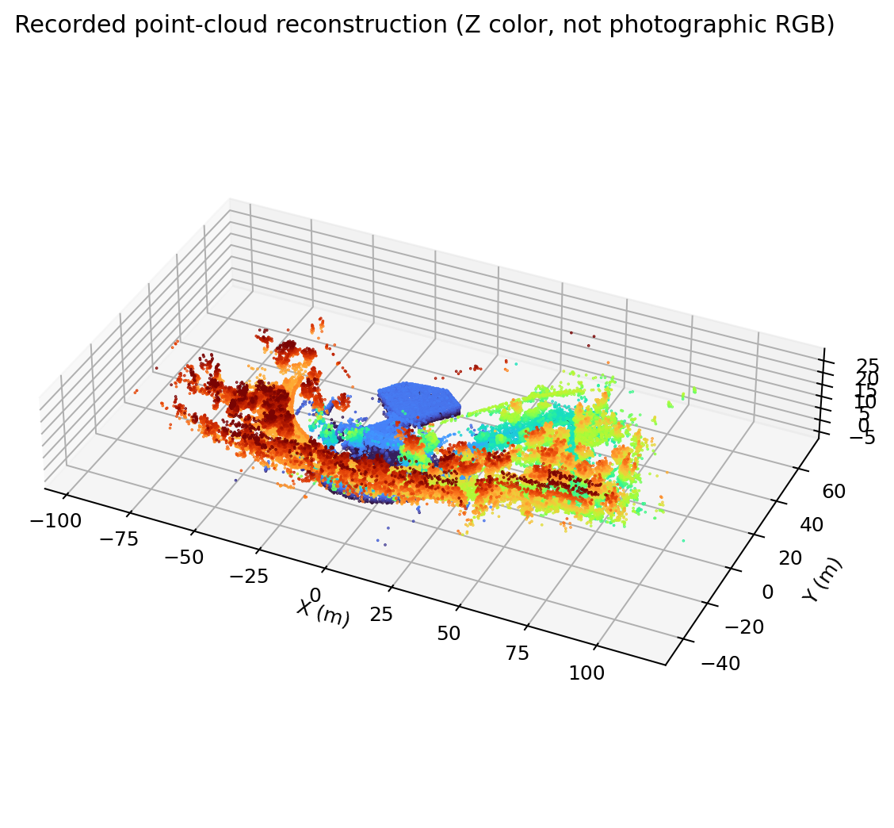

# S10 历史数据与专家参考研究交接

更新：2026-09-09。这份文档面向拿到 Git 仓库的队友，汇总历史录制、仿真、其他队伍代码和地图调查结果。完整研究包单独保存在采集工作站的 `artifacts/`，不随 Git 提交；下文所有 `artifacts/...` 路径均相对仓库根目录，领取研究包后才存在。

## 先看结论

**有可用的关节参考、局部空间路径和整轮点云地图，但尚没有经过验证的完整专家全身轨迹，也没有完成基于这些数据的 RL 训练。**

| 材料 | 已经能做什么 | 不能据此认定什么 |
|---|---|---|
| 32.6 秒楼梯记录 | 提取 50 Hz 关节状态、200 Hz IMU；做运动学回放和短时物理跟踪 | 缺定位，不能直接恢复现场 XYZ 路径；没有教师关节命令 |
| 120 秒高台记录 | 提取 1,201 个约 10 Hz 的 SLAM 位姿 | 关节仅 1 Hz，无法恢复跨越瞬间的高频全身运动 |
| 14:01 建图会话 | 查看完整点云、保存轨迹和二维栅格 | 点云不是仿真碰撞网格，尚未量出可信的高台/楼梯尺寸 |
| 楼梯模型副本 | ONNX 能做离线推理，可研究观测及残差适配 | 历史 shadow 日志没有实际推理，不能当作实机成功记录 |
| 106 SLAM 安装文件 | 确认厂商版本及 LIO＋回环＋图优化结构 | 不能确定现行二进制对应哪个完整开源版本 |

楼梯关节记录与高台空间路径来自不同录制，不能拼成同一次示范。关节**反馈**也不是原厂控制器发出的关节**命令**。

## 数据来自哪里

9 轮闭合录制来自 AGX `10.21.33.102:/home/xwy/s10_gait_data`，采集日期为 2026-09-06，复制日期为 2026-09-09。共 31 个文件、10,194,824,515 字节、781.36 秒、219,044 条消息；复制大小核对和 SQLite 完整性检查通过，消息成功解码，抽取数值没有 NaN/Inf。流内源时间戳正常不代表跨板时钟已经标定。

关键录制 ID：

| 完整 ID | 场景与质量 |
|---|---|
| `gait_20260906_134324_93fa2317c970` | 楼梯，导出 32.58 秒、1,630 帧 50 Hz 参考；无 SLAM |
| `gait_20260906_141606_4ef6a913c02c` | 高台，约 120 秒，SLAM 10 Hz、关节 1 Hz |
| `gait_20260906_151603_3aa186c2ff49` | 连续楼梯约 300 秒，关节 1 Hz，不适合高频动作模仿 |

这 9 轮均没有 `/JOINTS_CMD`、`/LOCATION_STATUS`、`/tf`、`/tf_static`，只有高台一轮有 `/SLAM_ODOM`。结果均未标注；主要运动录制没有人工事件或地形尺寸。采集工具提供字段不代表历史记录已经填写。

另已复制 AGX `/home/xwy` 下的 `s10_maps/`、`s10_readonly_validation_03fbb29/`、`s10_stair2_manual/`：5,546 个普通文件，共 334,124,497 字节。Linux 原始 tar 保留符号链接；Windows 副本中自带的 ARM64 `.venv` 不能用作本机环境。`s10_quick_mapping/` 的关键源码在单独的 inventory 快照内。

### 9 月 9 日新增的独立采集数据

另有用户当天遥控采集的 **17 段，15,148,185,579 字节、1251.90 秒**，保存在采集工作站 `D:/S10Data/050/2026-09-09/`，不在上面的 `artifacts/` 历史研究包中，也不随 Git 分发。队友需要单独领取该目录及其中的 `transfer-inventory.json`、`verified.json`；路径是该工作站的实际位置，并非其他电脑 clone 后会自动生成的目录。

已完成全部文件远端/本地 SHA-256 校验及 SQLite `quick_check`，之后按用户要求只删除 AGX `/home/ysc/s10_capture_session/data` 中对应的当天 17 段；原 xwy 历史数据未改动。各段均有 IMU、关节反馈、运动状态和前后雷达，16 段有两路轴输入，9 段有 GAIT；没有 JOINTS_CMD、里程计、定位状态、TF、深度相机或 RGB 数据。

本节只确认转存完整性和话题覆盖，尚未完成这批数据的时间同步、丢帧、地形标签及训练适用性分析。下文的历史仿真结论不能直接套用到这 17 段。

## 人工事件和地形字段怎么用

地形尺寸用于构建候选仿真场景，但仍需台阶数、方向、相对位置等信息；只有高度/深度不能确定完整现场地形。当前楼梯记录的 `parameters` 为空。

进入/离开障碍、打滑、失败、接管等事件帮助切分片段和筛选训练样本。标注时间是服务器收到手机请求的时刻，包含操作和网络延迟，不能作为精确触地真值。运动状态/步态来自 `/MOTION_INFO`，可以辅助分段，但不能替代人工确认的成功结果。

采集字段与格式见 [LOCAL_COPY.md](../tools/s10_gait_capture/LOCAL_COPY.md)，当前 50 号机器人现场入口见 [DEPLOYMENT_050.md](../tools/s10_gait_capture/DEPLOYMENT_050.md)。不要混用旧 xwy 采集站和新的独立采集站目录。

## 已完成的仿真验证

复用比赛 SDK 的 S10 模型和关节转换，使用本机 MuJoCo 3.11。映射后全部 1,630 帧没有受限关节超限；姿态变化与陀螺仪的轴相关系数为 0.949、0.987、0.998，支持数据内部一致性，但不是 IMU 安装外参标定。

控制方式是把实测关节状态当作 PD 目标：腿部 `kp=80, kd=2`，轮速 `kd=0.6`，腿/轮力矩限幅 50/14 Nm，步长 1 ms。没有使用原厂教师动作或力矩前馈。

| 测试 | 结果 | 解释 |
|---|---|---|
| 12 秒固定机身跟踪 | 腿部角度 RMSE 1.75° | 检查关节映射与跟踪能力 |
| 12 秒平地自由机身跟踪 | 腿部角度 RMSE 3.65°，未跌倒 | 不是楼梯越障验收 |
| 假设楼梯上的第一次下楼 13.4–16.4 秒 | 俯仰 RMSE 4.13°、腿部 RMSE 3.47°，到达下方平地 | 15 cm 阶高、28 cm 踏面、3 级 |
| 同场景第二次下楼 27.2–30.2 秒 | 俯仰 RMSE 4.80°、腿部 RMSE 3.41°，到达下方平地 | 尺寸与起始间距复用，没有重搜 |
| 上楼候选 | 未通过；短片段抬升后，延长或复测出现失稳 | 不能标为成功专家样本 |

上下楼共搜索 72 组候选。下楼 36 组中 25 组满足终点判据，上楼 36 组均未通过，因此匹配结果**不能唯一反推真实楼梯尺寸**。仿真生成的 XYZ 必须标为假设地形下的合成路径；运动学回放固定的机身 XYZ 只是显示坐标。

## 其他队伍代码有什么价值

`s10_stair2_manual` 的 `base.onnx` 与当前 SDK `policy.onnx` 逐字节相同；基础观测 57 维、动作 16 维。楼梯 primary/recovery 模型输入 723 维（288 维点云特征＋8×54 历史＋3 维命令），包含 GRU，输出动作残差及辅助预测。三模型通过 ONNX 结构检查和合成输入推理。

`monitor.py` 只加载 base 和 primary，输出候选日志，未发送关节命令；两次历史 shadow 记录推理次数均为 0。候选动作历史不等于原厂实际施加的动作。代码每周期要求机身倾斜小于约 31.79°，而楼梯参考有 8 帧超过此条件；完整门控还要求 SDK state=100，历史录制则为 state=17。

这套材料适合研究观测构造、残差尺度和门控，尚不足以复验其完整训练过程或实机越障能力。

## 地图与轨迹

地图会话：`venue_20260906_140116_6a094074`。完整 `full_cloud.pcd` 有 **1,832,970 点**，已导出全点数 PLY 和离线交互 HTML。以下预览随文档提交，GitHub 可直接查看。



颜色表示地图 Z 坐标，不是真实颜色；原始 intensity 全为零。网页全图预览抽样为 16 万点，`full_map.ply` 保留全部点。高台时段附近裁剪有 71,815 点，只是根据保存轨迹选取的位置，尚未独立确认具体障碍几何。PLY 不含闭合表面或碰撞面。

`lio_odom.pose` 与 `poses.txt` 各有 558 个同时间戳样本；单一刚体变换对齐后位置 RMSE 仍约 **3.45 m**。高台 bag 中 10 个重合时间样本与 `lio_odom.pose` 的位置在文本精度内一致。已经确认程序有回环/全局优化，但尚未确认两份轨迹差异的完整原因，不能把保存轨迹直接当作真值。

106 安装版本、调用过程和算法证据见 [SLAM 调查](S10_SLAM_106_RESEARCH_ZH.md)。目前判断为厂商 LIO＋回环＋GTSAM 位姿图优化，前端有 FAST-LIO／Faster-LIO 来源线索，具体派生版本待确认。

## 队友如何复查

只读文档不需要机器人或 Docker。重跑历史分析需要先从采集工作站领取以下研究包，按相对路径放到仓库根目录；目前尚未设置团队共享下载链接。

| 相对目录 | 内容与入口 |
|---|---|
| `artifacts/s10-expert-analysis/` | 原始 bag、解码数组、参考轨迹、`REPORT.md`、`simulation_review/VALIDATION.md`、`stairs_match/REPORT.md` 及分析脚本 |
| `artifacts/xwy-study/` | 三个下载目录、`research/FINDINGS.md`、`map-view/`、`research/slam-106-evidence/` |
| `artifacts/xwy-inventory/source_snapshot/` | `s10_quick_mapping/` 等关键源码快照 |

在有研究包的机器上，从仓库根目录按顺序执行：

```powershell
# Python 需能导入 rosbags；可放在脚本加载的 tmp/s10-analysis-deps 中。
python artifacts/s10-expert-analysis/analyze.py
# 需要兼容的 NumPy、SciPy、Matplotlib。
python -s artifacts/s10-expert-analysis/build_references.py
# 需要 README 中的本机 MuJoCo 环境和已获取的比赛 SDK。
.venv-win/Scripts/python.exe artifacts/s10-expert-analysis/validate_motion.py
.venv-win/Scripts/python.exe artifacts/s10-expert-analysis/match_stairs.py
# 需要 NumPy、Matplotlib、Pillow、Plotly，以及下载的地图目录。
python -s artifacts/xwy-study/research/rebuild_map.py
```

这些是原工作站已执行的命令；`python -s` 是为避开该机用户目录中的 NumPy 版本冲突，队友应使用自己依赖兼容的 Python 环境。只查看地图可直接打开研究包中的 `artifacts/xwy-study/map-view/full-map.html`，不依赖临时 localhost 服务。

本机另有 `rl-training:isaaclab-2.3.2` Docker 镜像，曾用于离线 ONNX 推理检查；镜像不在 Git 中，当前仿真报告由原生 MuJoCo 生成，尚未完成 Isaac Lab 训练资产接入。

## 提交内容和下一步

本次 Git 文档包含研究结论、数据目录说明、可复查入口和地图预览。`.gitignore` 排除 `artifacts/`、`tmp/` 和浏览器临时目录，避免把约 10 GB 原始录制、下载副本、本地认证文件和生成物一起加入提交；已有的其他代码/模型改动仍需按实际提交范围审阅。

研究包共享只需上述数据、代码和结果，网页口令、SSH 私钥、认证配置、演示访问令牌不属于研究材料。更细的下一步及完成条件已写入 [TODO.md](TODO.md)：先确认坐标/接触与成功片段，再接入短片段参考跟踪训练。
