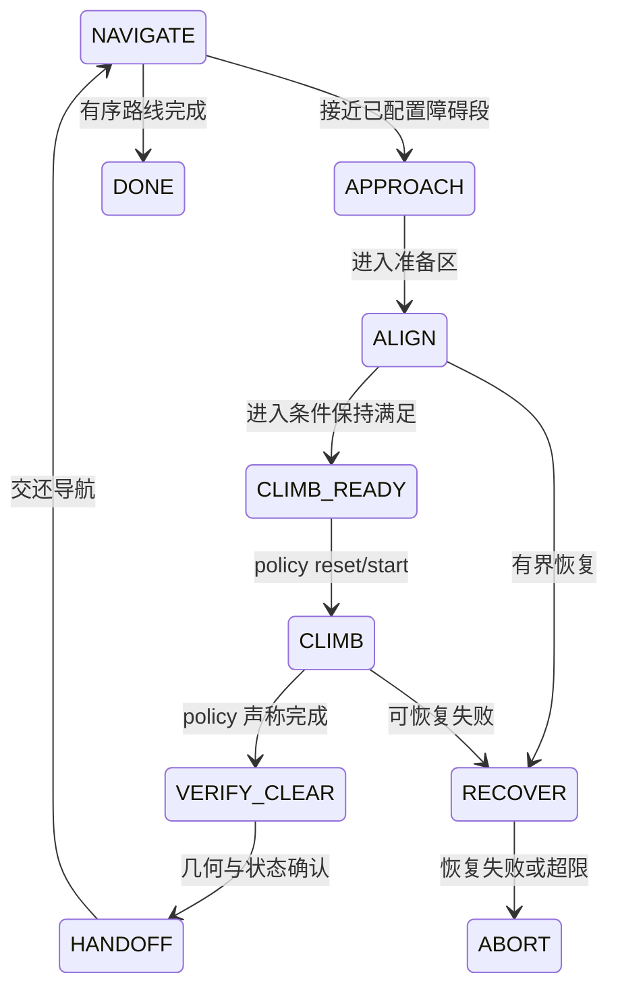
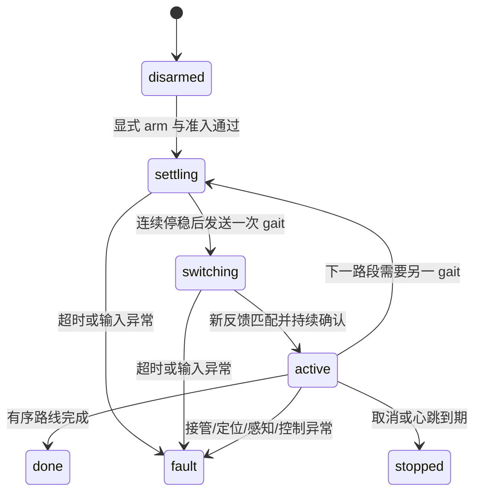

# S10-048 导航、建图、点云、IMU 与 Router 设计参考

整理日期：**2026-09-18（北京时间）**。对象：GOAI 项目、S10-048、v3 地图、现有 follower/router 与机身原厂运控接入。

这是一份面向后续导航策略与 router 设计的工程基线，汇总现有实现、数据、接口和证据。本次工作读取本地源代码、数据审计及历史实机记录，**没有重新连接机器人、改变服务、切图或执行运动测试**。下文“最近实机记录”指 2026-09-17 的记录，不表示机器人此刻仍保持相同状态。

## 阅读顺序与结论

设计导航先看第 1、3、7、8 节；设计 router 看第 9–12 节；准备新 SLAM 看第 4–7 节；查文件看第 16 节及配套文件索引。所有距离默认米，角度在参数表中明确区分度与弧度。

本文是**现状基线**。基于它提出的规划重构方案（以走过的轨迹作为全局路线、局部只做走廊内搜索）另见 [导航规划重构](S10_NAVIGATION_PLANNING_REDESIGN_ZH.md)，其中第 15 节的三层职责在那里被具体化为可落地的数据结构与迁移步骤。

目前可复用的主链是：**厂商雷达/IMU → 厂商 SLAM/定位 → 我们的感知适配 → 原有完整 follower → NativeGaitRouter → `/NAV_CMD`、`/GAIT` → 机身原厂 policy**。原厂 policy 不需要先导出或解密，才可通过开放接口调用；但“接口存在”与“真实调用和运动响应已经验收”是两回事。

| 能力 | 当前证据支持的结论 | 尚不能据此声称 |
|---|---|---|
| v3 全场点云 | 已保存、下载、审计，3,346,032 点；有完整关键帧及优化轨迹 | 全场任意位置均达到某一绝对精度 |
| 厂商融合定位 | 048 有运行中的定位链，能输出 ODOM、状态和点云 | ODOM 新鲜就一定在 v3 正确位置 |
| 原始雷达/IMU 数据 | 9 月 17 日有 177.824 秒 MCAP，连续消息审计通过 | 可用它重做 9 月 14 日整个 v3 建图，或外参已标定 |
| 我们的 follower/router | 原有模块与原生接入层均有离线测试；隔离 ROS 消息链通过 | Start→B 实机已经跑通 |
| 官方普通/楼梯/高台 | 本机历史日志确认基础模式存在；导航平地有使用记录；导航楼梯有接口依据 | 高台基础模式一定接受导航速度，或等同某个 ONNX |
| 原生控制源交接 | 9 月 17 日晚停用两个竞争源后，新发现 `/NAV_CMD` 发布者为 0 | 以后开机仍必然为 0，或物理停车能力已验证 |
| App 自动导航页 | 已接后端、只读检查、提交/取消、心跳、报告；默认门禁阻止未验收运动 | 点击页面或搬到 Start 就能直接跑路线 |
| MuJoCo 交付 | v3 全点云＋Start/B/B 后短平台局部精细场景；加载、碰撞工程检查有证据 | 全场 mesh 已完成，或原厂机身策略通过了全程 |

**首要缺口**是现场全局定位、位姿参考点/外参、真实感知投影、原厂模式及速度/停车响应、楼梯切换位置。`field.pending.json` 保留这些未知；不能为了消除页面提示将它们直接改为通过。

## 1. 路径、版本与证据口径

### 1.1 本地路径根

下文路径使用以下明确别名。`APP/…` 等是文档记法，不是已设置的环境变量。配套 [详细文件索引](S10_NAVIGATION_SOURCE_INDEX_ZH.md) 列出绝对路径、用途及文件是否存在；[源文件清单](S10_NAVIGATION_SOURCE_MANIFEST.json) 保存整理时的大小与 SHA-256。

| 别名 | 本机绝对路径 | 用途 |
|---|---|---|
| `ROOT` | `/Users/xxxwbwxxx/Documents/ChatGPT/GOAI` | 全部工作资料 |
| `APP` | `/Users/xxxwbwxxx/Documents/ChatGPT/GOAI/s10-field-assistant` | 当前已汇总的开发仓库，优先从这里读代码 |
| `REAL` | `/Users/xxxwbwxxx/Documents/ChatGPT/GOAI/s10-real-readiness` | 原生接入原工作目录、历史实机证据 |
| `V3` | `/Users/xxxwbwxxx/Documents/ChatGPT/GOAI/map-reviews/0914_fr_v3-20260914-142008` | v3 原始地图、审计、建模与实验 |
| `BAG` | `/Users/xxxwbwxxx/Documents/ChatGPT/GOAI/recordings/slam_test_20260917_170443` | 9 月 17 日原始录制，含完整 MCAP |
| `PACK` | `APP/deliverables/S10_v3_Map_MuJoCo_20260916` | 便携点云与 MuJoCo 交付 |

截至整理时，APP 的本地 HEAD 为 `e61bb1c`，分支 `codex/field-assistant`；最近一次发布整理说明位于 `APP/docs/GITHUB_FILE_INDEX_ZH.md`。本文件是之后新增的本地文档，不据此宣称已推送 GitHub。

9 月 18 日对代码副本的比对：`native_transfer` 16 文件相同，`prepare_routes.py` 不同（APP 改为使用仓库内已汇总的重建输入）；`real_transfer` 30 文件相同，README 不同；`src/s10_auto_nav` 42 文件相同。后续优先修改 APP 的实现，再明确部署与同步，避免两套工作目录漂移。

### 1.2 如何解释历史文档

1. `S10_SLAM_106_RESEARCH_ZH.md` 中有 **50 号机历史调查**，不能将其所有环境/地图/参数当作 048 当前值。048 看 `S10_48_SLAM_ZH.md` 及本机证据。
2. 早期原厂调查提出“优先使用厂商规划器”；后续用户确定使用**我们的 follower/router**，现在 native 接入按后者实现。
3. `native_transfer/README_ZH.md`、App 使用说明里“仍有两个 NAV_CMD 发布端”是当晚较早观察，已被 23:26–23:35 的控制源交接记录更新。不能只读较早 README 判断现状。
4. 旧 App 文档“网页不发运动”适用于原建图/证据页面。新增 `/native-nav` 有受门禁控制的真实执行入口，功能边界已经扩展。
5. 数据连续性、地图内部一致性、仿真碰撞、隔离 ROS、实机反馈、实机路线通过属于不同证据层次，必须分别记账。

## 2. 设备与部署拓扑

### 2.1 三块计算板

| 设备 | 已知角色 | 账号/系统线索 | 我们的代码部署位置 |
|---|---|---|---|
| 102，AGX Orin | App Web 服务、SDK/开发环境；可做隔离 ROS 测试 | `golai`；Ubuntu 24.04、ROS 2 Jazzy；远程入口历史为 `s10-48-remote` | `/home/golai/s10_mapping_web/`；`/home/golai/goai_native_start_b_20260917/code/` |
| 106，RK3588 | 厂商雷达/IMU/SLAM/定位/规划；当前原生导航执行进程和任务管理器 | `user`；ROS 2 Jazzy | `/home/user/s10_mapping_web/`；`/home/user/goai_native_start_b_20260917/code/` |
| 103 | `motion_master` 原厂运控、`robot_server`、遥控/热点相关接口 | SSH 的 `user` 视图有限，部分为容器环境 | 控制源变更备份 `/home/user/goai_native_control_20260917/` |

103 SSH 看不到某个主机路径或 systemd 项，不代表真实主机没有该文件/服务。原厂加载日志比容器内有限文件搜索更能说明当时运行的运控。

手机入口：连 `S10 PRO-048-5G`，访问 `http://10.21.41.1:8080/`。已有代理将热点入口转到 102 的 `10.21.33.102:8080`。地址用于现有部署说明，本次未在线刷新。

### 2.2 ROS 与进程环境

- 生产机器人域：`ROS_DOMAIN_ID=0`，`RMW_IMPLEMENTATION=rmw_fastrtps_cpp`，厂商 DDS profile `/opt/robot/fastdds.xml`，加载 ROS 2 Jazzy 环境。以 `native_transfer/run_on_106.sh` 为实际启动依据。
- 隔离测试：domain 211、localhost only，使用 `isolated_acceptance.py`。域隔离和真实反馈模拟只能验证软件协议，不能验证物理能力。
- 102 原 SDK 消息包缺少本次 native 所需的一些 drdds 类型；此前从 106 原装定义构建了独立 `native_ws/install/setup.bash`，没有覆盖原 SDK 工作区。
- 首轮实机执行放在 106：此前 102 有消息源时间检查失败；106 的短时观察能收到新鲜 Motion/ODOM/NAV_POINTS。不能因此推定跨板时钟问题永久解决。
- 业务代码默认 observer；进程存在不表示它拥有或正在发布速度。

### 2.3 原厂服务与最近一次控制权交接

| 对象 | 功能/依赖 | 9 月 17 日晚记录 |
|---|---|---|
| 106 `mapping.service` | 新地图采集、保存链路 | 不应与定位任务混为一谈 |
| 106 `localization.service` | 已保存地图上的定位 | 交接期间保留原会话，无重启 |
| 106 `planner.service` | 原脚本同时启动 `pcl_remove` 和 `localPlanner` | 改为只运行 `pcl_remove`，保留 NAV_POINTS |
| 106 `global_planner` | 厂商目标规划 | 未删除；不作为我们当前速度来源 |
| 103 `handler.service` | 遥控避障辅助；会建立 NAV_CMD 发布端 | 经 NodeCtl 停止；唯一配置条目 autostart 改为 false |
| 103 `motion_master` | 原厂策略与运控 | 保留运行 |
| 103 `robot_server` | 原厂通信接口 | 保留运行 |
| 106 `s10-native-nav.service` | 我们的 App 导航任务管理器 | 启动 idle；不会自动启动行走 |

106 drop-in：`/etc/systemd/system/planner.service.d/90-goai-perception-only.conf`，本地副本 `APP/native_transfer/config/planner-perception-only.conf`。实际替换项：

```ini
[Service]
ExecStart=
ExecStart=/usr/bin/chrt 50 /usr/bin/taskset -c 4,5 /opt/robot/share/planner/bin/pcl_remove
```

原脚本 `/opt/robot/share/planner/scripts/local_planner.sh` 和二进制仍在。103 配置 `/var/opt/robot/conf/dr_nodectl/dr_nodectl_CD1.yaml` 只修改了 handler 的 autostart；没有重启机器人或 dr_nodectl，**跨开机持久行为尚未验证**。

停止 handler 使用 `/NODECTL_CMD_103`（`drdds/msg/NodeCtlCmd`，`action=stop,module_name=handler.service`），查询 `/NODECTL_QUERY_103`（`drdds/srv/NodeCtlQuery`）。本次观察 active=0、inactive=4；停止后 pid=0。DDS 发现缓存短暂保留旧端点，约 4 秒的首次检查未通过，随后新观察者确认 NAV_CMD 发布者 0；没有盲目重复 stop。

证据：`REAL/artifacts/native-control-handoff-20260917/README.md`、`handler-stop.jsonl`、`handler-settled.jsonl`、`app-after-control-release.json`。最近记录中定位仍为 Code3/局部模式，机器人不在原场景且趴着，不能解释成硬件故障。

**后续切图依赖问题：**旧 App 的导航空闲判断读取原 `Planning Monitor` 日志；localPlanner 已停后，它可能没有新鲜日志。切图检查因此阻断时，应维护正确的控制权/状态接口，不能伪造 Code999 或零速度来放行。若恢复原规划器，必须与我们的 follower 互斥；具体备份与恢复依据在交接 README。本文件不执行恢复。

## 3. 当前端到端数据流

```mermaid
flowchart TD
  L[双 RoboSense AIRY 雷达] --> D[厂商驱动与双雷达处理]
  I[YESENSE IMU] --> IM[/IMU 原始连续消息]
  D --> PC[/LIDAR/POINTS 等输入]
  PC --> SL[厂商 dr_lio / SLAM]
  IM --> SL
  SL --> MAP[关键帧 / 轨迹 / 回环优化 / full_cloud]
  MAP --> LOC[已有 v3 上的 localization]
  SL --> OD[ODOM 与处理后点云]
  LOC --> OD
  LOC --> LS[定位状态 + 地图和服务会话]
  OD --> PCL[pcl_remove 等厂商处理]
  PCL --> NP[/NAV_POINTS]
  OD --> AD[我们的位姿和感知适配]
  NP --> AD
  LS --> AD
  AD --> FO[完整 WaypointFollowerNode]
  ROUTE[有序 XYZ + incoming kind] --> FO
  ROUTE --> NR[NativeGaitRouter]
  FO -->|候选速度| NR
  MS[MOTION_INFO / HES / 接管 / 故障] --> NR
  APP[App 任务 / 人工开始 / 心跳 / 取消] --> NR
  NR -->|NAV_CMD + GAIT| MM[103 原厂运控与内置 policy]
  MM --> MS
```

图表示功能关系，不断言所有中间点云节点都有已核实的一对一话题连接。尤其 `NAV_POINTS` 的完整过滤、去畸变和自体剔除语义仍待验证。

有三条独立用途的分支：

| 分支 | 入口 | 输出/用途 | 与真机运动关系 |
|---|---|---|---|
| 数据与证据 | `tools/s10_mapping_web`、`scripts/check_s10_slam.py` | 状态、录制、地图预览、静止/航点复访报告 | 原 field/imu 功能不直接行走；建图/切图有自身服务副作用 |
| 离线影子 | `real_transfer/ros_observer.py`、`shadow.py`、`replay.py` | 输入适配、准入原因、影子输出 | 不发送执行指令 |
| 原生测试执行 | `native_transfer/runtime.py` | follower 候选→限速/切换/互斥→原生接口 | 只有显式 arm 且条件满足才创建原生运动发布器 |

仿真 `s10_perception/sim_node.py`、MuJoCo heightmap/raycast、`strategy_router_node.py` 另有模型与 ROS 桥。仿真 `/ground_truth/odom` 不能直接替代实机全局定位有效性判断。

## 4. 建图、定位与 v3 地图

### 4.1 厂商 SLAM 的已知边界

048 历史检查记录版本 `slam 3.5.1`、`slam-common-lib 1.1.3`。主程序 `/opt/robot/share/slam/bin/slam_ddsnode`，启动涉及 `drsec exec`；管理入口 `/usr/local/bin/drmap`。这些是历史安装记录，本次没有在线查询升级状态。

审计中能看到 `dr_lio/lio.h`、IMU 初始化/处理/去畸变相关接口，以及关键帧、LIO 位姿、IMU 四元数、位姿图优化和导出云链路。**不能据此称其为未经修改的 FAST-LIO，或假定它就是 Nav2/AMCL。** 厂商内部定位匹配与优化细节不能仅由名称推断。

### 4.2 建图与定位的生命周期

| 操作 | 已知行为 | 设计时需要保留的约束 |
|---|---|---|
| `drmap mapping start NAME --no-activate --no-rviz --indoor/--outdoor` | 启动新建图；即使 `--no-activate` 也会停止既有 localization | 不能在自主导航中“顺便录一张新图” |
| `drmap mapping stop` | 调用保存/后处理后停止建图，恢复定位流程 | 不应以直接 kill/systemctl stop 代替保存验收 |
| `drmap map activate FULLID` | 切换激活地图并重启定位相关流程 | 当前路线与旧定位证据必须失效 |
| 只读状态/文件检查 | 检查服务、地图、话题、时间和产物 | 消息新鲜不等于定位精度 |

以上是接口说明，不是本次已执行命令。完成建图至少核查 `full_cloud.pcd`、`occ_grid.yaml`、`occ_grid.pgm`，以及保存完成日志、关键帧/轨迹等实际文件。远端地图根 `/var/opt/robot/data/maps/`。

### 4.3 当前使用的地图资产

地图 ID：`0914_fr_v3-20260914-142008`。

| 项目 | v3 审计值 | 正确解释 |
|---|---:|---|
| 关键帧 | 1,435，ID 0–1434 | 保存文件和编号检查通过 |
| 导出 full_cloud | 3,346,032 点；53,536,704 bytes | XYZI 全局点云 |
| 保存关键帧总点数 | 16,864,305 | 与下采样/导出的全图点数不是同一计数 |
| 时间 | 9 月 14 日 14:20:16.550–14:55:12.450 | 约 34 分 56 秒采集轨迹 |
| 保存结束 | 14:56:32–14:56:33 附近完成 | 不能以最后移动时刻代替写盘完成 |
| 水平轨迹累计长度 | 约 1,041.8 m | 含重复访问、回走，非赛道长度 |
| 回环约束 | 150 | 不等于 150 次独立验收 |
| 优化后首尾距离 | 约 0.250 m；高度差约 +0.025 m | 地图内部闭合指标，非外部真值误差 |
| 轨迹 Z | 约 −0.044 到 6.386 m | 定位/轨迹参考点高度，非地面高度 |
| 栅格分辨率 | 0.05 m | 采样分辨率，不代表 5 cm 绝对精度 |
| 栅格包围盒 unknown 比例 | 约 63% | 不是路线有 63% 缺失 |

`full_cloud.pcd` SHA-256：

```text
87a80cf2a88c4d8ab782772ff5b437e6df1c74c277364ae000ef90028dde81ea
```

本地原 session：`V3/raw/0914_fr_v3-20260914-142008/`；便携原导出：`PACK/maps/v3/full_cloud.pcd`。轨迹、关键帧等以原 session 内文件为准。`V3/analysis/metrics.json`、`overlap.json`、`keyframe-validation.json` 是机器可读统计。

原 session 的隐含目录不要遗漏（一般文件浏览器可能隐藏它们）：

| session 内相对路径 | 内容/用途 |
|---|---|
| `.sessions/session_0/poses.txt` | 优化位姿，逐行 `timestamp x y z qx qy qz qw`；与关键帧编号/顺序配对 |
| `.sessions/session_0/lio_odom.pose` | 优化前 LIO 位姿，同样的时间/位置/四元数格式；不要直接拿来替代优化 pose |
| `.sessions/session_0/imu_quat.txt` | 关键帧 ID 与四元数；不是完整连续角速度/加速度 |
| `.sessions/session_0/lidar_cloud/` | 每帧 PCD，供局部重投影/审计 |
| `.sessions/session_0/labels.txt` | 厂商保存的标签信息，具体语义需结合其工具 |
| `.optimizers/optimizer_0/loops.txt` | 回环索引及约束数据；变换方向按厂商实现核对 |
| `.optimizers/optimizer_0/priors.txt` | 优化先验 |
| `occ_grid.pgm`、`occ_grid.yaml` | 二维栅格图及坐标/阈值 |
| `occ_grid_id_map.toml` | 厂商保存的栅格 ID 映射信息 |

当前 v3 栅格 YAML：`resolution=0.05`、`origin=[-60.85,-42.85,0.0]`、`negate=0`、`occupied_thresh=0.65`、`free_thresh=0.196`。image 字段引用机器人绝对路径；在 Mac 读取需解析到本地 PGM，不能据该远端路径判断本地文件丢失。二维栅格不保留完整楼层/台阶语义，不宜单独承担 B 多层楼梯的导航地图。

### 4.4 地图质量的已知问题

- 未优化轨迹与优化轨迹有明显差异：历史统计位置差中位数约 2.54 m、最大约 7.26 m。**航点、网格和定位必须绑定同一优化地图版本**，不能直接混用建图时即时 ODOM 和最终地图。
- B 附近 14:24:07.309 曾出现 LiDAR–IMU 时间差约 0.642522 s，随后 14:24:08.111 附近恢复。全图审计另发现 23 条双雷达合成等待超时/单帧处理事件。这些是异常线索，不足以把所有几何误差归因于 IMU。
- B 及其他若干区域在保存关键帧层已有表面厚度/跨帧不一致，说明问题并非全部由 mesh 重建产生。
- 优化关键帧重投影到导出云的距离 P50 约 4.29 mm、P95 约 40.57 mm、该检查均小于 10 cm，支持导出与输入一致；不提供现场绝对精度。
- C 等跨访问区域有相对重叠误差诊断，其中典型中位数约 0.157 m、P90 约 0.387 m，个别配对约 1.016 m；最近邻距离包含遮挡、视角和采样差异，不能直接当定位误差。
- v3 当时的连续原始角速度/加速度和未去畸变双雷达扫描没有完整保留下来供本地复算。`imu_quat.txt` 是关键帧相关四元数，不是连续六轴 IMU。

完整依据：`V3/REVIEW.md`、`V3/lidar_imu_audit_20260915/诊断报告.md`。B 上平台局部审查的收尾状态仍为 **UNRESOLVED_LOCAL_GEOMETRY**，见 `V3/B_platform_local_review_20260915/收尾归档.md`；未通过的平面修复没有替换原数据，也没有因此擅改 IMU/外参。

### 4.5 定位是否可用于导航

目前原生执行要求的不只是 `header.frame_id == map`：还需匹配地图 ID、定位服务 InvocationID、新鲜全局模式日志、已核实的 LocationStatus 语义，以及连续位姿/云数据。地图或定位会话改变即撤销本次运行资格。

最近观察 `/LOCATION_STATUS` 的 header 时间戳为零，因此 runtime 对其用接收时间，并交叉验证 `map_context.py` 提供的全局日志/会话。不能自己把零时间戳替换成“测量时间正常”。健康 `total_status` 的工程配置目前仍为 null；历史文档的正常值观察不能直接代替本轮现场确认。

`/ODOM` 曾出现空 `child_frame_id`、零协方差。空 child 不是 base_link 的证明；全零 covariance 不是“零误差”。App 的 30 秒定位检查、人工点云叠合、实体标记复访，是补充证据；仍不等于已有外部地面真值。

### 4.6 保存的 SLAM/驱动配置参数

以下来自 **9/17 录制之后**的只读配置快照，不能据此证明 9/14 v3 全程恰好使用了同一参数，也不代表本次在线查询了实际进程的最终合并配置。

快照目录 `BAG/evidence/configuration_snapshot_after_recording/`；文件名把远端 `/` 编码为 `__`，例如 `var__opt__robot__conf__slam__params.yaml` 对应 `/var/opt/robot/conf/slam/params.yaml`。用户参数只是开放子集，厂商默认文件为 `/opt/robot/share/slam/conf/params.yaml`。

| 配置域 | 已保存数值 | 对后续研究的意义 |
|---|---|---|
| LIO 噪声项 | acc_cov=0.5，gyr_cov=0.5，b_acc_cov=0.001，b_gyr_cov=0.001，lidar_cov=0.001 | 算法配置项，不是实测噪声统计；单位/定义以厂商实现为准 |
| LIO 迭代/点处理 | max_iteration=3，enable_downsample=true，leaf_size=0.15，leaf_size_body=0.05，skip_num=5 | 输入/内部/发布降采样层次应区分，skip_num 不凭名称推断完整抽点语义 |
| LIO 初始化/平面 | init_time=0.1，esti_plane_threshold=0.1 | 不是“0.1 秒后定位必然可靠”的承诺 |
| 默认文件外参 | extrinsic_est_en=false；extrinsic_B_I、extrinsic_B_L 为单位阵 | 可能依赖上游已经变换后的输入，不能认定物理传感器共点 |
| 默认文件时间 | lidar_use_system_time=false，imu_use_system_time=false | 配置倾向保留传感源时间，仍需实际消息审计 |
| 2D 栅格生成 | min_height=−0.2，max_height=0.4，resolution=0.05，min_range=0.2，max_range=30，angle_increment=0.006，max_level=8 | 高度截取和投影参数不等于完整三维通行模型 |
| PGO | enable_imu_gravity=true，imu_gravity_noise=[0.1,0.1,0.1] | 有 IMU 重力约束，仍不证明无姿态偏差 |
| PGO 匹配相关 | distance_threshold_factor=0.03，segment_num=15，matching_error_threshold=0.16，inlier_fraction_threshold=0.95，max_search_distance=8.0，keyframe_time=60.0 | 厂商算法参数；不将 0.16 解释成我们的定位误差验收上限 |
| 双雷达输入 | msg_source=1，send_separately=false，send_by_rows=true | 当前快照使用在线合成输出 |
| 雷达时间/分帧 | use_lidar_clock=true，ts_first_point=true，split_frame_mode=1，split_angle=180 | 与逐点/header 时间对照，不能用 bag 接收时刻代替 |
| 雷达范围/点 | min_distance=0.2，max_distance=60，dense_points=true | 丢弃 NaN 与有效可通行空间不是同一件事 |
| 雷达源端故障阈值 | timeout_ms=2000，power_on_timeout_ms=20000，zero_cloud_frames=5 | 不可代替上层 0.35 秒的控制新鲜度约束 |

默认 SLAM 文件列出的输入是 `/LIDAR/POINTS`、`/IMU`，输出名包括 `/SLAM_ODOM`、`/SLAM_ALIGNED_POINTS`、`/DEPTH_POINTS`、`/DEPTH_IMAGE`、`/SLAM_ACCUMULATED_POINTS_MAP`。当前 native 使用的 `/ODOM`、`/NAV_POINTS` 属于实际定位/导航处理链；不能把默认 SLAM 输出名与整个运行系统的话题名直接等同。需要改接输入时，先做当前 DDS/服务发现。

YESENSE 快照仍是 `/dev/imu0`、460800、freq=200，common frame_id=`basic_id`；但 bag 中 IMU header.frame_id 实际为空。**配置文件写了某个 frame 不代表已发布消息遵守它**，这是接口适配需要明确解决的差异。

## 5. 点云层次与真实可用数据

### 5.1 不同“点云”的用途

| 数据 | 语义/坐标线索 | 适合用途 | 不应替代什么 |
|---|---|---|---|
| `/LIDAR/POINTS` | 9/17 bag 为 lidar_link；有 ring、逐点时间；已涉及厂商双雷达处理 | 输入适配、时间检查、新 LIO 离线研究 | 未处理 UDP 原包、完整标定资料 |
| `/LIDAR/POINTS_MERGED` | 现场助手采集 profile 中的点云话题 | 现有处理链诊断/预览 | 不默认与上一话题字段和处理语义相同 |
| `/ALIGNED_POINTS` | 厂商对齐后点云，供叠合观察 | 地图匹配的视觉证据 | 新 SLAM 的原始输入 |
| `/NAV_POINTS` | 最近观察 frame=base_link；由保留的 pcl_remove 路径产生 | 当前 native 感知适配候选输入 | 未核实就当成完整可通行地表 |
| 原 session 关键帧 PCD | 保存点及对应优化位姿、IMU 四元数 | 分帧审计、重投影、局部几何比较 | 连续原始扫描和连续 IMU |
| `full_cloud.pcd` | v3 map 坐标的导出 XYZI | 全局地图、离线建模、路线/地标参考 | 在线避障传感器或真值地图 |
| 手机点云预览 | 抽样、体素化、频率限制后的展示 | 人工叠合/交互 | 算法完整输入；预览降采样不等于 SLAM 输入降采样 |
| MuJoCo heightmap/raycast | 模型上合成的几何传感输入 | 算法与策略仿真 | 实机遮挡、噪声、反射和自体点分布 |

网页预览参数与 SLAM 参数是两套东西。当前 `field_robot.py` 点云预览节流间隔为 0.2 秒；旧资料另有约 1 Hz/30k 点/0.2 m 体素的展示说明，不能跨版本直接当成传感器实际输出频率。

### 5.2 雷达与坐标处理

历史审计确认双 RoboSense AIRY 和 CD1 前后雷达配置，驱动参考配置 `/var/opt/robot/conf/rslidar/config.yaml`。其中前后平移 X 约 ±0.22341 m、Z 约 −0.0001 m，pitch 约 −1.5707 rad，前雷达 yaw 约 −3.1416、后雷达约 0；**这是已读取的历史配置，不是独立标定结果**。

若驱动已经将两雷达变换到共同坐标，后端再施加同一变换会重复旋转/平移。frame 名称不足以确定处理步骤；必须查发布代码/配置并用实物轴向和静止地面做验证。`send_separately:false`、ring 0–191 也不能简单套成单台 16/32 线设备输入。

旧关键帧中的 curvature 数值曾被推测类似相对毫秒时间，语义未证实。9/17 bag 的 `timestamp` 则已实测为 epoch 秒。两者不能互换，更不能在已去畸变点云上再次套通用 deskew。

### 5.3 9 月 17 日原始录制

录制标识：`slam_test_20260917_170443`。源于 106 `/var/opt/robot/data/slam_test_20260917_170443`；本地完整数据在 BAG。接收时间 17:04:45.984–17:07:43.808，177.824 秒，39,121 条消息；8 个 MCAP 分卷是同一次录制。

| 话题 | 类型 | 数量 | 按源时间计算频率 | 最大源时间间隔 |
|---|---|---:|---:|---:|
| `/LIDAR/POINTS` | `sensor_msgs/msg/PointCloud2` | 1,778 | 10.000 Hz | 100.683 ms |
| `/IMU` | `sensor_msgs/msg/Imu` | 35,566 | 200.000 Hz | 5.000 ms |
| `/ODOM` | `nav_msgs/msg/Odometry` | 1,777 | 10.000 Hz | 100.732 ms |

三类源时间均未见重复/倒退。LiDAR 共 163,561,653 点，逐点扫描时间跨度中位数 0.099985 秒；1 帧扫描点时间超出已录 IMU 首尾覆盖，需要审查边界并保留初始化上下文。

PointCloud2 实际字段为 `x,y,z,intensity,ring,timestamp`，`point_step=26`；`ring` 为 uint16、offset=16；`timestamp` 为 float64、offset=18。读取时必须尊重 `fields/point_step/row_step/is_bigendian`，**不能硬套默认对齐的 C++ 点结构体**。

这里保存连续六轴 IMU 和姿态；`/ODOM` 已经是融合结果。没有 `/tf`、`/tf_static`，没有独立录下两台 AIRY 自带 IMU，也没有原始 UDP/PCAP。IMU frame_id 为空，单位和外参仍须按驱动契约确认。

源与本地逐文件 SHA-256 一致、所有消息原生反序列化成功，意味着文件可用和已检查的连续性成立；不意味着零 UDP 丢包、标定正确或 SLAM 精度已通过。

| 文件 | 作用 |
|---|---|
| `BAG/raw_bag/metadata.yaml` 与 8 个 `.mcap` | 原始 ROS 2 rosbag2/MCAP/CDR 数据，需一起保留 |
| `BAG/evidence/bag_audit.json` | 字段、计数、时间、点时间与 header 关系、审计详情 |
| `BAG/evidence/configuration_snapshot_after_recording/` | 录后配置参考；不是录制开始时冻结配置或标定证书 |
| `BAG/MANIFEST.json` | 交付文件大小与哈希 |
| `ROOT/deliverables/S10_048_LiDAR_IMU_20260917_170443.zip` | 约 2.31 GiB 的录制交付包 |
| `APP/recordings/` | GitHub 索引、元数据和审计；不含完整 MCAP 正文 |

完整 MCAP 约 3.97 GiB，保留在 ROOT。离线回放应使用与真机控制网络隔离的环境；本次仅整理文件，没有执行 bag play。

## 6. IMU、运动反馈与静止诊断

### 6.1 传感器与数据含义

历史配置中的主 IMU 为 YESENSE，涉及 `/dev/imu0`、460800 波特率、200 Hz、`basic_id`、`orient=121`、`att_axis=1` 等字段；具体数值含义和轴向要从保存配置及驱动确认，不能凭字段名当作完整标定。

| 读数 | 物理含义/注意点 |
|---|---|
| `Imu.angular_velocity` | 三轴角速度；需核对驱动坐标轴、单位及时间语义 |
| `Imu.linear_acceleration` | 含重力影响，静止时不应该简单全为零 |
| `Imu.orientation` | 传感器姿态表示，需核对输出坐标与有效性；不是直接的 map 全局位置 |
| `MOTION_INFO` 中运动速度 | 厂商运控反馈；第三项 yaw 是角速度，不是竖直 Z 速度 |
| ODOM 姿态与位置 | 已融合结果；不等于原始 IMU，无独立 IMU 故障归因能力 |

机器人趴着/Idle 时速度反馈可能冻结；“一直零”不自动等于测量正常。接收新消息也不能让旧源时间戳变新。

### 6.2 App 的 IMU 诊断

入口 `/imu-check`，实现 `imu_diag.py`、`imu_zero.py`。界面以约 10 Hz 展示原始/统计读数，后台可保存原消息 JSONL 与 CDR base64；支持 60/180/300 秒采集、容量/余量保护、队列溢出计数。断开手机不自动中断已接受诊断任务；worker 重启时未完成任务标记 interrupted，不自动重跑。

106 证据目录：`/var/opt/robot/data/s10_field_assistant/imu_diagnostics/<session_id>/`，含 manifest/status、samples.jsonl/CSV、report.json/HTML、diagnostic.zip。此前做过 300 秒现场静止采样，但不能据此宣称温漂、振动、运动中标定都已完成。

“零参考”是**显示层诊断工具**：约 10 秒拟合＋3 秒验证，记录静止角速度和条件满足时的运动反馈残差，默认 120 秒有效；源时间、数据质量、服务变化会使其失效，移动前应清除。它不修改驱动，不给 SLAM、导航、航点或切图停稳判断做偏置扣除；加速度/姿态不被清零。

### 6.3 切图的静止判断与导航的停稳判断不同

当前 App `field_robot.py` 切图逻辑：规划日志 `Cmd Velocity` 各分量绝对值小于 0.0005；运动反馈各分量绝对值不超过 0.02；连续 5 秒检查，相对起点位置变化不超过 1 cm、姿态变化不超过 1°，并保留 pose_summary 的其他限制；IMU 角速度各轴不超过 0.08，源/接收新鲜度不超过 0.5 秒。日志速度单位在代码中仍明确标为未独立核实，不能把该容差作为实机控制器 deadband。

原生 gait 切换的停止阈值则为 0.04 m/s、0.08 rad/s、持续 0.4 秒。两个功能目的不同，不能复制一个阈值“统一修好”。尤其停止原 localPlanner 后，切图的日志前提可能不成立。

`STATIONARY_TOLERANCE_REVIEW_20260916_ZH.md` 中的离线候选与后续部署并非同一阶段。它引用的旧 `artifacts/move-stop-validation-20260916-ec4690b6/验收与部署记录.md` 在本次 APP 路径下未找到；本文有关当前参数以已检查源码为准，不将缺失链接当作已审阅证据。

### 6.4 当前 native 对 IMU 的实际依赖

`native_transfer/runtime.py` **没有直接订阅 `/IMU`**。它使用 ODOM 的完整四元数做倾斜判断与点云姿态变换；原始 IMU 经厂商 SLAM 间接影响 ODOM。因此目前具备融合姿态/源时间检查，但尚没有独立的原始 IMU 饱和、偏置突变、温度、短时掉线诊断直接进入 native router。

后续若增加 IMU 健康状态，建议作为独立质量输入，不将显示零参考当作标定，也不要在本轮原生测试前无依据替换厂商 IMU 外参。

## 7. ROS 接口、坐标和时间契约

### 7.1 当前 native 输入/输出

| 接口 | 类型 | 方向/用途 | 关键约定 |
|---|---|---|---|
| `/ODOM` | `nav_msgs/msg/Odometry` | 输入；融合位姿 | 检查源时间、map/child 帧、四元数和位姿跳变 |
| 配置中的 `cloud_topic`，默认 `/NAV_POINTS` | `sensor_msgs/msg/PointCloud2` | 输入；单帧高度图和扫描 | 检查帧、源时间、与 ODOM 的时间差 |
| `/MOTION_INFO` | `drdds/msg/MotionInfo` | 输入；gait/state/vel_x/vel_y/vel_yaw | 用实际消息嵌套结构，检查源时间 |
| `/LOCATION_STATUS` | `drdds/msg/LocationStatus` | 输入；定位状态 | total_status 加地图/会话交叉验证；header 零值单独处理 |
| `/HES_STATUS` | `drdds/msg/StdMsgInt32` | 输入；紧急停止状态 | 当前准入要求 value=0，不主动解除 |
| `/HANDLE_STEER` | `drdds/msg/Steer` | 输入；人工杆量 | x/y/z/roll/pitch/yaw 非有限或绝对值 >0.05 触发接管故障 |
| `/MOTION_STATUS` | `drdds/msg/MotionStatus` | 输入；运控错误 | 收到非零错误字段触发 fault |
| `/native_start_b/map_context` | `std_msgs/msg/String` JSON | 辅助输入 | map_id、session_id、global_mode、wall_time |
| `/NAV_CMD` | `drdds/msg/NavCmd` | 唯一原生速度输出 | data.x_vel/y_vel/yaw_vel，m/s、rad/s，10 Hz |
| `/GAIT` | `drdds/msg/Gait` | 原生模式请求 | data.gait=0x3002 或 0x3003；请求与回执分离 |
| `/native_start_b/arm` | `std_srvs/srv/Trigger` | 显式开始 | 仅 `--enable-motion` 时开放；不会自动 arm |
| `/native_start_b/cancel` | `std_srvs/srv/Trigger` | 取消 | observer 也提供；停止后不原地自动恢复任务 |

传感输入使用 `qos_profile_sensor_data`；map_context 订阅深度 10；原生速度/步态发布深度 1。DDS 能发现端点不意味着对方一定持续消费，端点数量也不等同当前非零输出。

`MOTION_STATUS`、`HANDLE_STEER` 目前主要在收到消息时检查异常；不能将它们描述成已经具备与 ODOM 同样完整的源时间/持续到达看门狗。后续统一健康状态接口时应明确各输入是否必需、是否允许缺失、如何判定失联。

厂商还发现过 `/GOAL_GLOBAL`、`/GOAL_PLANNER`（`drdds/srv/PoseStampedToInt32`）、`/CANCEL_NAV_GLOBAL`、`/CANCEL_NAV_PLANNER`、`/NAV_GAIT`、`/MOTION_SDK_MODE`。当前我们的路线执行不依赖向厂商全局规划器发目标。`/NAV_GAIT` 的 command 枚举没有验证，**不可直接把 `/GAIT` 的十六进制值套入另一个服务**。

### 7.2 坐标转换的唯一约定

实现：`APP/real_transfer/geometry.py`。四元数使用 ROS **xyzw**，米制、右手系。配置必须给出明确的 4×4 刚体变换，不通过空字段自动猜单位阵。

```text
map_T_base = map_T_odom_child × odom_child_T_base
p_base = base_R_cloud × p_cloud + base_t_cloud
p_yaw_aligned = Rz(yaw)^T × map_R_base × p_base
```

最后一步输出的点原点在机身参考点，Z 与重力方向对齐，XY 保留机器人当前 heading 的相对方向。使用了完整 roll/pitch；不能只做 yaw 旋转，否则楼梯上的地面高度会被机身俯仰污染。点的高度是相对机身参考点的高度，不是绝对 map Z。

配置项含义：

| 字段 | 应填写的物理意义 | 当前 pending 状态 |
|---|---|---|
| `frames.map` | ODOM header 所在全局帧 | `map`，仍需全局定位交叉验证 |
| `frames.odom_child` | ODOM 描述的实际参考点/子帧字符串 | 空字符串，记录厂商现状，物理参考点未核实 |
| `frames.cloud` | 选定点云的 frame_id | `base_link`，名称本身不是外参证明 |
| `odom_child_from_base` | 将 base 点变到 ODOM child 的变换 | null |
| `base_from_cloud` | 将 cloud 点变到 base 的变换 | null |
| `body_z_offset` | 路线地面 Z 转为目标机身参考点 Z 的偏移 | null；代码只接受有限且 0<offset<1 |

当前实现用统一 `body_z_offset` 加到路线 Z。它是简化模型，站姿、俯仰、上台阶时机身离地关系会变化；后续设计需要验证其是否足够，不能把 constant offset 当成完整足端/地面估计。

旧关键帧重投影约定为 `p_map = R(q_xyzw) × p_saved + t`；PACK 中地图和地形保持 v3 米制 Z-up，变换为 identity。任何重建或路线平移必须另记变换和地图 hash，不能悄悄把 Start 设新原点后继续使用旧坐标。

### 7.3 时间与新鲜度

| 检查 | 当前实现值 | 用途/限制 |
|---|---:|---|
| Motion/ODOM/Cloud 源时间年龄 | −0.03 至 +0.35 秒 | 超前过多、过期、零值拒绝 |
| 同一输入的源时间 | 严格递增 | 重复/倒序不能靠新接收时间刷新 |
| 关键输入接收年龄 | ≤0.35 秒 | monotonic 时钟看门狗；probe 有较小输入集合 |
| cloud 与选用 ODOM 源时间差 | ≤0.10 秒 | 最近位姿配对，没有完整逐点运动补偿 |
| 控制 tick 间隔 | >0 且 ≤0.35 秒 | 进程阻塞/调度中断触发故障 |
| map_context 的 wall_time/到达 | 约 2 秒以内 | 独立元数据心跳 |
| map_context 中全局日志 | 新鲜日志，约 3 秒门槛 | 绑定 localization 会话，不能复用旧“全局正常”行 |
| 位姿跳变 | 位移 >0.10 m + Δt×1 m/s 则拒绝 | 连续性保护，不是全局定位精度上界 |

源测量时间、DDS 接收时间、ROS bag 接收时间、日志墙钟和本地 monotonic 有不同用途，文档和日志应同时保留。不要在运行中以手工改系统时间解决时间异常；先定位跨板时钟、驱动 stamp 和服务会话来源。

## 8. 我们的感知适配与 follower

### 8.1 当前单帧高度图

`real_transfer/geometry.py::height_grid`：

| 参数 | 数值/规则 |
|---|---|
| 形状 | 13×9，共 117 格，X-major；展平顺序 `ix*9+iy` |
| 格中心 X | −0.6…1.2 m，间隔 0.15 m |
| 格中心 Y | −0.6…0.6 m，间隔 0.15 m |
| 点 ROI | X [−0.675,1.275)，Y [−0.675,0.675) |
| 单格最低点数 | 3 |
| 单格高度最大跨度 | 0.08 m；超过则不把混合层当可行驶面 |
| 单格值 | 满足条件时取最高 Z；不是简单均值 |
| 高度有效范围 | min Z >−1 m 且 max Z <1 m |
| 未知 | 值 −1 配合独立 valid mask；必须保留 mask 语义 |

这里没有自动地面分割、时序融合、孔洞填充、自体剔除或额外 deskew。它是保守的单帧接口适配，不是完整局部 elevation mapping 系统。

### 8.2 从点云合成扫描

`native_transfer/contracts.py::conservative_scan` 使用 72 个角度 bin（5°），考虑水平距离 0.25–10 m。每个角度的可见范围取已观察点的最大距离；相对机身 Z 在 [−0.25,0.75] 的点会以最近距离缩短该范围。没有点的 bin 为 NaN，而不是无穷远/自由空间。

当前 runtime 只有在 **117 格全部有效且 72 个扫描方向全部已知** 时才设 `perception_valid=true` 并交给 follower。真实遮挡、地面稀疏、自体剔除会使这个要求难以满足；尤其 NAV_POINTS 若偏向保留障碍物，未必适合生成完整地面图。

这是一项明确的现场适配缺口。后续改进应先审查输入云的真实语义，再引入有效区域、可见性/置信度和必要的时序融合；不能把 NaN 改为“畅通”或填平所有未知来获得运行资格。扫描的远端有点也不自动证明中间路面可通行，负障碍仍需独立地面证据。

### 8.3 follower 的职责与模块

主实现 `APP/src/s10_auto_nav/s10_auto_nav/follower_node.py::WaypointFollowerNode`，native 运行时实例化**完整节点逻辑**，取消其独立 timer，捕获其发布器输出，再由自己的 10 Hz tick 驱动。捕获的候选指令不直接写 `/cmd_vel` 或原生速度话题。

| 模块 | 职责 | 后续设计注意点 |
|---|---|---|
| `waypoints.py` | Course、有序目标、到点及 carrot | 必须按顺序到点；XYZ 防止楼层混淆 |
| `pure_pursuit.py` | 面向目标的 yaw/横移/前进速度与 slew | 不是全局寻路；目标错误仍会向错误方向推进 |
| `local_planner.py` | 候选方向、通道净空、避障/限速、地面起伏分析 | 类候选航向扫描，不等同完整 Nav2/DWA 栈 |
| `terrain.py` | 根据高度起伏、坡度、姿态/进展等分类并做状态保持 | 阈值有仿真历史，需要实云验证 |
| `step_commit.py` | 对短台阶等设置有界前进承诺，避免纯刹车停在台阶前 | 承诺不应绕过定位/边缘未知/控制权检查 |
| `follower_node.py` | 拼接感知、控制、停滞/恢复、路线例外 | 有旧竞赛特殊航点逻辑，不能裸用全部默认参数 |
| `segment_recorder.py` | 分段运行与有序通过证据 | 不把仅到最终目标当成每个中间点通过 |

Pure pursuit 根据目标相对方向计算 yaw_rate，按 heading error 降低前进速度；角度过大时先旋转，横向误差可生成小 lateral correction，接近目标时刹车，输出有变化率限制。局部规划器改变候选方向和速度，但不会自动完成复杂全场语义路线规划。

### 8.4 有序 XYZ 到点规则

- Course 只对当前 cursor 的目标判定完成，再推进下一目标；不是到任一后续点就跳过中间段。
- 普通实现的 height_tolerance 可关闭；native 明确启用 **XY 半径 0.20 m、Z 容差 0.20 m**。这属于本轮测试配置，不是定位精度证明。
- lookahead 的 carrot 不越过当前必须验收的 gate，避免为抄近路跳过航点。
- native 把草稿地面 Z 加 `body_z_offset` 后生成会话专属 course YAML，原草稿不修改。
- native 额外检查当前位置距当前路线线段不超过 **0.35 m**；首目标相当于围绕该点的准入走廊。它并非“机器人全部轮子离边缘至少 0.35 m”。
- `travelled` 在当前 native runtime 用 `cursor*100 + along` 构造单调进展量供超时检测，不是真实累计米数；分析速度/里程时不能使用这个值当路径长度。

### 8.5 native 对 follower 的重要覆盖参数

| 参数 | 当前值 |
|---|---:|
| control_rate | 10 Hz |
| max_forward / terrain_max_forward | 0.20 m/s |
| max_lateral | 0.05 m/s |
| max_yaw_rate | 0.20 rad/s |
| lookahead | 0.50 m |
| lookahead_speed_gain | 0 |
| pivot_threshold_deg | 10° |
| align_falloff_deg | 30° |
| forward/lateral/yaw slew | 0.2 m/s²、0.1 m/s²、0.3 rad/s² |
| stall_speed / stall_timeout | 0.02 m/s / 4 s |
| progress_timeout | 15 s |
| climb_speed / climb_timeout | 0.15 m/s / 180 s |
| score_radius / height_tolerance | 0.20 m / 0.20 m；短距离速度 probe 的 XY 半径为 0.03 m |

旧赛道的 fast-flat、corner-retreat、committed terrain/runup、same-level corridor、route-hint、corner-preview、特定航点限速列表被设为 `[-1]` 等以停用。楼梯模式切换期间通过原 follower 的 strategy 回调暂停/重置相关状态，避免等待回执时积累 stall/back-off，放行后突然执行恢复动作。原生边界也会拒绝明显倒车候选，而不是自动倒退解困。

## 9. 两层 router：能力与边界

### 9.1 原 `strategy.Router`

路径 `APP/src/s10_auto_nav/s10_auto_nav/strategy/router.py`。它不依赖 ROS，以 `RobotState → RouterOutput` 的形式管理控制权和状态，原默认控制率 50 Hz。`strategy_router_node.py` 是其 ROS/仿真适配层。



这是概念流程，源码还包含传感器、倾斜、超时等到 ABORT 的路径。policy 返回 SUCCEEDED 不自动等于机器人全身已越过障碍；可用的轮位/接触/几何决定通过检查强度。

核心输入包括：时间、当前 segment、XYZ、yaw/pitch/roll、速度/角速度、odom/lidar/heightmap 时间、横向/航向误差、距障碍入口、进展、完成标志；可选关节状态/力矩、轮位/接触、障碍边缘/法线、目标高度与当前关节控制者。实机没有提供的字段不能伪装成仿真 ground truth。

控制来源 `Source`：NAV、POLICY、ROUTER、NONE。ROUTER 输出零代表仍主动持有输出并请求停车；NONE 是不发布，不能保证上一个运动命令已失效。`policy.py` 定义 TWIST/JOINT/DELEGATED 等动作契约，`arbiter.py` 管理外部关节控制权；这些用于既有策略框架，**不意味着本轮 native 接入已经接上自定义关节 policy**。

### 9.2 当前 `NativeGaitRouter`

路径 `APP/native_transfer/router.py`。复用原 Router 的基础传感器/倾斜/完成检查，外包机身 gait 切换与原生输出权限。没有注册 Gate16/自定义 climb adapter，不走外部 SDK 关节 actor 分支。



核心次序是 **输出零 → 测得停稳 → 发送一次 gait → 等待请求之后的新鲜匹配反馈 → 持续确认 → 后续 tick 才输出速度**。只看到进入相同模式的旧状态不够；确认 tick 仍输出零。

| 项目 | 默认值/行为 |
|---|---|
| 平地/楼梯 | 0x3002 / 0x3003 |
| 停稳保持 | 0.4 s |
| 停稳速度 | 平面速度 ≤0.04 m/s，yaw_rate ≤0.08 rad/s |
| gait 回执保持 | 0.4 s，且回执新于请求 |
| 切换总超时 | 4 s |
| 最大常规测试时间 | 600 s；外层任务可更短 |
| 无进展超时 | 15 s |
| 最大平地/楼梯前进 | 0.20 / 0.15 m/s |
| 最大横移/转向 | 0.05 m/s、0.20 rad/s |
| 最大综合倾斜 | 35°，基于融合姿态，不是地形物理能力保证 |
| 停止/故障/完成后 | 锁定，需新测试会话；数据恢复或刷新网页不续跑 |

arm 要求原厂运动状态 **17**、HES=0、必要输入新鲜、没有输入故障、控制源独占；正式路线另需完整工程准入。机器人趴着的状态 0 不满足行走准入，程序没有自动起立路径。

速度独占检查：arm 前 NAV_CMD 发布者应为 0；创建自己的发布器后应为 1，且 NAV_CMD 和 GAIT 各至少存在一个订阅者。人工摇杆、HES、意外 gait、运控错误、地图/会话改变、感知缺失、位姿跳变、超时等会停止或故障锁定。源码对明显负向前进（<−0.01 m/s）候选也设为故障，不自行回退。

该互斥基于 DDS 发现和软件约束，不是底层实时硬件仲裁。进程被杀、网络丢失后原厂指令超时多久、是否可靠停车，仍需现场受控验证；软件“已取消”不是物理静止证明。

## 10. 原厂 policy 的可用性与加密问题

### 10.1 本机已观察的运控

103 日志显示加载 `/opt/robot/share/motion_master/run_policy/lib/arm/CD1/libCD1RunPolicy.so`，`CD1_policy`、`CD1_Policy_v1.0.3`、ABI 1、Build 2026-08-12。9/17 21:04:32 有成功装载并创建 CD1 实例的记录。

原厂策略在机身运控侧执行；遥控器负责选择模式和输入，并非已有证据证明“所有模型文件在遥控器里”。各 gait 是否对应不同网络、是否共享权重，本轮未确认。

| 模式 | 代码 | 证据与用途 |
|---|---:|---|
| 基础普通 | 0x1001 | 本机历史运行日志存在；不是当前选用的导航接口 |
| 基础高台 | 0x1002 | 本机历史运行存在；是否接受 NAV_CMD 未验证 |
| 基础楼梯 | 0x1003 | 本机历史 RLControl 记录存在 |
| 导航平地 | 0x3002 | 软件指南开放，本机有历史 RLControl 记录；本轮选择 flat |
| 导航楼梯 | 0x3003 | 软件指南开放、CD1 导航配置有依据；本轮选择 stairs，真实切换/响应待验收 |

手册依据：`APP/docs/reference/S10软件开发指南202607.pdf` 第 49–52 页；实际已安装 drdds 定义优先于手册伪代码。NavCmd 只在相应导航模式生效，建议 10 Hz，速度单位 m/s、rad/s。

### 10.2 哪些已经知道、哪些未知

- 已确认 robot_server 的通信使用 TLS/DTLS，日志对应端口 30003/30004；这是通信加密。
- 已确认原厂 `.so` 被装载；二进制封装不等于已经证明内部权重加密。
- 权重是否加密未知。当前 103 容器视图看不到日志里的库路径，也没找到独立模型文件，不能以“没找到”推断加密。
- 使用机身已有原厂运控的开放接口不需要提取权重。要把该策略搬到 MuJoCo、训练环境或另一台设备则是另一个未解决问题。
- AGX SDK 的 `policy.onnx`、本地仿真 actor、机身 CD1 库不能视为同一个策略版本；原审计已指出文件 hash 不同/来源不同。

原调查证据：`REAL/artifacts/native-navigation-audit-20260917/`。`APP/integration/ros_cmd_interface.hpp` 是旧 `/cmd_vel → 外部 SDK actor` 路径，存在 autostart 行为；不要把它与当前原生接口桥同时运行。

### 10.3 三种验收不能合并

1. **模式反馈验收**：零速度请求 flat/stairs，反馈进入预期 gait；只能证明模式链路。
2. **实际速度/停止验收**：同模式两点短路线，0.20–0.30 m、|ΔZ|≤0.03 m、≤0.10 m/s、最多 8 s，验证方向、响应、取消和超时。模式反馈成功不能替代这一步。
3. **路线验收**：全局定位、感知和路线工程确认齐全，再按 Start/B/串联计划实走。

`--probe-gait` 有意只要求现场操作与基本反馈等较小条件集合，不运行完整 follower；`--velocity-probe` 要求其余坐标/感知等准入，只豁免“此项验收本身尚未完成”的最终 policy/timeout 记录；常规路线要求 `policy_call_acceptance=passed_on_048`。都需要显式 arm，没有默认自动移动。

## 11. Start → Area B 当前路线与地形

### 11.1 范围和来源

本轮 native 路线只从 Start 到 **B 顶部平台**，不延伸到 B 后转弯、D、沥青或花园终点。文件：

- `APP/native_transfer/config/start.draft.json`：5 个目标。
- `APP/native_transfer/config/b.draft.json`：14 个目标，B 从自身 index 0 开始编号。
- `APP/native_transfer/config/start_b.draft.json`：18 个目标，Start 与 B 的接点不重复。
- `APP/native_transfer/prepare_routes.py`：从既有 course 与 B 边缘报告生成草稿，不读取现场真值。
- 原输入 `APP/map-reviews/0914_fr_v3-20260914-142008/reconstruction/start_B_short_fine_v1/official_policy_v1/bundle/course_full.yaml`。
- 原输入 `APP/map-reviews/0914_fr_v3-20260914-142008/reconstruction/B_structured_repair_v1/delivery/repair_report.json`。

草稿元数据明确 `z_reference=ground`、`DRAFT`、场地/净空/参考点未验证。名字包含 official_policy 的历史仿真目录不能证明其 actor 与当前 CD1 原生策略相同。

### 11.2 模式与平台切换语义

`kind` 是**到达该目标的 incoming segment 使用的 gait**，不是“到点以后再切这个 gait”。例如目标 5 为 stairs，意味着完成目标 4 后就应停稳并切 stairs，然后朝目标 5 走。

沿 B 中心线弧长记为 s，单位 m；草稿按第 11、18 个候选边缘后的平台和第 31 个边缘后的上平台安排切换，整机清空/预切换 margin 暂取 0.70 m：

| 区间/位置 | 草稿值 | 解释 |
|---|---:|---|
| 第一个中间平台 flat 区间 | s=7.7625…9.5125 | 长约 1.750 m；两端是换挡候选点 |
| 第二个中间平台 flat 区间 | s=15.1875…15.7625 | 长约 0.575 m；整机几何和停稳空间尤其需要复核 |
| 顶平台开始 flat 的候选位置 | s=24.4375 | 先以 stairs 到达该点，再为后续目标切 flat |

总体是 flat→stairs→flat→stairs→flat→stairs→flat。当前仅按路线标注切换，不使用瞬时 pitch 自动识别“已经上楼/下楼”。

**现有缺口：**0.70 m 并非从当前实机完整 footprint、姿态和定位不确定性算出的验收距离；草稿 Z 是已有仿真路线插值，不保证新插入点落在真实平台平面上。特别第二个平台 flat 段较短，可能不适合完成两次可靠停稳/切换。应现场核查后决定保留 flat 小段还是整段维持 stairs；本文没有修改路线。

### 11.3 合并路线坐标表

以下是 `start_b.draft.json` 的**原值按 4 位小数展示**，Z 为地面草稿高度，尚未加 body_z_offset。精确值以 JSON 为准；不是现场可直接执行的已验收航点。

<!-- ROUTE_TABLE_BEGIN -->
| 合并 index | X m | Y m | 地面 Z m | incoming kind | B 弧长 s m | 切换候选 |
|---:|---:|---:|---:|---|---:|---|
| 0 | 0.0000 | 0.5000 | -0.4293 | flat | — | — |
| 1 | 4.0000 | 0.5000 | -0.3535 | flat | — | — |
| 2 | 8.0000 | 0.5000 | -0.4202 | flat | — | — |
| 3 | 10.5000 | 1.4000 | -0.3786 | flat | — | — |
| 4 | 12.8917 | 2.0570 | -0.3487 | flat | 0.0000 | — |
| 5 | 18.9932 | 4.5218 | 1.2661 | stairs | 6.5805 | — |
| 6 | 19.9586 | 5.2039 | 1.3294 | stairs | 7.7625 | 是 |
| 7 | 21.3878 | 6.2136 | 1.4231 | flat | 9.5125 | 是 |
| 8 | 21.6663 | 6.4104 | 1.4414 | stairs | 9.8535 | — |
| 9 | 23.6769 | 8.5517 | 2.2211 | stairs | 12.7908 | — |
| 10 | 22.8953 | 10.0381 | 2.3853 | stairs | 14.4701 | — |
| 11 | 23.0678 | 10.7344 | 2.4853 | stairs | 15.1875 | 是 |
| 12 | 23.2061 | 11.2925 | 2.5654 | flat | 15.7625 | 是 |
| 13 | 23.6496 | 13.0829 | 2.8223 | stairs | 17.6070 | — |
| 14 | 25.1149 | 15.8864 | 3.7680 | stairs | 20.7704 | — |
| 15 | 25.6975 | 19.0109 | 4.5661 | stairs | 23.9487 | — |
| 16 | 25.8410 | 19.4782 | 4.5779 | stairs | 24.4375 | 是 |
| 17 | 26.5166 | 21.6790 | 4.6336 | flat | 26.7397 | — |
<!-- ROUTE_TABLE_END -->

### 11.4 B 尺寸估计与模型边界

`V3/B_dimensions_20260917/README.md`、`dimensions.json`、`B_step_dimensions.csv` 给出逐级证据：现有检测为 31 个候选上升边界，约 31 级、32 个含平台模型分片；上下端中心小片区高差约 4.97 m。级高大致 14 cm 量级，但各级同帧样本数量、分布和模型差异不同。

第 11 级后沿线长表面约 3.15 m，第 18 级后约 1.98 m，第 31 级后约 3.00 m。第 16–17 级后的约 0.90/1.08 m 保留为较长表面，没有擅自补台阶。模型横向约 2.2 m 是裁剪宽度，**不是楼梯实际净宽**。沿中心线的进深也未必是垂直台阶边缘的净进深。

因此 router 的进入/退出条件应引用现场可核实的边缘、平台面和整机包络，不只引用“31 级”计数或 `pitch≈0`。多层/转弯楼梯必须保留 XYZ 和路段身份，不能只看 XY 距离。

## 12. App、运行任务与操作体验

### 12.1 页面分工

| 入口 | 功能 | 主要源码 |
|---|---|---|
| `/` | 总入口、建图相关功能 | `server.py`、`index.html` |
| `/field` | 地图/定位检查、人工叠合、记录航点、复访、现场证据 | `field_core.py`、`field_robot.py`、`field_worker.py`、`field_recorder.py` |
| `/imu-check` | IMU/运动反馈诊断、短期显示零参考 | `imu_diag.py`、`imu_zero.py` |
| `/native-nav` | 原生模式/Start/B 测试、取消、实时状态、报告 | `native_nav.py`、`native_nav.html`、`native_nav.js` |

完整操作说明 `APP/tools/s10_mapping_web/NATIVE_NAV_GUIDE_ZH.md`；现场证据使用 `FIELD_GUIDE_ZH.md`、`WAYPOINT_REVISIT_GUIDE_ZH.md`。较早使用说明中的实机发布者计数，以本文件第 2 节更新记录为准。

### 12.2 自动导航任务链

```text
手机登录 + CSRF
  → 102 server.py
  → 既有受限 SSH backend.sh
  → 106 native_nav.py 管理器
  → 固定类型任务 + 独立配置/日志 + 共享 operation.lock
  → native runtime + map_context + 本地控制租约
  → 显式 arm 后的原生输出
```

接口：`GET /phone/native/status`、`GET /phone/native/report?id=…`、`POST /phone/native/submit`；POST action 仅 submit/cancel/heartbeat。复用登录、HttpOnly/SameSite cookie 和 CSRF，不接受网页传入任意 shell、ROS 参数、路径或 accepted 标记。

管理器固定任务：observe 约 15 s；flat/stairs 模式测试约 12 s；Start 上限 180 s；B 300 s；Start→B 600 s。参数只说明任务时限，实际是否能运动仍由 runtime 判定。

### 12.3 配置与任务证据

- 工程配置优先 `config/field.accepted.json`，不存在则用 `field.pending.json`。
- 技术确认项与现场复选框分开：网页只能向本次任务副本写现场确认，不能覆盖坐标/感知/路线/停车等工程验收。
- 106 数据根 `/var/opt/robot/data/s10_field_assistant/native_navigation/`；任务数据库 `runs.sqlite3`；每次任务有配置、`control.json`、`telemetry.jsonl`、`runtime.log`、`context.log` 等。
- 任务数据目录 0700、socket 0600。与建图/现场写操作共用 `operation.lock`，避免同时改地图或启动另一执行任务。
- 同一幂等键返回同一任务；新并发任务拒绝。服务重启将未完成任务记为中断，不自动恢复运动。

### 12.4 心跳与取消

发起页面持有随机 owner，只有该页面可续租；任意已登录现场页面可以取消。页面关闭、后台冻结或断网约 4 秒无心跳后，本地租约过期，runtime 锁定取消并请求零速度。`AppControl` 对有效期也做边界检查，损坏/异常控制文件不能永久保活。

刷新网页只查任务，不重发、不自动 arm；恢复网络不会自动续跑。软件请求零速度与机器人已经物理停稳必须分开显示、分开验收。管理器运行在 106，手机不是实时 10 Hz 控制循环的执行设备。

已做过的 UI 检查包含：320/390/1280 px 无横向溢出，重要按钮至少 48 px，停止入口固定，断线仍保留当前任务停止入口，历史数据标注，不将在线状态等同可移动，无外部资源依赖。浏览器用合成数据检查流程，不能代替现场网络和人工接管测试。

### 12.5 航点与复访资料怎样进入策略设计

原 field 页的航点输出属于**证据采样**，不是自动 navigation_ready。复访通过实体标记和同地图/参考语义比较两次静止采样，记录 XY 偏差、带符号 Z 差和朝向差；人工归位残差、站姿变化与定位误差混在结果中，不能单独当绝对定位精度。

当前标点/复访检查包括地图内容 hash、机器人/定位会话、帧和标定配置；静止采样位置相对均值散布上限 10 cm、姿态 5°，较大散布另提示；复访显示的水平 10 cm/高度 ±10 cm 参考线不是导航安全阈值。30 秒检查通过、人工叠合确认后才能保留依赖该证据的点；证据到期、定位失败或会话改变需重新检查。

建议将航点原证据及质量值附到后续 route 数据，而非手工复制一列 XY 丢掉地图 hash、Z、参考点和采样条件。

## 13. 仿真、地图重建与历史实验如何复用

### 13.1 当前便携交付

入口 `PACK/README.md`，全图点云 `maps/v3/full_cloud.pcd`；地形 `mujoco/terrain/scene_contact_v1.xml`；含机器人场景 `mujoco/robot_scene/scene.xml`；清单 `MANIFEST_SHA256.json`，脚本在 `scripts/`。

全点云覆盖采集到的全场，局部精细地形覆盖 Start、B、B 后短平台。包内可视网格 8,512 三角面、碰撞体 3,846；包含原 B 的 32 个分片。MuJoCo 的总 ngeom 还包含其他场景对象，不能与这两个数直接混用。

9/18 复查记录检查了 117 项文件 hash，MuJoCo 3.13.0 可加载两个场景；接触探针在 1/2 ms 步长及关闭碰撞反例中得到预期结果。记录明确 `field_accuracy_validated=false`、`robot_policy_test=false`。这证明包的工程可加载性和对应碰撞实现，不能证明实际楼梯尺寸或策略通过率。

`mujoco/terrain/code_snapshot/` 是历史构建代码，需要额外输入，不是完整独立重建入口；使用已打包 XML/assets 时依赖已在包内。历史 provenance 的绝对路径主要用于追溯。

### 13.2 保留的研究目录

V3 下 `reconstruction/` 保存原始草稿、B 结构化修复、Start/B 精细样板、向后段延伸和策略试验。重要入口包括：

- `B_stair_detail/`、`B_structured_repair_v1/`：B 边缘/分片与修复候选证据。
- `start_B_short_fine_v1/`：当前交付的重要源；`three_regions_02/` 为三段细化资料。
- `start_B_short_fine_v1/official_policy_v1/`、`stairs_policy_v1/`：仿真策略实验，不等同原生 CD1 策略实机验证。
- `extension_to_turn_v1/`、`extension_to_D_v1/`、`extension_to_asphalt_v1/`、`extension_final_garden_v1/`：后段候选/实验资料，需要按各自 README、输入清单与日志判断，不自动升级为当前接受路线。

路线局部能通过、从某个中间状态重置后能通过、从 Start 全程连续通过，是不同结论。之前完整 Start 出发仍在 B 有失败，后段成功记录不能拼成一条“已通过全程”的证明。

### 13.3 仿真到实机的必要差异

| 仿真输入/条件 | 实机必须额外解决 |
|---|---|
| ground truth pose | SLAM 全局正确性、重定位跳变、时延和会话 |
| 无噪声射线/高度图 | 双雷达时间、遮挡、反光、自体点、未知区域、deskew |
| 确定地形和接触 | 地图厚度、遗漏侧边障碍、真实摩擦和台阶形状 |
| 确定 actor/控制通道 | CD1 原厂 gait 响应、命令超时、接管与控制源竞争 |
| 可瞬间 reset 到平台 | 实际机器人须连续、整机到达，不能靠 reset 省略困难入口 |

## 14. 验证证据、当前缺口与开测顺序

### 14.1 已有测试记录

本次整理没有重新运行运动或软件测试。以下来自已有结果文件，计数可能覆盖相同用例，**不相加当作独立总数**。

| 日期/证据 | 结果 | 证明范围 |
|---|---|---|
| 9/17 native 初始记录 | 78 项本地回归；平地/楼梯两个隔离 ROS 用例 | 基础接入、消息、切换/限速/取消逻辑 |
| 9/17 App QA | 12 项 native App 检查；121 项 router/geometry/shadow 回归 | 管理器边界、几何与软件状态 |
| 9/17 106 隔离 lease 用例 | domain211 + localhost，真实 follower/router、合成反馈；租约到期输出零 | 消息链和软件取消，不接实机控制域 |
| 9/17 App 实机只读 | 首轮 148 条、取消检查 24 条；后续来源交接再观察 | 能读取状态；记录未创建原生运动发布器 |
| 9/18 汇总仓库复查 | App 151 通过；迁移后 native App 12 通过；native/navigation 221 项无失败 | 汇总后的文件与离线兼容性 |
| 9/18 navigation baseline | XML 记录 359 tests、55 skipped、0 failures/errors，另 1 case deselected | 不是 359 项全部执行通过；有 ROS/SDK/model 相关文件排除 |
| 9/18 前端与数据包 | field JS 30、IMU UI 6 等检查；native 浏览器检查；117 文件 hash/场景加载 | UI、文件完整性、工程加载 |

最新总表 `APP/evidence/github-sync-20260918/verification_summary.json` 列出了 excluded files 与 deselected case；不要隐藏跳过项。原实机和部署 hash 在 `APP/tools/s10_mapping_web/qa/native-nav-evidence/`；来源交接最终状态看 REAL artifacts。9/18 复查明确 `robot_contacted=false`。

### 14.2 尚未验收的项目

| 项目 | 当前状态 | 完成时需要的证据 |
|---|---|---|
| 搬回原 Start 后全局定位 | 未完成本轮确认 | 同 v3、稳定全局状态、地标叠合、XYZ/朝向合理、会话和时间有效 |
| ODOM child 物理参考点 | 未确认 | 厂商契约或实测，含轴向/参考点与变换 |
| 机身高度和地面 Z | 未确认 | 当前站姿下参考点高度及楼梯适用性 |
| NAV_POINTS 处理语义 | 未确认 | 帧、deskew、自体滤除、地面覆盖、延迟和点云与实体叠合 |
| 13×9/72-bin 感知 | 未确认 | 静止/俯仰/边缘等场景有效 mask 和障碍/落差对照 |
| 原厂 0x3002/0x3003 请求回执 | 本轮未物理验收 | 两种模式各自新反馈、切换等待、无异常模式 |
| 实际速度响应/停车 | 未物理验收 | 方向/速度/取消/进程失联超时、遥控接管记录 |
| 平台切换及净空 | 草稿 | 整机越阶、平台长度、侧边、转弯与停稳区域 |
| Start、B 首段、完整 B、串联 | 未通过实机验收 | 按分阶段计划连续完成与失败记录 |
| 控制源设置跨开机保持 | 未验证 | 新启动后的服务配置和 DDS 来源重新发现 |

### 14.3 开测顺序

以 `APP/docs/NATIVE_START_B_ACCEPTANCE.md` 为验收计划：

1. 原场地 Start 位置先只读检查：地图、全局定位、会话、时间、传感输入和控制源；机器人仍可保持趴稳。
2. 现场人员用遥控器起立并验证接管/停车，进入合适原厂状态；软件没有自动起立或解除急停路径。
3. 分别验证 flat/stairs 原地零速度模式回执；站姿可能变化，因此不是纯查询。
4. 净空平地做两种模式短距离速度/停止响应验收；收集实际运控反馈与物理观察。
5. 完成外参/参考点/感知/路线工程确认，再建立独立 accepted 配置。
6. Start 平地两次 → B 首段 → 完整 B 两次 → Start→B 串联两次；XY/Z 按本轮 0.20 m 容差记录，取消/失败/接管单独保留，不计成功。

搬到 Start 是开始定位与工程验收的前提，不是自动导航能力已具备的证明。

## 15. 为下一版导航与 router 建议保留的设计契约

本节是**建议设计，不表示已实现或现场验收**。优先补当前数据/控制契约，不先以更复杂 policy 掩盖定位与感知不确定性。

### 15.1 三层职责

| 层 | 应负责 | 不宜承担 |
|---|---|---|
| 路线/任务层 | 地图版本、分段拓扑、目标顺序、区域/楼层、允许 gait、进出平台和验收目标 | 直接输出多路速度或绕过控制权 |
| follower/局部导航 | 目标方向、局部障碍/边缘、可观测走廊、连续速度候选、进展 | 自行认定已切换原厂模式或自动解除故障 |
| router/执行层 | 唯一输出、模式切换/回执、状态质量、超时、接管/取消、故障锁定 | 猜测地图正确、自动填补未知传感数据 |

### 15.2 建议的路段对象

```yaml
# 设计示意，当前 native JSON 尚不支持这些完整字段，不能直接当配置运行。
segment_id: B_flight_1
map_id: 0914_fr_v3-20260914-142008
map_sha256: "..."
frame: map
z_reference: ground
terrain_type: stairs_up
controller: native
gait: stairs
entry_pose_xyz_yaw: null       # 由现场证据填写
exit_pose_xyz_yaw: null
centerline_xyz: []
floor_or_region_id: B_level_1
body_clearance_polygon: []    # 连同 footprint 与不确定性计算
staging_polygon: []
exit_clear_condition: null
localization_quality_required: null
perception_required_region: null
speed_limits: {forward: 0.15, lateral: 0.05, yaw: 0.20}
timeout_s: null
fallback: stop_and_request_operator
evidence_ids: []
acceptance_status: pending
```

route 应同时记录版本/hash、编辑来源、各点原始采样证据、地面/机身语义及对应 accepted 配置 hash。尽量由现场几何定义楼梯入口、轮组清空和可停区，而不是将某个 waypoint 序号硬编码为“可忽略障碍”。

### 15.3 定位质量契约

建议把 `uninitialized/local/global_unverified/global_verified/stale/jumped/session_changed` 等状态明确区分；这一命名属于设计建议，当前代码仍用现有状态/门禁组合。

最小证据包含：robot/boot/map/hash/session、源时间和到达年龄、frame/参考点、有效全局匹配状态、位姿连续性、人工或自动地标检查、可用匹配残差及其语义。协方差为零或没有质量字段时写 unknown；不要产生无依据的“定位置信度 98%”。

跨楼层位置必须使用 XYZ＋路段/楼层语义；楼梯平台附近优先在已知可停区域重确认定位。定位恢复以后仍需要显式新会话开始，不自动继续跨越危险边缘。

### 15.4 感知质量契约

建议输出 `height + valid_mask + point_count + spread + age + visibility + region_id`，把“观测到地面”“没有回波”“被遮挡”“点混合多层”“已观测障碍”分开。感知门禁应针对当前执行所需的机身/轮组走廊，而非永久要求所有后方角度已知；但改变现有全量有效门槛必须先用真实数据验证，不直接放宽。

若做多帧融合，需要严格位姿和时间补偿、过期清除、自体滤除以及地图重定位后清空缓存。邻近上平台点不能填入下层未知格，负障碍不能因“没有点”被填平。厂商 GridMap 的手机预览由 `heightmap.py` 单独解码，当前未直接接入 native follower；若要采用，应先验证其帧、层、循环缓冲、有效值和延迟契约。

### 15.5 模式切换与高台扩展

- 平地/楼梯优先由路段语义选择，地形分类可做交叉检查；瞬时 pitch 不足以判断最后一对轮子已经越阶。
- 执行前确认停稳区；切换中坚持零速度/新回执/超时/锁定。不能在半个机身跨越边缘时为了跟随 classifier 抖动来回切 gait。
- 高台必须先确认其可用自动控制接口和输入语义，再实现独立 adapter。不能把 0x1002 强行放进当前 flat/stairs 枚举，或推断其支持 NAV_CMD。
- 明确模式不支持、回执未到、非预期 gait、人工摇杆、重复发布者、固件重启各自的状态和日志。软件源计数与机身 timeout 两层都要验证。
- “维持 stairs 通过短平台”可作为第二平台的候选设计，是否更合适由本机反馈、平台净空和物理能力决定，不能在未测试时宣称更安全或更快。

### 15.6 新 SLAM 的最小研究步骤

1. 从 BAG 原始数据做输入适配：正确读取 26-byte PointCloud2、ring 和 epoch 点时间，确认双雷达来源与已有变换，核对 IMU 轴向/单位/外参方向。
2. 保留源时间，审查初始化和首尾 IMU 覆盖；与旧 ODOM 只做对照，不把旧融合结果当成新算法真值。
3. 在隔离离线环境验证静止地面、转动时表面厚度、回访一致性、轨迹连续性和运行耗时。报告算法结果与数据覆盖，不宣称这次短 bag 代表 v3 全场。
4. 若需要重建 v3 全场，重新采集覆盖该场景的原始点云/IMU，冻结配置和外参、记录 TF/处理语义、机器人身份和时钟状态，保留独立控制点/尺寸证据。
5. 新地图要新 ID/hash、坐标关系和路线重绑定；先影子对照，再讨论替换执行输入，不直接覆盖当前原始 v3。

### 15.7 优先级与可交付结果

| 优先级 | 工作 | 应产生的文件/证据 |
|---|---|---|
| P0 | 原场地定位确认、重新发现控制源 | 新 observer JSONL、地图/会话/服务快照 |
| P0 | 原厂模式、速度、停车与接管验收 | 两 gait 的请求/反馈/实际速度/停止日志及现场记录 |
| P0 | ODOM/cloud 参考系与机身 Z | 标定/测量记录、明确矩阵、带来源的 accepted 配置 |
| P0 | B 入口/两平台/出口净空 | 现场路线版本、切换多边形/位置和照片 |
| P1 | 感知已知/未知建模、所需走廊有效性 | 真实云回放集、mask 与失败案例、接口回归 |
| P1 | App 切图对旧 planner 日志的依赖处理 | 控制权明确的新停稳/无任务证据及回归 |
| P1 | 分段运行评估 | 成功/失败/接管分开统计，带定位和控制失效原因 |
| P2 | 高台、自定义 policy、全场路线 | 已核实接口的 adapter、独立验收计划及版本化路线 |
| P2 | 替换/改进 SLAM | 原始采集、冻结配置、独立几何基准及比较报告 |

## 16. 文件索引与维护方法

完整列表见 [S10_NAVIGATION_SOURCE_INDEX_ZH.md](S10_NAVIGATION_SOURCE_INDEX_ZH.md)，包含本机绝对路径、相对根路径、用途与文件状态；配套 [S10_NAVIGATION_SOURCE_MANIFEST.json](S10_NAVIGATION_SOURCE_MANIFEST.json) 记录被索引文件的 SHA-256 和大小。目录项不做递归全量 hash；大体量原 bag 的逐文件 hash 以已存在的 BAG/MANIFEST 为入口，避免把重复遍历误称为重新采集。

### 16.1 最短代码阅读路线

1. `native_transfer/README_ZH.md` 与 `docs/NATIVE_START_B_ACCEPTANCE.md`：范围与验收。
2. `native_transfer/config/field.pending.json`、`start_b.draft.json`：未知项和路线。
3. `native_transfer/runtime.py`：真实 ROS 接入、follower 包装、输出边界。
4. `native_transfer/contracts.py`、`real_transfer/geometry.py`：时间、帧、感知契约。
5. `native_transfer/router.py`：当前原生模式/控制权状态机。
6. `src/s10_auto_nav/s10_auto_nav/waypoints.py`、`follower_node.py`、`pure_pursuit.py`、`local_planner.py`、`terrain.py`：导航候选如何产生。
7. `src/s10_auto_nav/s10_auto_nav/strategy/{router,policy,arbiter}.py`：原框架与未来策略扩展。
8. `tools/s10_mapping_web/native_nav.py`、`native_nav.js`、`app_control.py`（最后一个在 native_transfer）：人机交互/任务生命期。

### 16.2 远端关键路径汇总

| 设备 | 绝对路径 | 用途/状态依据 |
|---|---|---|
| 106 | `/var/opt/robot/data/maps/0914_fr_v3-20260914-142008/` | 厂商地图 session；9/17 记录的 active map |
| 106 | `/opt/robot/share/slam/bin/slam_ddsnode` | 厂商 SLAM 程序 |
| 106 | `/usr/local/bin/drmap` | 地图/建图管理入口 |
| 106 | `/var/opt/robot/conf/rslidar/config.yaml` | 历史雷达配置路径；录后快照也已保留 |
| 106 | `/opt/robot/fastdds.xml` | 厂商 DDS 配置 |
| 106 | `/opt/robot/share/planner/scripts/local_planner.sh` | 原 planner 启动脚本，包含两个程序 |
| 106 | `/etc/systemd/system/planner.service.d/90-goai-perception-only.conf` | 我们保留点云、去掉速度规划器的 override |
| 106 | `/home/user/goai_native_start_b_20260917/code/` | 原生执行代码部署 |
| 106 | `/home/user/s10_mapping_web/` | App worker/管理器代码 |
| 106 | `/var/opt/robot/data/s10_field_assistant/` | 现场任务、IMU、导航证据根 |
| 106 | `/var/opt/robot/data/slam_test_20260917_170443/` | 原始录制源 |
| 106 | `/home/user/goai_native_app_20260917/before/` | App 部署前备份 |
| 102 | `/home/golai/s10_mapping_web/` | App Web 服务 |
| 102 | `/home/golai/goai_native_start_b_20260917/code/` | 原生代码副本与隔离测试用途 |
| 102 | `/home/golai/goai_native_start_b_20260917/native_ws/install/setup.bash` | 独立原生 drdds overlay |
| 102 | `/home/golai/goai_native_start_b_20260917/app-before/` | 原网页部署前备份 |
| 103 | `/opt/robot/share/motion_master/run_policy/lib/arm/CD1/libCD1RunPolicy.so` | 主机运控日志中的库路径；容器 SSH 不一定可见 |
| 103 | `/var/opt/robot/conf/dr_nodectl/dr_nodectl_CD1.yaml` | handler 自启动配置 |
| 103 | `/home/user/goai_native_control_20260917/dr_nodectl_CD1.before.yaml` | 控制源变更前配置备份 |

远端路径来自已留存记录，本次只核查了本地副本和证据，未验证机器人当前文件存在性。不在文档中保存密码、密钥或会话令牌。

### 16.3 后续每轮设计/实验需要一起保存什么

- robot ID、boot/session、地图 ID/hash、代码 commit/dirty 状态、配置 hash、路线 hash、原厂版本/模式、处理链/时钟配置。
- 输入的源时间与接收年龄、定位有效性/异常原因、点云有效格比例/未知区域、当前目标/路段/模式、请求与回执时间。
- follower 候选、router 决策、真正输出、原厂运动反馈、控制源数、App lease、取消/接管/故障和重新开始的分界。
- 完成/失败判据、现场观察、缺失数据和未跑测试。策略声称完成与实测通过分开。
- 原始数据保留不覆盖；分析结果单独目录；新地图/重建/路线用新版本，不静默替换已引用文件。

本文件的事实更新应带日期和新增证据。若只有配置更改或仿真通过，继续将对应实机项保留 pending。
