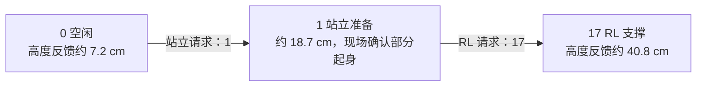

# S10 真机上手：从领狗到传感器预览、SDK 与 RL

**当前入口（2026-09-11）：使用 48 号、本队 `golai`，见 [48 号安装记录](S10_48_SETUP_ZH.md) 和 [48 号 SLAM 指南](S10_48_SLAM_ZH.md)。本文以下内容是 50 号历史实测；`xwy`、旧 `/tmp` 目录和 50 号运动验收不适用于 48 号。GUI 源码现已迁移到 48 号，历史章节中的默认值不再代表当前代码。**

记录日期：2026-09-08。实测设备：借用的 50 号 S10，Wi-Fi 名称 `S10 PRO-050-5G`。

这份文档给第一次接触真机的队员使用。先理解电脑各自负责什么，再按步骤验收。50 号机是多人用过的设备，它的账户、地址、代码和服务配置不能直接作为新狗的标准镜像。

此前拟换到 51 号的计划已改为使用 48 号；[51 号交接与复现指南](S10_51_HANDOVER_ZH.md) 仅保留检查清单。50 号当时最后进展：独立 AGX ONNX 副本已完成零速度站立，以及 100% 右移 1 秒并回零、趴下；现场均确认，随后用户决定关机换电。

## 1. 先记住这几件事

- **你的 Windows 电脑**：写代码、SSH 远程操作、查看结果。
- **电脑里的 WSL Ubuntu**：跑 ROS 2 + MuJoCo，验证仿真赛道。
- **电脑里的 Docker `rl-training`**：用 Isaac Lab 训练策略。训练结束后导出策略，再做部署验证。
- **狗身上的 AGX**：也是一台 Linux 电脑；接雷达和相机，运行传感器驱动和策略推理。
- **S10 本体控制器**：负责机器人的硬件控制；与 AGX 是不同设备。

**ROS、MuJoCo、Isaac Lab 不需要在所有电脑上各装一遍。** 只远程操作 AGX 时，Windows 有 SSH 就够用。真机部署不要求在 AGX 上运行 MuJoCo 或训练用的 Isaac Lab。

### 实测环境对照

| 项目 | Windows 本机 | 本机 WSL Ubuntu | 本机 Docker | 50 号 AGX |
|---|---|---|---|---|
| 系统/架构 | Windows，x86-64 | Ubuntu 24.04.4，x86-64 | Ubuntu 24.04.2，x86-64 | Ubuntu 24.04.4，ARM64 |
| 主要用途 | 编辑、SSH、看结果 | ROS/MuJoCo 仿真 | Isaac Lab 训练 | 真机驱动、策略推理 |
| ROS 2 Jazzy | 未作为 Windows 环境检查 | 已有 | 常见安装位置未找到 | 已有 |
| colcon | 不在此处编译真机程序 | 已有 | 常见位置未找到 | 已有 |
| MuJoCo | 本次不作完整盘点 | 系统 Python 未确认；项目虚拟环境未完整检查 | Isaac Python 中未安装 | 真机控制不需要 |
| Isaac Lab/Sim | 通过 Docker 使用 | 无需重复装 | 已有，镜像 `rl-training:isaaclab-2.3.2` | 不必为部署而安装 |
| PyTorch/NumPy | 不作为本次部署环境 | 未完整检查 | Torch 2.7.0+cu128、NumPy 1.26.0 | 本次未完整检查，已有 C++ 部署程序 |
| 真机部署程序 | 本机二进制不能直接当 ARM 程序用 | 通常编译 x86 仿真版本 | 训练环境不等于部署环境 | ARM `rl_deploy` 已存在，动态库未见缺失 |
| 传感器 | 不直接接这些传感器 | 可后续用于查看 ROS 数据 | 不必装真机驱动 | 双雷达、D435i 驱动已安装 |

本机显卡为 RTX 4060 Laptop、约 8 GB 显存；只确认了硬件，尚未验证 Docker GPU 训练是否可用。50 号 AGX 系统盘当时约剩 15 GB。

**本机这个 `goai26-s10-racing` 仓库，与 AGX 上的 `goai_embodied_future_material` 不是同一份工作区。** 本机存在仿真、导航等改动；不能假设它们已经部署到 AGX。x86 的 `build/`、`install/` 也不要直接复制去 ARM 使用。

## 2. 不懂 DDS 和组播也能先操作

| 名词 | 可以怎么理解 | 你实际需要注意什么 |
|---|---|---|
| SSH | 远程打开 AGX 的命令行 | 登录后执行的 Linux 命令发生在 AGX 上 |
| ROS 节点 | 一个正在运行的程序 | 驱动节点采数据，策略节点计算动作 |
| ROS 话题 | 程序之间传数据的频道 | 雷达频道有名字，但存在名字不保证收到数据 |
| DDS | ROS 2 在电脑之间传消息的底层机制 | 一般不需写 DDS 代码，通信配置正确即可 |
| DDS 网卡白名单 | 只允许 ROS 从某张网卡通信 | 如果填的是 AGX 已经没有的 IP，就可能收发失败 |
| `ROS_DOMAIN_ID` | ROS 的通信分组号码 | 相关程序要一致；一致还不代表网络和权限一定正常 |
| 组播 | 雷达把数据发送到一个“群组地址” | `.201/.202` 是设备地址，`224.10.10.*` 是数据群组地址 |
| 组播路由 | 告诉系统这个群组走哪张网卡 | 不能只凭没有某条路由就认定坏了，还要看实际数据 |
| QoS / Best Effort | 订阅时对消息可靠性的要求 | 预览传感器通常选择 Best Effort；不匹配可能看不到 |
| frame / 坐标系 | 点的位置是相对哪个原点和方向表达的 | RViz Fixed Frame 要与实际数据对应；坐标系名字不能随便改 |

**SDK 模式**是机器人允许外部程序控制的工作模式，需按官方流程授权和切换。
**RL 模式**是部署程序内部使用强化学习策略控制机器人的状态。
安装 SDK 软件、启用 SDK 模式、进入 RL 状态，是三件不同的事。RL 推理也不是现场训练。

## 3. 领到自己的狗：先交接，再安装

请现场技术支持确认并记录：

| 项目 | 你的设备记录 |
|---|---|
| 狗编号 / Wi-Fi 名称 | 待填写 |
| AGX 是否已配齐 / 是否有系统镜像要求 | 待填写 |
| AGX 地址、用户名；密码单独保管 | 待填写 |
| S10 控制器地址 | 待填写 |
| 前、后雷达地址与安装方向 | 待填写 |
| 相机型号、USB 接口 | 待填写 |
| Ubuntu / ROS / Jetson 系统版本 | 待填写 |
| SDK 授权方式、该设备是否已授权 | 待填写 |
| 本体 SoC SN（用于申请该设备的 SDK 授权码） | 登录该设备后读取，不沿用其他狗的 SN |
| 手柄型号、SDK 模式进入/退出方法、停止方法 | 待填写 |
| 获准运行的基线策略和配套 SDK 版本 | 待填写 |
| 自己的账户与工作区目录 | 待填写 |

不同狗的 Wi-Fi 可能使用相同内部 IP。**换狗后先核实设备编号，不要只看到 `.102` 可连就认定连对了。** SSH 主机密钥变化应由交接信息核实，不要直接关闭检查。

现成的 AGX 通常优先补缺失项，不先重刷系统、不直接升级内核。Jetson 系统和硬件驱动由交付版本决定；如果不是比赛要求的 Ubuntu 24.04/Jazzy，先找技术支持确认适配方案。

## 4. 第一步：连接并做基础盘点

通常的物理连接关系：

```text
Windows 电脑 --机器人 Wi-Fi/可达网络--> S10 网络 --以太网--> AGX
                                                        |
                                S10 本体、前雷达、后雷达共享交换机
                                                        |
                                              D435i --USB--> AGX
```

USB 的作用取决于它插在哪里：相机 USB 传图像；手机 USB 共享可能只给 Windows 上网；AGX USB 网络又是另一个网络。**电脑能上网不等于 AGX 能上网。**

50 号实测：电脑 WLAN 为 `10.21.41.19`，AGX 网口 `end0` 为 `10.21.33.102/24`，SSH 可达；电脑另有 `172.20.10.2` 的 USB 网络。这不证明 AGX 的下载网络已配置好。

在 **Windows PowerShell**（以下地址和用户名仅是 50 号示例）：

```powershell
ping 10.21.33.102
ssh ysc@10.21.33.102
```

登录后在 **AGX**：

```bash
hostname
uname -m
cat /etc/os-release
df -h /
ip -4 addr
ip route
ls /opt/ros
command -v colcon
ping -c 2 10.21.33.103
lsusb
systemctl --no-pager --type=service --state=running
```

通过条件：设备身份正确，架构为 `aarch64`，ROS 版本符合要求，能访问 S10。

先确认有没有其他人正在操作，哪些服务已开机启动。**看到驱动已在运行，就先订阅；不要再启动第二份相机驱动或机器人控制器。**

## 5. 第二步：只补需要的环境

以下是未来自己的 AGX 安装流程，**不是要求在 50 号机重装**。缺什么补什么；每一组命令分开执行，上一组通过再继续。

### 5.1 ROS 和构建工具

如果没有 ROS，先按 [ROS 2 Jazzy 官方 Ubuntu 安装说明](https://docs.ros.org/en/jazzy/Installation/Ubuntu-Install-Debs.html) 配置 ROS 软件源。官方支持 Ubuntu 24.04 的 amd64 和 arm64；安装方式另见 [官方二进制安装说明](https://docs.ros.org/en/jazzy/Installation/Alternatives/Ubuntu-Install-Binary.html)。已有 Jazzy 就跳过系统安装。

下面假设官方 ROS 软件源已配置完成：

```bash
sudo apt update
sudo apt install -y ros-jazzy-ros-base ros-jazzy-rviz2 \
  git build-essential cmake python3-colcon-common-extensions \
  python3-rosdep libyaml-cpp-dev libpcap-dev
source /opt/ros/jazzy/setup.bash
```

只有 `rosdep` 未初始化时才运行 `sudo rosdep init`；然后执行 `rosdep update`。
RViz 是图形界面，需在 AGX 的桌面终端或已配置好的远程桌面中运行，普通 SSH 终端不自动带桌面显示。

### 5.2 自己的比赛工作区和 ARM 部署

使用自己的账户和新目录，不覆盖借用机上的工作区。仓库地址来自比赛 README；以主办方当前发放的版本为准。

```bash
mkdir -p ~/s10_team
cd ~/s10_team
git clone https://github.com/DeepRoboticsLab/goai_embodied_future_material.git
cd goai_embodied_future_material
source /opt/ros/jazzy/setup.bash
rosdep install --from-paths src --ignore-src -r -y
colcon build --packages-up-to s10_sdk_deploy --cmake-args -DBUILD_PLATFORM=arm
source install/setup.bash
ros2 pkg executables s10_sdk_deploy
```

通过条件：构建完成，能列出 `rl_deploy`，策略文件与配套配置存在。**这一步不启动控制器。** 保存 `git rev-parse HEAD` 作为自己的版本记录。

### 5.3 双 RoboSense 雷达

先确认驱动没装、服务没运行，再按比赛 README 安装。以下从自己的比赛仓库根目录执行；若目标目录已存在，先检查版本，不重复 clone。

```bash
git clone --branch v1.5.19 \
  https://github.com/RoboSense-LiDAR/rslidar_sdk.git src/rslidar_sdk
git -C src/rslidar_sdk submodule update --init --recursive
git clone https://github.com/RoboSense-LiDAR/rslidar_msg.git src/rslidar_msg
git -C src/rslidar_msg checkout fe8a95cb242bd294cc3d5e3422f2093fb49a56ee
source /opt/ros/jazzy/setup.bash
rosdep install --from-paths src --ignore-src -r -y
colcon build --symlink-install --packages-up-to rslidar_sdk dual_airy_merger
```

按交接信息核对 `airy_dual.yaml` 的 `host_address`、群组、端口、前后安装外参，以及 Fast DDS 白名单。README 的例子是 AGX `.102`、S10 `.103`、雷达 `.201/.202`，不是所有设备必须无条件照搬的地址。

自己的 AGX 确认使用这些地址后，按 README 安装配置：

```bash
mkdir -p ~/.ros
cp src/dual_airy_merger/config/fastdds_ethernet.xml ~/.ros/
sudo cp src/dual_airy_merger/config/99-rslidar-network.conf /etc/sysctl.d/
sudo sysctl --system
```

如果已有同名文件，先备份并确认正在使用的内容，不能用模板直接覆盖多人机器。

网口没有配置好时，按 README 第 7.5 节设置静态地址和组播路由。**通过这张网卡 SSH 操作时，重新激活网络可能断开连接**，应在现场终端或有备用连接时操作。

```bash
nmcli connection show
# 下列连接名称和地址必须先核对；已正确配置则跳过。
sudo nmcli connection modify "Wired connection 1" \
  ipv4.method manual ipv4.addresses 10.21.33.102/24
sudo nmcli connection modify "Wired connection 1" \
  +ipv4.routes "224.10.10.0/24"
sudo nmcli connection up "Wired connection 1"
```

通过条件不是“ping 通”，而是第 6 节实际收到前、后、合并点云。

### 5.4 D435i 深度相机

先 `lsusb`，再检查是否已有 RealSense 驱动。50 号已装 ROS wrapper 4.58.1、ROS Librealsense 2.58.1，不需要重装。

缺少 ROS 包时：

```bash
sudo apt install -y ros-jazzy-realsense2-camera \
  ros-jazzy-realsense2-camera-msgs ros-jazzy-realsense2-description
```

如果需要比赛 README 指定的 Jetson userspace USB 后端，按其第 8 节安装 Librealsense。先断开相机，审阅上游脚本后运行：

```bash
cd ~
wget https://github.com/realsenseai/librealsense/raw/master/scripts/libuvc_installation.sh
less libuvc_installation.sh
chmod +x libuvc_installation.sh
./libuvc_installation.sh
```

安装完成再连接相机，运行 `rs-enumerate-devices`。官方 [Jetson 说明](https://github.com/realsenseai/librealsense/blob/master/doc/installation_jetson.md) 描述了 RSUSB 用户态后端；它减少对内核补丁的依赖。

上游 `master` 会变化，交接时记录实际 Librealsense、ROS wrapper 和系统版本，不把 README 中的“测试版本”当作每次下载都固定不变。`/usr/local` 自行编译的库和 `/opt/ros/jazzy` 的库可能是不同版本；工具能看见设备，还要验证 ROS 图像。

## 6. 第三步：最小传感器启动与可视化

不需要开启 SDK 模式，也不需要运行 `rl_deploy`，就能看雷达和相机。

### 6.1 先统一每个终端的环境

在 AGX 上使用与驱动相同的用户、工作区和 ROS 分组。以下 `0` 是 50 号实测值；仿真 README 的 `1` 不应直接用于当前真机驱动。

```bash
source /opt/ros/jazzy/setup.bash
source ~/s10_team/goai_embodied_future_material/install/setup.bash
export ROS_DOMAIN_ID=0
export RMW_IMPLEMENTATION=rmw_fastrtps_cpp
```

DDS 网卡文件核对正确后才启用：

```bash
export FASTRTPS_DEFAULT_PROFILES_FILE=~/.ros/fastdds_ethernet.xml
```

如果确认某份旧 DDS 文件不适合当前网络，可在**自己的诊断终端**中暂时取消它，测试默认发现。这个操作只影响该终端后续启动的程序，不修复已经运行的服务：

```bash
unset FASTRTPS_DEFAULT_PROFILES_FILE FASTDDS_DEFAULT_PROFILES_FILE
```

### 6.2 雷达驱动没运行时才启动

终端 1，从自己的仓库根目录：

```bash
ros2 run rslidar_sdk rslidar_sdk_node --ros-args \
  -p config_path:=src/dual_airy_merger/config/airy_dual.yaml
```

终端 2，同样 source 环境：

```bash
ros2 run dual_airy_merger dual_airy_merger_node
```

终端 3，逐项检查。`timeout` 到时结束订阅属于预期行为：

```bash
ros2 topic list --no-daemon
timeout -s INT 15 ros2 topic hz /rslidar_front/points
timeout -s INT 15 ros2 topic hz /rslidar_rear/points
timeout -s INT 15 ros2 topic hz /LIDAR/POINTS_MERGED
timeout -s INT 10 ros2 topic echo /LIDAR/POINTS_MERGED \
  sensor_msgs/msg/PointCloud2 --once --field header \
  --qos-reliability best_effort --no-daemon
```

README 目标约 10 Hz。`ros2 topic hz` 是这个订阅端实际收到的速率，受负载、QoS、网络和丢包影响，不等于传感器硬件的精确频率。

### 6.3 在 RViz 看实时点云

在有桌面显示的 AGX 终端，source 同样环境后：

```bash
rviz2
```

1. Global Options → Fixed Frame：填刚才 `header.frame_id` 的实际值。
2. Add → PointCloud2 → Topic：`/LIDAR/POINTS_MERGED`。
3. Reliability Policy：`Best Effort`；Decay Time 可先设 `0`，只显示当前帧。
4. 用鼠标旋转、缩放，移动一个现场物体，确认点云随之改变。

50 号实际坐标系是 `base_link`；原 README 模板写的是 `lidar_link`。默认 `merged_airy.rviz` 可以用，但必须检查其 Fixed Frame 是否匹配。不要为了让画面出现就随便加一个错误的坐标变换。

普通 Windows PowerShell 的 SSH 不会自动显示 RViz。最省事是接 AGX 显示器/键鼠，或使用现场已有的远程桌面；后续也可配置 WSL RViz 跨机订阅，但首次上手不必先解决这条链路。

### 6.4 相机启动与深度图

先确认没有现成相机进程占用 USB。驱动未运行时，在配置正确的终端启动：

```bash
ros2 run realsense2_camera realsense2_camera_node
```

另一个同环境终端：

```bash
ros2 topic list --no-daemon | grep '^/camera/'
timeout -s INT 15 ros2 topic hz /camera/camera/depth/image_rect_raw
timeout -s INT 10 ros2 topic echo /camera/camera/depth/image_rect_raw \
  sensor_msgs/msg/Image --once --field width \
  --qos-reliability best_effort --no-daemon
```

在 RViz Add → Image，选择 `/camera/camera/depth/image_rect_raw`；另加 Image 选择 `/camera/camera/color/image_raw`。传感器订阅使用匹配的 QoS，优先尝试 Best Effort。纯 Image 显示不用先搭完整 TF 树。

需要对齐深度或相机点云时，改用一个 launch 启动实例：

```bash
ros2 launch realsense2_camera rs_launch.py \
  align_depth.enable:=true pointcloud.enable:=true
```

先通过 `ros2 topic list` 确认该实例实际发布的名称，再在 RViz 添加。**不要在原驱动仍占用相机时再运行这个实例。**

深度图表示距离，不是彩色照片。无效像素没有有效测距；本次可视化把无效像素显示成白色，并将色标限制为 0–5 米。原始 `16UC1` 深度图按 RealSense 常见 ROS 输出以毫米解释；接入不同驱动前核对单位。

### 6.5 50 号本次实测截图

以下是实时数据的一次性采样图，不是持续刷新的界面，也不是历史示意图。


一帧合并点云 54,000 个点；绘图抽样显示，颜色代表高度，红色十字是坐标原点。未以此证明外参、重力方向或场景几何完全正确。


深度图：848×480，`16UC1`，本帧约 86.1% 像素为有效正深度。


彩色图：1280×720，`rgb8`。彩色与深度是分别取样，没有做像素对齐或严格同步。

为了取图，本次临时停止 `realsense-camera.service`，使用不加载旧 DDS 文件的限时相机预览进程；预览完成后停止该进程并恢复原服务，已确认状态为 `active/running`。前后雷达服务持续运行，未重启。原文件、原开机配置和其他队的控制代码均未修改。原相机服务仍保留旧地址问题，截图成功不意味着已永久修复服务。

## 7. 第四步：SDK 和 RL，分开验收

### 7.1 SDK 授权与启用：PDF 与赛事技术回复

2026-09-08 新收到并归档两份官方资料：

- [山猫 S10 Pro 产品手册 V1.0.1](reference/山猫S10%20Pro产品手册%20V1.0.1.pdf)：31 个 PDF 页面；印刷页码比 PDF 页序少 4。
- [S10 软件开发指南 202607](reference/S10软件开发指南202607.pdf)：58 页；下文页码使用 PDF 页序。文件名虽然带 `202607`，封面实际写 V0.0.1、更新日期 2026-06-15。

**此前没有确认授权，不等于 50 号尚未授权。** 比赛 README 要求联系技术支持获得授权码，但这两份 PDF 没有提供授权码申请、输入、许可证查询或 SDK 激活菜单的具体流程。借用机可能已完成授权，不能要求重复申请，也不能仅凭已经安装程序就认定授权成功。

#### 按设备 SN 申请授权：2026-09-08 技术聊天截图补充

来源：用户提供的赛事技术聊天截图及用户说明。截图给出了本体登录、授权配置和 SoC SN 的读取方法；以下命令作为操作文档记录，本次文档更新没有连接机器人或执行它们。

**授权码按设备 SN 申请。换一台狗，就读取那台设备自己的 SN，让技术支持提供对应授权码；不能复用截图、50 号或其他队设备的 SN/授权码。** 截图中的示例 SN 未核实属于 50 号，本指南不把它填进设备交接记录。

1. **连接目标狗的 Wi-Fi，登录机器人本体。** 先核对狗编号，下面 `.103` 是本体，不是 AGX `.102`：

   ```bash
   ssh user@10.21.33.103
   ```

   密码使用赛事技术提供的本体登录口令，单独保管。AGX 的用户名、密码与本体登录信息分别记录；不要根据某个账户曾经能登录就推断另一个账户也能登录。

2. **只读查看本体的 SDK 授权配置：**

   ```bash
   cat /var/opt/robot/conf/motion_master/SDK_authority_code.toml
   ```

   截图给出的未解锁示例为：

   ```toml
   [authority]
   sdk_authCode = ""
   ```

   技术回复明确将空字符串判定为“还没解锁”。如果字段非空，只能先确认填过内容，还需确认授权码对应本机 SN、有效且已被程序加载，不能仅凭非空宣布授权通过。文件不存在或无法读取也不能直接等同于已授权/未授权，应把具体情况交给技术支持。

3. **读取当前本体的 SoC SN：**

   ```bash
   cat /sys/class/dev_info/soc_info
   ```

   输出示意为 `soc sn: <当前设备的实际 SN>`。把完整输出和狗编号复制给技术支持；不要用 Wi-Fi 名称、AGX 序列号或截图示例代替这个值。

4. **申请并按技术指导应用该设备的授权码。** 截图没有说明授权码具体如何写入/导入、是否需要重启及重启哪个服务。收到授权码后，请技术支持给出对应固件的完整生效步骤；不要自行猜测重启流程，或把另一台狗的配置覆盖过来。

5. **复查授权状态，再验证手柄 SDK 开关。** 按技术给出的生效步骤完成后，重新查看配置并确认程序认可授权；在满足操作条件时检查手柄 SDK 选项是否可用，以及切换后的状态反馈。授权成功、SDK 已开启、控制权已交给自己的程序，仍是三项不同的验收。

可发给技术支持的文字：

> 设备编号：____；本体 `soc_info` 输出：____。授权配置中的 `sdk_authCode` 为“空/非空”（不在群里贴已有完整授权码）。手柄 SDK 选项灰色、点击无反应。请确认本机是否已解锁；若未解锁，请按这个 SN 提供授权码，并说明写入/导入、生效和手柄启用步骤。

**50 号当前新增现象：用户观察到手柄 SDK 模式选项灰色且点击无反应。** 此现象不足以证明已授权，也不能单独证明未授权。本次尚未读取该机上述授权文件和 SN；下一步应先做步骤 2、3，再结合技术反馈判断。已有别人安装的代码、能用遥控器或能进入本体 `state=17`，都不能替代 SDK 授权检查。

#### 已授权后的 SDK 模式开关

《软件开发指南》**第 17–18 页，1.2.8“运动 SDK 模式下发”**明确提供了进入/退出 SDK 控制模式的协议接口：

| 字段 | 手册定义 | 怎么理解 |
|---|---|---|
| `Type` | `0x00100005` | 指令所属类型 |
| `Command` | `0x00300002` | SDK 模式下发指令 |
| `SDKEnable` | `true` 开启，`false` 关闭 | 切换模式，不是生成许可证 |
| `Frequency` | 关节话题数据发出频率；整数 1–200，且能整除 1000 | 示例为 100；不是训练频率或步行速度 |

该接口的请求字段没有授权码参数。这只能说明**此模式切换消息不携带授权码**，不能证明所有设备都不需要事先授权。它是一个改变机器人工作模式的请求，不是只读查询。

《软件开发指南》**第 45–46 页，1.5**规定通用应答：`Type`、`Command` 与请求对应，且报文 ID 用于请求/应答配对；`ErrorCode=0` 表示接口调用成功。`0xE007` 表示无操作权限、`0xE008` 表示不允许的操作。无操作权限也不能单独等同于“许可证未激活”，需要结合实际错误信息和控制权状态判断。发送成功或网络连通不等于机器人接受请求；接口成功也还需后续模式/状态反馈验证。

**通信方式不可照抄旧附录。** 第 4 页写明默认加密端点为机器人 `10.21.33.103:30003`（TLS/TCP）和 `:30004`（DTLS/UDP），关闭加密需联系技术支持。第 57–58 页 UDP 附录却使用 `10.21.31.103:30000`，还存在与正文不同的心跳字段；本次不拿该示例直接对真机试发。实际使用应先核对配套客户端、证书/认证要求和固件配置。

协议还有固定 16 字节头部；不是向端口发送一段裸 JSON 就可以使用。手册示例里的带空格十六进制数字也不是合法 JSON 数字，程序应按协议编码，不能原样复制为 JSON 文件。

《产品手册》PDF 第 17–18 页（印刷第 13–14 页）说明普通手柄控制界面和站立/趴下操作，但没有说明 SDK 授权或 SDK 开关入口。普通使用模式“常规/辅助/导航”不等于 SDK 授权状态。第 21 页（印刷第 17 页）说明软/硬急停，操作前由现场人员对照实物确认。

**当前最准确的状态记录：50 号 SDK 授权未知，手柄 SDK 开关不可用；本次尚未核实该机授权配置和 SN。** 优先按上方技术回复读取授权字段与本体 SN，再确认对应授权码及生效步骤。模式切换接口不替代这项授权检查。

不能把程序内部的“进入 RL”按键当作 SDK 激活步骤，也不能从别人的账户复制授权来代替交接。

传感器检查阶段没有启动 `rl_deploy` 或发布运动指令。后续用户明确要求站立后，已通过原厂 `/MOTION_STATE` 接口依次完成站立 `state=1` 和原厂 RL 支撑 `state=17`，高度反馈从约 7.2 cm 经 18.7 cm 升至 40.8 cm，详见文末。**SDK 开关与 AGX 比赛策略仍未启动；原厂 RL 支撑成功不等于自定义 SDK 控制验收通过。**

### 7.2 查清楚程序到底接收哪一种输入

在自己的部署仓库查看：

```bash
sed -n '1,100p' src/S10_sdk_deploy/main.cpp
```

找到没有被注释的 `RemoteCommandType`：

| 入口选择 | 输入来源 | 使用方法 |
|---|---|---|
| `kGamepad` | 手柄接口 | 按配套 README 和手柄型号确认 |
| `kKeyBoard` | 键盘接口 | 不可直接套用手柄映射 |
| `kDDS` | ROS 话题转发的摇杆和按键 | 先确认桥接程序、话题和按键字符串 |

50 号源代码使用 **`kDDS`**，可执行文件中也包含 DDS 接口标识。它订阅 `/STEER` 和 `/GAMEPAD_KEY`。映射经文件读取确认如下：

| 状态动作 | G20 输入字符串 | G12 输入字符串 |
|---|---|---|
| 站立 | `G20_KEY_L1` | `G12_KEY_C` |
| 站立后进入 RL | `G20_KEY_L2` | `G12_KEY_A` |
| 趴下 | `G20_KEY_R1` | `G12_KEY_B` |
| 关节阻尼 | `G20_KEY_R2` | `G12_KEY_D` |

这些是**部署程序收到的消息字符串**。实际手柄是否会发送它们，取决于手柄型号、SDK 模式和机器人侧桥接。本次只读验证映射，不替现场手柄做动作确认。阻尼状态不是“保持站姿”，也不能把停止 SSH/按 Ctrl-C 当作经过验证的硬件急停。

在授权及控制权确认后，可以先只订阅按键，核对手柄事件；不要用 `ros2 topic pub` 试发未知运动命令：

```bash
timeout -s INT 10 ros2 topic echo /GAMEPAD_KEY \
  std_msgs/msg/String --no-daemon
```

### 7.3 获准后的最小 RL 测试顺序

前提：SDK 模式已由现场确认、操作人员掌握停止方式、空间准备好，且只有一个获准的外部控制器。使用主办方确认的基线策略；先不把本机训练中的策略直接放上真机。

1. 核对机器人电量、支撑/摆放要求、手柄连接和摇杆回中。
2. 核对源码/二进制、策略、关节顺序和控制参数是同一配套版本。
3. 在 AGX 正确的工作区终端 source ROS 和 install；使用与机器人通信一致的 domain 和网络设置。
4. 在前台运行部署程序，观察日志；这个动作是启动控制器，不是只读检查：

```bash
source /opt/ros/jazzy/setup.bash
source install/setup.bash
ros2 run s10_sdk_deploy rl_deploy
```

5. 核对日志的输入方式、策略加载和状态反馈。出现错误先停止试验，不盲目连续按键。
6. 按确认过的站立键；稳定站立后才进入 RL。
7. 摇杆保持零输入，先看原地是否稳定；随后在现场操作人员控制下短时、小幅移动。
8. 按官方/现场验证过的方式退出控制并使机器人安全落稳，再停止部署程序。

通过条件：现场模式指示与日志一致，能站立、进入 RL、响应预期的小幅输入并正常退出。仅看到 `State Machine Start Running` 不算完成。

50 号已有 `policy/policy.onnx`，约 795 KB。源码通过编译时的源文件路径推导策略位置，因此不能只复制一个 `rl_deploy` 二进制就假设策略路径仍正确。本次确认文件存在，但未加载执行，也未验证该策略的实际运动表现。

### 7.4 每个 state 是什么：先认清是哪一套编号

以下主表对应官方 ROS `/MOTION_STATE` 指令和 `/MOTION_INFO.data.motion_state.state` 反馈，依据《软件开发指南》PDF 第 48–51 页。`state` 表示控制状态，不表示模型作者，也不是期望高度。

| 对外 state | 官方名称 | 实际怎么理解 | 第 48 页是否允许作为 ROS 下发值 |
|---|---|---|---|
| `0` | 空闲 | 等待起身等操作；单凭 0 无法判断策略来源 | 否，只读状态 |
| `1` | 站立 | 执行起身/准备支撑；50 号本次在这一状态停留于约 18.7 cm 的低姿态 | 是，但要符合当前状态的转换条件 |
| `2` | 关节阻尼 / 软急停 | 进入缓冲/软停控制，不是保持站立的“暂停键”；可能失去正常站姿支撑 | 是 |
| `3` | 开机阻尼 | 开机初始的阻尼状态，等待后续操作 | 否，只读状态 |
| `4` | 趴下 | 执行收腿下降并进入趴下状态，用于正常收尾 | 是 |
| `17` | RL 控制 | 策略维持支撑并根据控制输入运动；零输入也仍在计算支撑动作 | 是，需完成站立准备 |

本次实测的序列：



这些高度只是 50 号本次反馈，不是所有 S10 的固定目标。机械腿保持弯曲可以是正常站姿，不应以“腿完全伸直”作为通过标准。

官方第 49 页状态图还描述：开机后进入开机阻尼；收到站立指令后开始起身；RL 可经趴下过程进入趴下状态；阻尼/软急停后约 3 秒回空闲。图中起身到 RL 的箭头写“自动进入”，同页文字又要求站立后尽快切换 RL；50 号本次实际需要追加 `17`，因此必须看实际反馈，不能只按图推断已自动完成。

#### 协议章节里的额外 state

第 10、20 页的 TCP/UDP 监控协议另列更大的状态集合，不能全部搬到 ROS 指令话题：

| 数值 | 协议含义 | 与上表的区别 |
|---|---|---|
| `-2` | 软急停 | 监控协议用此反馈；第 10 页说明仅查询，不可通过该命令下发；ROS 第 48 页把关节阻尼/软急停列为 2 |
| `5` | 标零 | 关节零位校准相关状态，不是日常起立步骤 |
| `16` | 小车移动 | 单独的运动状态，本次未验证其启用条件 |
| `4097` / `0x1001` | 阻尼趴下 | 监控协议列出的组合状态；不属于 ROS 第 48 页列出的可下发集合 |

监控协议第 20 页还将 `0` 描述为默认值/运动未上报；ROS 反馈表称空闲。判断时同时看话题来源、反馈是否新鲜及设备行为。

#### AGX 比赛 SDK 的内部 state 又是另一套

50 号 AGX 的源码 `/home/ysc/goai_embodied_future_material/src/S10_sdk_deploy/include/types/custom_types.h` 第 14–28 行定义：

| 含义 | `RobotMotionState` / `StateName` 内部编号 | 官方 ROS 对外编号 |
|---|---|---|
| 等待站立 / 空闲 | 0 | 0 |
| 站立 | 1 | 1 |
| 关节阻尼 | 2 | 2 |
| 趴下 | 4 | 4 |
| RL | **6** | **17** |
| 无效状态 | `StateName::kInvalid=-1` | 第 48 页未定义这个下发值 |

**不要把内部 `6` 发到官方 `/MOTION_STATE` 当作 RL 指令。** 也不要因为源码出现 `6` 就认为官方文档的 `17` 错了。AGX 此版本实际通过 `/GAMEPAD_KEY` 映射切换自己的状态机，没有在本次测试中启动它。

状态、步态、使用模式、SDK 和硬急停也要区分：

- `state=17`：处于 RL 控制状态，不说明是不是你训练的模型。
- `gait`：RL 使用哪种步态，例如 `/MOTION_INFO` 文档中 `0x1001` 表示基础步态；与监控协议里同值的“阻尼趴下 state”是不同字段。
- `ControlUsageMode`：常规/导航/辅助模式的选择，不是 SDK 授权。
- `SDKEnable`：是否开启外部 SDK 控制，不是 RL 状态号。
- `HES`：独立的硬急停状态；硬急停不是 `state=2` 的另一种写法。

### 7.5 当前 RL 来自哪里：已核实与未核实

2026-09-08 后续只读检查结果：

1. AGX 上未发现运行中的 `rl_deploy`、`motion_master`、STAIR2 或策略技能进程；本次没有启动或加载其他队的 ONNX 模型。
2. `/MOTION_INFO` 当时只有一个发布端，显示为原生 DDS 应用。将该发布端的 GUID 前缀与实际 RTPS 网络报文匹配，确认它来自 **`10.21.33.103` 本体**。
3. **因此可以确认本次使用本体当前的运动控制接口，而不是已查到的 AGX 比赛策略程序。** 但接口名、IP、`state=17` 和进程名称都不能证明本体模型从未被替换。
4. 本体 `user@10.21.33.103` 的现有 SSH 公钥认证未通过，尚未读取本体服务启动路径、实际模型配置或版本来源。下一步需要获准的本体登录方式；读取启动配置和模型来源，并与主办方确认的固件/模型基线对照。没有可对照的基线时，文件名或修改时间本身不能证明原厂来源。
5. 这次只读检查时，本体已反馈 `state=0`、高度约 `0.0723 m`，不是前一次记录的 RL 支撑姿态。本次未切换状态，回到空闲的原因未核实。

**本指南历史记录中的“原厂 RL”应理解为通过官方本体接口调用的当前 RL 控制；不构成模型权重为出厂原版的证明。当前最准确称呼是“本体当前 RL 控制器，模型来源待核实”。**

## 8. 最常见的问题：按证据排查

| 现象 | 先查什么 | 50 号经验 |
|---|---|---|
| SSH 不通 | 是否连对狗、地址、网络和 AGX 电源 | Wi-Fi 可跨子网访问 `.102`，不要求电脑一定是 `.33.*` |
| ping 雷达正常但无点云 | 群组、端口、驱动、实际 UDP 接收 | ping 只验证管理连接 |
| 没有显式组播路由 | 网卡是否加入群组、是否实际收包 | 50 号依然收到两路数据，不能仅据此“修路由” |
| 服务 running 但没图 | 驱动日志、话题消息、DDS 配置 | 相机成功开流，但 DDS 白名单指向不存在的旧 IP |
| 有话题名但收不到消息 | 同用户/domain、QoS、网卡、共享内存与跨用户差异 | 用 `xwy`、domain 0 可收到雷达；跨用户问题未完全定位 |
| RViz 点云空白 | Fixed Frame、Topic、Best Effort、视角 | 真实 frame 是 `base_link`，模板是 `lidar_link` |
| 相机 USB 已识别但无图 | 是否被另一驱动占用、ROS 日志、USB 状态 | 不要重复开第二个驱动抢设备 |
| RL 不响应 README 按键 | `main.cpp` 入口、手柄型号、SDK 模式、消息桥 | 50 号是 DDS 控制，不是原文描述的 UDP 手柄入口 |
| 换个工作区启动仍用旧程序 | source 顺序、systemd drop-in、二进制路径 | 雷达服务被 drop-in 指向 `/home/xwy/s10_driver_ws` |

只在需要时使用如下诊断，不先改配置：

```bash
systemctl cat rslidar-dual.service rslidar-merge.service realsense-camera.service
ip maddr show dev end0
sudo timeout 5 tcpdump -n -i end0 -c 6 \
  'udp and (dst host 224.10.10.201 or dst host 224.10.10.202)'
journalctl -u realsense-camera.service -n 30 --no-pager
```

`end0` 是 50 号网卡名，新狗以 `ip addr` 为准。

## 9. 还需要补上的事项

- **谁负责哪个账户/服务**：自己的工作区独立；借用狗不覆盖他人文件。服务模板、drop-in、实际进程路径都要记下来。
- **数据新鲜度和时间同步**：导航/融合前检查时间戳、延迟、雷达与 IMU 同步。50 号存在 PTP/时钟同步服务，不应在不了解用途时关闭。
- **坐标和标定**：前后雷达外参、相机安装姿态、深度单位、关节顺序/零位都影响策略。画面能显示不等于标定通过。
- **相机 IMU 另行验证**：50 号日志曾提示 HID 信息缺失、IMU disabled；D435i 深度/彩色成功不代表其 IMU 成功。
- **存储和网络**：先短时录包，检查空间，不让长时间点云/图像录制占满系统盘。AGX 上网要单独验证。
- **版本归档**：记录仓库 commit、模型来源、ROS/驱动版本和实际配置。换狗先复现已验证基线。
- **训练与部署接口**：观测维度、归一化、动作缩放、频率、关节顺序必须一致。ONNX 能导出不等于可直接上狗。
- **感知策略要求**：看见相机/雷达，只完成了传感器环节；默认 RL 能走也不等于满足比赛的感知策略要求。
- **先基线、后自研**：基线运动通过 → 本机 MuJoCo 验证自己的策略 → 真机逐级验证。不要首次就同时切模型、导航和驱动。
- **开机自启放最后**：手动启动和退出验收后，再配置自己的传感器服务。首次上手不把 RL 控制器设成开机自动运行。

## 10. 首次验收清单

- [ ] 对应狗编号、AGX 身份、账号、工作区已确认。
- [ ] AGX 能到 S10；需要下载时 AGX 自己能上网。
- [ ] Ubuntu/ROS/ARM 架构正确，缺失环境才补装。
- [ ] 前后点云及合并点云均收到；坐标系、频率有记录。
- [ ] 深度和彩色实际显示；需要时再验相机 IMU和对齐图。
- [ ] 没有重复的传感器驱动或外部控制器。
- [ ] SDK 授权、手柄切换和停止操作已由技术支持演示。
- [ ] 控制输入方式与实际二进制对应，基线策略来源清楚。
- [ ] 完成站立、RL 零输入、小幅移动和退出的现场测试。
- [ ] 记录通过的版本、命令、配置和未解决项。

**50 号当前结论：连接和传感器采样已通过；原厂站立及 RL 支撑已收到状态反馈，高度约 40.8 cm；原相机服务的 DDS 配置仍未永久修复；SDK 切换与 AGX 比赛 RL 仍未实测。**

后续站立尝试记录：用户连接遥控器后要求尝试站立；电脑仍连接 `S10 PRO-050-5G`，本体 `.103` ping 正常，但 AGX `.102` 的 ping/SSH 多次超时。本体 SSH 未通过现有公钥认证，因此未能核实当前控制状态，未发送 SDK 切换、站立或其他运动指令。待确认 AGX 电源和以太网连接后继续；遥控器能连接本体，不代表 AGX 同时在线。

### 2026-09-08 重启后：原厂站立请求实测

用户重启机器人后，AGX `.102` SSH 恢复。此时 AGX 上没有比赛 `rl_deploy` 进程；本体已发布 `/MOTION_INFO`，`/MOTION_STATE` 有原生 DDS 接收端。

原有 `ysc` 比赛消息包缺少 `MotionState` 和完整 `MotionInfo` 类型；`xwy` 的只读采集消息包具备状态反馈类型但缺少站立命令类型。因此在独立临时目录 `/tmp/s10-stand-Xwfbja` 构建了仅供本次测试的 `drdds` 消息包：复用已安装的 MetaType、MotionInfo 等实际定义，按官方 PDF 第 48 页补齐 `MotionState = MetaType header + MotionStateValue data`。未修改两位用户原来的消息包、控制源码或 systemd 配置；该临时目录不是后续部署依赖。

测试过程：

1. 消息序列化/反序列化自检通过。
2. 同一进程订阅 `/MOTION_INFO` 与 `/HES_STATUS`，确认反馈接收时间小于 0.5 秒、速度为零、硬急停为 0，命令话题有订阅端。
3. 初始反馈 `state=0`（空闲），高度约 `0.072 m`。
4. **仅发布一次 `/MOTION_STATE`，`data.state=1`**，附当前时间戳。
5. 连续观察 8 秒：反馈切为 `state=1`；高度从 `0.072 m` 经 `0.134 m` 升至约 `0.1867 m` 并稳定；速度保持为零，硬急停为 0。
6. 一次性请求进程退出，不保持后台命令发布者；没有发轴指令、SDKEnable 或 RL 切换请求。现场姿态仍由操作人员确认，反馈高度不是额外尺量的物理尺寸。

这证明**原厂高层站立接口在该机上接受了本次请求并产生状态变化**。它不证明已经进入 SDK 模式、不证明许可证状态，也不证明已在运行 AGX 上的自定义策略。原厂控制和自定义 SDK 控制须分开记录。

### 同次测试的重要修正：站立状态只是低姿态，须进入原厂 RL 支撑

用户现场反馈：四条腿已经支撑，但只是部分起身，没有达到正常高度。**因此不能把 `state=1` 或约 18.7 cm 的高度直接记成完整站立成功。**

《软件开发指南》第 49 页要求完成站立后尽快切换 RL 控制。继续操作前重新检查新鲜反馈为 `state=1`、速度为零、硬急停为 0，再通过同一原厂接口**仅发布一次 `data.state=17`**：

- 反馈立即切为 `state=17`（RL 控制）。
- 约 1 秒后高度反馈到 `0.403 m`，随后在 `0.408 m` 附近保持。
- 观察约 10 秒，未发送行走、侧移或转向速度指令；速度估计存在厘米/秒量级非零值，是否实际移动由现场观察确认。
- 一次性指令进程退出后，由原厂控制器继续支撑，不需要 AGX 保持该测试进程运行。

**新狗的原厂基础体验顺序是：确认现场条件 → 站立请求 → 原厂 RL 支撑 → 确认姿态和高度；不是要求腿完全伸直。** 首次应由现场人员按照手册连续完成两步，不在低姿态停留做长时间文档整理。这个经验只针对已验证的原厂高层接口；自定义 SDK 策略的授权、接管和退出流程仍需单独验证。

资料依据：用户提供的比赛 README（第 3–8 节）、2026-09-08 的本机和 50 号 AGX 检查、文中链接的 ROS 与 RealSense 官方资料。50 号实际配置与原 README 不一致的地方均单独标出。

### 后续低速 RL 体验：在起身检查阶段结束，未执行前进

用户确认机身正前方至少 1 米无障碍、无线缆牵绊，并持遥控器准备接管。计划先恢复本体 RL 支撑，再给 1 秒短时前进输入并回零。

接口核对：已安装的 `SteerValue` 定义明确 `x/y/yaw` 为 `[-1,1]` 的比例量，**不能把 `x=0.1` 直接当作 0.1 m/s**。本轮准备采用 `/STEER.x=0.02`；结合产品手册 PDF 第 7 页的最高工作速度 5 m/s，这对应约 0.1 m/s 的名义换算，实际执行仍受当前限速、映射、死区和反馈影响。`/NAV_CMD` 虽然直接用 m/s，但开发指南第 52 页要求导航模式，并提醒与 planner/charge_manager 的冲突，因此未直接启用或停用这些服务。

实际结果：

- 独立临时消息包补入已有的 `Steer/SteerValue` 定义；没有修改他人的工作区。
- 本地限时测试工具的反馈超时、状态、非有限值、高度和速度阈值检查通过。
- 初始反馈 `state=0`、高度约 7.2 cm；发送了一次 `state=1` 起身请求。
- 约 2.5 秒观察窗内收到 51 条运动反馈，均仍为 `state=0`，因此在进入 RL/前进之前结束。
- **没有发送任何前进输入，也没有进入本轮 RL 测试阶段。** 不能据此判断 RL 的行走效果好坏。
- 后续电池反馈 `battery_level=21`，保护字段为 0。低电量是需要关注的条件，但尚无证据证明它导致这次起身未生效；产品手册指出低于 20% 应充电或更换电池。
- 用户询问遥控器与电脑能否同时连接，并怀疑低电量。再次只读获取电池反馈为 **19%**，`protected_state=0`，已低于手册的 20% 充电/换电提示线。因此暂停运动测试，先按手册充电或更换电池；仍不能仅据此认定起身失败的原因。
- 遥控器和电脑可以同时连接；电脑读取状态、查看传感器不要求断开遥控器。运动测试时约定一个指令来源，现场人员持遥控器准备接管；两端同时发运动指令的优先级尚未验证，不应假定能自动协调。

结果与原始反馈保存在 [rl-trial.json](../artifacts/s10-50-onboarding/rl-trial.json) 和 [rl-trial.log](../artifacts/s10-50-onboarding/rl-trial.log)。临时测试工具为 `tmp/s10_rl_trial.py`，`--check` 只运行本地检查；`--run` 会实际控制机器人，必须满足现场条件和配套消息环境，不能作为无条件启动脚本。

### 再次重启后：RL 站稳，短时输入的前进效果不明显

重新连接 AGX 后，电量反馈为 86%、保护字段为 0，初始运动状态为 0、速度为零，硬急停反馈为 0。电量读数较此前 19% 明显变化，但未核实是否更换过电池，不能把重启视为恢复电量的方法。

重启清除了上次的临时消息包，因此在新的独立目录 `/tmp/s10-trial-hjrwn2_p` 恢复测试接口，未修改他人的工作区或系统配置。沿用已授权的一次短时测试，实际反馈为：

- 起身请求后进入 `state=1`，随后请求 `state=17`，进入本体 RL 支撑。
- 稳定观察阶段高度约 40.8 cm；发送约 1 秒 `/STEER.x=0.02` 比例输入，然后连续发送零输入约 1 秒，再观察 3 秒。
- 前进阶段平均前向速度估计约 0.055 m/s，最大约 0.064 m/s。这是机载反馈，不是外部测得的位移；不能直接认定实际前进距离。
- 测试未触发程序检查异常；末次反馈为 `state=17`、高度约 40.9 cm。测试进程退出，未请求趴下，仍由本体控制器支撑。
- **现场人员确认：站稳了，但没有看出前进。** 因此记录为 RL 站立通过、行走效果尚未由现场确认；未自动加大输入或延长测试。
- 本轮仍未发送 SDKEnable，也未启动 AGX 的比赛 `rl_deploy`；本体策略权重的来源仍未核实。

原始记录：[rl-trial-reboot.json](../artifacts/s10-50-onboarding/rl-trial-reboot.json)、[rl-trial-reboot.log](../artifacts/s10-50-onboarding/rl-trial-reboot.log)。

### 用户要求加大输入：3% 短时前进测试

用户要求“加大试试”后，将本地临时测试工具的前进比例从 0.02 调为 0.03，持续时间仍约 1 秒，原有反馈检查和回零流程保留。测试前电量为 82%、电池保护字段为 0；初始运动反馈为 `state=17`，因此本轮没有发送状态切换请求。

- 前进阶段平均前向速度反馈约 0.085 m/s，峰值约 0.101 m/s。
- 回零后观察 3 秒，平均前向速度反馈约 0.0002 m/s；末次高度约 41.9 cm、状态仍为 17。
- 程序未触发检查异常，测试进程已退出。现场是否明确迈步及姿态表现，待操作人员反馈；速度估计不等于外部测得的位移。

原始记录：[rl-trial-03.json](../artifacts/s10-50-onboarding/rl-trial-03.json)、[rl-trial-03.log](../artifacts/s10-50-onboarding/rl-trial-03.log)。

现场随后确认 3% 的 1 秒测试能看到往前动了一下，并授权延长至 3 秒。保持相同输入执行后，前向速度反馈平均约 0.091 m/s、峰值约 0.100 m/s；回零并观察后接近零，状态仍为 17，末次高度约 41.9 cm。程序未触发检查异常，未自动执行侧移、旋转或其他模式。记录：[rl-trial-03-3s.json](../artifacts/s10-50-onboarding/rl-trial-03-3s.json)、[rl-trial-03-3s.log](../artifacts/s10-50-onboarding/rl-trial-03-3s.log)。

### Windows 点击控制界面

按用户要求提供了本机 GUI：[启动器](../scripts/start_s10_gui.cmd)、[控制程序](../scripts/s10_control_gui.py)。在资源管理器中双击 `scripts/start_s10_gui.cmd`，填写 AGX 的 SSH 密码即可使用；密码不会写入文件。当前借用的 50 号机器使用 AGX `10.21.33.102`、登录用户 `ysc`。启动器优先使用本机已有的 `D:\Anaconda\pythonw.exe`，无需安装新依赖。

- 每次点击只执行一轮；比例可选 1%、2%、3%、5%、8%、10%、15%、20%，以及 30%–100%（每档 10%），时间可选 1–5 秒，默认仍为 3% / 1 秒。用户明确要求后才扩展至 100%。比例不是 m/s，100% 是满量程输入；速度反馈阈值仍然保留，超过会提前结束本轮，不保证满量程持续运行。
- 支持前后移动、左右平移、顺/逆时针旋转。按机身方向理解；平移和旋转的实机效果尚待现场首次验证，先选 1 秒。
- “站立 → RL 支撑”对应 1 → 17；“趴下”请求 4。移动按钮要求已处于 RL 状态，不会自动起身。
- “停止本轮运动 / 速度回零”及空格键用于结束本轮速度输入，保留支撑。它不是硬急停，不会自动撤销已经生效的模式切换。现场遥控器继续作为接管手段。
- 单次动作由 AGX 端计时；反馈过期、GUI 心跳丢失、SSH 输入结束时结束本轮并尝试回零。日志输出失败也不能跳过回零路径；若检测到外部非零轴输入，退出并让出控制。断电、ROS/控制器进程崩溃等情况下软件回零无法保证执行。
- 动作前检查新鲜运动反馈、硬急停和电池：电量低于 20%、保护字段非零、起始未静止或高度/速度反馈异常时不开始移动。位移和稳定性仍需现场观察。
- 不切换 SDK、不启动 AGX 比赛策略，也不提供未经验证的步态切换或硬急停按钮。
- 状态带采样时间，空闲时通过“刷新状态”更新；不是持续监控。已输入密码时，启动只自动读取一次状态，不发送运动指令。日志保存在 `artifacts/s10-50-onboarding/gui/`。

当前 GUI 为 **50 号本次会话** 配置：通过 `ysc` 登录后，以现有 `xwy` 账号运行隔离临时目录中的 ROS 接口。依赖 `/tmp/s10-trial-hjrwn2_p/install/setup.bash`，重启后需要重新准备接口；新的目录可通过环境变量 `S10_GUI_ROS_SETUP` 指定。它不能直接作为自己领取的新狗的通用安装器：先核实账号、sudo 权限、ROS 接口和遥控接管流程，再适配。没有改动其他队伍原有代码或服务配置。

已完成真实设备只读连接检查和 GUI 控件尺寸检查；离线测试覆盖参数范围、反馈异常、限时侧移输入、SSH 输入断开、心跳超时，以及输出通道损坏后仍回零。运行 `python scripts/test_s10_control_gui.py` 可复现这些离线检查，不连接机器人。GUI 中的趴下、平移和旋转尚未实机点击验证。

### GUI 现场反馈与范围调整

用户随后通过 GUI 验证前后移动有效，但 3% 输入下的平移和旋转没有可见效果。检查两轮左移和两轮顺时针旋转日志，均执行了 3 秒、无检查错误、无外部轴指令接管；左移的横向速度反馈几乎不变，旋转反馈也较小。不能把 `Zero input` 当作失败原因：它只是定时运动结束后的回零事件。输入死区是可能原因，本体控制模式限制仍未排除；未访问到本体策略实现，不能断言增大比例一定解决。

按用户要求，将 GUI 上限改为 10% / 5 秒，默认保持 3% / 1 秒。反馈中止阈值同步调整为平移合速度 `hypot(vx, vy) > 0.40 m/s` 或 `abs(yaw) > 0.50 rad/s`，并保留高度、电池、急停、反馈新鲜度及心跳检查。它们是反馈检查阈值，不是保证不会超过的物理限速。GUI 对回零给出中文解释，并显示所选轴相对起始反馈的平均速度变化；响应较小时提示尚不能确认动作生效。

新版经过离线中止路径检查和 UI 尺寸检查，未自动执行任何更大幅度的真实动作。由用户先选 5% / 1 秒进行现场验证；趴下效果仍待验证。

### 用户实测旋转有效、平移仍无效；输入选项扩至 100%

用户确认 10% / 5 秒旋转有可见效果，平移仍没有效果。日志中左移的横向速度变化约为零；顺时针旋转平均反馈变化约为 -0.043 rad/s。本轮没有自动继续试探更高输入。

用户明确要求将比例选项开放至 100%，因此扩展了 GUI 和远端参数校验上限，持续时间保持最多 5 秒、默认 3% / 1 秒。平移合速度 0.40 m/s、角速度 0.50 rad/s 的反馈中止阈值保持不变，回零、心跳、低电量和急停检查保留。更大输入在实机上的效果尚未验证；平移无响应的原因仍待核实，不能确认仅为输入死区。离线检查包括满量程参数在模拟发布器中的正确赋值和断连回零，没有向真实机器人发送满量程输入。

### 当前 RL 与 AGX ONNX 的来源区别

再次只读核查 AGX：没有发现 `rl_deploy` 或 `motion_master` 进程。GUI 调用的是本体公开状态/轴接口，不加载 ONNX；本体当前控制器的模型路径、文件格式和权重来源尚未核实，不能称为已经确认的原厂 ONNX。

AGX 的 `/home/ysc/goai_embodied_future_material/src/S10_sdk_deploy/policy/policy.onnx` 是另一份文件：

- 本地仓库 origin 为 `git@github.com:DeepRoboticsLab/goai_embodied_future_material.git`，HEAD 为 `dec310ba2f13f14d81e1a3ad240c7e1b026445e8`。
- 该文件最近的本地 Git 记录为 `93a3745`，时间 2026-08-20，说明为 `update control policy`。
- 文件内容的 Git blob 标识与索引均为 `f6f7cf29b8ffb26a238aa7759055d9976a579669`，没有发现本地文件修改。
- 这些证据支持“与本地赛事仓库所附版本一致”；本次公开 GitHub 提交页面无法访问，未独立验证远端提交。更不能将该文件的来源结论直接用于当前正在运行的本体策略。

用户随后提供了 `user@10.21.33.102` 的密码。用该账号在 `.102` 尝试一次，又按此前确认的本体地址在 `.103` 尝试一次，两次均收到 SSH 密码认证失败。没有继续猜测密码，也没有获取到本体模型。密码不写入本指南；需向赛事方核实本体 SSH 地址、账号及登录方式。认证失败不能单独证明账号不存在。

### 如何使用 AGX 上的 policy.onnx（已核对代码，尚未实机接管）

用户提供的 README 截图再次确认：`.102` 使用 AGX 账号，`.103` 使用本体账号；图中八位数字密码属于 Wi-Fi，并非明确提供的本体 SSH 密码。从 AGX 再次执行严格主机密钥检查、禁止密码交互的本体 SSH 检查，收到 `Permission denied (publickey,password)`：SSH 网络可达，但 AGX 现有密钥也未获准登录本体。

使用 AGX 策略无需把 ONNX 复制进本体。执行链路是：机器人关节/IMU反馈 → AGX `rl_deploy` → ONNX Runtime 推理 → `/JOINTS_CMD` → 已允许 SDK 关节控制的本体。

50 号已具备 ARM 构建：`build/s10_sdk_deploy/CMakeCache.txt` 为 `BUILD_PLATFORM:STRING=arm`；现有 `rl_deploy` 二进制包含 DDS 按键和轴接口字符串。`RLControlState` 构造时按编译源码路径定位 `src/S10_sdk_deploy/policy/policy.onnx`；模型不是通过命令行另传路径。本次不需要重新安装环境或重建原工作区。

接管前须完成官方 SDK 模式及退出/接管方式的确认，结束当前 GUI 的本体控制测试。**不能直接把当前 GUI 当成 AGX 策略控制面板**：当前模式按钮发 `/MOTION_STATE`，而该 `rl_deploy` 订阅 `/GAMEPAD_KEY`；GUI 的状态检查也依赖本体状态 17，尚未适配 SDK 反馈。

仅在完成上述 SDK 接管准备后，AGX 启动命令为：

```bash
cd /home/ysc/goai_embodied_future_material
source /opt/ros/jazzy/setup.bash
source install/setup.bash
export ROS_DOMAIN_ID=0
ros2 run s10_sdk_deploy rl_deploy
```

不启动 MuJoCo。注意：`DdsInterface` 构造时会调用 `ResetJointError()` 并发布关节控制字，`S10Interface::Start()` 还会发送零增益初始化命令，因此启动程序本身并非只读动作。本轮未执行启动，也未切换 SDK。

当前 DDS 输入代码对应的状态请求是 `/GAMEPAD_KEY`（`std_msgs/msg/String`）：`G20_KEY_L1` 起身、站立状态下 `G20_KEY_L2` 进入该部署程序的 RL、`G20_KEY_R1` 趴下、`G20_KEY_R2` 关节阻尼。模式转换需结合该程序的日志和现场反馈，不把这些按键名称直接混作本体 `/MOTION_STATE` 数字。软件内部 RL 状态 6 与本体高层状态 17 也不相同。

策略运行器目前接收 `obs`，形状为 `[1,57]`，输出 `actions` 为 16 维；57 维观测由角速度、重力投影、三维命令、关节位置、关节速度、上次动作组成。当前流水线没有摄像头/雷达输入。代码中三轴比例映射为 `x*1.5`、`y*0.5`、`yaw*0.6` 的策略命令值；这是 AGX 运行器的映射，不能用于解释本体当前策略的速度或保证其实际运动效果。

接管前还需处理已识别的控制差异：DDS 输入回调保存最后一条轴值，未提供自动超时回零；`SafeController::Run()` 未调用现有用户命令心跳检查，`RLControlState::PostureUnsafeCheck()` 当前直接返回 false。因此不能假定现有二进制天然具有当前 GUI 的断连回零和姿态保护。此处仅记录代码事实，没有修改其他队伍的代码；SDK 测试面板、反馈和退出路径需在接管前单独适配并验证。

### AGX ONNX 实际推理检查通过，SDK 实机接管尚未开始

用户要求尝试 AGX 策略时，先发现 Windows WLAN 已断开，恢复连接已有的 `S10 PRO-050-5G` 配置后重新连通 AGX。只读反馈：电池 52%、保护字段 0、硬急停 0、本体 `state=17`、高度约 40.8 cm。用户现场明确表示仍为普通遥控／本体 RL 模式，没有确认 SDK 已启用。话题中已有原生 DDS 关节命令发布端，不能仅因 `/JOINTS_CMD` 存在就认定 SDK 已授权接管。

未启动 `rl_deploy`，未发送 SDKEnable 或关节指令。改为在 AGX 的独立临时目录 `/tmp/s10-onnx-check-YVQywp` 编译并运行纯 ONNX Runtime 检查程序，复用仓库自带的 ARM ONNX Runtime 1.22.0 和 g++，没有安装新依赖或改动原工作区。该程序不链接 ROS、不创建 DDS 接口。

实测结果：`policy.onnx` 可加载，输入 `obs` 为 float32 `[1,57]`，输出 `actions` 为 float32 `[1,16]`。用合成的直立重力、零速度命令与零关节偏差/历史动作做一次推理，16 个输出全部为有限值，范围约 -0.280953 至 0.207978。退出码 0。该测试证明格式兼容和一次推理可运行，不代表闭环稳定性、站立效果或 SDK 接管已经验证。

可复查 [onnx-offline-check.txt](../artifacts/s10-50-onboarding/onnx-offline-check.txt)；检查源码是 `tmp/s10_onnx_check.cpp`。后续仍需确认官方 SDK 启用/退出流程，并适配与验证 SDK 控制输入、反馈和断连处理后，再进行零速度实机站立。

### 用户启用 SDK 后的检查：发现 IMU 接口不兼容，尚未接管

用户现场确认已打开手柄 SDK 模式，并确认机器人趴稳在地面。关闭旧的本体 GUI，恢复断开的 50 号 Wi-Fi 后，只读收到了 16 个关节反馈（状态码均为 1）及 IMU 数据。原有临时消息目录已随重启清除；检查使用 AGX 现存消息包。没有启动 `rl_deploy` 或发送关节控制指令。

接管前发现两处必须处理的输入问题：

1. `/IMU_DATA` 两个原生 DDS 发布端的可靠性均为 `BEST_EFFORT`，而现有 `dds_interface.hpp` 的 `create_subscription(..., 10, ...)` 默认要求 Reliable，QoS 不兼容。关节、电池发布端则为 Reliable，不能把 IMU 问题泛化到全部话题。
2. 4 秒只读采样得到 806 条 `/IMU_DATA`，roll 平均约 0.0932857；标准 `/IMU` 四元数解算出的 roll 约 0.0932853 rad，即 5.34485°，加速度重力方向估算约 0.0927174 rad。数值支持当前原始姿态角使用弧度。现有代码却对三个姿态角执行 `Deg2Rad`，会把正确的弧度值再缩小约 57.3 倍。

采样记录：[sdk-imu-preflight.txt](../artifacts/s10-50-onboarding/sdk-imu-preflight.txt)。已生成但**尚未应用**的两行修正补丁：[sdk-imu-compatibility.patch](../artifacts/s10-50-onboarding/sdk-imu-compatibility.patch)：IMU 订阅采用 `rclcpp::SensorDataQoS()`，姿态角直接作为弧度使用。

用户此前明确要求不修改代码，因此未修改借用机器上的部署程序。下一步待用户允许在独立副本应用兼容性修正，并准备限时运行、反馈监控和退出流程，再做 SDK 零速度站立。离线 ONNX 推理通过不能代替硬件接口匹配检查。

### SDK 实机验证通过：独立 AGX 副本完整起身、RL 支撑、趴下

用户明确允许在不影响他人原代码的前提下尝试修正，且此前已在遥控器开启 SDK、确认机器狗趴稳。独立工作区为 `/tmp/s10-sdk-isolated-x0oii75l`，复制了部署源码与模型；已有 third_party 仅通过符号链接引用，不写入。原仓库、已安装程序和系统服务未被替换。

副本的变更为：

1. IMU 订阅采用 `rclcpp::SensorDataQoS()`，匹配 Best Effort 发布端。
2. IMU 姿态直接使用收到的弧度值，不重复执行度转弧度。
3. `main` 接收 `argc/argv` 并传入 `rclcpp::init`，让 ROS 话题映射生效。

完整修正：[sdk-isolated-full.patch](../artifacts/s10-50-onboarding/sdk-isolated-full.patch)。独立副本的 `policy.onnx` 与原文件一致，没有训练、改权重或改变策略动作映射。

副本以 ARM 目标单独编译，约 71 秒完成，退出码 0。构建使用原有已安装的 drdds 消息包，输出全部留在独立工作区。采用以下构建方式（SDK_COPY_ROOT 应指向准备好的独立工作区）：

```bash
source /opt/ros/jazzy/setup.bash
source /home/ysc/goai_embodied_future_material/install/setup.bash
cd "$SDK_COPY_ROOT"
CMAKE_BUILD_PARALLEL_LEVEL=2 colcon build \
  --packages-select s10_sdk_deploy --allow-overriding s10_sdk_deploy \
  --cmake-args -DBUILD_PLATFORM=arm
```

测试监控程序最初位于 `tmp/s10_sdk_supervisor.py`，现已归档为 [scripts/s10_sdk_trial.py](../scripts/s10_sdk_trial.py)。这次零速度测试只发送零轴输入和有限次模式按键，监测关节/IMU更新、非有限数值、硬急停、电池、角度、角速度及关节速度/力矩/温度，并监听本地连接心跳。正常结束请求趴下；异常时请求副本进入阻尼并退出。原部署程序的输入被映射至 `/s10_sdk_test/STEER`、`/s10_sdk_test/GAMEPAD_KEY`，不使用旧 GUI 的模式按钮。后续归档版本增加了下文记录的限时侧移模式。

先执行 `--dry` 检查：所有 `/JOINTS_CMD` 输出也映射到 `/s10_sdk_test/DRY_JOINTS_CMD`，仍读取真实反馈。副本日志中的姿态约 `[0.093, -0.00398, 0.00016] rad`，与原始反馈相符，初始化完成并正常退出；该阶段关节命令未发往电机。

随后执行一次 `--run` 实机流程：

- 初始零输入并确认反馈，启动独立 `rl_deploy`。
- 发送独立按键 `G20_KEY_L1`，日志确认 `standup_state`；等待完整的两个 2 秒起身阶段。
- 发送 `G20_KEY_L2`，日志确认 `rl_control`；维持零速度命令约 5 秒。
- 发送 `G20_KEY_R1`，日志确认 `liedown_state`；等待约 4.5 秒完成趴下。
- 部署进程退出码为 0，监控没有报告异常，结束后未发现残留 `rl_deploy` 或 supervisor 测试进程。

**现场人员确认：完整起身、稳定支撑并正常趴下。** 这是 AGX 副本加载现有 ONNX 后的真实闭环测试，区别于此前的本体 RL 控制体验和纯离线 ONNX 推理。没有发送行走输入，尚不构成 AGX 策略前进、平移、旋转或感知能力的验证。

RL 零输入阶段采样显示，最大绝对 roll 约 2.20°、pitch 约 2.81°，峰值绝对关节力矩反馈约 18.09。起身、RL、趴下阶段的关节角度有连续变化，与现场观察一致。验证的是这一台机器人当时条件下的一次短时流程，不代替新狗的接口复核。

执行前后核对原目录 `main.cpp`、`dds_interface.hpp` 和 `policy.onnx` 内容一致，原仓库已跟踪文件无修改。本次脚本没有关闭 SDK 开关；若恢复普通遥控，请按官方流程退出 SDK。旧 GUI 仍是本体接口版本，不能当作这份 SDK 副本的控制面板。

记录：[sdk-trial-summary.json](../artifacts/s10-50-onboarding/sdk-trial-summary.json)、[sdk-result-live.json](../artifacts/s10-50-onboarding/sdk-result-live.json)、[sdk-supervisor-live.log](../artifacts/s10-50-onboarding/sdk-supervisor-live.log)、[sdk-deploy-live.log](../artifacts/s10-50-onboarding/sdk-deploy-live.log)、[sdk-original-unchanged.json](../artifacts/s10-50-onboarding/sdk-original-unchanged.json)。重启会清除 `/tmp`，再次测试需重新准备独立副本；不得跳过 SDK 状态、姿态和反馈检查，直接将本次命令当作无条件开机启动项。

### AGX 策略右移：小输入不明显，满量程短时测试现场确认有效

用户要求尝试平移并指定向机身右侧。使用同一独立编译副本，原模型和部署源码不再改动，只调整独立测试监控程序的轴输入。两轮均先完整起身、零速度 RL 支撑 5 秒，侧向输入结束后回零观察 2 秒，再趴下并退出。

| 测试 | 私有 `/STEER.y` | 策略侧向目标 | 持续时间 | 程序结果 | 现场观察 |
|---|---|---|---|---|---|
| 小幅右移 | -0.1（10%） | -0.05 m/s | 2 秒 | 完成、回零、趴下，退出码 0 | 只看出站起、几秒后趴下，未见明显平移 |
| 用户明确要求增大后的右移 | -1.0（100%） | -0.5 m/s | 1 秒 | 完成、回零、趴下，退出码 0 | **看到向右平移，姿态稳定** |

表中的速度是运行器按 `side_vel_scale * 0.5` 产生的策略目标，不是外部测量的实际速度或位移。首次低幅度未见平移不能判定模型完全不支持侧移；满量程一次有效也不能推断所有方向、时长、地形或其他机器都有效。

满量程侧移阶段采样：最大绝对 roll 约 1.92°、pitch 约 4.57°，峰值绝对关节力矩反馈约 29.85，未触发测试监控阈值。没有发送前向或转向输入。最后日志确认 `liedown_state`，子进程正常退出；SDK 开关未由脚本关闭。

记录：[sdk-result-right.json](../artifacts/s10-50-onboarding/sdk-result-right.json)、[sdk-supervisor-right.log](../artifacts/s10-50-onboarding/sdk-supervisor-right.log)、[sdk-result-right-full.json](../artifacts/s10-50-onboarding/sdk-result-right-full.json)、[sdk-supervisor-right-full.log](../artifacts/s10-50-onboarding/sdk-supervisor-right-full.log)。末次电池反馈 28%；用户随后表示电量不足、准备关机换电，因此停止后续真机测试，余下工作仅在本机归档。

### 为换到 51 号保留的复现材料

已将监控工具移出临时目录，并补充 [独立副本准备脚本](../scripts/prepare_s10_sdk_copy.py) 与 [按设备身份连接的启动器](../scripts/run_s10_sdk_trial.py)。新工具允许指定 51 号实际源码路径、消息环境和已验证的 SSH 别名；准备副本时必须明确已核实的 IMU 单位，不默认所有狗都需要相同单位修正。

完整步骤、缺环境时的处理、设备身份核验、关机换电后的恢复以及待填写验收表见 [S10_51_HANDOVER_ZH.md](S10_51_HANDOVER_ZH.md)。新机器尚未连接，通用工具尚未在 51 号端到端验收；必须从只读检查和 dry 开始。50 号的临时目录、账号与他人服务配置只是历史记录，不是通用部署标准。
