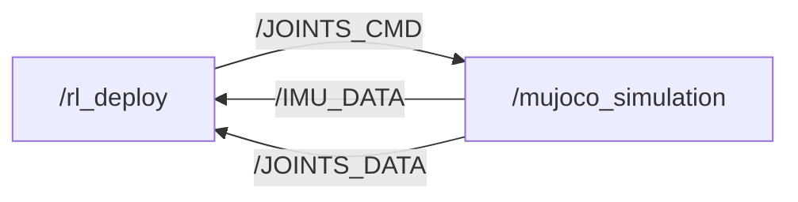
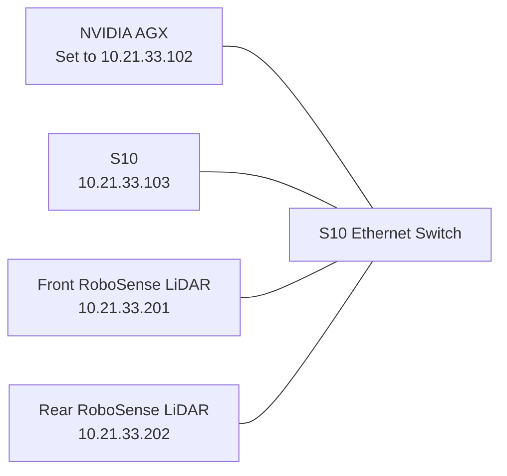

# S10 Perception Racing Contest

[](https://discord.gg/gdM9mQutC8)

## 1. Overview

This repository provides the ROS 2 and MuJoCo simulation environment for a contest focused on racing the S10 robot around a waypoint track using perception. Participants train their own perception-based locomotion policy to control the S10 robot in the provided track scene.

The default MuJoCo scene is `S10_track.xml`, which includes:

- the unscaled S10 robot model from `S10.xml`. The corresponding URDF of S10 is `S10.urdf`.
- the scaled environment from `scene.xml`
- the visual waypoint track from `track_overlay.xml`



## 2. Competition Task

The goal is to complete the waypoint course as quickly as possible. During the track scene, waypoint progress is checked in order. When the robot base enters a `0.2 m` horizontal radius of waypoint 0, the timer starts and that waypoint disappears. Each following waypoint disappears only after the previous one has been reached. When the final waypoint is reached, the timer stops and the elapsed simulation time is printed in the terminal.

Participants are expected to train their own policy with perception. This policy should serve as the locomotion policy for controlling the S10 robot. Participants will need to implement a simulated lidar or depth camera in MuJoCo and use that sensor input as part of their policy pipeline.

For simulation, participants are not required to build a SLAM algorithm. You may directly use the ground truth robot position from MuJoCo. Navigation is optional; if you implement navigation, the final elapsed time will be divided by `1.2` for scoring.

## 3. Setup

### 3.1. Prerequisites

Use Ubuntu 24.04 with ROS 2 Jazzy.

### 3.2. Clone the Repository and Install Dependencies

```bash
pip install "numpy < 2.0" mujoco
git clone https://github.com/DeepRoboticsLab/goai_embodied_future_material.git
cd goai_embodied_future_material
```

### 3.3. Build for Sim-to-Sim

Source ROS and build with the `x86` platform flag:

```bash
source /opt/ros/jazzy/setup.bash
colcon build --packages-up-to s10_sdk_deploy --cmake-args -DBUILD_PLATFORM=x86
```

For sim-to-real deployment, use the `arm` build described in Section 5.

## 4. Sim-to-Sim

The simulation workflow requires two terminals with the same `ROS_DOMAIN_ID`.

### 4.1. Start the Deployment Node

In Terminal 1, run:

```bash
export ROS_DOMAIN_ID=1
source install/setup.bash
ros2 run s10_sdk_deploy rl_deploy
```

### 4.2. Start the MuJoCo Simulator

In Terminal 2, run:

```bash
export ROS_DOMAIN_ID=1
source install/setup.bash
python3 src/S10_sdk_deploy/interface/robot/simulation/mujoco_simulation_ros2.py
```

### 4.3. Load a Custom MJCF

To load a custom MJCF, for example after adding a lidar or depth camera, set
`S10_MUJOCO_XML` when starting the simulator:

```bash
S10_MUJOCO_XML=/absolute/path/to/model.xml \
python3 src/S10_sdk_deploy/interface/robot/simulation/mujoco_simulation_ros2.py
```

## 5. Sim-to-Real

The deployment code can run either on an NVIDIA AGX mounted on the S10 or
directly on the robot. Unlike sim-to-sim, real-robot deployment uses the ARM
build target, requires SDK mode to be enabled from the gamepad, and does not
require the MuJoCo simulation process.

### 5.1. Run from the AGX

#### 5.1.1. Check the Robot Connection

The AGX and the robot must be connected by Ethernet. Before building or
running the deployment node, verify that the AGX can reach the robot:

```bash
ssh user@10.21.33.103
```

Enter the robot's configured password when prompted. If the SSH connection
succeeds, the AGX-to-robot connection is ready. The robot's Wi-Fi network is
`S10-xxxx`, with password `12345678`.

Then, SSH into the AGX:

```bash
ssh ysc@10.21.33.102
```

Password: `'` (a single quote)

#### 5.1.2. Build for ARM

On the AGX, build the workspace for ARM:

```bash
source /opt/ros/jazzy/setup.bash
colcon build --packages-up-to s10_sdk_deploy --cmake-args -DBUILD_PLATFORM=arm
```

#### 5.1.3. Enable SDK Mode

Contact technical support to obtain the authorization code before enabling SDK
mode. Then enable SDK mode on the robot using the gamepad before starting the
deployment node.

#### 5.1.4. Start the Deployment Node

No MuJoCo process is required. From the workspace root, run:

```bash
source install/setup.bash
ros2 run s10_sdk_deploy rl_deploy
```

### 5.2. Run Directly on the Robot

The same repository can also run directly on the S10. In this case, no
AGX-to-robot connection check is needed.

#### 5.2.1. Enable SDK Mode

Contact technical support to obtain the authorization code before enabling SDK
mode. Then enable SDK mode on the robot using the gamepad.

#### 5.2.2. Build for ARM

```bash
source /opt/ros/jazzy/setup.bash
colcon build --packages-up-to s10_sdk_deploy --cmake-args -DBUILD_PLATFORM=arm
```

#### 5.2.3. Start the Deployment Node

From the workspace root, run:

```bash
source install/setup.bash
ros2 run s10_sdk_deploy rl_deploy
```

### 5.3. Real-Robot Gamepad Controls

The real-robot deployment supports gamepad control. The gamepad is currently
selected in [`src/S10_sdk_deploy/main.cpp`](src/S10_sdk_deploy/main.cpp) by
constructing the state machine with
`RemoteCommandType::kGamepad`. To switch the input method, edit the gamepad and
keyboard state-machine construction lines in that file, then rebuild the
workspace.

| Input | Action |
| --- | --- |
| Button `C` | Enter the stand-up state. |
| Button `A` | Enter the RL control state after the robot is standing. |
| Button `B` | Enter the lie-down state. |
| Button `D` | Enter the joint-damping state. |
| Left joystick | Send forward and lateral velocity commands. |
| Right joystick | Send rotational velocity commands. |

## 6. Simulator Reference

### 6.1. Simulator Parameters

The following parameters are defined near the top of
`src/S10_sdk_deploy/interface/robot/simulation/mujoco_simulation_ros2.py`.
Restart the simulator after changing them.

| Parameter | Default | Description |
| --- | --- | --- |
| `USE_VIEWER` | `True` | Enables or disables the MuJoCo viewer. |
| `TRACK_VIEWER` | `False` | Makes the viewer camera follow `TRACK_BODY_NAME` when the simulator starts. |
| `CAMERA_AZIMUTH` | `90` | Initial horizontal camera angle in degrees. |
| `CAMERA_ELEVATION` | `-25` | Initial vertical camera angle in degrees. |
| `CAMERA_DISTANCE` | `18.0` | Initial camera distance from the robot. |
| `TRACK_START_BASE_POS` | `[0.0, -2.5, 0.2]` | Initial robot base position in `[x, y, z]` order. |
| `TRACK_BODY_NAME` | `"base_link"` | MuJoCo body used for waypoint progress and startup camera tracking. |

### 6.2. Manual Controls

In the simulator window:

- `z`: default position
- `c`: RL control default position
- `w/a/s/d`: forward, leftward, backward, rightward
- `q/e`: rotate counterclockwise or clockwise
- `Ctrl` + right-double-click a body: start camera tracking for that body
- `Esc`: stop camera tracking and return to the free camera

Right-click the simulator window and select "always on top" if it loses focus during testing.

## 7. Dual RoboSense LiDAR

The real robot contains front and rear RoboSense RS-LiDAR-AIRY sensors. Both
LiDARs and the S10 connect to an internal Ethernet switch, and the AGX connects
to the same switch through its Ethernet link. They therefore share the
`10.21.33.0/24` network.



| Device | Address | Point-data destination |
| --- | --- | --- |
| AGX Ethernet interface | Set to `10.21.33.102/24` for this setup. | Receives both LiDAR streams. |
| S10 | `10.21.33.103` | Connected through the internal switch. |
| Front LiDAR | `10.21.33.201` | Multicast `224.10.10.201`. |
| Rear LiDAR | `10.21.33.202` | Multicast `224.10.10.202`. |

The LiDAR IP addresses respond to management traffic such as `ping`, but the
point data is delivered through multicast. The AGX must therefore have both a
static address on this subnet and a multicast route on its wired interface.

The tested driver configuration and merger are included as the
[`dual_airy_merger`](src/dual_airy_merger) ROS package. The instructions below
use the tested ROS 2 Jazzy and Ubuntu 24.04 ARM64 setup.

The upstream `rslidar_sdk` and `rslidar_msg` repositories are downloaded during
setup and are not stored in this repository. Only the S10-specific dual-LiDAR
configuration, merger source, network settings, RViz profiles, and service
templates are kept locally.

### 7.1. LiDAR Topics and Data Flow

The RoboSense driver publishes separate transformed point clouds and IMU data
for each LiDAR. The merger synchronizes and combines the two point clouds into
one topic for the policy:

| Topic | Description |
| --- | --- |
| `/rslidar_front/points` | Front point cloud with the front extrinsic transform applied. |
| `/rslidar_rear/points` | Rear point cloud with the rear extrinsic transform applied. |
| `/rslidar_front/imu` | Front LiDAR IMU data. |
| `/rslidar_rear/imu` | Rear LiDAR IMU data. |
| `/LIDAR/POINTS_MERGED` | Synchronized and concatenated front and rear point cloud. |

Both point-cloud inputs use the `lidar_link` frame. The driver applies the
front and rear extrinsic transforms from
[`airy_dual.yaml`](src/dual_airy_merger/config/airy_dual.yaml). The merger
pairs clouds whose sensor timestamps differ by no more than `100 ms` and does
not transform the points a second time.

Do not publish the local merged cloud as `/LIDAR/POINTS`. That name is used by
the robot-side DDS publisher and can cause unnecessary network traffic and a
lower merge rate. Use `/LIDAR/POINTS_MERGED` for the local combined cloud.

### 7.2. Connect to Wi-Fi for Internet Access

The AGX Ethernet interface is dedicated to the LiDAR subnet. To download
packages in the following steps, connect the AGX to a Wi-Fi network with
internet access:

```bash
# Scan for available networks
sudo nmcli device wifi rescan
nmcli device wifi list

# Connect (replace <SSID> and <PASSWORD> with actual values)
sudo nmcli device wifi connect <SSID> password <PASSWORD>

# Verify connectivity
nmcli connection show --active
ping -c 3 8.8.8.8
```

### 7.3. Install the RoboSense Driver and Merger

From the root of this repository, install the dependencies and clone the pinned
RoboSense driver and message repositories into this workspace:

```bash
sudo apt update
sudo apt install -y \
  git \
  python3-colcon-common-extensions \
  libyaml-cpp-dev \
  libpcap-dev

git clone --branch v1.5.19 \
  https://github.com/RoboSense-LiDAR/rslidar_sdk.git src/rslidar_sdk
git -C src/rslidar_sdk submodule update --init --recursive
git clone https://github.com/RoboSense-LiDAR/rslidar_msg.git src/rslidar_msg
git -C src/rslidar_msg checkout fe8a95cb242bd294cc3d5e3422f2093fb49a56ee
```

Build the driver, messages, and merger package:

```bash
source /opt/ros/jazzy/setup.bash
rosdep install --from-paths src --ignore-src -r -y
colcon build --symlink-install \
  --packages-up-to rslidar_sdk dual_airy_merger
```

### 7.4. Install the Runtime Configuration

From the root of this repository, install the tested Fast DDS and UDP
receive-buffer configurations:

```bash
mkdir -p ~/.ros
cp src/dual_airy_merger/config/fastdds_ethernet.xml ~/.ros/
sudo cp src/dual_airy_merger/config/99-rslidar-network.conf \
  /etc/sysctl.d/
sudo sysctl --system
```

The AGX address is not configured automatically. The supplied files expect
`10.21.33.102`, so explicitly set the AGX wired interface to
`10.21.33.102/24`. If that address cannot be used, choose another unused
address in the `10.21.33.0/24` subnet and update both `host_address` entries in
`src/dual_airy_merger/config/airy_dual.yaml` and the interface address in
`~/.ros/fastdds_ethernet.xml` to match.

### 7.5. Set and Check the AGX Ethernet Address

Find the AGX wired connection name with `nmcli connection show`. Then set an
unused static address and add the persistent multicast route. The commands
below set the expected `10.21.33.102/24` address. Replace `Wired connection 1`
if the connection has a different name. If `.102` cannot be used, replace it
here and in the runtime configuration described in Section 7.4:

```bash
sudo nmcli connection modify "Wired connection 1" \
  ipv4.method manual ipv4.addresses 10.21.33.102/24
sudo nmcli connection modify "Wired connection 1" \
  +ipv4.routes "224.10.10.0/24"
sudo nmcli connection up "Wired connection 1"
```

Verify the route and confirm that both LiDARs are reachable:

```bash
ip route | grep 224.10.10
ping -c 3 10.21.33.201
ping -c 3 10.21.33.202
```

Successful pings confirm management connectivity. Point-cloud reception also
requires the multicast route shown by the first command.

### 7.6. Start the Front and Rear LiDAR Topics

In Terminal 1, source the LiDAR workspace, restrict Fast DDS to the Ethernet
interface, and start the RoboSense driver with the dual-LiDAR configuration:

```bash
source /opt/ros/jazzy/setup.bash
source install/setup.bash
export FASTRTPS_DEFAULT_PROFILES_FILE=~/.ros/fastdds_ethernet.xml
ros2 run rslidar_sdk rslidar_sdk_node --ros-args \
  -p config_path:=src/dual_airy_merger/config/airy_dual.yaml
```

This single driver process publishes the separate front and rear topics listed
in Section 7.1.

### 7.7. Merge the Two Point Clouds

In Terminal 2, run the included merger node:

```bash
source /opt/ros/jazzy/setup.bash
source install/setup.bash
export FASTRTPS_DEFAULT_PROFILES_FILE=~/.ros/fastdds_ethernet.xml
ros2 run dual_airy_merger dual_airy_merger_node
```

The merged point cloud is published on `/LIDAR/POINTS_MERGED`.

### 7.8. Verify the LiDAR Topics

In Terminal 3, check the front, rear, and merged point-cloud rates:

```bash
source /opt/ros/jazzy/setup.bash
source install/setup.bash
export FASTRTPS_DEFAULT_PROFILES_FILE=~/.ros/fastdds_ethernet.xml
ros2 topic hz /rslidar_front/points
ros2 topic hz /rslidar_rear/points
ros2 topic hz /LIDAR/POINTS_MERGED
ros2 topic echo /LIDAR/POINTS_MERGED --once --field width
```

The expected rate is approximately `10 Hz` for all three point-cloud topics.
For RViz, use `lidar_link` as the fixed frame and set the PointCloud2
reliability policy to `Best Effort`. From the repository root, open the
ready-to-use configuration:

```bash
rviz2 -d src/dual_airy_merger/config/merged_airy.rviz
```

The separate-cloud RViz configuration is also available at
`src/dual_airy_merger/config/dual_airy.rviz`.

### 7.9. Optional Automatic Startup

Service templates are provided in `src/dual_airy_merger/systemd`. Before
installing them, replace `AGX_USER` and `REPOSITORY_ROOT` in both files with the
AGX account name and the absolute path to this repository. Systemd service
files require absolute paths.

Then install and start the services:

```bash
sudo cp src/dual_airy_merger/systemd/rslidar-dual.service \
  src/dual_airy_merger/systemd/rslidar-merge.service \
  /etc/systemd/system/
sudo systemctl daemon-reload
sudo systemctl enable --now rslidar-dual.service rslidar-merge.service
systemctl --no-pager status rslidar-dual.service rslidar-merge.service
```

Restart both services after changing the LiDAR configuration:

```bash
sudo systemctl restart rslidar-dual.service rslidar-merge.service
```

### 7.10. LiDAR Troubleshooting

- If ping works but no clouds are published, confirm that `224.10.10.0/24`
  routes through the wired LiDAR interface and inspect multicast packets with
  `tcpdump`.
- `ERRCODE_MSOPTIMEOUT` means the SDK is not receiving measurement packets.
  Check LiDAR power, multicast routing, the host address, ports, and Ethernet
  link state.
- If a topic exists but RViz is blank, set the fixed frame to `lidar_link` and
  PointCloud2 reliability to `Best Effort`.
- If merging is slower than the raw clouds, confirm that the merger publishes
  only `/LIDAR/POINTS_MERGED` and that no obsolete relay subscribes to the
  S10's `/LIDAR/POINTS` topic.

## 8. Depth Camera (Intel RealSense D435i)

An Intel RealSense D435i can be connected to the NVIDIA AGX to provide depth
camera data to a real-robot policy. The following steps were tested on a Jetson
AGX Orin running Ubuntu 24.04, ROS 2 Jazzy, and the NVIDIA
`6.8.12-1021-tegra` kernel.

This installation uses Librealsense's userspace USB (LibUVC/RSUSB) backend, so
no kernel patch is required. This is useful on Jetson kernels that are not
supported by the standard DKMS package. The procedure is based on the upstream
[LibUVC-backend installation guide](https://github.com/realsenseai/librealsense/blob/master/doc/libuvc_installation.md).

Disconnect the D435i from the AGX before starting the driver installation.
The Librealsense source and ROS wrapper are downloaded during setup; no
RealSense driver source or binary is stored in this repository.

### 8.1. Install the Librealsense Driver and Tools

Run the Librealsense LibUVC installer on the AGX:

```bash
cd ~
wget https://github.com/realsenseai/librealsense/raw/master/scripts/libuvc_installation.sh
chmod +x libuvc_installation.sh
./libuvc_installation.sh
```

The script installs the build dependencies, copies the RealSense udev rules,
builds Librealsense with `FORCE_LIBUVC=true`, and installs its libraries and
tools under `/usr/local`. Although `FORCE_LIBUVC` is deprecated in favor of
`FORCE_RSUSB_BACKEND`, Librealsense 2.58 still accepts it and selects the same
userspace USB backend.

#### 8.1.1. GitHub Download Fallback

The source archive is approximately 35 MB. If a proxy repeatedly interrupts
the GitHub download, download the archive without the proxy and continue the
remaining installation steps manually:

```bash
cd ~/librealsense_build
curl --noproxy '*' -fL --retry 20 --retry-all-errors --retry-delay 2 \
  -o master.zip https://github.com/realsenseai/librealsense/archive/master.zip
unzip master.zip
cd librealsense-master

sudo cp config/99-realsense-libusb.rules /etc/udev/rules.d/
sudo cp config/99-realsense-d4xx-mipi-dfu.rules /etc/udev/rules.d/
sudo udevadm control --reload-rules
sudo udevadm trigger

mkdir -p build
cd build
cmake .. -DFORCE_LIBUVC=true -DCMAKE_BUILD_TYPE=release
make -j"$(nproc)"
sudo make install
sudo ldconfig
```

### 8.2. Connect and Verify the D435i

Connect the D435i to the AGX after the installation finishes, then verify that
Librealsense detects it:

```bash
rs-enumerate-devices --version
rs-enumerate-devices
```

The tested build reports Librealsense `2.58.3`. If the second command reports
`No device detected`, check the USB cable and power, reconnect the camera after
the udev rules have loaded, and run `lsusb` before retrying.

### 8.3. Install the ROS 2 Jazzy Packages

Install the ARM64 RealSense camera wrapper, messages, and robot-description
packages from the configured ROS 2 repository:

```bash
sudo apt update
sudo apt install -y \
  ros-jazzy-realsense2-camera \
  ros-jazzy-realsense2-camera-msgs \
  ros-jazzy-realsense2-description
```

The binary wrapper also installs `ros-jazzy-librealsense2` under
`/opt/ros/jazzy` as a dependency. This setup was tested with RealSense ROS
`4.58.1` and its matching Librealsense `2.58.1` runtime.

### 8.4. Start the ROS 2 Camera Node

Connect the D435i and start the camera node in a separate terminal:

```bash
source /opt/ros/jazzy/setup.bash
ros2 run realsense2_camera realsense2_camera_node
```

Alternatively, use the launch file when camera parameters are required:

```bash
source /opt/ros/jazzy/setup.bash
ros2 launch realsense2_camera rs_launch.py
```

For example, enable aligned depth data and the point cloud with:

```bash
ros2 launch realsense2_camera rs_launch.py \
  align_depth.enable:=true pointcloud.enable:=true
```

### 8.5. Verify the Node and Depth Topic

In a second terminal, verify the node and inspect the camera topics:

```bash
source /opt/ros/jazzy/setup.bash
ros2 node list | grep /camera/camera
ros2 topic list | grep '^/camera/'
ros2 topic hz /camera/camera/depth/image_rect_raw
```

The node can start without a connected camera and register `/camera/camera`,
but it will log `No RealSense devices were found!` and will not publish image
streams. A connected D435i is required to verify the depth topic rate. Stop the
camera node with `Ctrl-C`.
