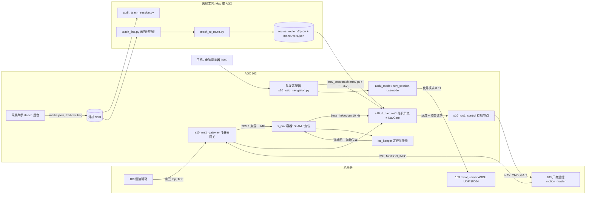

# S10 自动导航：整条链路与规划策略

更新：2026-09-21（北京时间）｜当前机器：48 号狗（`CS10100048`），AGX（102）随狗供电｜场地地图：`v7_o`（29 个 WP，约 280 m，高差 6.6 m）

状态标记：✅ 真机验证过｜🧪 只在仿真或离线测试里验证过｜❓ 还没验证

---

## 0. 先看这几条

- **一句话：** x_nav 只负责定位；路线来自“人工示教 + 自动拉直”；我们自己的跟踪器沿线走，通过厂商运控的速度接口和步态接口驱动狗；页面（队友的 app）负责遥控和导航之间的切换。
- **真机上验证过的只有平地短路线**（9 月 20 日，`v6_room`，5 m，0.1～0.7 m/s）。整圈 `v7_o`（含台阶步态）目前只在运动学仿真里跑通：29/29 个点、505 秒、平均 0.53 m/s、5 次步态切换。
- **台阶步态区内是盲走**：不看局部高度图和障碍扫描，照示教走过的线走。路线上必须清空，操作员拿着急停跟随。
- **WP 的到达规则**：机身任意部位进 WP 20 cm 就算到。机身 0.9 × 0.5 m，所以“机身中心离 WP 不超过 0.45 m”就一定满足。路线只需要从标点旁边经过，不需要踩到标点（有些 WP 在狗上不去的高台边上）。
- 狗是共用的：还狗前执行 `robot_session.sh tls restore`、`down`、`unkeys`。

---

## 1. 链路总览



| 环节 | 程序 | 输入 → 输出 | 状态 |
|---|---|---|---|
| 传感器网关 | `s10_ros1_gateway`（C++）+ 106 上的 `s10_lidar_tap.py` | 狗的 ROS 2 点云、IMU → AGX 的 ROS 1 话题 | ✅ 10 Hz / 200 Hz |
| 定位 | 厂商 x_nav 容器（`x_slam localization <地图>`） | 点云 + IMU → `/base_link/odom` | ✅（高度 z 不可靠，见 3.2） |
| 定位保持 | `scripts/loc_keeper.py` | 每秒存位姿；重启后选回地图并恢复位姿 | 🧪 选地图 ✅，恢复位姿 ❓ |
| 采集 | `/teach` 页面 + `teach_worker.py` | 建图录包、WP 标点、示教轨迹 → SSD | ✅ |
| 审计 | `tools/audit_teach_session.py` | 会话 → 报告 + 图（含操作员实际步态） | ✅（离线） |
| 示教线 | `tools/teach_line.py` | 多次示教 + x_nav 地图 → 拉直的线 + 步态区 | 🧪 |
| 路线 | `tools/teach_to_route.py` | 示教线 → `route_v2.json` / `maneuvers.json` | ✅ 平地，🧪 台阶 |
| 导航 | `nav/s10_rl_nav_ros1.py` + `nav/nav_core.py` + 团队的 `s10_auto_nav` | 位姿 + 点云 + 路线 → 速度 + 步态请求 | ✅ 平地，🧪 整圈 |
| 控制 | `s10_ros1_control`（C++） | 速度 + 步态请求 → `/NAV_CMD`、`/GAIT`，限幅、独占、看门狗 | ✅ |
| 使用模式 | `tools/asdu_mode.py` | 常规(0) ↔ 导航(1)；`/NAV_CMD` 只在导航模式生效 | ✅ |
| 页面 | 队友的 8090 页面（103）+ AGX 适配器 | 遥控 ↔ 导航热切换 | 🧪 本版补丁未真机走过 |

---

## 2. 使用说明

### 2.1 每次上电（Mac 上）

```bash
bash ~/Documents/ChatGPT/GOAI/s10-real-readiness/ros1_gateway/scripts/robot_session.sh up
```

看到 `HEALTH_OK` 即可。AGX 开机会自动起：x_nav 容器、网关（IMU 不通会自动重启网关）、控制节点（只读）、采集后台（自动打开上次会话）、定位保持器（自动选回上次地图并恢复位姿）。换狗或还狗后第一次要先 `keys`、`autostart`。

### 2.2 新场地：建图 → 标点 → 示教（手机页面 `http://10.21.33.102:8080/teach`）

1. x_nav 页面（`:8000`）新增地图并回车 → `/teach` 新建会话、① 建图、开始采集 → 遥控走一圈 → **x_nav 保存地图** → 结束采集。
2. x_nav 选中该地图、设置位姿（之后不再需要 x_nav 页面）。
3. ② 标点：每个 WP 停稳按一次。WP 在高台边上时，把狗开到能贴近的位置标即可。
4. ③ 示教：从 WP01 到最后一个 WP **完整走 2～3 遍**（遍数越多，拉直时可用的走廊越宽）。最后两遍用你比赛时打算用的步态走：步态区取自你的实际操作，不用再按“进台阶 / 出台阶”。

### 2.3 生成路线（AGX 或 Mac 上，几秒钟）

```bash
S=/mnt/s10ssd/s10_teach/sessions/<会话目录>
python3 tools/audit_teach_session.py $S --control-logs ~/ros1_gateway/logs --map /opt/data/nav_map/<地图>/global_map_downsize.pcd --out /tmp/audit
python3 tools/teach_line.py $S --map-dir /opt/data/nav_map/<地图> --control-logs ~/ros1_gateway/logs --out /tmp/teach_line   # 可加 --free-at WP06:2.5（操作员确认该标点周围没有障碍）
python3 tools/teach_to_route.py /tmp/teach_line/derived_session --map-id <地图> --out ~/routes/<路线名> --tol-z 5 --step 0.10
python3 tools/verify_route_clearance.py ~/routes/<路线名> $S --map-dir /opt/data/nav_map/<地图>   # 必须打印 ROUTE_CLEARANCE_OK；teach_line 用了 --free-at 的话这里给同一个值
python3 tests/nav/sim_full_route.py ~/routes/<路线名> 0.8 0.5        # 必须打印 SIM_FULL_ROUTE_OK
```

**`verify_route_clearance.py` 是硬性关卡**：它用 0.9 × 0.5 m 的机身轮廓沿路线扫一遍，结果写进路线目录的 `clearance.json`；机身压到障碍的路线，导航节点会拒绝加载。`teach_line.py` 自己也做同样的检查，修不掉就以退出码 3 结束、不应继续。

先看 `audit` 的输出（哪几遍示教是完整的、有没有摔倒），再看 `teach_line.png`（线有没有穿过灰色障碍、每个 WP 的绿圈是否被经过）。想只走前几个点：`teach_to_route.py … --last-wp WP03`。

### 2.4 运行（队友的页面，推荐）

`http://10.21.33.102:8090/` → 路线导航 → 选地图和路线 → “使用当前位置 · 沿途接入” → 核对黄色箭头 → 准备导航 → 开始导航。

- 导航中点“手动遥控”：先发零速停住（等同软急停），再关掉运动输出、切回常规模式和遥控步态，全程不趴下。
- 速度在 AGX 的 `~/ros1_gateway/config/web_nav.json`：`speed`（平地）、`climb_speed`（台阶步态段）、`allow_stairs`（是否列出带台阶的路线）。改完下一次“开始导航”生效。
- 没有位姿时（x_nav 刚重启）：页面的“使用当前位置”会先让定位保持器恢复上次位姿；狗被搬动过就选“在起点重新定位”。

### 2.5 命令行备用（Mac 上一条命令）

```bash
robot_session.sh nav --speed 0.5 [--route short|full|<目录>] [--climb-speed 0.4] [--at start|end] [--shadow]
robot_session.sh navstop
```

AGX 上的细分命令：`nav_session.sh route|shadow|arm|go|pause|stop|watch|usemode|loc`。`loc restore` / `loc wp WP05` 不经过 x_nav 页面恢复定位。

---

## 3. 各环节要点

### 3.1 传感器网关
- 106 的点云只在本机可见，所以在 106 上跑一个只读的转发脚本（`tap/`），用 TCP 发到 AGX；IMU 走狗的 ROS 2。网关把两者转成 ROS 1。
- `/LIDAR/POINTS` 已经在机身坐标系（前后两个雷达合并后的云，外参为单位阵；050 和 048 上都用地面拟合验证过）。
- 已知问题：网关比狗的 DDS 先起来时，IMU 会一直 0 Hz，x_nav 因此没有位姿。开机脚本现在会检测并重启网关。

### 3.2 定位（x_nav）
- 输出 `/base_link/odom` 10 Hz。**x、y、朝向可用；高度 z 不可用**：同一位置前后能差 0.5 m，三次示教之间最大差 0.63 m。所以导航不用它的 z（`ignore_pose_z: true`，高度取路线自身），路线的到点判定也不看高度（`--tol-z 5`）。
- 俯仰 / 横滚也不用 x_nav 的（048 上报 −3.5°，狗实际水平），用狗自己的 `/IMU`。
- x_nav 每次重启都会忘记地图和位姿。`loc_keeper.py` 每秒把位姿原子写入 `run/last_pose.json`；重启后发 `/node_cmd launch_navigation#<地图>`（✅ 1 秒内生效）再发 `/initialpose`。恢复的位姿只有在狗没被搬动时才对，导航开始前页面要人工确认。

### 3.3 采集
- 建图录包每分钟约 1.5 GB，直接录到外接 SSD（`/mnt/s10ssd/s10_teach`）。标点每条立即落盘，轨迹每 2 秒落盘，AGX 突然断电最多丢 2 秒。
- 控制节点（只读）一直在记 `/MOTION_INFO` 的步态变化事件，所以示教时操作员用的步态可以按时间对回轨迹上。

### 3.4 控制节点 `s10_ros1_control`
- 唯一向狗发运动指令的程序。不带 `--enable-motion` 时是只读（连发布者都不创建）。
- 10 Hz 发 `/NAV_CMD`；限幅（运行时由 `arm <速度>` 决定，代码只拒绝超出狗指令范围 1.67 / 0.5 / 1.0 的配置）；指令超时 0.5 s 归零；`/MOTION_INFO` 过期归零；别的程序发 `/NAV_CMD` 就锁死报故障；切步态前先停稳 ≥ 1 秒、发 `/GAIT`、10 秒内确认，否则锁停。
- 上电后只接受 `/rl_nav/cmd_vel` 这一个速度源，命令走私有话题，x_nav 页面上的按钮动不了狗。

### 3.5 使用模式
- 开发指南 2.3.1：`/NAV_CMD` 只在导航模式（1）生效。048 出厂时 ASDU 端口加密，改 `Network.toml` 的 `enableTls=false` 并重启狗后明文可用（还狗前 `tls restore`）。导航模式下遥控器摇杆很可能无效，急停仍有效。

---

## 4. 规划策略

### 4.1 思路
比赛路线是固定的，人已经用遥控器证明了哪里能走。所以不做全局规划，做 **teach-and-repeat**：把人走过的线整理成一条好线，机器人只负责沿线走准、走顺。规划上的聪明都放在“整理这条线”上，运行时越简单越稳（“第一版按标称走”的原则）。

### 4.2 示教线生成 `tools/teach_line.py`
操作员是一下一下推杆的，轨迹是折线：完整示教每遍有 120～210 个大于 15° 的拐点，直行比例只有 35%～50%。照着走，狗会一直纠偏、踏步。

1. **障碍点（0.1 m 栅格的格心）**：x_nav 保存的全量点云减去它自己的地面点云，取地面以上 0.20～1.00 m 的点。v7_o 路边 3 m 内有约 6 万个这样的格子，八成高于 0.40 m（灌木、围栏、墙、人影），不是草皮噪声。
2. **安全判据（`teach_line.Clearance`，生成器和独立检查工具共用）**：对每个障碍点精确计算它到机身矩形（0.9 × 0.5 m）的距离。`d_op` = 示教时操作员的机身离它最近到多少（包括标点那一趟），`d_new` = 新路线的机身离它最近到多少。**违规 = `d_new` < 5 cm 且 `d_new` < `d_op` − 3 cm**。也就是：机身离任何东西至少留 5 cm，除非操作员当时就贴得这么近；操作员机身压过的点（台阶立面、路沿、垂下的枝叶）不算障碍；操作员没碰过的障碍，新路线的机身一碰就是违规。用连续几何而不是栅格比较，结果不受路线采样方式影响。
3. **走廊**：所有示教轨迹周围 0.5 m（台阶步态段 0.25 m）的并集，加上标点那一趟在各标点 2.5 m 内的轨迹。线只允许在“有人走过的地方”横向移动，所以真正绕障的弯会保留，空地上的晃动会被拉直。机身中心另外要离未碰过的障碍至少 0.35 m，只有严格踩在示教轨迹上时例外（窄处只能照人走的线走）。
4. **参考线**：在触碰到最多 WP 的示教里选转向最少的一遍，整圈用同一遍。
5. **WP 是触碰圆，不是必经点**：判定用机身矩形。参考线的机身扫掠离标点超过 5 cm 时，才把参考线朝标点平滑弯过去（2 m 余弦鼓包），而且只弯到不违反安全判据为止（100% → 80% → … → 20%）。
6. **视线拉直**：贪心地找最远的可直连顶点；直连线段必须全程在允许区域内，并且被跳过的 WP 仍在触碰距离内。
7. **圆角**：每个拐角用放得下的最大圆弧（最大 1.2 m）替换，圆弧也要满足上面的条件。
8. **死胡同掉头**：进去再原路出来的 WP，进出两条线重合会让纯追踪的目标点落在狗自己身上、原地来回转。放得下时改成靠右行驶的小发卡弯（两侧相隔 0.3～0.4 m）。
9. **最后一道关卡（机身扫掠）**：对整条线跑一遍安全判据。违规的路段换回操作员自己走的那段线（只在两条线重合或两侧空旷处切入切出）；还不行就把整段 WP 到 WP 的路交还给操作员的线；仍有违规则报 `TEACH_LINE_UNSAFE`、退出码 3。
10. **门（gate）**：路线里每个 WP 的位置用线上的贴近点，半径取两种保证里较大的一个：`0.45 − 中心偏移` 或 `0.20 − 机身到标点的距离`，最小 0.15 m。两种都给不出 0.15 m 的 WP 会被列为“无保证”。
11. **步态区**：把控制节点记录的步态变化按时间对到示教轨迹上，取后几遍示教的多数票，投到新线上得到按路程计的区间。
12. **高度**：所有示教的 z 取中位数再平滑。

v7_o 上的结果（加上安全判据之后，`--free-at WP06:2.5`）：直行比例 35%～50% → 78%，总转向量 9390°～14313° → 约 3000°，长度 293～322 m → 276.5 m；7 段被退回到操作员的线；**独立检查：机身压到障碍 0 处，进 5 cm 余量 0 处；29 个 WP 全部有保证**。步态区 15～97 m、114～122 m、219～276.5 m，与操作员后两遍示教的切换位置一致。

**操作员声明“这里没有障碍”（`--free-at`）**：WP06 周围的地图里有 0.2～1.4 m 高的点（多半是标点时站在旁边的人留下的残影），不加声明时安全的线上机身离标点 0.34 m，碰不到。操作员确认现场没有东西后，用 `--free-at WP06:2.5` 忽略该标点 2.5 m 内的地图障碍（1801 格），生成器和独立检查要用同一个参数；检查结果的 `clearance.json` 里记着 `free_at`，谁、在哪、忽略了多少格都可查。这是人工声明，不是检测结果：只在操作员亲眼确认过的标点上用。

对照：旧流程（单遍示教原样生成，段端点硬拉到标点上）在同一检查下有 29 个格子被机身压到。所以 9 月 21 日凌晨放到 AGX 上的三条 v7_o 路线（`20260920-223720-v7_o-short`、`20260921-v7_o-line-short`、`20260921-v7_o-line-full`）都**不要运行**，换成通过检查的版本。

### 4.3 沿线跟踪（`nav/nav_core.py` 包着团队的 `s10_auto_nav`）
- **跟踪器**：团队的 `RouteFollowerCore`（局部栅格 + 候选偏移 + 纯追踪）。我们用 Regulated Pure Pursuit 的思路调参：前视距离 1.0 m + 0.8 s × 速度；转向增益 1.0；航向误差超过 70° 才原地转；35°～70° 之间只减速到 40%；终点前 0.6 m 减速。
- **局部规划代价**：横向偏移、换边、保持当前目标的代价都调高（3.0 / 3.0 / 1.0），只有真被挡时才离开示教线。
- **保龄球道**：横向偏差 ±10 cm 且航向误差 ±6° 以内不纠偏；出界后纠偏量从边界起平滑增长，回到 5 cm 内才停；前方 1.2 m 内路线转向超过 12° 或跟踪器要原地转时交还给跟踪器（否则会和转弯抢方向而停死）。
- **输出平滑**：前进加速度 0.6 m/s²、减速 1.0 m/s²，转向角加速度 1.5 rad/s²，横移和转向各加 0.25 s 低通；暂停、HOLD、完成立即停。
- **感知修正**：机身盒子内的自身点（腿）丢弃；机身 0.6 m 内的地面视为可走；雷达盲区用最近的已知高度补齐；平地台阶阈值 0.15 m。
- **台阶步态区（`zone_mode: gait_only`）**：同一个跟踪器，只按路程切步态和限速；区内和标为台阶的路段用“路线自身高度”合成高度图并给规划器全空栅格（盲走）。原来为 RL 台阶策略设计的“靠近 / 对正 / 攀爬”状态机（`zone_mode: maneuver`）保留可选，但不适合厂商步态（9 月 20 日真机试过一次：攀爬 25 秒无进展）。
- **投影**：沿路线最多回退 0.2 m（`tracker_back`），掉头处不会跳回进来的那条线。
- **安全停车**：位姿超时 0.3 s、定位跳变 > 0.5 m 或 30°、控制节点故障或锁停、内部异常 → 零速并暂停；8 秒内前进不到 0.3 m → HOLD，要重新开始。

### 4.4 已知的上游问题（用配置绕开，没改团队代码）
规划器在路径受 WP 限制时，把最后一个采样点强行放到 WP 位置并检查机身在那里有没有碰撞。WP 在高台边缘就永远“被挡”，禁止绕行的路段会直接停死。绕开办法：门放在示教线上（4.2 第 8 条）+ `planner.min_horizon: 0.65`、`commit_length_flat: 0.6`。

---

## 5. 主要参数在哪改

| 想改什么 | 文件 | 键 |
|---|---|---|
| 页面运行的速度、是否列出台阶路线 | `config/web_nav.json` | `speed`、`climb_speed`、`allow_stairs` |
| 命令行运行的速度 | 命令参数 | `nav --speed 0.8 --climb-speed 0.4`（或 `0.7x` = 厂商上限的倍数） |
| 纠偏手感 | `config/nav.yaml` | `lane.*`、`smooth.*`、`gains.*` |
| 离开示教线的意愿 | `config/nav.yaml` | `planner.w_lat`、`w_side_switch`、`switch_margin` |
| 台阶区策略 | `config/nav.yaml` | `zone_mode`（`gait_only` / `maneuver`）、`zone_blind` |
| WP 触碰规则 | `tools/teach_line.py` 参数 | `--reach 0.45`、`--touch 0.20` |
| 拉直的激进程度 | 同上 | `--corridor 0.5`、`--corridor-stairs 0.25`、`--inflate 0.40`、`--fillet 1.2` |

---

## 6. 测试

| 命令 | 说明 |
|---|---|
| `python3 tools/verify_route_clearance.py <路线> <会话> --map-dir <地图目录>` | 独立的机身扫掠检查，写 `clearance.json` 和 `clearance.png`；HARD 必须为 0 |
| `python3 tests/nav/sim_full_route.py <路线> 0.8 0.5` | 整条路线的运动学仿真，含步态切换仿真。v7_o：29/29 |
| `NAV_TEST_OVERRIDES='zone_mode=maneuver' python3 tests/nav/test_nav_core.py --stairs-zones --max-s 3000` | 旧的 30 点路线（旧台阶模式） |
| `python3 tests/nav/sim_tracking_noise.py <路线> 0.7` | 带定位噪声和延迟的直线段，对比新旧跟踪参数 |
| `python3 tests/nav/test_node_safety_stub.py <路线>` | 影子模式不发指令、定位跳变暂停、异常零速 |
| `bash scripts/deploy_nav.sh` | 同步到 AGX、编译控制节点、在 AGX 上跑控制模拟测试（35+7 项）和 ROS 1 端到端测试 |
| 队友的 `python -m unittest test_asdu_navigation …` | 打了我们补丁的适配器：48/49 通过，剩下 1 项是测试机网卡绑定问题，与适配器无关；两处期望值按新行为改了（速度来自配置、接入信息多了 `s_shift`） |

---

## 7. 还没验证 / 已知限制

- ❓ 整圈 v7_o 真机运行：台阶步态下的实际速度、盲走区的表现、发卡弯、0.45 m 触碰规则在裁判眼里是否成立。
- ❓ 定位保持器的“重启后恢复位姿”；页面补丁版的完整流程（准备 → 开始 → 手动接管 → 再接入）。
- ⚠️ 障碍来自 x_nav 的静态地图：建图之后才出现的东西、地图里被当成障碍的路人残影，这个检查都管不了；运行时平地段有局部高度图，台阶步态区内是盲走。
- ❓ 如果某个标点本来就是“狗鼻子刚好够到”的极限位置，0.20 m 的贴近余量可能不够：用 `--touch 0.05` 重新生成，或告诉我们是哪几个点。
- 台阶步态区内没有任何障碍检测。
- 没有全局重定位：狗被搬动后必须放到路线起点（或某个 WP）重新给位姿。
- 页面切换耗时约 10 秒，大头是控制节点自身启动约 5 秒。要降到 2 秒需要给控制节点加运行时上电 / 撤电（未做，涉及“开机即创建运动发布者”的安全取舍）。
- AGX 曾多次意外重启：电源记录显示重启前电压、温度都正常，是外部断电或复位，怀疑供电接头。

## 8. 回退

- 路线：不用 `teach_line.py`，直接对原会话跑 `teach_to_route.py` 就是旧行为。
- 跟踪：`nav.yaml` 里 `lane.enabled: false`、`smooth.enabled: false`、`zone_mode: maneuver`、`ignore_pose_z: false`。
- 页面适配器：`~/golai-web-entry/backup_20260921-navteam/` 里是队友原版；拷回去并重启适配器进程。
- 代码基线：仓库主分支 PR #9（31c9c39）是 9 月 20 日的快照；本文描述的改动在其之后。

## 9. 文件索引

| 路径 | 内容 |
|---|---|
| `scripts/robot_session.sh` | Mac 上的总入口：`up`/`down`/`status`/`keys`/`unkeys`/`autostart`/`nav`/`navstop`/`tls` |
| `scripts/nav_session.sh`、`nav_run.py` | AGX 上的导航命令和一键运行 |
| `scripts/loc_keeper.py`、`agx_boot.sh` | 定位保持、开机自启 |
| `nav/nav_core.py`、`nav/s10_rl_nav_ros1.py` | 我们的导航层和 ROS 1 节点 |
| `nav/s10_auto_nav/` | 团队规划核心的拷贝（`nav/sync_auto_nav.sh` 同步，勿手改） |
| `tools/audit_teach_session.py`、`teach_line.py`、`teach_to_route.py`、`make_demo_video.py` | 离线工具 |
| `web_entry/` | 队友适配器的补丁版和原版 |
| `config/nav.yaml`、`control.yaml`、`web_nav.json` | 参数 |
| `docs/` | 本文、`HANDOFF_S10_AUTONOMY_STACK.md`（英文接口手册）、`ROOM_NAV_RUNBOOK_ZH.md`、`EXPERIMENT_048_ZH.md` |
| `field_data/20260920-v7_o/`（不进仓库） | v7_o 的标点、示教、地图、日志、图和视频 |

---

## 10. strategy1（2026-09-21 中午，第一次整圈真机之后）

strategy0 = 9 月 21 日上午跑过的版本，整包备份在 Mac 的 `s10-real-readiness/backups/strategy0_20260921-*.tgz` 和 AGX 的 `~/strategy0_20260921/`（代码、配置、路线、页面适配器）。回退：解包覆盖 `~/ros1_gateway` 和 `~/routes` 即可。

真机日志（WP10→WP29，569 秒）的结论：66% 的时间在台阶步态里以 0.30 m/s 走（路线默认的台阶限速；操作员自己在台阶步态下的中位速度是 0.73 m/s）；平地段平均 0.69 m/s，被“前方可见空间不足”的缩放和侧移纠偏拖慢；回线靠侧移（vy），狗在侧移时踏步减速。

| 改动 | 位置 |
|---|---|
| 回线改成转向为主（Stanley：朝线偏一个角度 `atan(0.9·偏差/速度)`，最大 20°，侧移只留 30%） | `nav_core._lane`，`nav.yaml` `lane.steer*` |
| 加速度 0.6→2.0 m/s²，减速 1.0→3.0，转向 1.5→4.0 rad/s²，低通 0.25→0.10 s；对准减速下限 0.4→0.7；规划器速度缩放下限 0.6→0.7、满速所需可见长度 1.0→0.8 m | `nav.yaml` |
| 台阶步态区内的速度按路程给：平缓处 0.7 m/s，地图显示有台阶/坡的地方 0.45 m/s（`--climb-speed` 改的是前者） | `nav.yaml` `zone_speed`，路线目录的 `terrain.json` |
| 台阶步态区 = 操作员用台阶步态 **且** 地面地图显示有台阶/坡（前后各留 1.5 m，小于 6 m 的间隙不切换）；v7_o 上台阶步态从 148 m 降到约 115 m | `teach_line.py --terrain-zones` |
| 补录的局部示教可以替换参考线：`--splice`（WP08→10、WP14→18、WP29→30）；`--drop WP25`；`--contact WP17,WP24`（必须顶到墙才碰得到的点：线走到标点本身，标点 1.5 m 内的墙不算障碍，运行时该范围内不看局部障碍） | `teach_line.py` |
| 朝标点弯线时先试窄鼓包，并且每个候选都过机身扫掠；修复之后再对最终的线弯一次；判据容差 3→5 cm（地图栅格 10 cm，操作员自己的线以前会因为 1 cm 判违规） | `teach_line.py` |
| 中途续跑 `nav --from WP08|here`；带台阶区的路线也能从狗站的位置起步 | `nav_run.py` |

v7_o 新路线 `20260921b-v7_o-s1-full`：29 个点（去 WP25、加 WP30），279.7 m，直行比例 86%，总转向 2209°，WP06 不再需要“忽略障碍”；独立检查 HARD 0 / SOFT 0；仿真 29/29，413 秒（strategy0 同速约 470 秒）。以上都还没上真机。

---

## 11. strategy3（2026-09-21 15:40，四步态第一次上真机之后）

真机结果（15:10，`20260921c-v7_o-s2-full`，`--speed 1`）：切到快走 `0xF002` 之后，指令约 0.9 m/s，沿线进度每秒约 2.7 m，8 秒内偏线 0.8 m 进入 HOLD。这个步态不按指令速度走，不能用来跟线。之后三次 `--from here / wp08` 续跑都在加载路线时失败，页面连按十几次“返回遥控”都被拒。

| 改动 | 位置 |
|---|---|
| 取消快走：步态规划只剩楼梯和高台，其余都是走路步态 `0x3002`；生成器里 `--fast-gait` 默认 0（保留开关） | `tools/teach_line.py` |
| 走路步态不再另设上限（`zone_speed.walk: 0` = 用 `--speed`，和室内测试一样）；弯道限速保留 | `nav/nav_core.py`、`config/nav.yaml` |
| 续跑失败的原因：把路线起点挪到狗的位置时，第一个点的高度还是原 WP 的高度，坡上两者不一致，团队的路线校验拒绝（“centerline does not end near WP08”）。改成取线在狗脚下的高度 | `scripts/nav_run.py` |
| 新测试：在每一段的 4 个位置续跑，并用真正的校验器加载（112 个点；旧代码 17 个失败，新代码 0） | `tests/nav/test_resume_route.py` |
| 页面切不回遥控的原因：终端的运行结束后只把使用模式切回 0，步态还停在导航楼梯 `0x3003`，页面在这个步态下不能遥控，适配器又因为“没有正在运行的导航”而拒绝处理。现在终端的停止（`navstop`、Ctrl-C、跑完）会按说明书 1.2.4 的格式把步态切回 `0x1001` 并从状态上报确认；适配器在“没有导航在跑、但狗还在导航步态 / 导航模式”时也会自己把模式和步态切回去 | `tools/asdu_mode.py remote-gait`、`scripts/nav_session.sh stop`、`web_entry/s10_web_navigation.py`、`web_entry/test_navteam_handback.py` |

v7_o 新路线 `20260921d-v7_o-s3-full|short`：线和 strategy2 相同（279.7 m，直行 86%，29 个点），步态 = 楼梯 111 m（5 段）+ 走路 169 m，10 次切换；独立检查 HARD 0 / SOFT 0；仿真 29/29：1.0 / 1.4 / 1.67 m/s 分别 420 / 373 / 356 秒。带快走的 `20260921c-…-s2-*` 已移到 AGX 的 `~/routes_old`。高台（WP17、WP24 直接跳上去）仍需要用高台步态补录示教。

---

## 12. 参数总表（2026-09-21 16:00 起锁定）

**所有参数只在一个文件里：`config/s10_params.yaml`。** 分五节：`run`（终端一键运行的默认值）、`web`（页面默认值）、`route_build`（每条路线是用哪些参数生成的）、`nav`（导航节点）、`control`（控制节点）。

- `config/nav.yaml`、`config/control.yaml`、`config/web_nav.json` 是**生成文件**：每个启动脚本第一步都会从总表重新生成（`tools/params.py sync`），改它们没有用。页面适配器直接读总表的 `web` 节。
- 总表是**锁定**的：没有操作员（Bowen）同意，不改里面的任何值。每次 `nav` 运行第一行会打印总表是否和锁一致；不一致会列出哪几个值变了。
- 经同意改完之后：`python3 tools/params.py lock "<改了什么，谁同意的>"`，再部署。`python3 tools/params.py diff` 看和锁的差别，`show [节名]` 列出全部值。
- 路线按总表重新生成：`python3 tools/build_route.py v7_o`（拉直 → 出路线 → 机身扫掠检查 → 仿真，四步都用总表 `route_build.v7_o` 里的参数）。已核对：重新生成的路线和 AGX 上装的 `20260921d-v7_o-s3-*` 几何完全一致。
- 命令行参数（`--speed` 等）只对那一次运行生效，不改总表。
- 合并前的三个原文件留在 `config/_before_master_20260921/`。


## 13. strategy4：高台步态直接跳（2026-09-21 晚）

路线 `20260921e-v7_o-s4-full|short`（s3 保留作回退）。参数锁 `214140c7`。

- **示教**：WP14→18 用第 4、5 段（193500、193630），WP22→30 用后三段（194417、194635、194927）；其余按操作员要求忽略。
- **三个台阶**：WP17（约 0.38 m）、WP24（约 0.28 m）、WP26 前 0.6 m（约 0.36 m，即口头说的 “WP25”）。WP17/WP24 不再是“撞墙点”（`contact: []`）。
- **起跳直线（jump lane）**：`teach_line.py` 在高台步态且机身升高 > 0.12 m 处找台阶，用地面点云修正台阶位置；台阶前 2.0 m（WP17 因 WP16 缩到 1.5 m）到台阶后 1.0 m 为一条垂直于台阶、穿过操作员过线点的直线。直线必须在示教走廊内、通过机身扫掠、保住航点触碰，否则自动缩短。
- **后退片段剔除**：`--strip-backward`，去掉 WP18 的倒车和每次落地后的 0.1–0.3 m 回滑。
- **步态**：高台示教段内按操作员步态（第一个台阶前 6 m 起）；紧邻高台区、短于 4 m 的楼梯段并入高台区（少两次切换）。s4：楼梯 89 m、高台 15 m、共 12 次切换。
- **运行时（`nav_core.py`）**：任何步态切换前都减速到 0.3 m/s（包括楼梯→高台）；台阶前 0.35 m/s；台阶前 0.7 m 检查一次（横向 ≤ 0.05 m、航向 ≤ 5°）：航向偏→原地转；横向偏→后退 0.5 m 重来，最多 2 次，仍偏才 HOLD。高台区内用 0.5 m 短前视跟线（原 1.3 m 前视在两个台阶之间的 S 弯切弯 0.6 m）。
- **参数**：`route_build.v7_o.teach_line.jump_*`、`platform_absorb`、`strip_backward`；`nav.jump.*`。
- **检查**：机身净空 HARD 0 / SOFT 0；1.67 m/s 仿真 29/29；`tests/nav/test_jump_lane.py`（新）通过，含“被推偏 0.15 m→后退重来”和“不允许重试→HOLD”。未实地验证。

**21:30 修订（操作员：“别太严”“高台步态只在台阶前用，跳完马上切回”）**，参数锁 `db5c3c4f`：高台步态区只有台阶前 0.8 m 到台阶后 1.2 m（`platform_before/after`，`platform_absorb: 0`），跳完直接回到操作员的步态（楼梯/行走）；起跳检查放宽到横向 0.10 m、航向 10°，重试用完后只要偏差 ≤ 0.25 m 就直接跳，超过才 HOLD。整个接近段（含 WP24→WP26 之间的 S 弯）限速 0.35 m/s 并用短前视跟线；后退重来时保持高台步态，不来回切换。
